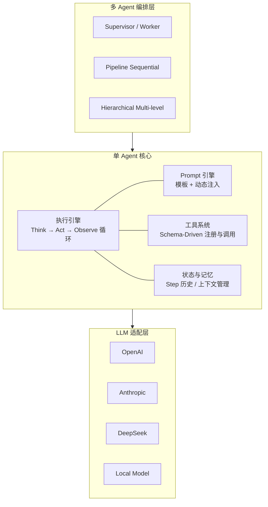
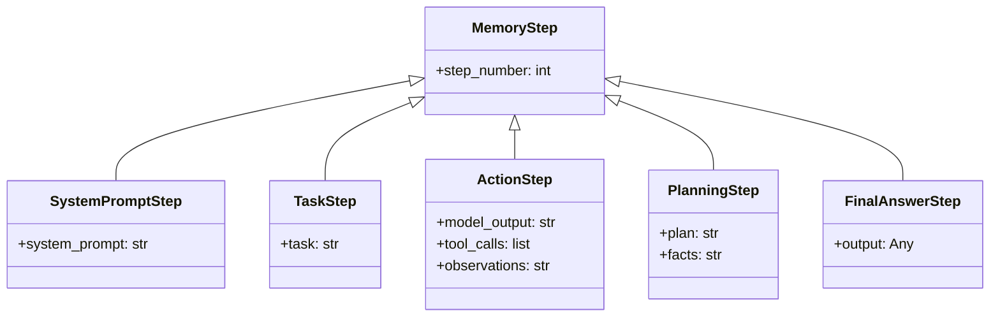
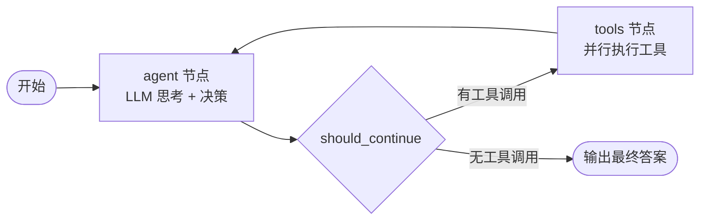
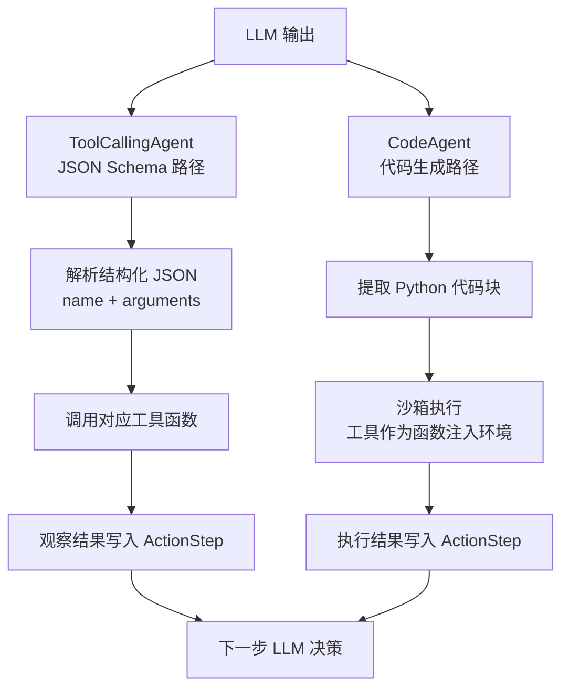
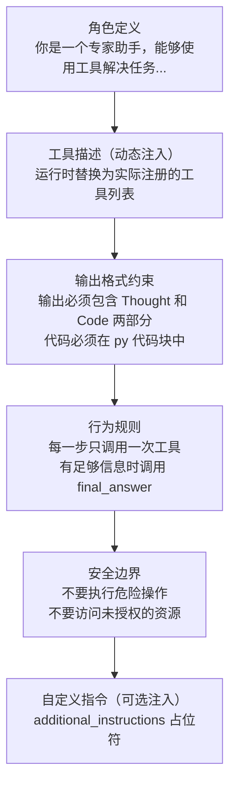
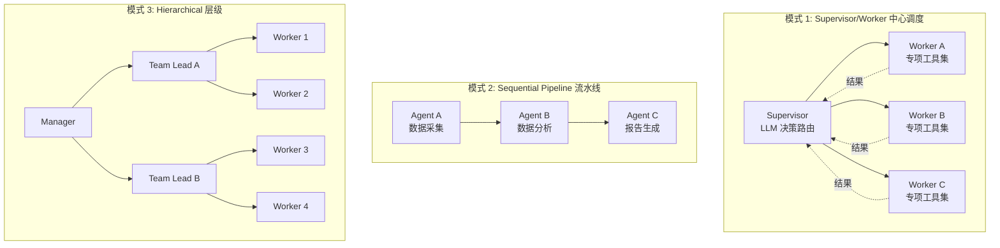
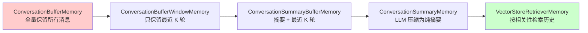
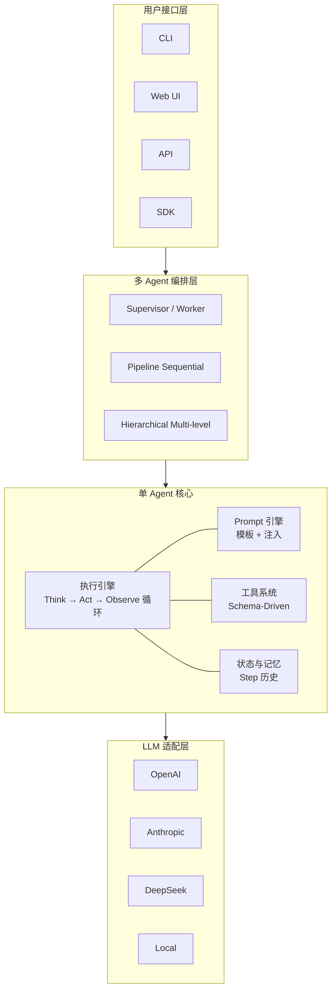
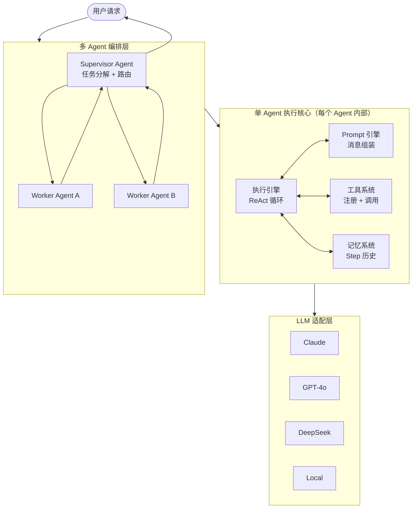

# 深入 Agent 架构设计：从源码理解框架的共性与本质

> 本文是 AI Agent 系统性学习系列的第 2 篇。上一篇我们从零手写了 ReAct Agent，理解了"Agent 怎么跑起来"。这一篇我们往上走一层：拆解成熟框架的架构设计，理解"框架是怎么设计的"。
>
> 方法：对比 smolagents 和 langchain/langgraph 的源码，提炼 Agent 框架的通用架构模式。不造轮子，但要看懂轮子。
>
> 前置要求：读过第 1 篇文章，理解 ReAct 基本原理。
>
> 配套代码：[phase-1-fundamentals/03-agent-architecture/](../../phase-1-fundamentals/03-agent-architecture/)

---

## 1. 为什么要理解 Agent 架构

### 1.1 从"会用框架"到"理解框架"

上一篇文章里，我们用 smolagents 跑通了 Agent 的完整流程。但如果你在实际工作中遇到这些问题：

- Agent 执行到一半卡住了，怎么排查？
- 想给 Agent 加一个自定义的规划策略，改哪里？
- 项目需要从 langchain 迁移到 smolagents，核心概念怎么映射？
- 想自己封装一个轻量级 Agent，需要哪些最小组件？

这些问题，光会调 API 是回答不了的。你需要理解框架背后的架构设计。

### 1.2 本文的方法

我们不会从头造一个框架（那是另一个量级的工程），而是：

1. **读源码**：深入 smolagents 和 langchain/langgraph 的核心模块
2. **找共性**：提炼两个框架的共同设计模式
3. **写精简实现**：用 80-120 行代码复现每个核心模块的设计思路
4. **看案例**：参考 awesome-llm-apps 中的优秀实践

这样做的好处是：你理解了架构的"骨架"，以后不管用哪个框架，都能快速上手、定制、排错。

### 1.3 Agent 框架的通用架构

不管是 smolagents、langchain、langgraph 还是 CrewAI，一个 Agent 框架的核心架构都可以抽象为六层：

| 层级 | 名称 | 核心职责 |
|------|------|---------|
| 第 6 层 | 多 Agent 编排层 | Supervisor / Pipeline / Hierarchy |
| 第 5 层 | Prompt 引擎层 | 模板系统 / 变量注入 / 消息历史管理 |
| 第 4 层 | 执行引擎层 | 核心循环 / 步骤抽象 / 终止判断 / 错误恢复 |
| 第 3 层 | 工具系统层 | Schema 驱动 / 注册发现 / 调用执行 |
| 第 2 层 | 状态与记忆层 | 执行状态 / 短期记忆 / 上下文管理 |
| 第 1 层 | LLM 适配层 | 多模型支持 / 统一接口 / 输出解析 |

接下来我们逐层拆解。



---

## 2. 执行引擎：核心循环的设计哲学

执行引擎是 Agent 的心脏。不管框架怎么包装，核心都是一个 while 循环：**思考 → 行动 → 观察 → 重复，直到完成或超时**。

### 2.1 smolagents 的执行循环

smolagents 的执行入口是 `MultiStepAgent.run()`（agents.py:436），它调用 `_run_stream()`（agents.py:540），核心循环长这样：

```python
# smolagents/agents.py — 简化后的核心循环
class MultiStepAgent:
    def _run_stream(self, task):
        self.memory.system_prompt = SystemPromptStep(
            system_prompt=self.initialize_system_prompt()
        )
        self.memory.task_steps = [TaskStep(task=task)]

        for step_num in range(self.max_steps):
            # 规划介入（每隔 N 步反思一次）
            if self.planning_interval and step_num % self.planning_interval == 0:
                self._generate_planning_step(task, step_num)

            # 核心：执行一步（由子类实现）
            final_answer = yield from self._step_stream(memory)

            if final_answer is not None:
                yield FinalAnswerStep(output=final_answer)
                return

        # 超时：强制生成最终答案
        yield FinalAnswerStep(output=self._force_final_answer(task))
```

几个关键设计决策：

**步骤抽象（MemoryStep 层级）**

smolagents 把每一步都记录为不可变的数据对象，形成清晰的类型层级：

```
MemoryStep（基类）
├── SystemPromptStep    — System Prompt 快照
├── TaskStep            — 用户任务
├── ActionStep          — LLM 的思考 + 工具调用 + 观察结果
├── PlanningStep        — 规划/反思步骤
└── FinalAnswerStep     — 最终答案
```

这个设计的好处是：每一步都是一条不可变记录，可以回放、序列化、用于调试。`ActionStep` 里同时包含了 `model_output`（LLM 原始输出）、`tool_calls`（解析后的工具调用）和 `observations`（工具返回结果），一个对象就是一次完整的"思考-行动-观察"。



**两种 Agent 子类**

`_step_stream()` 是抽象方法，由两个子类分别实现：

- `ToolCallingAgent`（agents.py:1215）：LLM 生成结构化的 JSON 工具调用（类似 OpenAI Function Calling）
- `CodeAgent`（agents.py:1505）：LLM 生成 Python 代码来调用工具，在沙箱中执行

```python
# ToolCallingAgent._step_stream() 的核心逻辑
def _step_stream(self, memory):
    # 1. 把历史消息发给 LLM
    messages = self.write_memory_to_messages(memory)
    output = self.model(messages, tools=self.tools)

    # 2. 解析 LLM 返回的工具调用
    if output.tool_calls:
        for tool_call in output.tool_calls:
            result = self.execute_tool(tool_call.name, tool_call.arguments)
            # 结果存入 ActionStep

    # 3. 检查是否调用了 final_answer
    if tool_call.name == "final_answer":
        return tool_call.arguments
    return None
```

```python
# CodeAgent._step_stream() 的核心逻辑
def _step_stream(self, memory):
    # 1. LLM 生成 Python 代码
    output = self.model(messages)
    code = self.parse_code_blob(output)

    # 2. 在安全沙箱中执行代码
    result = self.python_executor(code, tools=self.tools)

    # 3. 检查是否调用了 final_answer()
    if "final_answer" in result:
        return result["final_answer"]
    return None
```

CodeAgent 的优势在于：LLM 可以在一步里做多个工具调用、做条件判断、做数据处理——因为它生成的是代码，不是单个函数调用。代价是需要安全沙箱。

### 2.2 langchain/langgraph 的执行循环

langchain 的 Agent 执行经历了几代演进：

- **第一代**：`AgentExecutor`（langchain/agents/agent.py）— 经典的 while 循环
- **第二代**：langgraph 的 `create_react_agent()`（langgraph/prebuilt/chat_agent_executor.py）— 基于状态图
- **第三代**：`langchain.agents.create_agent()`（langchain/agents/factory.py）— 中间件模式

我们重点看 langgraph 的实现，因为它代表了当前的主流方向：

```python
# langgraph/prebuilt/chat_agent_executor.py — 简化后的核心结构
def create_react_agent(model, tools):
    # 定义状态图
    workflow = StateGraph(AgentState)

    # 两个节点
    workflow.add_node("agent", call_model)      # LLM 思考
    workflow.add_node("tools", tool_executor)    # 工具执行

    # 条件边：根据 LLM 输出决定下一步
    workflow.add_conditional_edges(
        "agent",
        should_continue,    # 有工具调用 → "tools"，否则 → END
        {"continue": "tools", "end": END}
    )
    workflow.add_edge("tools", "agent")  # 工具执行完回到 LLM

    return workflow.compile()

def should_continue(state):
    last_message = state["messages"][-1]
    if last_message.tool_calls:
        return "continue"
    return "end"
```

langgraph 把 Agent 循环建模为一个**状态图**（StateGraph）：
- 节点（Node）= 处理函数（LLM 调用、工具执行）
- 边（Edge）= 状态转移（条件路由）
- 状态（State）= 消息历史 + 自定义数据



这和 smolagents 的 while 循环本质上是同一件事，只是表达方式不同。状态图的好处是：更容易可视化、更容易添加分支逻辑、更容易做持久化和恢复。

### 2.3 共性提炼：执行引擎的三要素

对比两个框架，Agent 执行引擎的核心设计可以归纳为三个要素：

| 要素 | smolagents | langgraph | 本质 |
|------|-----------|-----------|------|
| 步骤抽象 | MemoryStep 层级 | AgentState + Messages | 每一步是不可变的数据记录 |
| 终止判断 | `final_answer` 工具 + max_steps | `should_continue()` 条件边 | 两种退出：正常完成 / 超时兜底 |
| 错误恢复 | try/except → 错误作为观察反馈 | 节点内 try/except | 错误不终止循环，而是让 LLM 自我修正 |

**错误恢复**是一个特别值得注意的设计。两个框架都不会因为工具执行失败就终止 Agent——而是把错误信息作为"观察结果"反馈给 LLM，让它自己决定怎么处理。这就是 Agent 比普通程序更"智能"的地方：它能从错误中学习和调整。

### 2.4 动手：实现一个可扩展的执行引擎

基于以上分析，我们用 ~80 行代码实现一个精简的执行引擎（完整代码见 `10_execution_engine.py`）：

```python
@dataclass
class Step:
    """所有步骤的基类"""
    step_number: int = 0

@dataclass
class ThoughtStep(Step):
    """LLM 的思考 + 行动决策"""
    thought: str = ""
    action: str = ""
    action_input: str = ""

@dataclass
class ObservationStep(Step):
    """工具执行后的观察结果"""
    observation: str = ""
    error: str | None = None

@dataclass
class FinalAnswer(Step):
    """终止步骤"""
    answer: Any = None


class ExecutionEngine:
    def __init__(self, think_fn, act_fn, max_steps=10, planning_interval=None):
        self.think_fn = think_fn      # LLM 思考函数
        self.act_fn = act_fn          # 工具执行函数
        self.max_steps = max_steps
        self.planning_interval = planning_interval
        self.memory: list[Step] = []

    def run(self, task: str) -> Any:
        for step_num in range(1, self.max_steps + 1):
            # 规划介入
            if self.planning_interval and step_num % self.planning_interval == 1:
                self._reflect(task, step_num)

            # 思考
            thought_step = self.think_fn(task, self.memory, step_num)
            self.memory.append(thought_step)

            # 终止判断
            if thought_step.action == "final_answer":
                answer = FinalAnswer(step_number=step_num, answer=thought_step.action_input)
                self.memory.append(answer)
                return answer.answer

            # 行动 + 错误恢复
            try:
                result = self.act_fn(thought_step.action, thought_step.action_input)
                obs = ObservationStep(step_number=step_num, observation=str(result))
            except Exception as e:
                obs = ObservationStep(step_number=step_num, error=str(e))

            self.memory.append(obs)

        return self._force_final_answer(task)
```

关键设计点：
- `think_fn` 和 `act_fn` 是注入的函数，引擎不关心具体实现（可以是真实 LLM，也可以是 mock）
- `memory` 是 Step 列表，完整记录执行轨迹
- 错误被捕获为 `ObservationStep(error=...)`，不会中断循环
- `planning_interval` 控制规划介入频率，和 smolagents 的设计一致

---

## 3. 工具系统：从注册到调用的完整链路

工具系统是 Agent 的"手"。LLM 再聪明，没有工具就只能说话不能做事。

### 3.1 工具的统一抽象

两个框架对工具的抽象惊人地相似：

**smolagents 的 Tool**（tools.py:106）：

```python
class Tool:
    name: str                    # 工具名称
    description: str             # 功能描述（LLM 读这个来理解工具）
    inputs: dict[str, dict]      # 参数 schema（类型 + 描述）
    output_type: str             # 返回值类型

    def forward(self, **kwargs):  # 实际执行逻辑
        ...
```

**langchain 的 BaseTool**（langchain_core/tools/base.py:405）：

```python
class BaseTool(RunnableSerializable):
    name: str                    # 工具名称
    description: str             # 功能描述
    args_schema: type[BaseModel] # Pydantic 模型定义参数

    def _run(self, **kwargs):    # 实际执行逻辑
        ...
```

核心共性：**Schema-Driven 设计**。

LLM 不是通过"看代码"来理解工具的，而是通过阅读结构化的 schema（名称、描述、参数类型）。这个 schema 会被注入到 System Prompt 中，成为 LLM 的"工具说明书"。

差异在参数定义方式：
- smolagents 用原生 dict：`{"query": {"type": "string", "description": "搜索关键词"}}`
- langchain 用 Pydantic 模型：类型安全，自动验证，但更重

### 3.2 工具注册：装饰器 vs 类继承

两个框架都提供两种注册方式：

**方式一：装饰器（适合简单工具）**

```python
# smolagents
@tool
def web_search(query: str) -> str:
    """搜索互联网获取信息
    Args:
        query: 搜索关键词
    """
    return requests.get(f"https://api.search.com?q={query}").text

# langchain
@tool
def web_search(query: str) -> str:
    """搜索互联网获取信息"""
    return requests.get(f"https://api.search.com?q={query}").text
```

装饰器的魔法：从函数签名自动提取参数类型，从 docstring 提取描述，自动生成完整的 schema。开发者只需要写一个普通函数。

**方式二：类继承（适合复杂/有状态的工具）**

```python
# smolagents
class DatabaseQuery(Tool):
    name = "database_query"
    description = "查询数据库"
    inputs = {"sql": {"type": "string", "description": "SQL 语句"}}
    output_type = "string"

    def __init__(self, connection_string):
        self.conn = create_connection(connection_string)

    def forward(self, sql: str) -> str:
        return self.conn.execute(sql)
```

类继承的优势：可以在 `__init__` 中初始化状态（数据库连接、API 客户端等），适合需要持有资源的工具。

### 3.3 工具调用的两条路径

这是 smolagents 最有特色的设计之一：它提供了两种完全不同的工具调用方式。

**路径一：JSON Schema 调用（ToolCallingAgent）**

```
LLM 输出:
{
  "name": "web_search",
  "arguments": {"query": "北京天气"}
}

框架解析 JSON → 找到工具 → 调用 web_search(query="北京天气")
```

这是 langchain 和大多数框架的标准方式。LLM 生成结构化的 JSON，框架解析后调用对应工具。

**路径二：代码生成调用（CodeAgent）**

LLM 输出：

```python
weather = web_search(query="北京天气")
if "晴" in weather:
    activity = web_search(query="北京户外活动")
else:
    activity = web_search(query="北京室内活动")
final_answer(f"天气: {weather}, 推荐: {activity}")
```

框架在沙箱中执行这段代码，工具作为可调用的函数注入沙箱环境。

**对比**：

| 维度 | JSON Schema | 代码生成 |
|------|------------|---------|
| 每步工具调用数 | 通常 1 个 | 可以多个 |
| 条件逻辑 | 不支持（需要多步） | 支持（if/else） |
| 数据处理 | 不支持 | 支持（变量、循环） |
| 安全性 | 高（结构化输入） | 需要沙箱 |
| 模型要求 | 支持 Function Calling | 能写 Python 即可 |
| 步骤效率 | 低（一步一调用） | 高（一步多调用） |



smolagents 的论文数据显示，CodeAgent 在基准测试上比 ToolCallingAgent 平均高 30%，主要因为步骤效率更高。

### 3.4 工具描述的 Prompt 注入

工具的 schema 最终要变成 LLM 能读懂的文本，注入到 System Prompt 中。两个框架的注入风格不同：

**smolagents CodeAgent 风格**（生成函数签名）：

```python
def web_search(query: str) -> str:
    """搜索互联网获取信息"""

def calculator(expression: str) -> str:
    """计算数学表达式"""
```

**langchain ToolCallingAgent 风格**（JSON 描述）：

```
web_search: 搜索互联网获取信息
  参数: {"query": {"type": "string", "description": "搜索关键词"}}

calculator: 计算数学表达式
  参数: {"expression": {"type": "string", "description": "数学表达式"}}
```

CodeAgent 用函数签名风格，因为 LLM 接下来要生成代码来调用这些函数——保持一致的"语言"。ToolCallingAgent 用 JSON 风格，因为 LLM 接下来要生成 JSON 格式的调用。

### 3.5 动手：实现一个 Schema-Driven 工具系统

完整代码见 `11_tool_system.py`，核心设计：

```python
class Tool(ABC):
    """工具基类 — Schema-Driven"""
    name: str
    description: str
    parameters: dict[str, dict[str, str]]

    @abstractmethod
    def forward(self, **kwargs) -> Any: ...

    def __call__(self, **kwargs) -> Any:
        return self.forward(**kwargs)


def tool(func: Callable) -> Tool:
    """装饰器：从函数签名自动生成 Tool"""
    hints = get_type_hints(func)
    sig = inspect.signature(func)

    # 自动提取参数 schema
    parameters = {}
    for name, param in sig.parameters.items():
        parameters[name] = {
            "type": type_map.get(hints.get(name, str), "string"),
            "description": extract_from_docstring(func, name),
        }

    # 创建具体 Tool 子类
    class SimpleTool(Tool):
        def forward(self, **kwargs):
            return func(**kwargs)

    instance = SimpleTool()
    instance.name = func.__name__
    instance.description = func.__doc__.split("\n")[0]
    instance.parameters = parameters
    return instance


class ToolRegistry:
    """工具注册表 — 支持动态增删和 Prompt 生成"""
    def register(self, tool: Tool): ...
    def execute(self, name: str, **kwargs): ...
    def to_prompt(self, style="code"): ...  # 生成注入 Prompt 的工具描述
```

---

## 4. Prompt 工程：Agent 的"操作系统"

如果说执行引擎是 Agent 的心脏，Prompt 就是它的操作系统。Agent 的行为模式、输出格式、安全边界，全部由 Prompt 定义。

### 4.1 System Prompt 的结构解剖

smolagents 的 System Prompt 是一个 Jinja2 模板（存储在 YAML 文件中），运行时通过 `populate_template()` 注入变量。我们来看 CodeAgent 的 System Prompt 结构：



关键设计：System Prompt 是**模板**，不是硬编码的字符串。工具描述、自定义指令、甚至输出格式都是运行时注入的变量。这意味着同一个 Agent 类可以通过不同的 Prompt 模板表现出完全不同的行为。

langchain 的 `ChatPromptTemplate` 也是类似思路，只是用 Python 的 `{variable}` 格式替代了 Jinja2：

```python
prompt = ChatPromptTemplate.from_messages([
    ("system", "你是一个助手。可用工具：{tools}\n{instructions}"),
    MessagesPlaceholder("chat_history"),
    ("human", "{input}"),
    MessagesPlaceholder("agent_scratchpad"),
])
```

### 4.2 消息历史管理

Agent 的多轮交互需要管理消息历史。两个框架的消息抽象：

| smolagents | langchain | 含义 |
|-----------|-----------|------|
| `Message(role="system")` | `SystemMessage` | 系统指令 |
| `Message(role="user")` | `HumanMessage` | 用户输入 |
| `Message(role="assistant")` | `AIMessage` | LLM 输出 |
| `Message(role="tool")` | `ToolMessage` | 工具返回结果 |

smolagents 的 `write_memory_to_messages()` 方法负责把 MemoryStep 列表转换为 LLM API 需要的消息格式。这个转换过程会：

1. 把 SystemPromptStep 转为 system 消息
2. 把 TaskStep 转为 user 消息
3. 把 ActionStep 拆分为 assistant 消息（LLM 输出）+ tool 消息（工具结果）
4. 把 PlanningStep 转为 assistant 消息

这个"Step → Message"的转换层是一个重要的设计：内部用丰富的 Step 类型记录执行轨迹，对外用标准的消息格式和 LLM 通信。

### 4.3 动态 Prompt 组装

实际运行中，Prompt 不是静态的——它在每一步都在变化：

```
第 1 步: [System Prompt] + [用户任务]
第 2 步: [System Prompt] + [用户任务] + [LLM思考1] + [工具结果1]
第 3 步: [System Prompt] + [用户任务] + [LLM思考1] + [工具结果1] + [规划反思] + [LLM思考2] + [工具结果2]
...
```

每一步，消息序列都在增长。这就引出了一个核心挑战：**上下文窗口管理**。

当消息历史超过 LLM 的上下文窗口时，需要策略来压缩：
- **截断**：丢弃最早的消息（简单但可能丢失关键信息）
- **摘要**：用 LLM 对历史消息做摘要（保留语义但有信息损失）
- **选择性保留**：保留 System Prompt + 最近 N 步 + 关键观察结果

smolagents 目前主要依赖 `max_steps` 来间接控制上下文长度。langchain 提供了更丰富的 Memory 抽象（ConversationBufferMemory、ConversationSummaryMemory 等），我们在第 6 章会详细讨论。

### 4.4 Prompt 设计的四个原则

从两个框架的 Prompt 模板中，可以提炼出四个通用原则：

**原则一：角色定义要具体**

```
❌ "你是一个 AI 助手"
✅ "你是一个专家助手，能够通过编写 Python 代码来调用工具解决任务。
    每一步你需要先思考，然后编写代码执行。"
```

**原则二：输出格式要严格约束**

```
❌ "请返回你的思考和行动"
✅ "你的输出必须严格遵循以下格式：
    Thought: <你的思考>
    Code:
    ```py
    <你的代码>
    ```<end_code>"
```

格式约束是 Agent 可靠性的关键。如果 LLM 的输出格式不稳定，解析就会失败，整个循环就断了。

**原则三：Few-shot 示例胜过长篇说明**

smolagents 在 Prompt 中嵌入了完整的示例交互，展示"正确的思考和行动是什么样的"。一个好的示例比三段描述更有效。

**原则四：安全边界要显式声明**

```
"你不能安装新的包。"
"你不能执行系统命令或子进程调用。"
"如果工具调用失败，不要重复相同的调用超过 3 次。"
```

### 4.5 动手：实现一个 Prompt 组装引擎

完整代码见 `12_prompt_engine.py`，核心设计：

```python
class PromptEngine:
    def __init__(self, system_template: str):
        self.system_template = system_template
        self.messages: list[Message] = []

    def build_system_prompt(self, tool_descriptions, custom_instructions=""):
        """运行时注入变量，组装 System Prompt"""
        return self.system_template.format(
            tool_descriptions=tool_descriptions,
            custom_instructions=custom_instructions,
        )

    def initialize(self, tool_descriptions, task, instructions=""):
        """初始化消息序列：System + 用户任务"""
        system_prompt = self.build_system_prompt(tool_descriptions, instructions)
        self.messages = [
            Message("system", system_prompt),
            Message("user", f"任务: {task}"),
        ]

    def add_assistant_message(self, thought, action, action_input):
        """添加 LLM 的思考和行动"""
        ...

    def add_tool_response(self, observation):
        """添加工具执行结果"""
        ...

    def add_planning_prompt(self, task, completed, remaining):
        """插入规划 Prompt（smolagents 的 planning_interval 机制）"""
        ...
```

---

## 5. 多 Agent 编排：从单体到协作

到目前为止，我们讨论的都是单个 Agent。但真实场景中，复杂任务往往需要多个 Agent 协作。

### 5.1 编排模式概览

多 Agent 编排有几种经典模式：



**awesome-llm-apps 的 Travel Planner** 是一个很好的真实案例：它用 6 个 Agent 协作完成旅行规划——航班搜索、酒店搜索、活动推荐、餐厅推荐、行程规划、预算计算。每个 Agent 有自己的工具集，由一个 Supervisor Agent 统一调度。

### 5.2 smolagents 的多 Agent 实现

smolagents 的多 Agent 设计核心是 `ManagedAgent`——把一个 Agent 包装成另一个 Agent 的"工具"：

```python
# smolagents 的 ManagedAgent 设计
class ManagedAgent:
    def __init__(self, agent, name, description):
        self.agent = agent          # 被管理的子 Agent
        self.name = name            # Supervisor 看到的名称
        self.description = description  # Supervisor 看到的能力描述

    def __call__(self, task):
        return self.agent.run(task)  # 执行子 Agent
```

使用方式：

```python
# 创建子 Agent
researcher = CodeAgent(tools=[web_search], model=model)
analyst = CodeAgent(tools=[calculator], model=model)

# 包装为 ManagedAgent
managed_researcher = ManagedAgent(researcher, "researcher", "搜索和收集信息")
managed_analyst = ManagedAgent(analyst, "analyst", "分析数据")

# Supervisor Agent 管理子 Agent
supervisor = CodeAgent(
    tools=[],
    managed_agents=[managed_researcher, managed_analyst],
    model=model,
)
supervisor.run("分析 AI Agent 行业趋势")
```

这个设计的精妙之处：**Agent 作为 Tool**。Supervisor 不需要知道子 Agent 的内部实现，它只看到 name 和 description——和调用普通工具一模一样。Supervisor 的 LLM 根据任务需求，自主决定调用哪个子 Agent。

### 5.3 langgraph 的多 Agent 实现

langgraph 用 StateGraph 的节点和条件边来实现多 Agent 编排：

```python
# langgraph 的 Supervisor 模式
workflow = StateGraph(SupervisorState)

# 每个 Agent 是一个节点
workflow.add_node("researcher", researcher_agent)
workflow.add_node("analyst", analyst_agent)
workflow.add_node("supervisor", supervisor_node)

# Supervisor 根据状态路由到不同 Agent
workflow.add_conditional_edges(
    "supervisor",
    route_to_agent,  # 路由函数
    {
        "researcher": "researcher",
        "analyst": "analyst",
        "FINISH": END,
    }
)

# Agent 执行完回到 Supervisor
workflow.add_edge("researcher", "supervisor")
workflow.add_edge("analyst", "supervisor")
```

langgraph 的优势在于：编排逻辑是**显式的图结构**，可以可视化、可以持久化、可以做断点恢复。smolagents 的编排逻辑隐含在 Supervisor Agent 的 LLM 决策中，更灵活但更难调试。

### 5.4 三种编排策略

在实际应用中，选择哪种编排策略取决于任务特点：

| 策略 | 适用场景 | 示例 |
|------|---------|------|
| LLM 路由 | 任务类型不确定，需要智能判断 | 通用客服 Agent |
| 规则路由 | 任务类型明确，可以用关键词/条件判断 | 工单分类系统 |
| 全部执行 | 需要多个视角的综合结果 | 研究报告生成 |
| 流水线 | 任务有明确的先后依赖 | 数据采集 → 分析 → 报告 |

### 5.5 动手：实现一个 Supervisor 编排器

完整代码见 `13_supervisor_orchestrator.py`，核心设计：

```python
@dataclass
class WorkerAgent:
    """Worker — Supervisor 可调度的最小单元"""
    name: str
    description: str
    execute_fn: Callable[[str], str]
    tools: list[str] = field(default_factory=list)

    def execute(self, task: str) -> str:
        return self.execute_fn(task)


class SupervisorOrchestrator:
    def __init__(self, workers: list[WorkerAgent]):
        self.workers = {w.name: w for w in workers}

    def route_by_rules(self, task, router_fn):
        """规则路由：根据任务内容选择 Worker"""
        worker_name = router_fn(task)
        return self.workers[worker_name].execute(task)

    def execute_all(self, task):
        """全部执行：所有 Worker 处理同一任务，汇总结果"""
        return {name: w.execute(task) for name, w in self.workers.items()}

    def execute_pipeline(self, task, pipeline):
        """流水线：按顺序传递，上一个的输出是下一个的输入"""
        current = task
        for name in pipeline:
            current = self.workers[name].execute(current)
        return current

    def get_worker_descriptions(self):
        """生成 Worker 描述（注入 Supervisor 的 Prompt）"""
        ...
```

`get_worker_descriptions()` 是连接编排层和 Prompt 层的桥梁——它把所有 Worker 的能力描述格式化为文本，注入 Supervisor Agent 的 System Prompt，让 LLM 知道有哪些"下属"可以调度。

---

## 6. 状态与记忆：Agent 的上下文管理

### 6.1 执行状态 vs 持久记忆

Agent 的"记忆"其实分两个层次：

| 层次 | 生命周期 | 内容 | 框架实现 |
|------|---------|------|---------|
| 执行状态 | 单次任务 | 当前任务的步骤历史、中间结果 | smolagents: `AgentMemory`；langgraph: `AgentState` |
| 持久记忆 | 跨任务 | 用户偏好、历史对话摘要、知识库 | langchain: `Memory` 抽象；smolagents: 暂无内置 |

大多数 Agent 框架重点解决的是**执行状态**——也就是"这次任务执行到哪了"。持久记忆是一个更复杂的话题，通常需要结合向量数据库（RAG）来实现，我们在 Phase 2 和 Phase 4 会深入讨论。

### 6.2 smolagents 的 Memory 设计

smolagents 的 `AgentMemory`（memory.py:214）是一个简洁的设计：

```python
class AgentMemory:
    system_prompt: SystemPromptStep     # System Prompt 快照
    task_steps: list[TaskStep]          # 用户任务
    steps: list[MemoryStep]            # 执行步骤序列
```

它本质上就是一个有类型的列表，按时间顺序记录所有步骤。`write_memory_to_messages()` 方法负责把这个列表转换为 LLM API 需要的消息格式。

关键方法：
- `get_succinct_steps()` — 获取精简版步骤（用于规划时的上下文压缩）
- `get_full_steps()` — 获取完整步骤（用于正常的 LLM 调用）
- `replay()` — 回放执行轨迹（用于调试）

### 6.3 langchain 的 Memory 抽象

langchain 提供了更丰富的 Memory 层级：

```
BaseMemory（抽象基类）
├── ConversationBufferMemory      — 完整保留所有消息
├── ConversationBufferWindowMemory — 只保留最近 K 轮
├── ConversationSummaryMemory     — 用 LLM 对历史做摘要
├── ConversationSummaryBufferMemory — 摘要 + 最近 K 轮
└── VectorStoreRetrieverMemory    — 基于向量检索的长期记忆
```

每种 Memory 都是在**信息完整性**和**上下文开销**之间做权衡：

```
完整性高 ◄──────────────────────────────► 开销低
Buffer    BufferWindow    SummaryBuffer    Summary    VectorStore
（全保留）  （最近K轮）    （摘要+最近）    （纯摘要）   （检索式）
```



### 6.4 上下文工程的核心挑战

不管用哪个框架，Agent 的上下文管理都面临三个核心挑战：

**挑战一：窗口溢出**

LLM 的上下文窗口是有限的（4K ~ 200K tokens）。一个复杂任务可能需要 20+ 步，每步的工具返回可能很长（比如搜索结果），很容易撑爆窗口。

应对策略：
- 限制 `max_steps`（smolagents 默认 6 步）
- 截断工具返回结果（smolagents 的 `max_output_length`）
- 对历史步骤做摘要压缩

**挑战二：信息选择**

不是所有历史信息都对当前决策有用。第 1 步的搜索结果可能和第 10 步的决策完全无关，但它还占着上下文空间。

应对策略：
- 规划步骤中做信息筛选（smolagents 的 `planning_interval`）
- 基于相关性检索历史（langchain 的 VectorStoreRetrieverMemory）
- 让 LLM 自己决定哪些信息需要保留

**挑战三：跨任务记忆**

用户说"用上次的方案"——Agent 需要记住上次做了什么。这超出了单次执行状态的范围，需要持久化存储。

应对策略：
- 对话历史持久化（数据库存储）
- 用户画像和偏好记录
- RAG（检索增强生成）— 把历史信息存入向量数据库，按需检索

这些挑战在后面中会系统性地讲解。

---

## 7. 架构全景图：一个通用 Agent 框架的骨架

### 7.1 六层架构

综合前面的分析，一个通用 Agent 框架的完整架构：



### 7.2 各层职责

| 层 | 职责 | smolagents | langchain/langgraph |
|----|------|-----------|-------------------|
| LLM 适配 | 统一不同 LLM 的调用接口 | LiteLLM 集成 | ChatModel 抽象 |
| 状态与记忆 | 管理执行轨迹和上下文 | AgentMemory | AgentState + Memory |
| 工具系统 | 工具注册、发现、调用 | Tool + @tool + ToolRegistry | BaseTool + @tool + ToolNode |
| Prompt 引擎 | 动态组装 LLM 输入 | Jinja2 模板 | ChatPromptTemplate |
| 执行引擎 | 核心循环 + 终止 + 错误恢复 | MultiStepAgent._run_stream() | StateGraph 节点/边 |
| 多 Agent 编排 | 多 Agent 协作调度 | ManagedAgent | StateGraph 条件路由 |



### 7.3 Provider-Agnostic 设计

awesome-llm-apps 项目中一个值得学习的设计理念是 **Provider-Agnostic**（模型提供商无关）。

好的 Agent 框架不应该绑定特定的 LLM 提供商。smolagents 通过 LiteLLM 实现了这一点——同一套代码可以无缝切换 OpenAI、Anthropic、DeepSeek、本地模型。langchain 通过 ChatModel 抽象层实现类似效果。

```python
# smolagents 的 Provider-Agnostic 设计
from smolagents import LiteLLMModel

# 切换模型只需要改一行
model = LiteLLMModel("deepseek/deepseek-chat")     # DeepSeek
model = LiteLLMModel("anthropic/claude-sonnet-4-6") # Claude
model = LiteLLMModel("openai/gpt-4o")              # GPT-4o

# Agent 代码完全不变
agent = CodeAgent(tools=[...], model=model)
```

这个设计在实际工作中非常重要：你可以用便宜的模型做开发测试，用强模型做生产部署，甚至根据任务复杂度动态选择模型。

### 7.4 框架选型指南

| 场景 | 推荐框架 | 原因 |
|------|---------|------|
| 快速原型 | smolagents | API 简洁，CodeAgent 效率高 |
| 复杂工作流 | langgraph | 状态图可视化，支持持久化和恢复 |
| 多 Agent 协作 | langgraph / CrewAI | 显式编排，角色定义清晰 |
| 企业级应用 | langchain + langgraph | 生态完整，社区活跃 |
| 学习理解 | smolagents | 源码清晰，架构简洁 |

没有"最好"的框架，只有最适合场景的框架。理解了架构的共性，切换框架的成本会很低。

---

## 8. 总结：带着架构视角进入框架实战

### 8.1 本文回顾

我们从源码层面拆解了 Agent 框架的六层架构：

1. **执行引擎**：while 循环 + 步骤抽象 + 终止判断 + 错误恢复
2. **工具系统**：Schema-Driven + 装饰器/类继承注册 + Code/JSON 两种调用路径
3. **Prompt 引擎**：模板系统 + 动态变量注入 + 消息历史管理
4. **多 Agent 编排**：Supervisor/Worker + Pipeline + Agent 作为 Tool
5. **状态与记忆**：执行状态（单次任务）+ 持久记忆（跨任务）
6. **LLM 适配**：Provider-Agnostic 设计

这些不是某个框架的特有设计，而是 Agent 框架的**通用架构模式**。smolagents 和 langchain 用不同的方式实现了相同的本质。

### 8.2 Phase 1 回顾

两篇文章 + 三组代码，我们完成了 Agent 基础的学习：

| 内容 | 收获 |
|------|------|
| 文章 1：ReAct 基础 | 理解 Agent 是什么、ReAct 循环怎么跑、smolagents 怎么用 |
| 文章 2：架构进阶 | 理解框架怎么设计、核心模块怎么协作、不同框架的共性 |
| 01-minimal-agent | 从零手写 Agent 的能力 |
| 02-smolagents-deep-dive | 深入框架内部机制的能力 |
| 03-agent-architecture | 架构级思考和设计的能力 |

### 8.3 下一步

带着这些架构理解，我们进入后续阶段：

- **Phase 2（RAG）**：给 Agent 接入外部知识库，解决"Agent 只知道训练数据"的问题
- **Phase 3（框架实战）**：用 LangGraph、CrewAI 等框架构建真实应用，你会发现架构知识让上手速度快很多
- **Phase 4（进阶）**：深入记忆系统、MCP 协议、安全机制——这些都是本文提到但没有展开的话题

理解架构不是为了造轮子，而是为了在使用轮子时知道哪个螺丝该拧、哪个零件能换。

---

> 配套代码：
> - `10_execution_engine.py` — 可扩展的 Agent 执行引擎
> - `11_tool_system.py` — Schema-Driven 工具系统（含批量注册）
> - `12_prompt_engine.py` — 动态 Prompt 组装引擎（含 summary 模式）
> - `13_supervisor_orchestrator.py` — Supervisor 多 Agent 编排器
> - `14_memory_context.py` — 记忆与上下文管理（AgentMemory + 回调 + token 预算 + 序列化）
> - `15_mini_agent.py` — 集成式迷你 Agent 框架（模块组装 + Agent-as-Tool 多 Agent 模式）
>
> 运行方式：`cd phase-1-fundamentals/03-agent-architecture && python <脚本名>.py`
