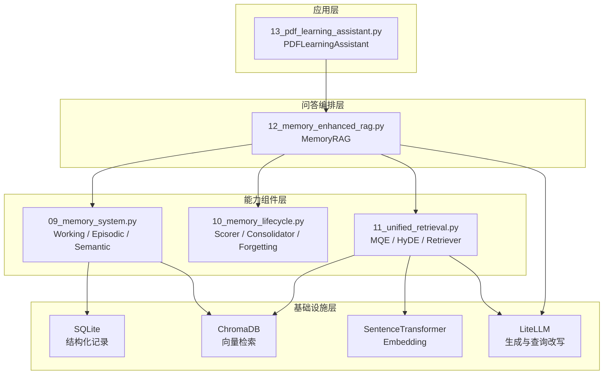
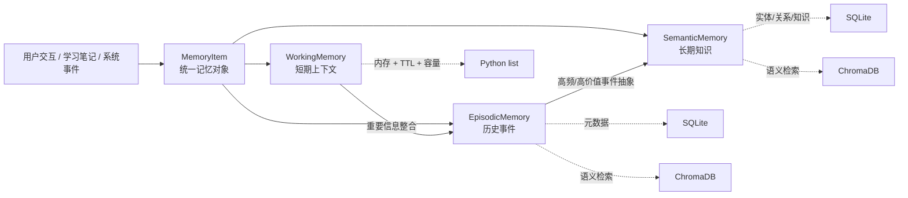
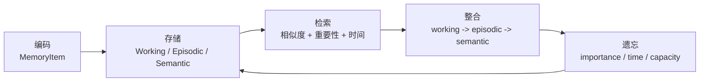
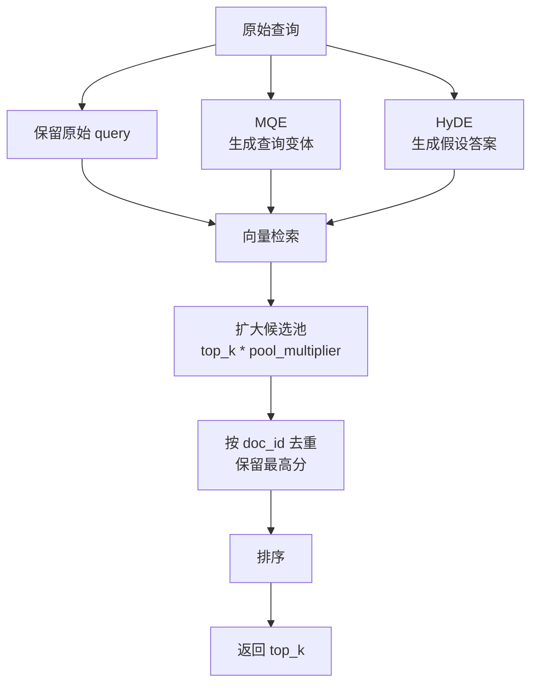
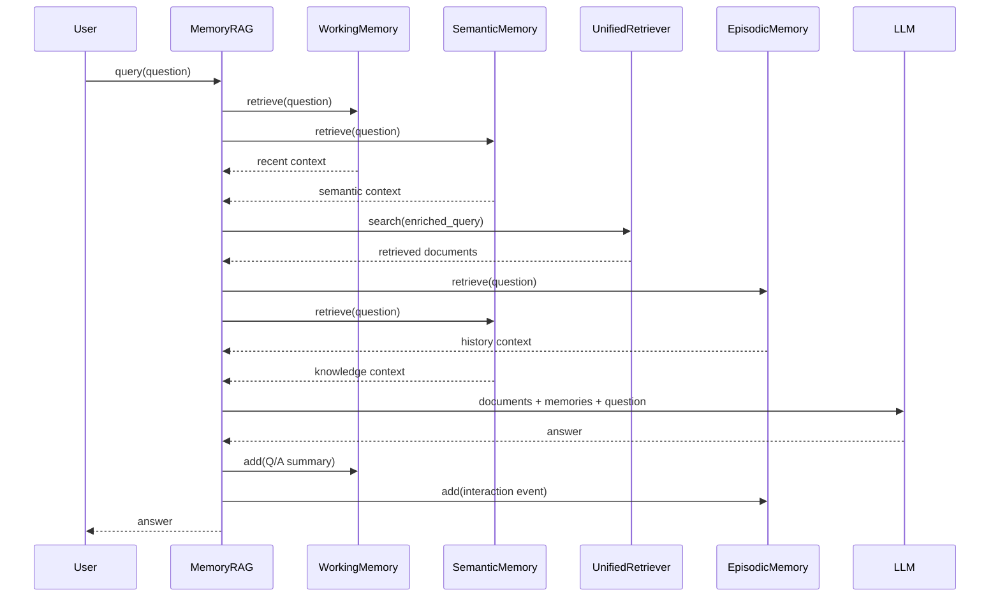
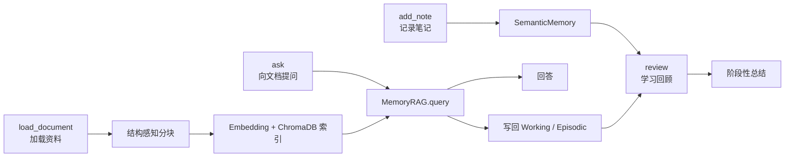

# Memory RAG：给 RAG 加上状态

> 前置要求：跑过基础 RAG、混合检索、重排序，了解 ChromaDB、Embedding、LLM 调用。
> 配套代码：[phase-2-rag/03-memory-rag/](../../phase-2-rag/03-memory-rag/)

---

前面几篇文章解决的是 RAG 的检索质量问题：

- 文档怎么切，才能不丢上下文
- 向量检索怎么做，才能按语义召回
- BM25 和向量怎么融合，才能兼顾关键词和语义
- Cross-Encoder 怎么重排，才能把真正有用的文档放到前面
- benchmark 怎么跑，才能证明策略真的有效

这些问题都很重要，但它们默认了一个前提：每次问答都是独立的。

真实使用里不是这样。

用户经常会连续追问：

```text
第一轮：RAG 系统怎么评估？
第二轮：那我这个实验应该先看哪个指标？
第三轮：刚才说的 Faithfulness 和 Recall 冲突时怎么取舍？
```

第二轮里的“我这个实验”，第三轮里的“刚才说的”，都不是文档知识，而是历史上下文。

普通 RAG 只知道知识库里有什么，不知道用户前面问过什么、当前学到哪一步、有哪些偏好和目标。

`03-memory-rag` 这组代码要解决的就是这个问题：**给 RAG 加上一层可检索、可管理、可写回的状态。**

---

## 一、整体架构：五个脚本，一条 Memory RAG 主线

`03-memory-rag` 下面有 5 个脚本：

```text
phase-2-rag/03-memory-rag/
├── 09_memory_system.py
├── 10_memory_lifecycle.py
├── 11_unified_retrieval.py
├── 12_memory_enhanced_rag.py
├── 13_pdf_learning_assistant.py
└── requirements.txt
```

它们不是五个孤立 demo，而是一条递进主线：

| 文件 | 角色 | 解决的问题 |
|------|------|------------|
| `09_memory_system.py` | 记忆模型和记忆仓库 | 记忆怎么分类、怎么存、怎么查 |
| `10_memory_lifecycle.py` | 生命周期管理 | 记忆怎么评分、整合、遗忘 |
| `11_unified_retrieval.py` | 检索增强层 | MQE、HyDE、候选池怎么统一 |
| `12_memory_enhanced_rag.py` | RAG 编排层 | 记忆怎么进入检索和生成 |
| `13_pdf_learning_assistant.py` | 应用层 | 怎么做成一个学习助手 |

从架构上看，它可以拆成四层：

```text
应用层
  PDFLearningAssistant

问答编排层
  MemoryRAG

能力组件层
  WorkingMemory / EpisodicMemory / SemanticMemory
  MemoryScorer / MemoryConsolidator / Forgetting
  UnifiedRetriever / EmbeddingWithFallback

基础设施层
  SQLite / ChromaDB / SentenceTransformer / LiteLLM
```

对应到代码结构，可以画成这样：



核心调用链是：

```text
用户问题
  -> MemoryRAG.query()
    -> 工作记忆/语义记忆增强 query
    -> UnifiedRetriever 检索文档
    -> 情景记忆/语义记忆补充上下文
    -> LLM 生成回答
    -> 本轮交互写回记忆
```

这和普通 RAG 的区别很明显。

普通 RAG：

```text
问题 -> 检索文档 -> 生成答案
```

Memory RAG：

```text
问题 -> 检索记忆 + 检索文档 -> 生成答案 -> 写回记忆
```

最后这个“写回”很关键。没有写回，记忆只是一个静态资料库；有了写回，系统才开始带状态运行。

这套结构参考了 HelloAgents 第八章的核心思路：记忆系统和 RAG 系统是两套能力，前者维护交互历史和用户状态，后者负责外部知识检索。区别在于，HelloAgents 用 `MemoryTool` / `RAGTool` 封装成框架工具；本项目为了学习，把能力拆成 `09-13` 五个脚本，便于看清每层代码。

### 1.1 先纠正一个边界：当前实现是三类记忆

`09_memory_system.py` 顶部注释写的是“四类记忆系统”，运行面板里也写了“四类记忆系统”。

但代码实际只实现了三类：

```python
class WorkingMemory:
    ...

class EpisodicMemory:
    ...

class SemanticMemory:
    ...
```

`MemoryItem.memory_type` 的注释也是：

```python
memory_type: str = "working"  # working / episodic / semantic
```

所以当前版本应该准确表述为：**三类文本记忆系统**。

| 记忆类型 | 是否实现 | 代码类 | 作用 |
|----------|----------|--------|------|
| 工作记忆 | 已实现 | `WorkingMemory` | 当前会话短期上下文 |
| 情景记忆 | 已实现 | `EpisodicMemory` | 历史交互事件 |
| 语义记忆 | 已实现 | `SemanticMemory` | 长期知识、概念、关系 |
| 感知记忆 | 未实现 | 无 | 可作为后续多模态扩展 |

技术文章里这个边界要写清楚。否则读者一边看文章一边翻代码，会觉得架构图比实现多了一块。

---

## 二、09_memory_system：三类记忆怎么落到代码

`09_memory_system.py` 是整套 Memory RAG 的底座。

它做了三件事：

1. 定义统一记忆数据结构 `MemoryItem`
2. 实现工作记忆 `WorkingMemory`
3. 实现情景记忆 `EpisodicMemory` 和语义记忆 `SemanticMemory`

这一步不是为了套认知科学名词，而是为了把不同生命周期的信息分开管理。

### 2.1 MemoryItem：记忆不是一段字符串

很多人第一次给 Agent 加 memory，会写成：

```python
history.append(user_message)
```

这只是聊天记录。

聊天记录只能解决“把最近几轮拼回 prompt”。但一个可管理的记忆系统还需要知道：

- 这条信息重要吗？
- 它属于短期状态，还是长期知识？
- 它什么时候发生？
- 它属于哪个会话？
- 它被检索过几次？
- 它应该被遗忘，还是被提升为长期记忆？

代码里的 `MemoryItem` 负责把这些信息统一起来：

```python
@dataclass
class MemoryItem:
    """统一的记忆数据结构，所有记忆类型共用"""
    content: str
    memory_type: str = "working"
    importance: float = 0.5
    timestamp: datetime = field(default_factory=datetime.now)
    memory_id: str = field(default_factory=lambda: uuid.uuid4().hex[:12])
    metadata: dict[str, Any] = field(default_factory=dict)
    access_count: int = 0
    session_id: str = "default"
```

这个模型的核心不是字段多，而是让“记忆”变成了可管理对象。

普通聊天记录只有：

```text
content
```

这里至少多了：

```text
type + importance + timestamp + session_id + access_count + metadata
```

这些字段直接支撑后面的评分、整合和遗忘。

没有 `importance`，系统不知道什么值得保留。

没有 `timestamp`，系统不知道什么已经过期。

没有 `memory_type`，系统不知道这条信息该当作事件、知识还是临时上下文。

没有 `session_id`，多个会话的历史会混在一起。

这就是第一条架构边界：**三类记忆可以用不同存储和检索算法，但对外都返回 `MemoryItem`。**

三类记忆的关系可以这样理解：



### 2.2 WorkingMemory：当前会话的短期缓存

工作记忆解决的是“刚刚发生什么”。

代码结构很轻：

```python
class WorkingMemory:
    def __init__(self, capacity: int = 50, ttl_minutes: int = 60):
        self.capacity = capacity
        self.ttl_minutes = ttl_minutes
        self.memories: list[MemoryItem] = []
        self._tfidf = None
```

这几个字段说明它的定位：

- `capacity`：防止当前会话无限增长
- `ttl_minutes`：让短期上下文自然过期
- `memories`：直接放内存，读写快
- `_tfidf`：用于轻量文本检索

检索时不是简单看最近几条，而是做混合评分：

```python
tfidf_sim = tfidf_scores.get(i, 0.0)
kw_score = self._keyword_score(query, mem.content)
base = tfidf_sim * 0.7 + kw_score * 0.3 if tfidf_sim > 0 else kw_score
decay = self._time_decay(mem.timestamp)
imp_weight = 0.8 + mem.importance * 0.4
final = base * decay * imp_weight
```

这个公式背后的判断是：

```text
相关，但太旧，降权。
相关，但不重要，降权。
重要，但不相关，也不要拿出来。
```

这比“最近 N 轮全部塞 prompt”更像一个可控系统。

当前实现也有教学版的边界。中文关键词匹配是按空格切：

```python
q_tokens = set(query.lower().split())
c_tokens = set(content.lower().split())
```

中文没有天然空格，所以这部分在中文场景下效果有限。真实系统里至少要接分词，或者让工作记忆也走 embedding 检索，再叠加时间衰减。

淘汰策略也比较简单：

```python
worst = min(self.memories, key=lambda m: m.importance)
```

这能演示“低重要性优先淘汰”，但生产里更合理的是综合：

```text
重要性 + 时间近因性 + 访问频率 + 是否已整合
```

### 2.3 EpisodicMemory：保存事件，不保存流水账

情景记忆保存的是发生过的事。

例如：

```text
用户完成了 RAG benchmark。
用户调试 ChromaDB 时遇到超时。
用户问过 RAGAS 的 Faithfulness 指标。
```

这类信息不应该和语义知识混在一起。它们的重点是“谁在什么时候做过什么”。

代码里 `EpisodicMemory` 用 SQLite 存结构化信息，用 ChromaDB 存向量：

```python
conn.execute("""
    CREATE TABLE IF NOT EXISTS episodes (
        memory_id TEXT PRIMARY KEY,
        content TEXT NOT NULL,
        importance REAL DEFAULT 0.5,
        timestamp TEXT NOT NULL,
        session_id TEXT DEFAULT 'default',
        access_count INTEGER DEFAULT 0,
        metadata TEXT DEFAULT '{}'
    )
""")

self._collection = self._chroma.get_or_create_collection(
    name=collection_name,
    metadata={"hnsw:space": "cosine"},
)
```

这是一种合理的双存储设计：

| 存储 | 负责什么 |
|------|----------|
| SQLite | session、timestamp、importance、metadata |
| ChromaDB | 按语义召回相似历史事件 |

如果要查某个会话发生过什么，用 SQL：

```python
get_session_history(session_id)
```

如果要查和当前问题相似的历史事件，用向量检索：

```python
retrieve(query, top_k)
```

情景记忆最容易写错的地方，是把完整对话都塞进去。

这份代码在 `MemoryRAG._store_interaction()` 里比较克制：

```python
self.episodic.add(
    f"用户问了「{question}」，回答涉及 {len(results)} 个文档",
    importance=0.7,
    session_id=self._session_id,
)
```

它保存的是事件摘要，而不是完整回答。

这点是对的。

长期记忆里放太多完整回答，后面检索会变得很吵。情景记忆应该像事件日志，而不是聊天全文归档。

当前实现有一个工程风险：SQLite 是持久化的，但 ChromaDB 用的是内存客户端 `chromadb.Client()`。重启后可能出现 SQLite 里还有记录，ChromaDB 里没有向量的状态。学习 demo 可以接受，工程化版本应该改成 `PersistentClient`。

### 2.4 SemanticMemory：长期知识需要实体和关系

语义记忆保存的是长期稳定的知识。

例如：

```text
RAG = Retrieval-Augmented Generation
BM25 擅长关键词匹配
用户更关注实验指标和工程实现
```

它不像情景记忆那样强调“什么时候发生”，更强调“以后是否还会用到”。

代码里 `SemanticMemory` 除了 ChromaDB，还建了实体和关系表：

```python
CREATE TABLE IF NOT EXISTS entities (...)
CREATE TABLE IF NOT EXISTS relations (...)
CREATE TABLE IF NOT EXISTS knowledge (...)
```

检索时叠加了实体命中：

```python
entity_boost = self._entity_match_scores(query)

base = vec_sim * 0.7 + ent_score * 0.3
imp_weight = 0.8 + importance * 0.4
final = base * imp_weight
```

为什么要加实体？

因为技术问答里，术语本身就是强信号。

用户问：

```text
BM25 和向量检索怎么配合？
```

包含 `BM25` 实体的知识，应该比一条泛泛谈“检索优化”的知识更靠前。

当前实体抽取是规则版：

```python
for token in text.replace("，", " ").replace("。", " ").split():
    token = token.strip()
    if len(token) >= 2 and not token.isdigit():
        entities.append({"name": token, "type": "concept"})
```

这个实现适合演示，不适合中文生产场景。

中文技术文本经常没有空格，比如：

```text
混合检索结合BM25和向量检索
```

规则抽取很可能漏掉 `BM25` 或把整句当作一个 token。

可以逐步替换成：

| 方案 | 适合场景 |
|------|----------|
| jieba / pkuseg 分词 | 技术术语相对固定 |
| 术语词典 + 规则 | 框架、算法、产品名较多 |
| LLM 抽取实体关系 | 数据量不大，重视质量 |
| 规则 + LLM 混合 | 既要稳定，又要覆盖长尾 |

Phase2 里不需要把知识图谱做复杂。关键是看懂这个设计点：**长期知识不能只靠向量相似度，实体和关系能提供更硬的检索信号。**

---

## 三、10_memory_lifecycle：记忆不能只会 add/search

很多 memory demo 到 `add()` 和 `search()` 就结束了。

这不够。

一个系统如果只记不忘，最后会变成噪声仓库。记忆越多，不一定越聪明，可能只是检索更乱。

`10_memory_lifecycle.py` 补的是生命周期：

```text
评分 -> 整合 -> 遗忘
```

这和 HelloAgents 第八章里的“编码、存储、检索、整合、遗忘”是一条线，只是当前工程实现得更轻量：



### 3.1 时间衰减：旧记忆不该一直有同样权重

代码里的时间衰减是指数模型：

```python
def time_decay(timestamp: datetime, half_life_hours: float = 24.0) -> float:
    elapsed = (datetime.now() - timestamp).total_seconds() / 3600
    return math.exp(-0.693 * max(0, elapsed) / half_life_hours)
```

`half_life_hours=24` 的意思是：24 小时后权重衰减到一半。

这比简单按时间排序更灵活。

有些记忆很新但不重要，有些记忆很旧但非常重要。时间只应该是一个因子，不应该是唯一因子。

### 3.2 MemoryScorer：相关性、重要性、近因性一起算

评分器是：

```python
class MemoryScorer:
    def __init__(self, alpha: float = 0.5, beta: float = 0.3,
                 gamma: float = 0.2):
        self.alpha = alpha
        self.beta = beta
        self.gamma = gamma

    def score(self, semantic_sim: float, importance: float,
              timestamp: datetime) -> float:
        recency = time_decay(timestamp)
        return (self.alpha * semantic_sim
                + self.beta * importance
                + self.gamma * recency)
```

默认权重是：

```text
语义相似度：0.5
重要性：    0.3
时间近因性：0.2
```

这套权重不一定最优，但它表达了一个正确方向：记忆检索不能只看相似度。

如果一条记忆和问题相似，但重要性很低、时间很久远，它不应该轻易进入 prompt。

### 3.3 MemoryConsolidator：短期记忆怎么变长期记忆

整合器定义了两条路径：

```text
working -> episodic
episodic -> semantic
```

第一条路径实现比较直接：

```python
if mem.importance >= self.importance_threshold:
    episodic.add(
        content=mem.content,
        importance=mem.importance,
        session_id=session_id,
        source="consolidated_from_working",
    )
```

当前会话里重要的信息，提升为历史事件。

这条路径是合理的。

第二条路径现在只是简化版。注释写的是：

```text
episodic -> semantic: access_count > access_threshold
```

但实际代码并没有在检索命中后更新 `access_count`，整合时也没有使用 `access_threshold`，而是按 importance 过滤：

```python
results = episodic.retrieve("", top_k=20)
for mem, score in results:
    if mem.importance >= 0.8:
        semantic.add(...)
```

所以这里要准确理解：**当前代码展示了生命周期结构，但 episodic -> semantic 的闭环还没完整实现。**

完整版本应该是：

```text
情景记忆被 retrieve 命中
  -> access_count + 1
  -> 定期扫描高频事件
  -> 总结成长期偏好或知识
  -> 写入 SemanticMemory
```

从事件到知识，不是简单复制，而是抽象。

例如：

```text
情景记忆：
- 用户问 RAGAS 怎么评估 Faithfulness
- 用户问怎么减少幻觉
- 用户问 answer repair 有没有必要

语义记忆：
用户在 RAG 学习中重点关注答案忠实度、幻觉控制和评估闭环。
```

这才是“经验沉淀成知识”。

### 3.4 遗忘：不是删数据，而是控制默认注意力

代码里有三种遗忘策略：

```python
forget_by_importance()
forget_by_time()
forget_by_capacity()
```

对应关系很清楚：

| 策略 | 适合处理 |
|------|----------|
| 重要性过滤 | 闲聊、低价值临时信息 |
| 时间过滤 | 已经过期的短期任务状态 |
| 容量过滤 | 工作记忆这类有限缓存 |

不过生产系统里的“遗忘”不一定是物理删除。

更常见的是：

```text
从工作记忆移除
降低检索权重
移出默认检索范围
归档到冷存储
需要用户确认才使用
按隐私要求彻底删除
```

Phase2 用删除来演示机制没问题，但文章和代码都应该提醒：记忆系统的遗忘，本质上是控制注意力。

---

## 四、11_unified_retrieval：检索增强要收在检索层

`11_unified_retrieval.py` 不依赖记忆系统。

它只负责一件事：

```text
给我一个 query，我返回一批候选文档。
```

这个边界很好。

MQE、HyDE、候选池融合都属于检索策略，不应该散落在业务层。

这层的完整流程是：



### 4.1 EmbeddingWithFallback：教学版降级链

代码里先尝试本地 embedding：

```python
if self._local_model is None:
    self._local_model = SentenceTransformer("all-MiniLM-L6-v2")
vecs = self._local_model.encode(texts)
```

失败后走 TF-IDF：

```python
matrix = self._tfidf_vec.fit_transform(all_texts)
vecs = matrix[-len(texts):].toarray()
```

作为教学代码，这能说明“embedding 服务需要 fallback”。

但当前 TF-IDF fallback 不能当生产实现。

原因是它每次重新 `fit_transform`，文档向量和查询向量可能不在同一个特征空间里。更稳的做法是把 TF-IDF 做成独立 sparse retriever：

```text
文档阶段：fit corpus，保存稀疏矩阵
查询阶段：transform query，计算稀疏相似度
```

不要把 TF-IDF 临时向量伪装成 dense embedding。

### 4.2 UnifiedRetriever.search：MQE、HyDE、原始 query 一起进候选池

主入口是：

```python
def search(self, query: str, top_k: int = 5,
           use_mqe: bool = True, use_hyde: bool = True,
           mqe_count: int = 2, pool_multiplier: int = 3) -> list[dict]:
```

流程是：

```text
原始 query
  -> MQE 生成多个查询变体
  -> HyDE 生成假设答案
  -> 每个 query 单独检索
  -> doc_id 去重
  -> 同一 doc 保留最高分
  -> 排序返回 top_k
```

代码里先构造所有查询变体：

```python
queries = [query]
if use_mqe:
    queries.extend(self._expand_queries(query, n=mqe_count))
if use_hyde:
    hyde_doc = self._generate_hypothetical_doc(query)
    if hyde_doc:
        queries.append(hyde_doc)
```

然后扩大候选池：

```python
per_query_k = max(top_k * pool_multiplier, 10)
```

这一步很重要。

多查询扩展的价值不一定体现在每个 query 的 top1，而在于它能不能把原始 query 召不回来的文档带进候选池。

所以先扩大候选，再融合，是合理的。

### 4.3 这层和 Memory RAG 的关系

`UnifiedRetriever` 不知道 memory 的存在。

这让它可以被复用：

```text
普通 RAG 可以用
Memory RAG 可以用
PDFLearningAssistant 可以用
后续 benchmark 也可以用
```

`MemoryRAG` 只需要决定：

```python
results = self.retriever.search(
    enriched_query,
    top_k=top_k,
    use_mqe=use_mqe,
    use_hyde=use_hyde,
)
```

这就是好的分层：检索层负责召回策略，RAG 编排层负责什么时候调用它。

---

## 五、12_memory_enhanced_rag：Memory RAG 的核心编排

`12_memory_enhanced_rag.py` 是这组代码的中心。

它把前面的组件组合成一条问答链路：

```text
记忆增强 query
  -> 检索文档
  -> 检索相关记忆
  -> 组装 prompt
  -> LLM 生成
  -> 写回记忆
```

运行时可以看成一条序列：



### 5.1 构造函数：MemoryRAG 组合了哪些组件

`MemoryRAG.__init__()` 里创建了三类记忆、检索器和整合器：

```python
self.working = WorkingMemory(capacity=30, ttl_minutes=120)
self.episodic = EpisodicMemory(...)
self.semantic = SemanticMemory(...)
self.retriever = UnifiedRetriever(collection)
self.consolidator = MemoryConsolidator(importance_threshold=0.7)
```

这说明 `MemoryRAG` 不是一个底层算法类，而是编排器。

它知道自己需要哪些组件，也负责决定这些组件的调用顺序。

### 5.2 query：完整链路在一个函数里

主流程在 `query()`：

```python
def query(self, question: str, use_mqe: bool = True,
          use_hyde: bool = False, top_k: int = 5) -> dict:
    self._turn_count += 1

    enriched_query = self._enrich_query(question)

    results = self.retriever.search(
        enriched_query, top_k=top_k,
        use_mqe=use_mqe, use_hyde=use_hyde,
    )

    retrieved_ctx = self._format_retrieved(results)
    memory_ctx = self._get_memory_context(question)

    prompt = MEMORY_RAG_PROMPT.format(
        retrieved_context=retrieved_ctx,
        memory_context=memory_ctx,
        question=question,
    )
    answer = call_llm(prompt)

    self._store_interaction(question, answer, results)
```

这段代码的重点不是调用了多少函数，而是顺序。

先用记忆增强 query，再检索文档。

再把文档上下文和记忆上下文分开放进 prompt。

最后把交互写回记忆。

这个顺序决定了 Memory RAG 和普通 RAG 的差异。

### 5.3 检索前：用记忆增强 query

`_enrich_query()` 会查工作记忆和语义记忆：

```python
recent = self.working.retrieve(question, top_k=2)
knowledge = self.semantic.retrieve(question, top_k=2)

context = "；".join(context_parts)
return f"{question}（背景：{context}）"
```

它解决的是指代不明和上下文缺失。

用户问：

```text
那这个怎么优化？
```

如果工作记忆里有：

```text
前面讨论的是 RAG 检索质量
```

增强后的 query 更容易搜到正确文档。

但这一步风险也最大。错误记忆进入 query，会直接带偏检索。

工程化版本至少要补：

- 记忆分数阈值
- 最大背景长度
- 被使用记忆的 trace
- 低置信时不做 query enrich

### 5.4 生成前：文档和记忆分开进入 prompt

Prompt 模板是：

```python
MEMORY_RAG_PROMPT = """你是一个智能助手，请基于以下信息回答用户的问题。

## 检索到的文档
{retrieved_context}

## 相关记忆（历史交互中积累的知识）
{memory_context}

## 用户问题
{question}

请基于以上信息给出准确、有条理的回答。如果信息不足，请如实说明。"""
```

这个分段是好的。

文档是外部事实证据。

记忆是用户历史、偏好、学习进度和系统经验。

它们都能参与回答，但可信度不同。后面如果做 faithfulness check，也应该区分：

```text
事实性断言 -> 主要看文档支持
个性化建议 -> 可以看记忆支持
```

### 5.5 生成后：写回记忆

`_store_interaction()` 把本轮交互写回：

```python
self.working.add(
    f"Q: {question}\nA: {answer[:100]}",
    importance=0.6,
    session_id=self._session_id,
)

self.episodic.add(
    f"用户问了「{question}」，回答涉及 {len(results)} 个文档",
    importance=0.7,
    session_id=self._session_id,
)
```

每 3 轮触发一次整合：

```python
if self._turn_count % 3 == 0:
    self.consolidator.consolidate_working_to_episodic(
        self.working, self.episodic, self._session_id)
```

这里的方向是对的：工作记忆记录当前问答，情景记忆记录事件摘要。

但真实系统不能无条件写回。

至少要加质量门：

```text
检索为空，不写长期记忆
回答低置信，不写长期记忆
用户纠正过的内容，要修正旧记忆
重要性不固定写死，由规则或 judge 计算
```

Memory RAG 最怕的不是没记住，而是记错了还反复使用。

### 5.6 一个小 bug：memory_used 会一直是 True

当前 `_get_memory_context()` 无记忆时返回：

```python
return "\n".join(parts) if parts else "（暂无相关记忆）"
```

但 `query()` 里这样判断：

```python
"memory_used": bool(memory_ctx.strip())
```

因为“暂无相关记忆”也是非空字符串，所以 `memory_used` 会一直是 `True`。

更稳的接口是：

```python
memory_ctx, memory_used = self._get_memory_context(question)
```

无记忆时返回：

```python
("", False)
```

展示层再决定要不要显示“暂无相关记忆”。

---

## 六、13_pdf_learning_assistant：应用层只暴露用户动作

`13_pdf_learning_assistant.py` 把底层能力包成了一个小应用：

```python
class PDFLearningAssistant:
    def load_document(self, text: str, doc_name: str = "document") -> dict:
        ...

    def ask(self, question: str) -> str:
        ...

    def add_note(self, content: str, concept: str = "general"):
        ...

    def review(self, topic: str) -> str:
        ...
```

这个应用层接口比较干净：

| 方法 | 用户动作 | 底层能力 |
|------|----------|----------|
| `load_document()` | 加载资料 | 分块、embedding、写入 ChromaDB |
| `ask()` | 向文档提问 | 调用 `MemoryRAG.query()` |
| `add_note()` | 记录学习笔记 | 写入语义记忆 |
| `review()` | 回顾某个主题 | 检索情景记忆和语义记忆 |
| `get_stats()` | 看学习状态 | 汇总记忆数量和使用统计 |

这层不应该知道太多底层细节。

用户只关心：

```text
我加载了什么资料
我问了什么问题
我记了什么笔记
我能不能回顾学过的内容
```

应用层的数据闭环是：



### 6.1 Markdown 结构感知分块

`chunk_markdown_with_paths()` 会保留标题路径：

```python
{
    "content": "...",
    "heading_path": "RAG 核心流程 > 在线查询阶段",
    "index": 3,
}
```

这比固定长度硬切更适合技术文档。

标题本身就是语义。

如果一个 chunk 来自：

```text
3.2 查询改写 > HyDE
```

这个 `heading_path` 对检索和回答都有帮助。后续构建 prompt 时，可以把它作为引用来源：

```text
[文档3 | 3.2 查询改写 > HyDE]
...
```

### 6.2 笔记进入语义记忆

`add_note()` 不是把笔记写进普通文档库，而是写入语义记忆：

```python
self._rag.semantic.add(
    content, importance=0.8,
    concept=concept, note_type="user_note",
)
```

这个设计挺关键。

文档是外部知识。

笔记是用户自己的理解。

学习助手如果只查文档，回答会比较像资料摘要。把笔记放进语义记忆后，系统下次回答可以参考用户已经形成的理解路径。

### 6.3 review 不是总结文档，而是总结学习记录

`review()` 查的是记忆：

```python
episodic = self._rag.episodic.retrieve(topic, top_k=3)
semantic = self._rag.semantic.retrieve(topic, top_k=3)
```

普通 RAG 问的是：

```text
资料里怎么说？
```

学习回顾问的是：

```text
我之前围绕这个主题学过什么？
```

这两件事不一样。

这也是 Memory RAG 比普通 RAG 多出来的价值：它可以围绕用户自己的学习过程组织回答。

### 6.4 应用层还有一个 ID 冲突问题

加载文档时，chunk id 是：

```python
ids = [f"{doc_name}_chunk_{c['index']}" for c in chunks]
```

同一个 `doc_name` 加载两次，容易和旧 chunk 冲突。

真实应用里应该引入 `doc_id`：

```text
doc_id = hash(doc_name + content + created_at)
chunk_id = f"{doc_id}_chunk_{index}"
```

或者加载前先删除同名文档旧索引。

---

## 七、这版实现离生产还差什么

这组代码适合作为 Phase2 学习项目，但它不是生产级 Memory RAG。

当前最需要补的是这些工程闭环。

### 7.1 注释和实现要对齐

实现只有三类记忆，就不要写“四类记忆系统”。

建议改：

```text
09_memory_system.py — 认知科学启发的三类记忆系统
```

运行面板里的“四类记忆系统”也要改。

### 7.2 ChromaDB 要持久化

`EpisodicMemory` 和 `SemanticMemory` 里现在是：

```python
self._chroma = chromadb.Client()
```

SQLite 是持久化的，ChromaDB 是内存客户端，这会导致状态不一致。

工程化版本应该改成：

```python
chromadb.PersistentClient(path="./memory_db/chroma")
```

并且统一管理 SQLite 和 ChromaDB 的清理、重建、迁移。

### 7.3 access_count 要闭环

现在有 `access_count` 字段，但检索命中后没有更新。

完整逻辑应该是：

```text
retrieve 命中情景记忆
  -> access_count + 1
  -> 定期扫描高频事件
  -> 总结成长期偏好或知识
  -> 写入 SemanticMemory
```

否则 `episodic -> semantic` 还停留在概念层。

### 7.4 写回要有质量门

当前每轮都会写工作记忆和情景记忆。

真实系统要防止记忆污染：

```text
幻觉答案不能写入长期记忆
低置信检索不能成为长期事实
用户纠正过的信息要覆盖旧记忆
临时偏好不能被永久化
```

Memory RAG 的风险不是“记不住”，而是“记错了还反复用”。

---

## 八、Memory RAG 应该怎么验收

前面的 Phase2 benchmark 验证的是：

```text
哪种检索策略让 RAG 更准？
```

Memory RAG 要验证的是另一件事：

```text
当问题依赖历史上下文时，记忆是否真的帮到了回答？
```

所以评估集不能只是一批独立问题，而要带历史。

样本可以长这样：

```json
{
  "history": [
    "用户完成了 naive RAG 实验",
    "用户已经对比过 hybrid_rerank",
    "用户更关心真实指标，不喜欢只讲概念"
  ],
  "question": "那下一步怎么优化？",
  "expected_memory": [
    "用户已经对比过 hybrid_rerank",
    "用户更关心真实指标"
  ],
  "expected_answer_points": [
    "先分析失败样本",
    "比较 query transform 是否真的提升 Recall",
    "用 benchmark 数字写报告"
  ]
}
```

可以对比四种模式：

| 模式 | 说明 |
|------|------|
| plain RAG | 只检索文档 |
| memory context only | 只在 prompt 里加入记忆 |
| query enrich + memory context | 检索前后都用记忆 |
| query enrich + memory context + write-back | 完整 Memory RAG |

指标也要换：

| 指标 | 看什么 |
|------|--------|
| Memory Hit Rate | 应该用的记忆有没有被召回 |
| Memory Precision | 召回的记忆有没有跑偏 |
| Answer Grounding | 事实结论是否有文档或记忆支持 |
| Personalization Accuracy | 个性化建议是否符合历史 |
| Memory Pollution Rate | 错误内容是否被写入长期记忆 |
| Latency / Cost | 记忆检索和 LLM 写回带来的额外成本 |

如果没有这一步，Memory RAG 很容易停留在“看起来更智能”。

做完这一步，才能证明：

```text
记忆不是装饰，它确实改善了依赖历史上下文的问题。
```

---

## 九、总结

`03-memory-rag` 这组代码最值得看的地方，不是它实现了多复杂的记忆系统，而是它把普通 RAG 缺失的“状态层”拆出来了。

普通 RAG 的链路是：

```text
问题 -> 文档检索 -> 生成回答
```

这版 Memory RAG 的链路是：

```text
问题
  -> 用工作/语义记忆增强 query
  -> 检索文档
  -> 检索情景/语义记忆
  -> 文档上下文和记忆上下文分开进入 prompt
  -> 生成回答
  -> 把本轮交互写回工作记忆和情景记忆
  -> 周期性整合
```

从学习价值看，它训练的是三个能力：

1. 把历史交互从聊天记录升级成可检索、可评分、可管理的记忆对象。
2. 把记忆和文档作为两种不同上下文来源，分别建模、分别检索、分别进入 prompt。
3. 把单轮 RAG 变成有反馈回路的系统。

当前实现还有明显边界：三类记忆不是四类，向量库没持久化，`access_count` 没闭环，`memory_used` 判断不准，写回缺少质量门。

但作为 Phase2 学习项目，它的方向是对的。

学完 hybrid/rerank，你知道怎么让 RAG 搜得更准。

学完 Memory RAG，你开始处理另一个问题：

```text
当用户的问题依赖历史、偏好和学习进度时，RAG 系统应该如何带着状态回答？
```

这一步已经很接近 Agent。

因为 Agent 不只是会查资料，还要能在任务过程中积累状态，并且知道这些状态什么时候该用、什么时候不该用。
