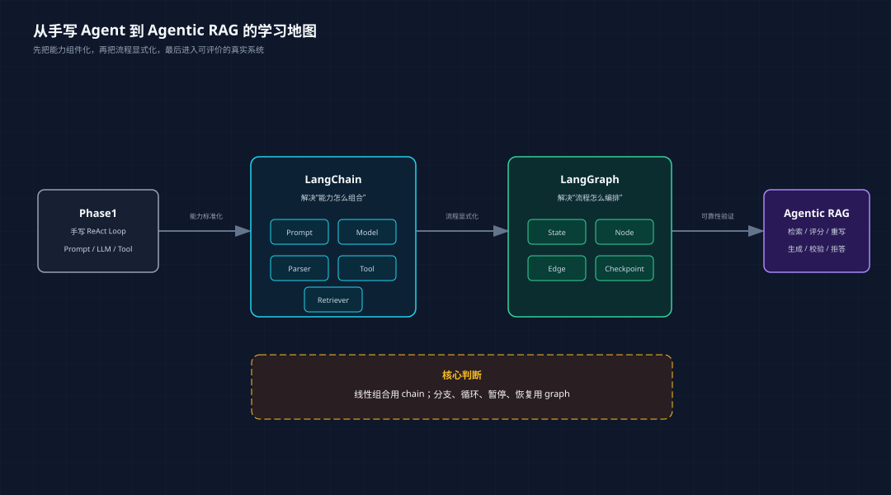
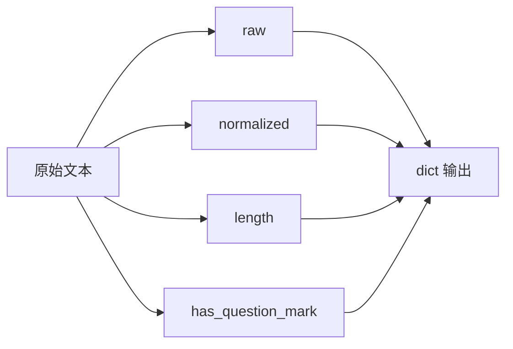
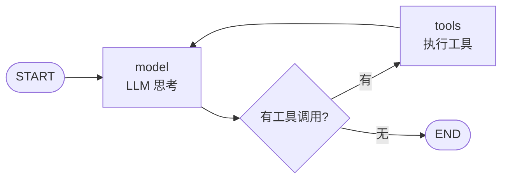
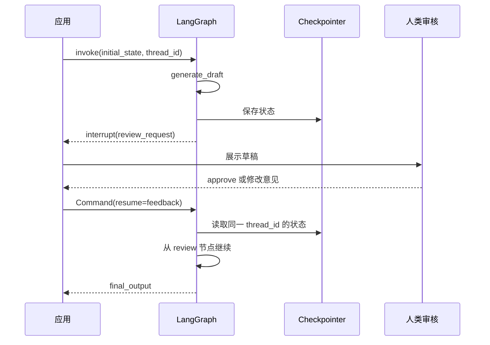
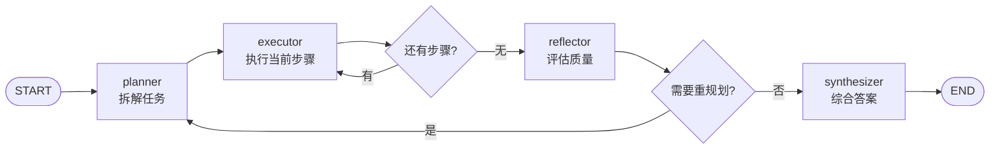
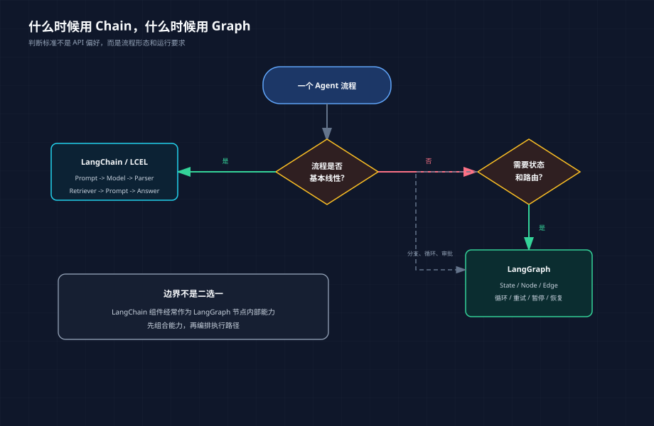
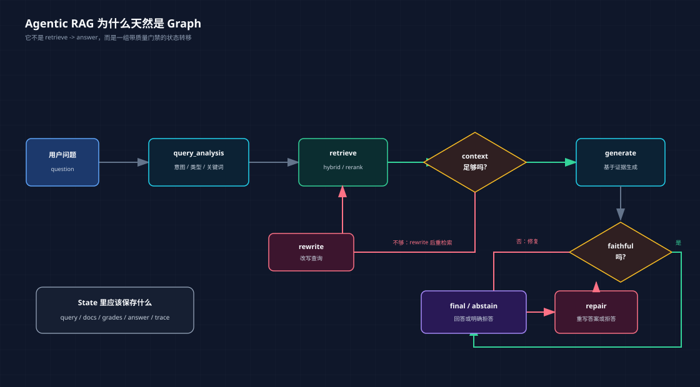

# 从 LangChain 到 LangGraph：Agent 框架基础真正要掌握什么

> 前置要求：读过 Phase1 的 ReAct / Tool Calling，理解 Prompt、LLM、Tool 的基本概念。
> 配套代码：`phase-3-frameworks/01-framework-basics/00-langchain-foundations/` 与 `phase-3-frameworks/01-framework-basics/01-langgraph-deep-dive/`。

**TL;DR：** LangChain 的重点不是“会写一条 chain”，而是把 Prompt、Model、Tool、Parser、Retriever 变成可复用能力；LangGraph 的重点不是“会画一个图”，而是把状态、路由、循环、暂停和恢复变成可控制的工作流。学完这两层，下一步才适合进入 Agentic RAG 这种需要检索质量、答案忠实度和运行可观测性的系统。

很多人学 Agent 框架，会从 API 开始：

```python
chain = prompt | model | parser
graph = StateGraph(State)
```

代码能跑，但脑子里没有结构。下一步遇到 RAG、工具调用、人工审批、失败重试、状态恢复，就开始靠感觉堆代码。

这不是 LangChain 或 LangGraph 的问题，是学习路径的问题。

LangChain 和 LangGraph 不应该被当成两套零散 API 来学。更好的理解方式是：

```text
LangChain 解决“能力怎么组合”。
LangGraph 解决“流程怎么编排”。
```

前者把 Prompt、Model、Tool、Parser、Retriever 变成可复用组件；后者把这些组件放进一个有状态、可路由、可暂停、可恢复的工作流。

这篇文章把工程里原来的三篇基础文章整合成一条主线：从 LangChain 的能力组合讲到 LangGraph 的状态图，再结合四个脚本拆开看代码架构。

---

## 一、为什么不能只从 API 学框架

如果只看 API，LangChain 和 LangGraph 很容易被学成这样：

```text
LangChain：会写 chain = prompt | model | parser
LangGraph：会写 add_node、add_edge、compile
```

这当然是入门，但不够。

Agent 系统真正难的不是“怎么调用模型”，而是：

```text
状态放在哪里？
下一步怎么决定？
什么时候应该重试？
什么时候应该拒答？
高风险动作能不能暂停？
服务重启后能不能恢复？
出了问题能不能复盘路径？
```

这些问题如果没有回答清楚，API 写得再熟也只是 demo。

所以我更建议用下面这张图来理解框架基础：



这张图里有两个分界点。

第一个分界点，是从 Phase1 手写代码到 LangChain。你不再每次都手写工具 schema、模型调用、输出解析，而是把常见能力包装成统一组件。

第二个分界点，是从 LangChain 到 LangGraph。你不再假设流程永远线性，而是显式设计状态、节点、边和失败路径。

学框架的重点，不是记住每个类叫什么，而是知道什么时候该从“调用链”升级到“工作流”。

---

## 二、LangChain 解决的是能力组合：Runnable、LCEL、Tool、Retriever

Phase1 里我们手写过 Agent 的基础能力：

```text
Prompt 拼接
LLM 调用
工具注册
工具执行
记忆列表
循环控制
```

这些代码很适合学习底层机制。但项目一多，就会遇到重复劳动：

```text
每个项目都要重新写模型调用、Prompt 拼接、工具 schema、输出解析、RAG 组装。
```

LangChain 要解决的不是“让模型更聪明”，而是把这些常见能力抽象成可组合组件。

一句话：

```text
LangChain 关注的是：如何把 Prompt、Model、Tool、Parser、Retriever 组合成可复用调用链。
```

### 1. Runnable：统一调用接口

在 LangChain 里，很多东西都可以看成 `Runnable`。

它可以是：

```text
Prompt
Model
Parser
Retriever
普通 Python 函数
另一个组合好的 chain
```

这件事看起来抽象，但工程价值很直接：你可以把不同能力统一成“可 invoke 的对象”。

配套 demo：`phase-3-frameworks/01-framework-basics/00-langchain-foundations/01_lcel_and_tools.py`

里面故意不用真实 LLM，而是写了一个 fake model：

```python
def fake_chat_model(prompt_value: Any) -> str:
    text = prompt_value.to_string() if hasattr(prompt_value, "to_string") else str(prompt_value)
    if "LangChain" in text:
        return "LangChain 的核心价值是把 Prompt、Model、Tool、Parser、Retriever 组合成可复用的 Runnable。"
    return f"收到输入：{text[:80]}"
```

为什么不用真实模型？

因为这一步要看的不是模型质量，而是框架如何组织调用链。模型越“聪明”，反而越容易把注意力带偏。

可以先直接跑：

```bash
cd phase-3-frameworks/01-framework-basics/00-langchain-foundations
python3 01_lcel_and_tools.py
```

输出里会依次看到三件事：

```text
LCEL: Prompt | Model | Parser
RunnableParallel: 同一输入的多个视角
Tool schema: 函数变成模型可调用的工具
```

这就是这一节要掌握的最小闭环。

### 2. LCEL：用管道表达调用链

LangChain Expression Language，通常简称 LCEL。

最常见的写法是：

```python
chain = prompt | model | parser
result = chain.invoke({"topic": "LangChain"})
```

它表达的是：

```text
输入 -> Prompt 模板 -> Model -> Parser -> 输出
```

对应到代码：

```python
prompt = ChatPromptTemplate.from_messages([
    ("system", "你是一个 AI Agent 学习助手。回答要简洁。"),
    ("human", "用一句话解释 {topic} 的核心价值。"),
])
model = RunnableLambda(fake_chat_model)
parser = StrOutputParser()

chain = prompt | model | parser
```

这段代码不是语法糖那么简单。

它把一个调用链变成了一个可以传递、复用、测试的对象：

```text
dict -> str
```

这比把 Prompt 拼接、模型调用、解析逻辑全部塞进一个函数里清楚很多。

运行后可以看到类似输出：

```text
LangChain 的核心价值是把 Prompt、Model、Tool、Parser、Retriever
组合成可复用的 Runnable。
```

这段输出虽然来自 fake model，但调用路径是真的：

```text
dict input -> ChatPromptTemplate -> RunnableLambda -> StrOutputParser -> str output
```

所以这不是“模拟 LangChain”，而是在用确定性模型观察 LangChain 的组合机制。

### 3. RunnableParallel：并行分支不是 if else

LCEL 不只支持顺序组合，也支持并行分支。

demo 里有这样一段：

```python
stats = RunnableParallel({
    "raw": RunnablePassthrough(),
    "normalized": normalize,
    "length": normalize | RunnableLambda(len),
    "has_question_mark": normalize | RunnableLambda(lambda x: "?" in x or "？" in x),
})
```

同一个输入会被送入多个分支：



这在 RAG 里很常见。

同一个问题可以并行做：

```text
提取关键词
判断问题类型
检索相关文档
生成 query rewrite
```

然后把结果合并给下一步。

demo 的输出大概是：

```text
raw               '  LangChain 和 LangGraph 有什么区别？  '
normalized        'langchain 和 langgraph 有什么区别？'
length            28
has_question_mark True
```

注意这里没有 `if/else`。

我们不是在一个函数里依次计算四个变量，而是把四个分支声明成一个并行结构。这个习惯后面会迁移到 RAG：同一个 query 可以同时进入关键词提取、问题分类、向量检索和 BM25 检索。

### 4. Tool：函数变成模型能理解的能力

模型不能直接调用 Python 函数。

它需要知道：

```text
工具叫什么
工具做什么
参数有哪些
参数类型是什么
```

LangChain 的 `@tool` 装饰器做的就是这个转换：

```python
@tool
def contains_keyword(text: str, keyword: str) -> bool:
    """判断文本是否包含指定关键词。"""
    return keyword.lower() in text.lower()
```

这一步对应 Phase1 手写的 `ToolRegistry`。

区别是：

```text
Phase1：自己维护工具名、描述、参数。
LangChain：函数签名和 docstring 自动变成工具 schema。
```

这就是 LangChain 的基础价值：它不替你设计复杂 Agent，但它把 Agent 所需的能力组件标准化了。

demo 里还会直接打印工具 schema：

```text
contains_keyword:
  description: 判断文本是否包含指定关键词。
  args:
    text: string
    keyword: string
```

然后再执行工具：

```python
contains_keyword.invoke({
    "text": "Agent workflow needs state",
    "keyword": "state",
})
```

输出：

```text
True
```

这一步要看清楚：Tool 不是“函数换个名字”。它把函数变成了模型可以选择、可以填参数、可以由程序执行的能力单元。

### 5. Retriever：把 RAG 也变成组件

Phase2 里我们已经写过 RAG pipeline：

```text
document loading -> chunking -> embedding -> vector store -> retrieval -> prompt -> generation
```

用 LangChain 的视角看，这些都可以是组件：

| Phase2 组件 | LangChain 视角 |
|---|---|
| 文档加载 | Document Loader |
| 文本分块 | Text Splitter |
| Embedding | Embeddings |
| 向量库 | VectorStore |
| 检索器 | Retriever |
| Prompt | PromptTemplate |
| LLM | ChatModel |
| 输出解析 | OutputParser |

如果流程只是：

```text
question -> retriever -> prompt -> model -> parser
```

LangChain 很舒服。

一个最小的 RAG chain 可以写成这样：

```python
def fake_retriever(question: str) -> list[str]:
    return [
        "LangChain 负责把 Prompt、Model、Tool、Retriever 组合成 Runnable。",
        "LangGraph 负责把 Agent 工作流建模为 StateGraph。",
    ]


rag_chain = (
    {
        "question": RunnablePassthrough(),
        "context": RunnableLambda(fake_retriever),
    }
    | ChatPromptTemplate.from_template("资料：{context}\n\n问题：{question}")
    | RunnableLambda(fake_chat_model)
    | StrOutputParser()
)
```

这段代码的重点不是检索质量，而是结构：

```text
question 同时进入两个分支
一个分支原样保留问题
一个分支检索 context
两个结果合并后进入 Prompt
```

但如果流程开始出现“判断检索质量、不够好就重写、生成后还要忠实度检查”，它就不再只是 chain。

这就进入下一层：LangGraph。

---

## 三、从 Chain 到 Graph：线性调用为什么不够

先看一个最小 Agent 循环：

```python
while not done:
    thought = think(task, memory)
    if thought.tool_call:
        observation = call_tool(thought.tool_call)
        memory.append(observation)
    else:
        done = True
```

这段代码适合 demo，也适合理解 ReAct。

但它有三个边界。

第一，控制流藏在代码里。

你想知道这个 Agent 的执行路径，只能从头读代码。等流程里有 5 个条件分支、3 个重试路径、2 个人工审批点，代码就会变成一团嵌套的 `if/else`。

第二，状态是隐式的。

`memory` 在循环里被不断修改。它什么时候被改，改了什么，服务挂掉后怎么恢复，都不是结构化设计的一部分。

第三，很难暂停和恢复。

产品说：“发邮件前让用户确认一下，确认后继续执行。”这时 while 循环就尴尬了。它要么继续跑，要么结束。真正的“暂停几小时，之后从断点继续”不是加一个输入框就能解决的。

所以 LangGraph 的核心不是“API 更高级”，而是换了一种表达方式：

```text
把 Agent 工作流建模成有向图。
节点是处理函数。
边是控制流。
State 是节点之间的数据合同。
```

对比一下：

```python
while_loop_demo = "控制流藏在代码里"
while step < max_steps:
    thought = think_fn(task, memory)
    if is_final(thought):
        break
    observation = act_fn(thought)
    memory.append(observation)

state_graph_demo = "控制流显式声明"
graph = StateGraph(AgentState)
graph.add_node("model", call_model)
graph.add_node("tools", call_tools)
graph.add_edge(START, "model")
graph.add_conditional_edges("model", should_continue, {"tools": "tools", END: END})
graph.add_edge("tools", "model")
```

两段代码都能表达 ReAct。

区别是：前者把流程埋进循环体，后者把流程声明成图。

如果要给两段代码加“人工审批”，差异会更明显。

while 循环版本通常会变成这样：

```python
if action.name == "send_email":
    approved = input("确认发送邮件？")
    if approved != "yes":
        return "用户取消"
```

这只能处理同步命令行输入。进程一停，现场就没了。

LangGraph 的思路不是在节点里卡住进程，而是把暂停变成图执行的一部分：

```python
feedback = interrupt({
    "type": "approval",
    "action": "send_email",
    "payload": email_payload,
})
```

暂停点和当前 State 会被 checkpointer 保存。恢复时，应用用同一个 `thread_id` 把 `Command(resume=...)` 送回图里。

---

## 四、LangGraph 的核心架构：State、Node、Edge、Graph

LangGraph 的心智模型很简单：

```text
State + Node + Edge = Graph
```

但每个词都很关键。

### 1. State：节点之间的数据合同

LangGraph 要求先定义 State。

例如 `01_state_graph_basics.py`：

```python
class AgentState(TypedDict):
    messages: Annotated[list, add_messages]
```

这里的 `TypedDict` 不是装饰。

它是所有节点之间的合同。

`messages` 表示这个 Agent 当前拥有的对话上下文；`add_messages` 是 reducer，说明新的消息不是覆盖旧消息，而是追加进去。

State-first 的好处是：你会被迫回答一个问题。

```text
这个 Agent 到底需要保存哪些中间状态？
```

这比一上来就写节点函数更重要。

### 2. Node：节点就是普通函数

节点没有神秘感。

节点就是：

```text
State -> partial State
```

比如模型节点：

```python
def call_model(state: AgentState) -> dict:
    response = llm.invoke(state["messages"])
    return {"messages": [response]}
```

工具节点：

```python
def call_tools(state: AgentState) -> dict:
    last_message = state["messages"][-1]
    results = []
    for call in last_message.tool_calls:
        tool_fn = tool_map[call["name"]]
        result = tool_fn.invoke(call["args"])
        results.append(ToolMessage(content=str(result), tool_call_id=call["id"]))
    return {"messages": results}
```

每个节点只返回自己负责更新的字段。

这让节点天然可测试，也让状态变更更容易追踪。

### 3. Edge：控制流显式化

普通代码里，控制流常常藏在函数内部。

LangGraph 把它拆出来：

```python
def should_continue(state: AgentState) -> str:
    last_message = state["messages"][-1]
    if last_message.tool_calls:
        return "tools"
    return END
```

然后挂到条件边上：

```python
graph.add_conditional_edges("model", should_continue, {"tools": "tools", END: END})
```

这一步很关键。

Agent 的失败经常不是某个函数报错，而是走错路径：

```text
该检索时没检索
该重写时没重写
该拒答时生成了答案
该人工确认时直接执行
```

显式边能让这些路径被观察、测试和复盘。

### 4. Graph：可运行的工作流

最后把节点和边组装起来：

```python
graph = StateGraph(AgentState)
graph.add_node("model", call_model)
graph.add_node("tools", call_tools)
graph.add_edge(START, "model")
graph.add_conditional_edges("model", should_continue, {"tools": "tools", END: END})
graph.add_edge("tools", "model")
agent = graph.compile()
```

图结构长这样：



这就是 LangGraph 最基础的架构。

不是“把 while 循环换个写法”，而是把执行路径变成可以声明、检查、扩展、持久化的结构。

对应到一次真实运行，输入可能是：

```python
result = agent.invoke({
    "messages": [HumanMessage(content="帮我算一下 (17 * 23) + (45 * 12)")]
})
```

执行路径会是：

```text
START -> model -> tools -> model -> END
```

如果只是普通聊天，没有工具调用，路径则是：

```text
START -> model -> END
```

这就是条件边的价值：不是所有输入都走同一条链路。

---

## 五、`01_state_graph_basics.py`：ReAct 循环如何变成状态图

这个脚本是 LangGraph 学习的入口。

运行方式：

```bash
cd phase-3-frameworks/01-framework-basics/01-langgraph-deep-dive
python3 01_state_graph_basics.py
```

它做的事情很简单：

```text
用户输入
  -> model 节点
  -> 如果模型要调工具，进入 tools 节点
  -> 工具结果回到 model
  -> 没有工具调用则结束
```

从架构上看，它包含四层：

| 层级 | 代码 | 作用 |
|---|---|---|
| State | `AgentState` | 保存消息列表，用 reducer 控制合并策略 |
| Tool | `calculate`、`get_word_length` | 复用 LangChain 的 `@tool` 生成 schema |
| Node | `call_model`、`call_tools` | 模型思考与工具执行分离 |
| Edge | `should_continue` | 决定继续调工具还是结束 |

这里最值得学的不是“怎么写计算器工具”，而是两个拆分。

第一个拆分：模型节点和工具节点分开。

模型只负责决定要不要调用工具；工具节点只负责执行工具并返回结果。

这样以后要加权限控制、工具超时、审计日志，就不用改模型节点。

第二个拆分：路由函数独立出来。

`should_continue` 不是藏在 `call_model` 里，而是单独作为条件边。

这意味着你可以单测它：

```python
def test_should_continue_to_tools(ai_message_with_tool_calls):
    state = {"messages": [ai_message_with_tool_calls]}
    assert should_continue(state) == "tools"


def test_should_continue_to_end(ai_message_without_tool_calls):
    state = {"messages": [ai_message_without_tool_calls]}
    assert should_continue(state) == END
```

这种可测试性，是从 demo 走向工程的第一步。

再看工具执行节点：

```python
def call_tools(state: AgentState) -> dict:
    last_message = state["messages"][-1]
    results = []
    for call in last_message.tool_calls:
        tool_fn = tool_map[call["name"]]
        result = tool_fn.invoke(call["args"])
        results.append(ToolMessage(content=str(result), tool_call_id=call["id"]))
    return {"messages": results}
```

它没有关心“下一步去哪”。

这就是一个好节点的样子：只做一件事，把控制流交给边。

---

## 六、`02_human_in_the_loop.py`：interrupt、thread_id、checkpointer 如何支撑暂停恢复

人机协作是很多 Agent demo 最容易讲虚的地方。

运行方式：

```bash
cd phase-3-frameworks/01-framework-basics/01-langgraph-deep-dive
python3 02_human_in_the_loop.py
```

真正的问题不是“能不能弹出一个确认框”，而是：

```text
图执行到一半能不能停？
停下来的状态保存在哪里？
用户几个小时后回来，怎么从原位置继续？
多个用户的暂停状态怎么隔离？
```

`02_human_in_the_loop.py` 用一个文案审核流程回答这些问题：



对应代码里有三个关键点。

第一，State 里显式保存审核相关字段：

```python
class ReviewState(TypedDict):
    messages: Annotated[list, add_messages]
    draft: str
    human_feedback: str
    approved: bool
    final_output: str
```

第二，`interrupt()` 是正式暂停点：

```python
feedback = interrupt({
    "type": "review_request",
    "draft": state["draft"],
    "prompt": "请审核这份草稿。输入修改意见，或输入 'approve' 批准。",
})
```

第三，恢复时必须带同一个 `thread_id`：

```python
config = {"configurable": {"thread_id": "review-session-1"}}
result = app.invoke(Command(resume=feedback), config)
```

为了让这个 demo 能进入自动化验收，脚本还补了一个小的输入适配：

```python
def get_review_feedback() -> str:
    env_feedback = os.getenv("HUMAN_REVIEW_FEEDBACK")
    if env_feedback:
        return env_feedback
    if not sys.stdin.isatty():
        return "approve"
    return Prompt.ask("你的反馈（输入 'approve' 批准，或输入修改意见）")
```

这段代码不改变 LangGraph 的图逻辑，只解决运行环境差异：本地学习时可以手动输入，CI 或非交互环境里默认走 `approve`，避免基础 smoke test 卡在 stdin 上。

这里的重点是：interrupt 不是一个 UI 功能，它依赖 checkpointer。

图的组装也能看出这个设计：

```python
graph.add_edge(START, "generate")
graph.add_edge("generate", "review")
graph.add_conditional_edges("review", check_approval, {
    "finalize": "finalize",
    "revise": "revise",
})
graph.add_edge("revise", "review")
graph.add_edge("finalize", END)

memory = InMemorySaver()
app = graph.compile(checkpointer=memory)
```

这里的 `revise -> review` 是一个显式回路。用户不批准，就回到修改节点；批准，才走向定稿。

没有 checkpointer，图不知道暂停在哪里，也不知道恢复时该加载哪份状态。

所以生产 Agent 和 demo Agent 的区别，经常不是“能调多少工具”，而是：

```text
能不能安全暂停、等待、恢复。
```

---

## 七、`03_plan_and_execute.py`：规划、执行、反思为什么应该拆成节点

很多教程讲 Plan-and-Execute，会说：

```text
先让 LLM 规划，再让 LLM 执行。
```

这还只是 prompt 拆分。

在 LangGraph 里，更关键的是把“规划、执行、反思、综合”拆成不同节点：



这背后有三个工程收益。

运行方式：

```bash
cd phase-3-frameworks/01-framework-basics/01-langgraph-deep-dive
python3 03_plan_and_execute.py
```

第一，可以换模型。

规划节点可以用强模型，执行节点可以用便宜模型，反思节点可以用更严格的 judge prompt。

第二，可以单独加控制。

比如在 `reflector` 后面插入人工审核：

```text
reflector -> human_review -> planner / synthesizer
```

第三，可以追踪任务进度。

`PlanExecuteState` 里保存了：

```python
class PlanExecuteState(TypedDict):
    task: str
    plan: list[str]
    current_step: int
    step_results: list[str]
    reflection: str
    needs_replan: bool
    final_answer: str
```

这不是普通聊天历史。

它是一个任务执行状态机。

看两个路由函数就更清楚：

```python
def should_execute_or_reflect(state: PlanExecuteState) -> str:
    if state["current_step"] < len(state["plan"]):
        return "executor"
    return "reflector"


def should_replan_or_finish(state: PlanExecuteState) -> str:
    if state.get("needs_replan"):
        return "planner"
    return "synthesizer"
```

这两段代码把“任务进度”和“是否重规划”从 prompt 里拿了出来，变成工程逻辑。

如果后面你要限制最多重规划两次，就应该扩展 State：

```python
class PlanExecuteState(TypedDict):
    ...
    replan_count: int
    max_replan: int
```

然后在路由函数里判断，而不是只在 prompt 里写“不要重复规划太多次”。

当任务失败时，你能知道：

```text
计划是什么？
执行到第几步？
哪一步结果不好？
为什么触发重规划？
最终答案基于哪些步骤结果？
```

这就是把 Agent 从“模型连续说话”升级成“可调试工作流”。

---

## 八、`05_persistence_memory.py`：checkpointing、线程隔离、状态回放

初学者很容易把 checkpointing 理解成“保存聊天记录”。

运行方式：

```bash
cd phase-3-frameworks/01-framework-basics/01-langgraph-deep-dive
python3 05_persistence_memory.py
```

这不准确。

LangGraph 的 Checkpointer 保存的是图执行状态：

```text
每个节点执行后的 State 快照
条件边的路由结果
interrupt 的暂停上下文
thread_id 对应的会话状态
checkpoint_id 与时间顺序
```

`05_persistence_memory.py` 做了三个演示。

### 1. 多轮对话持久化

同一个 `thread_id` 连续调用：

```python
config = {"configurable": {"thread_id": "user-alice"}}
app.invoke({"messages": [HumanMessage(content="我叫 Alice")], "summary": "", "turn_count": 0}, config)
app.invoke({"messages": [HumanMessage(content="你还记得我是谁吗？")], "summary": "", "turn_count": 0}, config)
```

图会沿用之前的状态。

这和普通函数调用完全不同。普通函数每次调用都是新的；带 checkpointer 的图会把“这个线程之前发生过什么”带回来。

### 2. 线程隔离

Alice 和 Bob 用不同 `thread_id`：

```text
user-alice-2
user-bob
```

两份状态互不影响。

这对应真实产品里的多用户会话隔离。

### 3. 状态历史检查

脚本里用：

```python
states = list(app.get_state_history(config))
for state in states[:3]:
    print(state.values.get("turn_count"), len(state.values.get("messages", [])))
```

查看 checkpoint 历史。

真实调试时，你关心的不是“保存了几条消息”，而是：

```text
当时 state 里 summary 是什么？
当时走到了哪个节点？
当时 messages 有几条？
当时 checkpoint_id 是什么？
```

这件事很重要。

传统 Agent 出问题时，你往往只能加日志再跑一次。但 LLM 是非确定性的，再跑一次可能已经不是当时的现场。

Checkpointing 的价值是：

```text
回到案发现场，而不是重新演一遍案发过程。
```

这也是为什么 LangGraph 官方会把 persistence、durable execution、human-in-the-loop 放在核心能力里，而不是附加功能。

---

## 九、LangChain 和 LangGraph 的边界：什么时候用 chain，什么时候用 graph

LangChain 和 LangGraph 不是替代关系。

更准确的关系是：

```text
LangChain 提供能力组件。
LangGraph 编排组件的执行流程。
```

可以用这张表判断：



| 问题 | 更适合 |
|---|---|
| Prompt、Model、Parser 顺序组合 | LangChain |
| Retriever -> Prompt -> Model 的 RAG 链路 | LangChain |
| 工具 schema 化和工具调用封装 | LangChain |
| 多个输入视角并行计算 | LangChain / LCEL |
| 多步骤任务执行 | LangGraph |
| 条件路由、循环重试 | LangGraph |
| 人工审批、暂停恢复 | LangGraph |
| 长任务状态持久化 | LangGraph |
| 需要 trace、checkpoint、时间旅行 | LangGraph |

一句话判断：

```text
如果流程是线性的，用 chain。
如果流程会分支、循环、暂停、恢复，用 graph。
```

例如基础 RAG：

```text
question -> retrieve -> prompt -> model -> answer
```

用 LangChain 就很好。

但 Agentic RAG 是：



```text
query_analysis
  -> retrieve
  -> context_grade
      -> generate
      -> rewrite -> retrieve
      -> abstain
  -> faithfulness_check
      -> repair
      -> abstain
      -> end
```

这已经不是 chain。

这是 workflow。

workflow 需要显式状态和条件边。

---

## 十、回到本工程：为什么下一步进入 Agentic RAG

Phase3 不是为了“用过 LangChain 和 LangGraph”。

真正目标是掌握 Agent 设计和开发能力。

这件事可以拆成几层：

```text
第一层：能力组件化
Prompt / Model / Parser / Tool / Retriever

第二层：流程显式化
State / Node / Edge / Graph

第三层：执行可控
route / retry / repair / abstain / human review

第四层：运行可恢复
thread_id / checkpoint / state history

第五层：系统可评估
trace / latency / cost / faithfulness / benchmark
```

LangChain 主要覆盖第一层。

LangGraph 从第二层开始发力。

Agentic RAG 会把这些层放在同一个真实系统里：

```text
用户问题
  -> query analysis
  -> hybrid retrieval / rerank
  -> context grading
  -> query rewrite or generate
  -> faithfulness check
  -> repair or abstain
  -> trace / metric / report
```

这就是为什么基础框架学习之后，不应该继续堆更多 demo，而应该进入可评估系统。

如果读完这篇只带走一个判断，我希望是：

```text
LangChain 让能力可组合。
LangGraph 让流程可控制。
Agentic RAG 让这两件事接受真实问题的检验。
```

框架会继续变，但这三个问题不会变：

```text
能力怎么封装？
流程怎么编排？
结果怎么证明可靠？
```

这才是 Agent 框架基础真正要掌握的东西。

---

## 十一、这轮测试后：掌握到什么程度才算够

这次把 `phase-3-frameworks/01-framework-basics/` 跑了一遍，结论是：当前 LangChain / LangGraph 基础已经足够进入 Agentic RAG，但还不等于已经掌握生产级 Agent 开发。

够的部分有五个：

| 能力 | 对应脚本 | 掌握标准 |
|---|---|---|
| 组件组合 | `00-langchain-foundations/01_lcel_and_tools.py` | 能解释 Runnable、LCEL、Tool schema 为什么存在 |
| 状态图 | `01_state_graph_basics.py` | 能把 ReAct loop 改写成 State + Node + Edge |
| 人机协作 | `02_human_in_the_loop.py` | 能说明 interrupt 为什么必须依赖 checkpointer 和 thread_id |
| 规划执行 | `03_plan_and_execute.py` | 能把 planner、executor、reflector 拆成独立节点 |
| 持久化记忆 | `05_persistence_memory.py` | 能解释 checkpoint 保存的是图状态，不只是聊天记录 |

还不够的地方也很明确。

第一，基础 demo 证明的是“框架抽象能跑”，不是“结果一定可靠”。`04-framework-showdown/02_langgraph_solution.py` 能完整跑完 planner、researcher、analyzer、synthesizer，但研究内容仍然跑偏到了 Spring Cloud、React/Vue/Angular 这类无关框架。这说明 LangGraph 控制的是流程，不自动保证每个节点的事实质量。

第二，CrewAI 的甜蜜点是角色协作和快速产出。`03_product_analysis_crew.py` 很顺，但输出里的市场规模、比例、增长率没有来源约束，不能直接当研究结论。`02_hierarchical_delegation.py` 可以观察 Manager 自动委派，但运行时间长、隐式步骤多，中间还会出现工具参数校验或 JSON 解析错误后自恢复，不适合作为日常 smoke test。

第三，Claude SDK 目录说明了另一件事：没有 `ANTHROPIC_API_KEY` 时，完整 agent loop 跑不起来，但规则 Guardrail 和 AST 静态分析仍然能工作。这是一个好的工程启发：确定性规则、静态分析、权限边界应该先于 LLM 语义判断。

所以进入下一阶段前，真正要补的不是更多框架 API，而是三类能力：

```text
检索约束：让节点拿到对的资料
评价机制：判断回答是否有依据
可观测性：记录路径、延迟、成本、失败原因
```

这也是为什么下一步应该进入 Agentic RAG。它会把 LangChain 的组件、LangGraph 的流程、Guardrail 的安全边界和 benchmark 的评价方法放到同一个系统里验证。

---

## 参考资料

- [LangChain Overview](https://docs.langchain.com/oss/python/langchain/overview)
- [LangGraph Overview](https://docs.langchain.com/oss/python/langgraph/overview)
- [LangGraph Interrupts](https://docs.langchain.com/oss/python/langgraph/interrupts)
- [LangGraph Persistence](https://docs.langchain.com/oss/python/langgraph/persistence)
