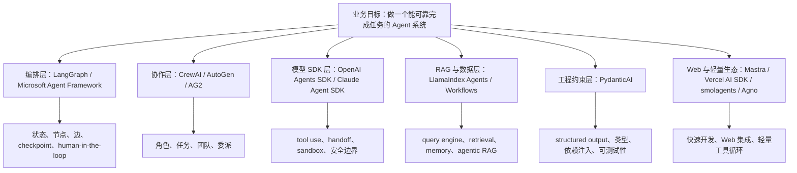

# Agent 框架怎么选：从 LangGraph 到 CrewAI、SDK、LlamaIndex

> 前置要求：读过基础 RAG、tool calling、LangChain / LangGraph 的基本概念，知道 Agent 不是一次 LLM 调用，而是带工具、状态和控制流的执行系统。

这篇文章不做“谁支持工具调用、谁支持多 Agent”的功能表。

因为到了 2026 年，主流 Agent 框架基本都能调用工具，也基本都能拼出多步流程。真正影响工程选型的，不是“能不能做”，而是：

> 当系统开始变复杂时，框架替你隐藏了什么，又强迫你面对什么。

我在 Phase3 里已经跑过 LangGraph、CrewAI、Claude SDK 以及一个 framework showdown。跑完之后会有一个很直接的感受：这些框架不是同一层东西。把它们放在一个表里打勾叉，会把问题看窄。

更合理的看法是分层。

先说明一下范围：LangGraph、CrewAI、Claude SDK demo 和 framework showdown，是这个工程里已经实际跑过的内容；OpenAI Agents SDK、LlamaIndex、PydanticAI、Microsoft Agent Framework、AutoGen / AG2、Agno、Mastra、Vercel AI SDK、smolagents，是结合当前主流生态补进来的选型观察。前者讲运行体感，后者讲学习价值和工程边界，不混在一起装成“都做过”。



这张图比功能表重要。

因为做 Agent 的时候，我们真正要回答的问题是：我现在缺的是编排能力、协作能力、工具执行能力、RAG 能力，还是工程约束能力？

下面按这个思路展开。

---

## 一、不要从功能表开始比较 Agent 框架

很多框架对比文章会这样写：

| 能力 | LangGraph | CrewAI | OpenAI SDK | Claude SDK |
|---|---|---|---|---|
| 工具调用 | 支持 | 支持 | 支持 | 支持 |
| 多 Agent | 支持 | 支持 | 支持 | 支持 |
| RAG | 支持 | 支持 | 可接入 | 可接入 |
| 人机协作 | 支持 | 支持 | 可实现 | 可实现 |

这类表格看起来完整，但对选型帮助很小。

因为“支持”两个字背后可能是完全不同的工程含义。

以人机协作为例：

- LangGraph 里可以用 `interrupt` 和 checkpointer 把图停在某个节点，等人类审批后继续。
- CrewAI 里可以通过 task、guardrail、human input 做流程控制，但它的核心心智模型仍然是角色协作。
- OpenAI / Claude SDK 里你可以自己写工具调用和 handoff 逻辑，但状态恢复、重试策略、审批点设计需要自己组织。

它们都能做，但代价不同。

再比如多 Agent：

- CrewAI 的多 Agent 很自然，因为它的核心抽象就是 Agent、Task、Crew。
- LangGraph 的多 Agent 本质是多节点、多子图和路由。
- SDK 层的多 Agent 更像多个模型调用对象之间的 handoff。

如果只看功能表，容易得出“都差不多”的结论。

但一旦落到真实工程，会发现差异非常大。

---

## 二、先把 Agent 框架分层

我更愿意把主流框架分成五层。

| 层级 | 代表框架 | 解决的问题 | 典型风险 |
|---|---|---|---|
| 编排层 | LangGraph、Microsoft Agent Framework | 明确状态、路由、循环、checkpoint、恢复 | 学习曲线高，代码更重 |
| 协作层 | CrewAI、AutoGen / AG2 | 多角色分工、任务委派、团队协作 | 控制流不透明，调试成本高 |
| SDK 层 | OpenAI Agents SDK、Claude Agent SDK | 模型原生工具调用、handoff、sandbox、安全边界 | 容易变成手写编排 |
| RAG / 数据层 | LlamaIndex Agents / Workflows | 文档、检索、query planning、agentic RAG | 编排复杂度不一定最低 |
| 工程约束层 | PydanticAI | 类型安全、structured output、依赖注入、可测试性 | 不是复杂编排框架 |

这五层不是互斥关系。

一个生产系统里可能是：

```text
LangGraph 做编排
+ LlamaIndex 做知识库工具
+ PydanticAI 约束输出
+ OpenAI / Claude SDK 执行模型调用
+ MCP 接工具生态
```

所以学习 Agent 框架，不是为了找一个“全能框架”，而是理解不同抽象分别解决什么问题。

---

## 三、LangGraph：把 Agent 写成可控状态图

如果 Phase3 只能选一个主线，我还是会选 LangGraph。

原因不是它最容易，而是它最接近真实 Agent 系统的难点。

LangGraph 的核心抽象很朴素：

```text
State + Node + Edge
```

State 表示系统现在知道什么。

Node 表示当前要做什么。

Edge 表示下一步去哪。

这和我们在 Agentic RAG 里遇到的问题刚好对应：

```text
query_analysis
  -> retrieve
  -> context_grade
      -> generate
      -> rewrite -> retrieve
      -> abstain
  -> faithfulness_check
      -> repair
      -> abstain
      -> end
```

这个流程不是“多个 Agent 聊天”，而是一个强控制流系统。

它需要保存：

- 原始问题
- 改写后的 query
- 检索结果
- context score
- answer
- faithfulness
- retry count
- repair count
- route trace
- latency 和 cost

这些东西都应该是显式状态。

LangGraph 适合这类系统，是因为它不会假装状态不存在。你必须把状态设计出来。

一个最小的路由逻辑大概长这样：

```python
def route_after_context_grade(state: dict) -> str:
    if state["context_score"] >= 0.7:
        return "generate"
    if state["retry_count"] < 2:
        return "rewrite"
    return "abstain"
```

这段代码看起来普通，但它很关键。

它把 Agent 的行为边界写成了可测试的工程逻辑，而不是藏在 Prompt 里。

### LangGraph 暴露了什么

LangGraph 暴露了状态设计、节点拆分、路由策略、失败出口。

这意味着你需要自己决定：

- 什么情况下 rewrite
- 什么情况下 repair
- 什么情况下 abstain
- checkpoint 保存哪些状态
- trace 要记录到什么粒度

这也是它的学习成本。

但从工程角度看，这些本来就不应该被完全隐藏。

我们在 `04-framework-showdown/02_langgraph_solution.py` 里跑过一个对比任务。它能完整走完 planner、researcher、analyzer、synthesizer，但中间有两个研究结果跑偏到了 React/Vue/Angular、Rasa/Dialogflow。

这件事反而很有价值。

它说明：LangGraph 能帮你控制流程，但不会自动保证每个节点的研究质量。节点的 Prompt、检索约束、上下文注入、评价机制，仍然要你自己设计。

这就是框架边界。

### 什么时候选 LangGraph

适合：

- Agentic RAG
- 多步推理 + 检索 + 质量检查
- 需要 retry / repair / abstain 的系统
- 需要 checkpoint、人机审批、状态恢复的系统
- 希望把 Agent 行为做成可观测工作流的系统

不适合：

- 只有一两个工具调用的小助手
- 只是想快速验证一个多角色 idea
- 团队还没有理解状态建模和 workflow 设计

我的判断是：LangGraph 不一定是最容易上手的框架，但它最适合作为学习主线。因为它会逼你面对 Agent 系统真正难的地方。

---

## 四、CrewAI：用角色协作快速搭原型

CrewAI 的心智模型非常直觉：

```text
Agent = 角色
Task = 任务
Crew = 团队
Process = 协作流程
```

这也是为什么它适合入门和快速原型。

你想做一个产品分析团队，就定义市场研究员、竞品分析师、技术评估师、报告撰写者。每个角色有 role、goal、backstory，然后按任务链执行。

我们跑过 `02-crewai-multi-agent/03_product_analysis_crew.py`，结果很符合 CrewAI 的甜蜜点：

```text
市场研究 -> 竞品分析 -> 技术评估 -> 综合报告
```

这个任务角色边界清楚，流程固定，CrewAI 表达起来非常顺。

同样的事情如果用 LangGraph 写，当然也能写，但你要定义 State schema、节点函数、边和上下文传递。对这个场景来说，确实有点重。

### CrewAI 暴露了什么

CrewAI 暴露角色、任务、目标、工具。

它隐藏上下文传递、Agent 协调、任务调度。

这会带来一种很舒服的体验：

```python
crew = Crew(
    agents=[researcher, analyst, writer],
    tasks=[research_task, analysis_task, writing_task],
    process=Process.sequential,
)
```

但隐藏越多，调试边界也越明显。

我们跑 `02_hierarchical_delegation.py` 时，它可以正常完成 Manager 委派、架构设计、代码生成、审查、返工、再审查，但这个 demo 非常重。它不是一个短平快 smoke test，而是会自动展开很多轮任务。

更具体一点，这次测试里它运行了很久，中间出现过 coworker / delegate 工具参数缺 `context` 的校验错误，也出现过工具参数 JSON 解析失败，然后框架继续尝试自恢复。这些现象不是“代码不能用”，恰恰说明 hierarchical 模式把很多调度细节放进了框架和 LLM 的协商过程里：产出可能很完整，但路径、成本和失败点不容易精确控制。

这正是 CrewAI hierarchical 模式的特点：写起来简单，但 Manager 的内部调度会变成黑盒。它很像把一个团队交给“自动项目经理”，你能看到产出，但很难精确控制每一步为什么这么走。

### 什么时候选 CrewAI

适合：

- 市场分析、产品分析、内容生成
- 研究员、分析师、写作者这种角色分工明确的流程
- 快速验证多 Agent 协作是否有价值
- 非强控制流的原型项目

不适合：

- 需要严格路由和可验证 trace 的生产工作流
- 每一步失败都要有明确恢复策略的系统
- 需要精确控制成本、延迟、重试次数的系统

CrewAI 不是不好，它只是解决的是另一类问题。

如果 LangGraph 像画流程图，CrewAI 更像搭一个临时项目组。

---

## 五、OpenAI / Claude Agent SDK：模型厂商的工具循环与安全边界

OpenAI Agents SDK 属于模型厂商原生 SDK。当前工程里的 `03-claude-agent-sdk` 更准确地说，是基于 Anthropic API / Claude tool use 思路写的一组 SDK 层 demo，用来学习工具循环、guardrail、handoff 和 autonomous coding 的边界；它不应该被理解成一个和 LangGraph、CrewAI 同层级的完整编排框架。

它们的重点不是“帮你设计复杂业务流程”，而是把模型调用、工具调用、handoff、sandbox、安全执行这些能力做成更标准的底层设施。

OpenAI 在 2026 年 4 月发布的 Agents SDK 更新里，重点强调了更强的 agent loop harness、原生 sandbox execution，以及让 Agent 在受控 workspace 里查看文件、运行命令、编辑代码、处理长任务的能力。

OpenAI Agents SDK 文档里，Agent 的核心构件是 instructions、model、tools。多 Agent 编排则分成两种思路：让 LLM 决策，或者用代码编排。

这和我们自己手写 Agent 时的经验很像：

```text
Agent = prompt + model + tools + run loop
```

Anthropic / Claude 这一层也类似，不过更强调工具协议、安全边界和应用侧执行责任。Claude 的 tool use / computer use 文档里反复强调：模型可以提出工具调用请求，但真正执行工具、回填结果、控制权限边界的是应用。

我们在 `03-claude-agent-sdk` 里跑过三个 demo：

- `01_agent_loop.py` 因为缺 `ANTHROPIC_API_KEY` 没有完整运行。
- `02_guardrails_handoffs.py` 在缺 key 情况下仍然跑通规则层 Guardrail。
- `03_autonomous_coder.py` 在缺 key 情况下仍然跑了 AST 静态代码审查。

这个结果很有意思。

它说明 SDK 层可以分成两部分：

```text
确定性部分：规则、AST、工具 schema、权限边界
LLM 部分：语义判断、计划、自然语言生成
```

真正好的 Agent 系统，不应该所有判断都交给 LLM。

比如代码审查 Agent 可以先用 AST 找明显问题，再把高风险片段交给 LLM 做语义判断。这样比全量调用 LLM 更便宜，也更稳定。

### SDK 层暴露了什么

SDK 层暴露的是最底层的 Agent loop。

你要自己决定：

- 什么时候调用模型
- 工具怎么注册
- 工具结果怎么回填
- handoff 怎么设计
- 安全策略在哪一层执行
- sandbox 里能做什么，不能做什么

它的好处是灵活，坏处是容易写成一堆 if / for / while。

如果你只是写一个单 Agent 工具助手，SDK 层非常合适。

如果你要做一个复杂的企业流程，它最好配合 LangGraph 这种编排层使用。

```text
LangGraph：决定下一步去哪
OpenAI / Claude SDK：执行某一步里的模型与工具调用
```

这比把所有东西都塞进一个 SDK loop 更清楚。

---

## 六、LlamaIndex：RAG 和知识库 Agent 的自然延伸

如果你已经做过 Phase2 RAG，那么 LlamaIndex 是很自然的下一站。

LlamaIndex 官方对 Agent 的描述很接近 RAG 场景：Agent 会接收用户输入，内部做决策，可能会拆解复杂问题、选择工具、规划任务，并使用 memory。

这和知识库问答非常贴。

LlamaIndex 的优势不是“比 LangGraph 更会编排复杂状态图”，而是它的数据和检索生态更完整。

比如：

- Query Engine
- Retriever
- Tool
- Query Planning
- Sub Question
- Agentic RAG
- LlamaParse
- LlamaHub
- AgentWorkflow
- Workflows

这些东西对文档密集型系统很实用。

一个企业知识库 Agent 常常不是先问“我该用几个 Agent”，而是先问：

```text
资料怎么切？
索引怎么建？
query 怎么拆？
多个知识库怎么路由？
检索结果怎么变成工具？
复杂问题怎么分解成多个子问题？
```

LlamaIndex 正好在这一层比较强。

### LlamaIndex 暴露了什么

LlamaIndex 暴露的是“数据到 Agent”的桥。

它让检索、query planning、tool use、workflow 更容易接起来。

但如果你的核心难点是复杂控制流，比如：

```text
检索不够好 -> rewrite
rewrite 两次还不行 -> abstain
生成后不忠实 -> repair
repair 后还不行 -> 人类审核
```

那你仍然需要很认真地设计 workflow。

所以我的建议是：LlamaIndex 不替代 LangGraph 主线，但它应该成为 Phase3 的 RAG Agent 补充模块。

具体可以这样学：

```text
Phase2 RAG benchmark
  -> LlamaIndex query engine / tools
  -> LlamaIndex AgentWorkflow
  -> 与 LangGraph Agentic RAG 对比
```

这样最顺。

---

## 七、PydanticAI：类型安全和结构化输出

PydanticAI 不是最“炫”的框架，但它很值得补。

原因很简单：真实工程里，LLM 输出不能总是一段自由文本。

你经常需要它返回：

```python
class RouteDecision(BaseModel):
    route: Literal["retrieve", "rewrite", "abstain"]
    confidence: float
    reason: str
```

或者：

```python
class FaithfulnessJudgement(BaseModel):
    score: float
    unsupported_claims: list[str]
    should_repair: bool
```

这类结构化输出是 Agent 工程的基本功。

PydanticAI 官方把 Agent 看作与 LLM 交互的主要接口，并强调 instructions、tools、structured output、dependency、model settings 这些构件。它的输出也能保留类型信息，例如用 Pydantic model 作为 `output_type`。

这很适合补 Agent 工程化短板。

### PydanticAI 暴露了什么

PydanticAI 暴露的是类型、依赖、结构化输出。

它不会替你解决复杂多节点编排，但会让单个 Agent 调用更可靠。

在 LangGraph 里，它可以用来约束每个节点的输出。

比如：

```text
query_analysis node -> QueryAnalysis
context_grade node -> ContextGrade
faithfulness_check node -> FaithfulnessJudgement
router node -> RouteDecision
```

这样做的好处是：状态图里的每个节点不再返回一段随缘文本，而是返回可校验的数据。

如果 LangGraph 是骨架，PydanticAI 就像关节处的螺丝。

不显眼，但松了会出事。

---

## 八、Microsoft Agent Framework / Semantic Kernel：企业生态与 Azure 集成

Microsoft Agent Framework 值得单独提一下。

根据 Microsoft 官方文档，Agent Framework 提供 Agents 和 Workflows 两类能力：Agent 负责处理输入、调用工具和 MCP server、生成响应；Workflows 负责连接多个 agent 和 function，支持多步骤任务、类型安全路由、checkpoint、人机协作。

更重要的是，微软明确把它描述为 AutoGen 和 Semantic Kernel 的后续统一方向：结合 AutoGen 的 agent 抽象和 Semantic Kernel 的企业能力，比如状态管理、类型安全、middleware、telemetry。

这对选型有两个影响。

第一，如果你在 Azure / .NET / Microsoft 生态里，Microsoft Agent Framework 比单独看 AutoGen 或 Semantic Kernel 更值得关注。

第二，如果你只是学习通用 Agent 设计，不一定要把它作为主线。因为它的价值很大一部分来自企业生态集成。

### 它适合什么

适合：

- Azure / Microsoft 生态项目
- .NET + Python 混合团队
- 需要企业 telemetry、middleware、type safety 的系统
- 已经在用 Semantic Kernel 或 AutoGen 的团队

不适合：

- 只想快速理解 Agent 核心抽象
- 当前主要在 Python + LangChain 生态学习
- 没有 Azure / Microsoft 平台约束的小项目

对这个工程来说，它更适合作为“企业生态补充”，而不是 Phase3 主线。

---

## 九、AutoGen、Agno、Mastra、Vercel AI SDK、smolagents 应该怎么看

这些框架不应该完全忽略，但也不必都深入。

### AutoGen / AG2

AutoGen 曾经是多 Agent 对话框架里非常重要的一支。

它适合研究型、多 Agent 对话型、实验型任务。你可以把它看成理解“多个 Agent 如何通过消息协作”的材料。

但如果今天从零做生产系统，我不会把 AutoGen 放在主线第一位。更建议把它作为历史和研究脉络来读，再关注 Microsoft Agent Framework 的新方向。

### Agno

Agno 是原 Phidata 方向演进而来的轻量 Agent 框架，偏快速构建和工具集成。

它适合做轻量应用、快速接工具、快速搭 Agent 服务。可以作为补充了解，但不是本工程主线。

### Mastra

Mastra 更偏 TypeScript / Node.js 生态。

如果后面 Phase6 要做 Next.js + Agent 后端，Mastra 可以作为 Web 工程里的参考。但当前 Phase3 主要是 Python 学习，不需要马上深入。

### Vercel AI SDK

Vercel AI SDK 不是传统意义上的 Agent 编排框架，它更适合 Web-first AI 应用：流式输出、前端交互、tool calling、React / Next.js 集成。

如果你的目标是做 AI 产品前端，它很有价值。

如果你的目标是理解 Agent workflow，优先级低于 LangGraph。

### smolagents

smolagents 的价值在于轻量和直接。

它适合理解 code agent、tool calling 的极简实现，也适合快速 demo。但它不是复杂企业工作流主线。

这些框架的学习策略应该是：

```text
知道它们解决什么问题
能看懂它们的抽象
但不急着都写一遍
```

框架不是集邮。

---

## 十、最终选型表：不同场景下该选什么

这张表比“功能支持表”更有用。

| 场景 | 优先选择 | 原因 | 不建议 |
|---|---|---|---|
| 复杂 Agentic RAG | LangGraph + LlamaIndex | LangGraph 控制流程，LlamaIndex 管数据和检索 | 只用 CrewAI 写成角色聊天 |
| 多角色内容/研究/产品分析 | CrewAI | 角色清晰，流程固定，产出快 | 为简单线性流程上复杂状态图 |
| 高风险工具调用 | OpenAI / Claude SDK + Guardrails | 更接近模型原生工具循环和安全边界 | 完全靠 Prompt 约束工具行为 |
| 需要 checkpoint / human-in-the-loop | LangGraph | 状态图和 checkpointer 天然适配 | 手写 while loop 堆状态 |
| 文档密集型知识库 Agent | LlamaIndex | query engine、retrieval、agentic RAG 生态完整 | 从零手写所有检索工具 |
| 输出必须结构化 | PydanticAI | 类型、schema、structured output、依赖注入 | 解析自由文本 |
| Azure / .NET 企业生态 | Microsoft Agent Framework / Semantic Kernel | 企业集成、telemetry、middleware、workflow | 只按开源热度选框架 |
| 快速多 Agent 原型 | CrewAI / AutoGen / Agno | 上手快，角色协作直观 | 一开始就追求全量生产架构 |
| Web-first AI 应用 | Vercel AI SDK / Mastra | 前端流式体验和 TS 生态更顺 | 用纯 Python 框架硬接前端 |
| 学习 Agent 核心设计 | LangGraph + 手写 Agent loop | 能理解状态、路由、工具、记忆、恢复 | 只用高层框架看产出 |

我的个人排序是：

```text
必须深入：
LangGraph

必须会用：
CrewAI、OpenAI Agents SDK、Claude Agent SDK

结合 Phase2 补：
LlamaIndex

工程化补：
PydanticAI

企业生态了解：
Microsoft Agent Framework / Semantic Kernel

选学：
AutoGen / AG2、Agno、Mastra、Vercel AI SDK、smolagents
```

这不是说其他框架不重要，而是学习要有主线。

主线应该服务于目标：掌握 Agent 设计和开发能力。

---

## 十一、回到本工程：Phase3 后续怎么学

结合当前工程，我建议 Phase3 接下来这样走。

### 1. 保持 LangGraph 主线

已经完成的 `01-langgraph-deep-dive` 很有价值：

- `01_state_graph_basics.py`：理解状态图和工具循环。
- `02_human_in_the_loop.py`：理解 interrupt 和审批。
- `03_plan_and_execute.py`：理解规划、执行、反思。
- `04_agentic_rag.py`：理解 Agentic RAG 的基本流程。
- `05_persistence_memory.py`：理解 checkpointer 和 thread 隔离。

这些不是 demo 集合，而是 Agent 系统的基础构件。

后面要做的是把它们收敛到一个真实系统里，而不是继续堆 demo。

### 2. 保留 CrewAI，但定位为对比

CrewAI 的学习价值很明确：

- 角色协作怎么建模
- hierarchical delegation 怎么工作
- 框架隐藏调度逻辑后会带来什么便利和风险

尤其是 `02_hierarchical_delegation.py`，它跑通了，但非常重。这个观察本身就应该写进文章和学习笔记：

> CrewAI 很适合快速组织多角色任务，但 hierarchical 模式可能会展开大量隐式步骤。它适合探索，不适合拿来做严格可控的 smoke test。

这个结论比“CrewAI 支持 hierarchical process”有价值。

### 3. 补 OpenAI Agents SDK

当前工程有 Claude SDK，但还缺 OpenAI Agents SDK。

建议新增一个小目录：

```text
phase-3-frameworks/01-framework-basics/05-openai-agents-sdk/
```

内容不需要大：

- 单 Agent + tools
- handoff / orchestration
- sandbox 或受控工具执行
- tracing / result inspection

重点不是“再学一个 SDK”，而是对比 OpenAI 和 Claude 的原生 Agent loop。

### 4. 补 LlamaIndex Agentic RAG

这和 Phase2 衔接最好。

建议新增：

```text
phase-3-frameworks/01-framework-basics/06-llamaindex-agentic-rag/
```

目标是把 Phase2 的资料、问题、benchmark 思路接过来：

- 用 LlamaIndex 建 query engine
- 把 query engine 作为 agent tool
- 做 query planning / sub-question
- 和 LangGraph Agentic RAG 对比

这样能回答一个具体问题：

> 如果任务是知识库 Agent，LlamaIndex 和 LangGraph 的边界在哪里？

### 5. 补 PydanticAI

建议新增：

```text
phase-3-frameworks/01-framework-basics/07-pydantic-ai-structured-agent/
```

只做一件事：把 Agent 输出从自由文本变成结构化数据。

比如：

```text
query analysis -> QueryAnalysis
route decision -> RouteDecision
faithfulness judge -> FaithfulnessJudgement
```

这个模块会补上工程化视角。

因为很多 Agent 项目失败，不是因为模型不会回答，而是因为回答不能稳定进入下一步程序。

---

## 总结

主流 Agent 框架不是一排可以互相替代的工具。

它们解决的是不同层的问题：

- LangGraph 解决“流程怎么可控”。
- CrewAI 解决“多角色怎么快速协作”。
- OpenAI / Claude SDK 解决“模型和工具怎么安全执行”。
- LlamaIndex 解决“数据和知识库怎么进入 Agent”。
- PydanticAI 解决“输出和依赖怎么工程化”。
- Microsoft Agent Framework 解决“企业生态里怎么统一 agent 和 workflow”。

对学习来说，不需要每个框架都深入到源码级。

更重要的是用它们建立几种核心能力：

```text
状态设计
工具调用
条件路由
检索增强
结构化输出
安全边界
可观测性
失败恢复
```

这些能力才是 Agent 开发的底层能力。

框架会变，但这些问题不会消失。

所以 Phase3 的学习主线应该很明确：

```text
LangGraph 打主线
CrewAI 做协作对比
OpenAI / Claude SDK 看工具循环和安全边界
LlamaIndex 承接 RAG
PydanticAI 补工程化
Microsoft Agent Framework 看企业趋势
```

这样学完之后，不是“我用过几个框架”，而是：

> 我知道一个 Agent 系统应该怎么设计、怎么拆层、怎么评估、怎么在框架边界处做取舍。

这才是 Phase3 真正应该拿到的东西。

---

## 参考资料

- [LangGraph Overview](https://docs.langchain.com/oss/python/langgraph/overview)
- [LangGraph Durable Execution](https://docs.langchain.com/oss/python/langgraph/durable-execution)
- [CrewAI Documentation](https://docs.crewai.com/)
- [OpenAI Agents SDK: Agents](https://openai.github.io/openai-agents-js/guides/agents/)
- [OpenAI Agents SDK: Agent Orchestration](https://openai.github.io/openai-agents-js/guides/multi-agent/)
- [OpenAI: The next evolution of the Agents SDK](https://openai.com/index/the-next-evolution-of-the-agents-sdk/)
- [Claude Docs: Tool use with Claude](https://docs.claude.com/en/docs/tool-use)
- [Claude Docs: Computer use tool](https://docs.claude.com/en/docs/agents-and-tools/computer-use)
- [LlamaIndex: Agents](https://docs.llamaindex.ai/en/stable/use_cases/agents/)
- [LlamaIndex: Maintaining state](https://docs.llamaindex.ai/en/stable/understanding/agent/state/)
- [PydanticAI: Agents](https://pydantic.dev/docs/ai/core-concepts/agent/)
- [PydanticAI: Output](https://pydantic.dev/docs/ai/core-concepts/output/)
- [Microsoft Agent Framework Overview](https://learn.microsoft.com/en-us/agent-framework/overview/)
