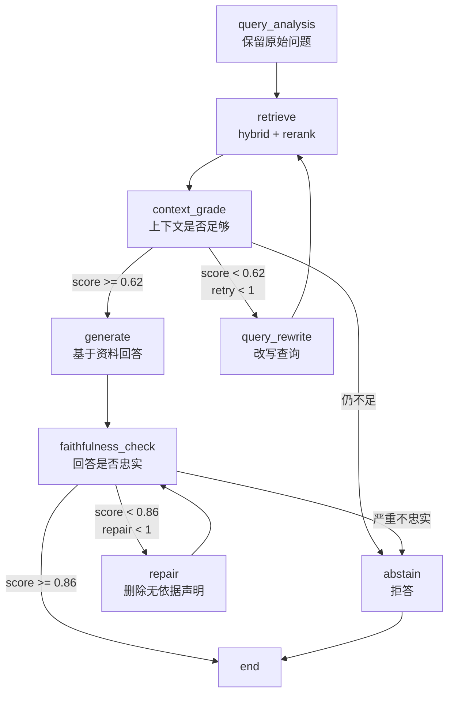

# Agentic RAG：为什么 RAG 优化不只是换检索器

> 前置要求：读过基础 RAG，知道 BM25、向量检索、rerank、Faithfulness 这些概念。  
> 配套代码：`phase-3-frameworks/02-agentic-rag-langgraph/`。  
> 这篇不写 LangGraph API 教程，而是复盘一次真实 Agentic RAG 改造：它到底解决了什么，没解决什么，代价是什么。

如果一个 RAG 系统回答不稳定，很多人的第一反应是换检索器：

```text
向量检索不准？加 BM25。
召回不够？加 Multi-Query。
排序不好？加 rerank。
答案幻觉？换一个更强模型。
```

这些都对，但还不完整。

Phase2 做完 benchmark 后，我已经有了一个比较稳的线性基线：`hybrid_rerank`。它不是 naive RAG，而是 BM25 + Dense + RRF + Cross-Encoder rerank 的组合。

问题在于，线性 RAG 只能这样跑：

```text
question -> retrieve -> rerank -> generate -> judge
```

它能回答“检索效果好不好”，但很难回答另一个更工程化的问题：

```text
如果检索结果不够好，系统下一步怎么办？
如果答案不忠实，系统下一步怎么办？
如果资料不足，系统应该继续编，还是拒答？
这些决策能不能被记录、复盘、评估？
```

这就是 Phase3 进入 Agentic RAG 的原因。

---

## 一、先看结果：Agentic RAG 没有免费午餐

这次实验复用 Phase2 的真实 benchmark：

- 42 个真实资料源：文章、Python 脚本、学习笔记
- 30 个手工标注问题
- 每个问题标注相关文档和参考答案
- 对比线性 `hybrid_rerank` 与 LangGraph Agentic RAG

全量 30 题结果如下：

| 系统 | P@3 | R@3 | MRR | NDCG@3 | Faithfulness | 平均延迟 | 总成本 | LLM 调用 | 拒答 |
|------|-----|-----|-----|--------|--------------|----------|--------|----------|------|
| `linear_hybrid_rerank` | 0.578 | 0.436 | 0.756 | 0.511 | 0.907 | 3269ms | $0.0296 | 60 | 0 |
| `agentic_rag_langgraph` | 0.572 | 0.425 | 0.756 | 0.503 | 0.980 | 5108ms | $0.0443 | 94 | 6 |

这个结果不适合写成“Agentic RAG 全面吊打线性 RAG”。

更准确的说法是：

```text
检索指标基本没提升，甚至略低。
Faithfulness 从 0.907 提升到 0.980。
平均延迟增加约 1.84 秒。
总成本增加约 49.5%。
LLM 调用从 60 次增加到 94 次。
```

所以 Agentic RAG 的价值不是“让检索更玄学地变强”，而是给 RAG 加上一套可控的风险处理机制。

一句话：

> RAG 优化解决“找什么资料”；Agentic RAG 解决“资料不够好、答案不够可信时，系统怎么继续走”。

---

## 二、为什么不是默认上 query transform

在 Phase2 里已经对比过几种配置：

```text
naive vector
hybrid
hybrid + rerank
query transform + rerank
```

最后默认策略选的是 `hybrid_rerank`，而不是每次都 query transform。

原因很朴素：query transform 不稳定。

它有时能提升召回，有时会把问题改偏。尤其是学习资料这种 corpus，很多问题本身已经很明确：

```text
RRF 排序融合的作用是什么？
Cross-Encoder 重排序为什么更准但更慢？
LangGraph 的 checkpointing 解决什么问题？
```

这种问题不一定需要改写。强行改写，反而可能引入新的表达偏差。

所以在 Phase3 的 Agentic RAG 里，我没有把 query transform 放进默认路径，而是放在 fallback 路径：

```text
先用原始问题检索
上下文评分不足
才触发 query rewrite
rewrite 后再检索一次
仍然不足就拒答
```

这是一条很重要的工程原则：

> 高级技巧不要默认启用。默认链路应该稳定、短、可解释；复杂策略应该有明确触发条件。

---

## 三、这次 Agentic RAG 的图长什么样

当前实现集中在：

```text
phase-3-frameworks/02-agentic-rag-langgraph/agentic_rag_graph.py
```

工作流可以画成这样：



它看起来比线性 RAG 多了很多节点，但每个节点只解决一个问题：

| 节点 | 职责 | 不该顺手做什么 |
|------|------|----------------|
| `query_analysis` | 初始化查询 | 不默认改写 |
| `retrieve` | 继承 Phase2 最优检索 | 不判断答案质量 |
| `context_grade` | 判断资料是否足够 | 不生成答案 |
| `query_rewrite` | 低质量上下文时改写 | 不无限循环 |
| `generate` | 基于上下文回答 | 不自己打忠实度分 |
| `faithfulness_check` | 判断回答是否忠实 | 不润色答案 |
| `repair` | 删除无依据内容 | 不扩写答案 |
| `abstain` | 资料不足时拒答 | 不假装有答案 |

这个拆法的好处不是“代码更有仪式感”，而是每一步都能被测量、路由和复盘。

---

## 四、State 不是 dict，是审计日志的雏形

LangGraph 里最先要想清楚的不是 node，而是 State。

当前项目里的 State 简化后是这样：

```python
class AgenticRAGState(TypedDict, total=False):
    question: str
    ground_truth: str
    relevant_source_ids: list[str]

    generated_queries: list[str]
    retrieved: list[dict[str, Any]]
    context: str
    context_score: float
    context_reason: str

    answer: str
    faithfulness: float
    faithfulness_reason: str

    retry_count: int
    repair_count: int
    abstained: bool
    route_trace: list[str]

    retrieval_metrics: dict[str, float]
    timings_ms: dict[str, float]
    llm_usage: dict[str, float]
```

这里有几类字段。

第一类是输入事实：

```text
question
ground_truth
relevant_source_ids
```

这类字段不应该被后续节点随意改掉，否则 benchmark 没法复盘。

第二类是中间判断：

```text
context_score
context_reason
faithfulness
faithfulness_reason
```

这些字段决定路由。它们不是“日志附属品”，而是控制流的一部分。

第三类是可观测性：

```text
route_trace
timings_ms
llm_usage
retrieval_metrics
```

如果没有这些字段，系统最终只剩一个答案。答案错了，你不知道是检索错、评分错、生成错，还是修复错。

所以我现在更倾向于这样理解 State：

> State 不是节点之间传递数据的临时容器，而是 Agent 系统的运行合同。

---

## 五、检索节点：不要为了 Agentic 而重写 RAG

Agentic RAG 最容易犯的错，是为了展示“Agent 编排”，把真实 RAG 退化成模拟知识库。

当前实现刻意复用 Phase2 的 `BenchmarkIndex`：

```python
def retrieve(state: AgenticRAGState, resources: AgenticRAGResources) -> dict[str, Any]:
    queries = state.get("generated_queries") or [state["question"]]

    candidates = resources.index.hybrid_search(
        queries,
        top_k=resources.first_stage_k,
    )
    ranked = resources.index.rerank(
        state["question"],
        candidates,
        top_k=resources.top_k,
    )
    context = build_context(resources.index.chunks, ranked)
```

这里保留了 Phase2 的核心能力：

```text
BM25 + Dense retrieval
RRF 融合
Cross-Encoder rerank
Top-K context 构造
Precision@3 / Recall@3 / MRR / NDCG@3
```

这件事很关键。

Agentic RAG 不是替代 RAG 优化，而是站在 RAG 优化之上。底层检索如果是假的，后面的 graph trace 再漂亮，也只是 demo。

---

## 六、Context Grading：让“资料够不够”真的改变路径

线性 RAG 也可以在 Prompt 里写：

```text
如果资料不足，请说明无法回答。
```

但这只是软约束。

Agentic RAG 把它变成硬路由：

```python
def route_after_context_grade(state, resources) -> str:
    if float(state.get("context_score", 0.0)) >= resources.min_context_score:
        return "generate"
    if int(state.get("retry_count", 0)) < resources.max_retries:
        return "rewrite"
    return "abstain"
```

当前阈值是：

```python
min_context_score = 0.62
max_retries = 1
```

这意味着：

```text
上下文够用 -> 生成
上下文不足且还没重试 -> 改写查询
重试后仍不足 -> 拒答
```

这里有个细节：最多只重试一次。

因为 Agent 的循环必须有预算。没有预算的循环，看起来很“自主”，实际很容易变成成本黑洞。

---

## 七、Faithfulness Check：从事后评估变成流程控制

Phase2 里，Faithfulness 主要是评估指标。也就是说，生成结束后打一个分。

Phase3 把它升级成路由条件：

```python
def route_after_faithfulness(state, resources) -> str:
    score = float(state.get("faithfulness", 0.0))
    if score >= resources.min_faithfulness:
        return "end"
    if int(state.get("repair_count", 0)) < resources.max_repairs:
        return "repair"
    if score < 0.45:
        return "abstain"
    return "end"
```

当前阈值是：

```python
min_faithfulness = 0.86
max_repairs = 1
```

这段逻辑表达了一个工程取舍：

```text
高忠实度：直接结束
低忠实度：给一次修复机会
严重不忠实：拒答
修复后仍一般：保守结束，留给报告暴露问题
```

最后一条很值得注意。

它不是完美策略。比如这次 benchmark 里有两个 repair 样本，修复后 Faithfulness 仍是 0.700，但系统没有拒答。这不是 LangGraph 的锅，而是路由策略本身还可以继续调。

这也是为什么要做 benchmark：它会把“看起来合理”的规则拉到真实样本里检验。

---

## 八、Repair 不是润色，而是收缩

很多人看到 repair，会理解成“把答案写得更好”。

RAG 里的 repair 不是这个意思。

当前 repair prompt 的核心要求是：

```text
删除所有参考资料无法支持的声明。
只保留能从参考资料中找到依据的内容。
如果资料不足，直接说明资料不足。
```

它的方向不是扩写，而是收缩：

```text
宁可短
宁可保守
宁可承认不知道
不要补上下文里没有的事实
```

这就是 Agentic RAG 和普通“优化回答”的分界线。

如果 repair 只是把答案变得更流畅，它可能会让幻觉更隐蔽。真正有用的 repair，应该让答案更可证据化。

---

## 九、Trace 1：正常路径，说明 graph 没有过度设计

单问 smoke test：

```bash
cd phase-3-frameworks/02-agentic-rag-langgraph
python3 run_agentic_rag.py --question "RAG 系统如何评估？"
```

本次输出的 trace 是：

```text
query_analysis:use_original_query
-> retrieve:ragas_from_scratch,memory_enhanced_rag,p2_rag_overview
-> context_grade:0.70
-> generate
-> faithfulness_check:1.00
```

这是一条好 trace。

为什么？

因为它没有为了“Agentic”而乱跳。上下文评分通过后直接生成，Faithfulness 通过后结束。

Agentic RAG 不是每次都要 rewrite、repair、反思三轮才显得高级。能短路径解决的问题，就应该短路径解决。

---

## 十、Trace 2：rewrite 后仍拒答，暴露过度保守问题

全量 benchmark 中有 6 次拒答。比如：

```text
文档加载和清洗为什么是 RAG 的上限因素？
```

Trace：

```text
query_analysis:use_original_query
-> retrieve:p2_rag_overview,rag_loading,pdf_learning_assistant
-> context_grade:0.40
-> query_rewrite:1
-> retrieve:p2_rag_overview,rag_loading,pdf_learning_assistant
-> context_grade:0.40
-> abstain
```

这个样本很有意思。

它检索到了 `rag_loading`，看起来并不是完全没资料。但 context grader 给了 0.40，改写后仍然是 0.40，于是系统拒答。

这说明两个问题：

第一，拒答机制确实生效了。系统没有在低置信上下文上硬编。

第二，它可能过于保守。对“文档加载和清洗为什么是 RAG 的上限因素”这种问题，也许 0.40 的上下文已经足够生成一个保守答案。

下一步可以优化：

```text
降低 min_context_score
改进 context grader prompt
增加 first_stage_k
让 grader 区分“可部分回答”和“完全不能回答”
```

这就是 trace 的价值：它不是只告诉你“拒答了”，而是告诉你为什么拒答。

---

## 十一、Trace 3：repair 触发，但也暴露路由策略缺口

另一个样本：

```text
Chroma 向量库在基础 RAG 中承担什么职责？
```

Trace：

```text
query_analysis:use_original_query
-> retrieve:pdf_learning_assistant,rag_optimization_lab,rag_eval_pipeline
-> context_grade:0.70
-> generate
-> faithfulness_check:0.70
-> repair:1
-> faithfulness_check:0.70
```

这个 trace 至少暴露三件事。

第一，检索结果不理想。问题问的是基础 RAG 里的 Chroma 职责，但检索结果偏到了 PDF assistant、优化实验室、评估 pipeline。

第二，Faithfulness check 抓到了风险，触发了 repair。

第三，repair 后 Faithfulness 仍是 0.70，说明修复没有真正解决问题。

当前路由里，修复一次后如果分数不是特别低，系统会结束。这对学习阶段是可以接受的，因为报告能暴露问题；但对生产系统不一定够。

如果业务要求更严格，可以改成：

```python
def route_after_faithfulness(state, resources) -> str:
    score = float(state.get("faithfulness", 0.0))
    if score >= resources.min_faithfulness:
        return "end"
    if int(state.get("repair_count", 0)) < resources.max_repairs:
        return "repair"
    return "abstain"
```

这会更保守，但拒答数量可能继续上升。

这就是 Agentic RAG 的真实权衡：你不是在调一个 prompt，而是在调一套风险策略。

---

## 十二、再看指标：提升在哪里，代价在哪里

把结果拆开看：

| 指标 | 线性 RAG | Agentic RAG | 解读 |
|------|----------|-------------|------|
| P@3 | 0.578 | 0.572 | 基本持平，Agent 编排没有自动改善检索 |
| R@3 | 0.436 | 0.425 | 略低，rewrite 不一定带来更好召回 |
| MRR | 0.756 | 0.756 | 首个相关文档排名基本不变 |
| NDCG@3 | 0.511 | 0.503 | 排序质量略降 |
| Faithfulness | 0.907 | 0.980 | 明显提升，来自 check / repair / abstain |
| 平均延迟 | 3269ms | 5108ms | 多了 context grading 和质量控制 |
| 总成本 | $0.0296 | $0.0443 | 成本增加约 49.5% |
| LLM 调用 | 60 | 94 | 每题平均多 1 次左右调用 |

这组数字说明：

```text
Agentic RAG 的收益主要在可靠性，不在检索指标。
Agentic RAG 的成本主要来自额外判断节点，不来自 LangGraph 本身。
```

所以它适合：

- 企业知识库问答
- 技术支持和故障排查
- 法务、财务、合规等高风险场景
- 需要 trace 审计的系统
- 宁可拒答也不能乱答的场景

不适合：

- 闲聊
- 低风险内容生成
- 强延迟敏感场景
- 本身资料质量很差、但又不允许拒答的场景

---

## 十三、这次学习真正要掌握什么

学到这里，我觉得 Agentic RAG 真正要掌握的不是 LangGraph 的 `add_node` 和 `add_conditional_edges`。

这些 API 看两遍就会。

真正难的是这些问题：

```text
哪些判断必须进入 State？
哪些判断应该改变路由？
默认路径应该尽量短，还是尽量安全？
rewrite、repair、abstain 的预算是多少？
拒答是失败，还是可靠性策略？
trace 够不够复盘一次错误答案？
benchmark 有没有把成本也算进去？
```

这也是为什么我认为 Phase3 不应该停在框架 demo。

框架 demo 只能证明“代码能跑”。Agentic RAG benchmark 才能证明“这个工作流有价值，但价值有边界”。

---

## 十四、怎么复现

先跑单问：

```bash
cd phase-3-frameworks/02-agentic-rag-langgraph
python3 run_agentic_rag.py --question "RAG 系统如何评估？"
```

再跑 smoke test：

```bash
python3 benchmark_agentic_rag.py --limit 2
```

`--limit` 会输出带 `_limit2` 后缀的文件，避免覆盖全量结果。

最后跑全量 benchmark：

```bash
python3 benchmark_agentic_rag.py
```

输出文件：

```text
outputs/agentic_rag_results.json
outputs/agentic_rag_summary.csv
reports/agentic_rag_experiment_report.md
```

看代码时建议按这个顺序：

```text
README.md
-> agentic_rag_graph.py
-> benchmark_agentic_rag.py
-> reports/agentic_rag_experiment_report.md
```

不要一上来就看 LangGraph API。先看 State，再看节点，再看条件边，最后看 benchmark 怎么把 trace 和指标收回来。

---

## 十五、结论

这次实验之后，我对 Agentic RAG 的理解变得更克制了。

它不是 RAG 的魔法增强器，也不是“加几个 Agent 节点就更智能”。

它更像是给 RAG 加了一套运行时风控：

```text
检索不够，先别急着答。
上下文弱，尝试改写一次。
答案不忠实，先修复。
修复不了，宁可拒答。
所有路径都留下 trace。
最后用 benchmark 看值不值。
```

如果你的系统只需要低成本、快速、够用的回答，线性 `hybrid_rerank` 可能已经很好。

如果你的系统需要可解释、可审计、可拒答、可修复，那么 Agentic RAG 才值得上。

这也是 Phase3 接下来要继续练的能力：不是“会用某个 Agent 框架”，而是能把一个不确定任务设计成可控制、可评估、可复盘的工作流。
