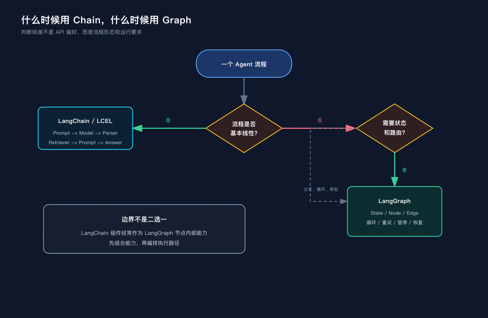
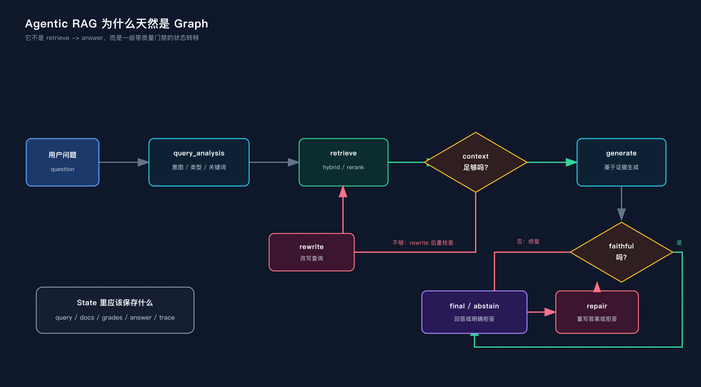

# Agentic RAG 工作流：把 RAG 从检索管道升级成可控 Agent

> 这是 Phase3 的收官文章。前面我们已经把 LangChain / LangGraph 的基础、Agentic RAG 的实现、Agent 工作流设计模式分别拆开讲过。这一篇把它们收成一条主线：为什么线性 RAG 不够，Agentic RAG 到底在“Agentic”什么，以及如何用真实 benchmark 判断它值不值得。
>
> 配套代码：`phase-3-frameworks/02-agentic-rag-langgraph/`  
> 读者默认已经了解基础 RAG、BM25、向量检索、rerank 和 LangGraph 的基本概念。

**TL;DR：**

- Agentic RAG 的核心不是让 LLM 更自由，而是把上下文评分、query rewrite、Faithfulness、repair、abstain 变成显式控制流。
- 这次实验里，Faithfulness 从 `0.907` 提升到 `0.980`，但平均延迟从 `3269ms` 增加到 `5108ms`，成本从 `$0.0296` 增加到 `$0.0443`。
- 真正值得学的不是多加几个节点，而是如何设计 State、路由、重试预算、失败出口和 trace，并用 benchmark 证明这些取舍。

---

## 一、先说结论：Agentic RAG 不是让模型更自由，而是让系统更可控

很多人听到 Agentic RAG，第一反应是：

```text
让 LLM 自己决定怎么检索、怎么改写、怎么反思。
```

这个理解听起来很酷，但工程上并不稳。

我更愿意把 Agentic RAG 理解成另一件事：

> 把 RAG 中原本靠 Prompt 暗示的判断，变成可路由、可重试、可修复、可拒答、可观测的工作流。

线性 RAG 解决的是：

```text
资料从哪里来？
```

Agentic RAG 进一步解决的是：

```text
资料不够好怎么办？
答案不可信怎么办？
系统什么时候应该继续，什么时候应该停下？
这些决策怎么被记录和评估？
```

这次 Phase3 的实验不是玩具 demo，而是复用 Phase2 的真实 RAG benchmark：

- 42 个真实资料源
- 30 个手工标注问题
- Phase2 已验证的 `hybrid_rerank` 检索基线
- Precision@3、Recall@3、MRR、NDCG@3、Faithfulness、延迟、成本等指标

最终结果也很真实：

| 指标 | 线性 RAG | Agentic RAG |
|------|----------|-------------|
| P@3 | 0.578 | 0.572 |
| R@3 | 0.436 | 0.425 |
| MRR | 0.756 | 0.756 |
| NDCG@3 | 0.511 | 0.503 |
| Faithfulness | 0.907 | 0.980 |
| 平均延迟 | 3269ms | 5108ms |
| 总成本 | $0.0296 | $0.0443 |
| LLM 调用 | 60 | 94 |
| 拒答 | 0 | 6 |

这个表很值得慢慢看。

Agentic RAG 没有自动提高检索指标，P@3、R@3、NDCG@3 还略低。但 Faithfulness 从 `0.907` 提升到了 `0.980`，代价是延迟、成本和 LLM 调用数上升。

所以结论不是“Agentic RAG 全面碾压线性 RAG”。

更准确的结论是：

```text
Agentic RAG 的收益主要在可靠性。
Agentic RAG 的代价主要在延迟和成本。
是否值得用，取决于业务是否需要更保守、更可审计的回答。
```

这才是工程里真正有用的判断。

---

## 二、线性 RAG 已经不差，为什么还要升级

Phase2 的 RAG 基线不是 naive vector search。

它已经做了：

```text
BM25
Dense retrieval
RRF 融合
Cross-Encoder rerank
Faithfulness judge
```

线性流程大概是这样：

```text
question
  -> hybrid_search(BM25 + Dense + RRF)
  -> cross_encoder_rerank
  -> build_context
  -> generate_answer
  -> judge_faithfulness
```

这条链路已经能解决很多问题。

但它仍然有一个核心限制：**它是线性的**。

线性意味着：

```text
检索结果弱，也继续生成。
上下文不够，也继续生成。
答案不忠实，也只能事后打分。
资料不足，也只能靠 Prompt 祈祷模型别编。
```

比如你在 Prompt 里写：

```text
如果资料不足，请说明无法回答。
```

这句话有用，但不够。

因为程序路径没有变，系统还是：

```text
retrieve -> generate -> return
```

是否拒答，仍然交给模型那一次生成时的“自觉”。

生产系统不能只靠自觉。

如果一个判断会影响下一步动作，它就不应该只停留在 Prompt 里，而应该进入 State 和路由。

这就是从线性 RAG 到 Agentic RAG 的分界线。



---

## 三、Agentic RAG 的图：每个节点只做一件事

这次 LangGraph 版本的工作流是：



如果写成文本，就是：

```text
query_analysis
  -> retrieve
  -> context_grade
      -> generate
      -> query_rewrite -> retrieve
      -> abstain
  -> faithfulness_check
      -> end
      -> repair
      -> abstain
```

这张图的重点不是“节点很多”，而是每个节点都有清晰职责。

| 节点 | 负责什么 | 不应该做什么 |
|------|----------|--------------|
| `query_analysis` | 初始化查询，保留原始问题 | 不默认改写 |
| `retrieve` | 复用 Phase2 的 `hybrid_rerank` | 不判断最终答案质量 |
| `context_grade` | 判断上下文是否足以回答 | 不生成最终答案 |
| `query_rewrite` | 上下文不足时换检索角度 | 不无限循环 |
| `generate` | 基于上下文生成草稿答案 | 不假装已经验证忠实度 |
| `faithfulness_check` | 判断答案是否忠于上下文 | 不直接改答案 |
| `repair` | 删除上下文不支持的声明 | 不扩写、不润色 |
| `abstain` | 资料不足或风险过高时拒答 | 不输出猜测性答案 |

这张表比代码更重要。

因为 Agent 系统最容易写乱的地方，就是每个节点都“顺手多做一点”。

检索节点顺手判断答案，生成节点顺手自我评分，评分节点顺手改写答案。刚开始看起来方便，后面就会变成一团 prompt，既不好测，也不好解释。

Agent 工作流的第一条经验是：

> 节点职责要窄，路由判断要显式，状态字段要可复盘。

---

## 四、State 不是 dict，是 Agent 系统的运行合同

LangGraph 里，第一件事不是写节点，而是定义 State。

这次实现里，State 简化后是这样：

```python
class AgenticRAGState(TypedDict, total=False):
    question: str
    ground_truth: str
    relevant_source_ids: list[str]

    generated_queries: list[str]
    retrieved: list[dict[str, Any]]
    context: str
    context_score: float
    context_reason: str

    answer: str
    faithfulness: float
    faithfulness_reason: str

    retry_count: int
    repair_count: int
    abstained: bool
    route_trace: list[str]

    retrieval_metrics: dict[str, float]
    timings_ms: dict[str, float]
    llm_usage: dict[str, float]
```

这里可以分成五类字段。

第一类是输入事实：

```text
question
ground_truth
relevant_source_ids
```

这些字段不应该被后续节点覆盖。尤其是 `question`，即使后面做 query rewrite，也应该把改写结果放到 `generated_queries`，不要抹掉原始问题。

第二类是中间产物：

```text
retrieved
context
answer
```

这些字段是节点之间的交接物。

第三类是判断字段：

```text
context_score
context_reason
faithfulness
faithfulness_reason
```

这些字段决定路由，不只是日志。

第四类是控制字段：

```text
retry_count
repair_count
abstained
```

所有循环都要有预算。没有预算的 Agent，不是自主，是失控。

第五类是可观测字段：

```text
route_trace
retrieval_metrics
timings_ms
llm_usage
```

这些字段让你回答：

```text
系统走了哪条路径？
为什么走这条路径？
这条路径花了多少钱？
最后结果是否值得？
```

所以 State 不是临时变量集合。

> State 是 Agent 系统的运行合同，也是审计日志的雏形。

---

## 五、默认路径要短，复杂策略要有触发条件

一个容易犯的错误，是把所有“高级技巧”都放进默认路径。

比如 query transform。

Phase2 已经验证过，query transform 并不稳定提升检索指标。它有时候能提升召回，有时候也会把问题改偏。

所以这次 Agentic RAG 没有默认 query transform。

默认路径是：

```text
原始问题 -> hybrid_rerank -> context_grade -> generate
```

只有当 `context_grade` 认为上下文不足时，才触发 rewrite：

```python
def route_after_context_grade(state, resources) -> str:
    if float(state.get("context_score", 0.0)) >= resources.min_context_score:
        return "generate"
    if int(state.get("retry_count", 0)) < resources.max_retries:
        return "rewrite"
    return "abstain"
```

当前阈值：

```python
min_context_score = 0.62
max_retries = 1
```

这里有两个设计判断。

第一，上下文够用时，不要为了“显得 Agentic”强行 rewrite。

第二，rewrite 最多一次。

因为重试不是免费的。一次 rewrite 至少会增加：

- 一次 LLM 调用
- 一次检索
- 一次 rerank
- 一次 context grading

如果第一次改写后上下文仍然不足，继续改写的边际收益很可能下降。

这条经验可以迁移到很多 Agent：

> 重试必须改变策略，循环必须有预算。

---

## 六、Faithfulness 不只是指标，而是控制流

很多 RAG 系统会这样做：

```text
generate -> judge -> log score
```

这当然有价值，但它还不是 Agentic。

Agentic 的关键是：

```text
generate -> judge
    -> return
    -> repair
    -> abstain
```

也就是说，judge 的结果必须改变系统路径。

这次实现里，Faithfulness check 复用 Phase2 的 judge：

```python
score, reason, usage = judge_faithfulness(
    resources.llm,
    eval_item,
    state.get("context", ""),
    state.get("answer", ""),
)
```

然后用路由函数决定下一步：

```python
def route_after_faithfulness(state, resources) -> str:
    score = float(state.get("faithfulness", 0.0))
    if score >= resources.min_faithfulness:
        return "end"
    if int(state.get("repair_count", 0)) < resources.max_repairs:
        return "repair"
    if score < 0.45:
        return "abstain"
    return "end"
```

当前阈值：

```python
min_faithfulness = 0.86
max_repairs = 1
```

这里不是简单地低分就拒答。

有些回答只是夹带了一点上下文无法支撑的扩展，先 repair 更合适。repair 后仍然很差，再拒答。

这一步把“答案是否可信”从事后评估，变成了工作流里的硬约束。

---

## 七、Repair 不是润色，而是收缩回答

很多人看到 repair，会自然理解成：

```text
把答案写得更好。
```

但在 RAG 里，repair 不是润色。

RAG repair 的方向是：

```text
删掉没有依据的内容。
只保留上下文能支持的声明。
如果资料不足，就承认资料不足。
```

当前 repair prompt 的核心要求是：

```text
删除所有参考资料无法支持的声明。
只保留能从参考资料中找到依据的内容。
如果资料不足，直接说明资料不足。
```

普通润色追求：

- 更完整
- 更顺畅
- 更有表达力

RAG repair 追求：

- 更保守
- 更可证
- 更少幻觉

一个很实用的判断标准：

> 如果 repair 后答案变长了，要警惕；如果 repair 后答案更短但更准确，通常是好事。

这也是 Agentic RAG 和普通“优化回答”的分界线。

---

## 八、拒答不是失败，而是可信系统的出口

这次全量 benchmark 中，Agentic RAG 触发了 6 次拒答。

其中一个样本是：

```text
文档加载和清洗为什么是 RAG 的上限因素？
```

Trace：

```text
query_analysis:use_original_query
-> retrieve:p2_rag_overview,rag_loading,pdf_learning_assistant
-> context_grade:0.40
-> query_rewrite:1
-> retrieve:p2_rag_overview,rag_loading,pdf_learning_assistant
-> context_grade:0.40
-> abstain
```

这条 trace 看起来有点反直觉。

明明检索到了 `rag_loading`，为什么还拒答？

原因是 context grader 判断资料只覆盖部分问题，不足以支持完整回答。rewrite 后上下文评分仍然只有 `0.40`，于是系统拒答。

这里的拒答一定正确吗？

不一定。

它可能过于保守。也许降低 `min_context_score`，或者改进 context grader prompt，就能生成一个保守但有用的回答。

但这正是 benchmark 的价值：它把问题暴露出来了。

没有 trace，你只会看到“系统没有答”。

有 trace，你能看到：

```text
它不是没检索。
它检索后评分低。
它尝试 rewrite。
rewrite 后评分仍低。
所以走了 abstain。
```

这就是可调试性。

从产品视角看，拒答可能让用户不爽。

但在这些场景里，拒答是必要能力：

- 企业知识库
- 技术支持
- 安全操作
- 法务、财务、合规
- 任何宁可不答也不能乱答的系统

没有拒答路径的 Agent，迟早会在资料不足时编造。

---

## 九、Trace 是 Agent 的可观测性底座

Agent 系统最麻烦的地方，不是“答案错了”。

而是你不知道它为什么错。

是检索错了？

是 rerank 排错了？

是 context grader 太严？

是 answer generator 编了？

是 repair 没修好？

是 abstain 阈值过高？

如果没有 trace，你只能猜。

这次每次运行都会记录 `route_trace`，例如：

```text
query_analysis:use_original_query
-> retrieve:pdf_learning_assistant,rag_optimization_lab,rag_eval_pipeline
-> context_grade:0.70
-> generate
-> faithfulness_check:0.70
-> repair:1
-> faithfulness_check:0.70
```

这是另一个真实样本：

```text
Chroma 向量库在基础 RAG 中承担什么职责？
```

这条 trace 说明了三件事：

第一，检索结果不理想。问题问的是基础 RAG 里的 Chroma 职责，但检索结果偏到了 PDF assistant、优化实验室、评估 pipeline。

第二，Faithfulness check 抓到了风险，触发了 repair。

第三，repair 后 Faithfulness 仍是 `0.70`，说明修复没有真正解决问题。

这条 trace 暴露了一个设计缺口：当前路由允许 repair 一次后，如果分数不是特别低，就结束。这在学习阶段可以接受，因为报告能暴露问题；但生产系统可能要更严格。

比如可以改成：

```python
def route_after_faithfulness(state, resources) -> str:
    score = float(state.get("faithfulness", 0.0))
    if score >= resources.min_faithfulness:
        return "end"
    if int(state.get("repair_count", 0)) < resources.max_repairs:
        return "repair"
    return "abstain"
```

这会更保守，但拒答数量可能继续上升。

这就是 Agent 工作流设计的真实味道：你不是在调一个 prompt，而是在调一套风险策略。

---

## 十、指标要和路径一起看

再看一次结果：

| 指标 | 线性 RAG | Agentic RAG | 怎么解释 |
|------|----------|-------------|----------|
| Precision@3 | 0.578 | 0.572 | 基本持平，Agent 编排没有自动改善检索 |
| Recall@3 | 0.436 | 0.425 | 略低，rewrite fallback 不一定改善召回 |
| MRR | 0.756 | 0.756 | 首个相关文档位置基本不变 |
| NDCG@3 | 0.511 | 0.503 | 排序质量略降 |
| Faithfulness | 0.907 | 0.980 | 明显提升，来自 check / repair / abstain |
| 平均延迟 | 3269ms | 5108ms | 多了 context grading 和质量控制 |
| 总成本 | $0.0296 | $0.0443 | 成本增加约 49.5% |
| LLM 调用 | 60 | 94 | 每题平均多 1 次左右调用 |

如果只看检索指标，Agentic RAG 似乎不划算。

如果只看 Faithfulness，Agentic RAG 很成功。

真正应该看的，是“指标 + 路径”：

- 检索指标略降，说明 Agent 编排不会自动弥补底层检索问题。
- Faithfulness 提升，说明 repair / abstain 对可靠性有效。
- 成本和延迟上升，说明质量控制不是免费的。
- 6 次拒答，说明系统更保守，也说明阈值还需要继续调。

这才是能指导工程决策的分析。

Agentic RAG 不是免费午餐。

它适合：

- 高风险知识问答
- 企业内部知识库
- 需要审计 trace 的系统
- 允许用成本换可靠性的场景

它不适合：

- 闲聊
- 低风险内容生成
- 强延迟敏感场景
- 资料质量很差但又不允许拒答的场景

---

## 十一、一套可以迁移到其他 Agent 的工作流模板

Agentic RAG 只是训练样本。

真正有价值的是背后的设计模板：

```text
input
  -> analyze
  -> act
  -> grade_result
      -> continue
      -> retry_with_new_strategy
      -> human_review
      -> abstain/fail
  -> generate_output
  -> verify_output
      -> return
      -> repair
      -> abstain/fail
```

对应到不同领域：

| 领域 | act | grade_result | verify_output |
|------|-----|--------------|---------------|
| RAG | 检索 | 上下文相关性 | Faithfulness |
| 代码 Agent | 修改代码 | 测试 / 静态检查 | Review |
| 数据分析 Agent | 查询数据 | 结果合理性 | 报告一致性 |
| 客服 Agent | 查知识库 / 工单 | 信息是否覆盖 | 是否合规 |
| MCP Agent | 调工具 | 工具结果是否可信 | 输出是否泄露敏感信息 |

这也是 Phase3 真正要练的能力：

> 不是记住 LangGraph 的 API，而是学会把不确定任务设计成可控工作流。

拿到一个 Agent 需求，不要先问“用哪个框架”。

先问五个问题：

1. 这个任务有哪些不可避免的不确定性？
2. 哪些不确定性可以通过工具调用降低？
3. 哪些判断会改变后续路径？
4. 哪些失败可以重试，哪些失败应该终止？
5. 最后如何证明这个 Agent 比线性流程更好？

以 Agentic RAG 为例：

| 设计问题 | 对应答案 |
|----------|----------|
| 不确定性是什么 | 检索是否命中、上下文是否足够、答案是否忠实 |
| 可以用什么工具降低 | hybrid retrieval、reranker、faithfulness judge |
| 哪些判断改变路径 | context grade、faithfulness check |
| 哪些失败可以重试 | 检索不足 rewrite 一次，答案不忠实 repair 一次 |
| 如何证明有效 | 和 linear hybrid_rerank 做 benchmark 对照 |

当这张表写出来，图结构基本就自然出现了。

---

## 十二、怎么复现这套实验

代码在：

```text
phase-3-frameworks/02-agentic-rag-langgraph/
```

核心文件：

```text
agentic_rag_graph.py
run_agentic_rag.py
benchmark_agentic_rag.py
outputs/agentic_rag_results.json
outputs/agentic_rag_summary.csv
reports/agentic_rag_experiment_report.md
```

单问运行：

```bash
cd phase-3-frameworks/02-agentic-rag-langgraph
python3 run_agentic_rag.py --question "RAG 系统如何评估？"
```

你会看到：

```text
答案
Graph Trace
Faithfulness
Latency
Cost
```

先跑 smoke test：

```bash
python3 benchmark_agentic_rag.py --limit 2
```

再跑全量 benchmark：

```bash
python3 benchmark_agentic_rag.py
```

为什么要先跑 `--limit 2`？

因为 Agentic RAG 的很多问题不是语法错误，而是路径错误：

- 该 rewrite 的时候没 rewrite
- 不该 repair 的时候 repair 了
- 应该拒答的时候编了答案
- 检索够用，但 context grader 判断过低
- faithfulness judge 太严格，导致答案被过度修复

这些问题靠 `py_compile` 发现不了，只能看 trace。

---

## 十三、落地前的检查清单

如果只把 Agentic RAG 当成一个 demo，看完 graph 就结束了。

但如果要把它变成可迁移的工程能力，最后一定要问三类问题。

第一类是工作流设计问题：

| 检查项 | 要问的问题 |
|--------|------------|
| 不确定性 | 这个任务里最容易错的是检索、推理、工具调用，还是输出格式？ |
| 状态合同 | 哪些字段必须进入 State，哪些字段只是临时变量？ |
| 路由条件 | 哪些判断会改变执行路径，哪些只用于记录？ |
| 重试预算 | 最多 rewrite 几次、repair 几次，超过以后怎么办？ |
| 失败出口 | 是继续猜、降级回答、拒答，还是交给人工？ |
| 可观测性 | trace 里能不能看出每一步为什么发生？ |

第二类是测试样例问题。

Agent 工作流的测试不能只测“有没有答案”，至少要覆盖这些路径：

| 场景 | 期望路径 |
|------|----------|
| 检索上下文充足 | `retrieve -> context_grade -> answer -> faithfulness_check -> end` |
| 初次检索不足，但改写后命中 | `retrieve -> context_grade -> query_rewrite -> retrieve -> answer` |
| 改写后仍然不足 | `retrieve -> query_rewrite -> retrieve -> abstain` |
| 答案包含资料不支持的扩展 | `answer -> faithfulness_check -> repair` |
| repair 后仍然不可信 | `repair -> faithfulness_check -> abstain` 或进入人工审核 |
| 空 query、超长 query、资料缺失 | 明确错误或拒答，不静默生成 |

第三类是指标问题。

离线 benchmark 和线上观测要分开看：

| 类型 | 指标 | 作用 |
|------|------|------|
| 离线检索 | Precision@K、Recall@K、MRR、NDCG | 判断资料有没有找对 |
| 离线生成 | Faithfulness、拒答率、repair 成功率 | 判断答案是否可信 |
| 离线成本 | 延迟、LLM 调用数、token 成本 | 判断 Agentic 路径是否划算 |
| 线上质量 | 用户采纳率、追问率、人工升级率 | 判断用户是否真的受益 |
| 线上风险 | 工具失败率、越权请求、敏感输出 | 判断系统边界是否稳定 |

这张检查清单比某个框架 API 更重要。

框架会变，模型会变，检索器也会变。但只要任务里存在不确定性，就需要回答同一组问题：

```text
什么时候继续？
什么时候重试？
什么时候修复？
什么时候停下来？
怎么证明这个选择是对的？
```

这才是 Agent 工作流设计真正可复用的部分。

---

## 十四、Phase3 到这里真正结束了什么

Phase3 一开始是框架学习。

LangChain、LangGraph、CrewAI、Claude SDK、框架对比，看起来像是在学工具。

但走到 Agentic RAG 之后，重点已经变了。

真正完成的是这件事：

```text
从“会调用框架”
升级到
“能把一个不确定任务设计成可控、可评估、可复盘的 Agent 工作流”
```

这也是为什么 Phase3 可以收口了。

继续横向加框架，收益已经开始下降。更值得进入下一阶段的问题是：

```text
Agent 如何安全连接真实工具？
Agent 如何管理权限和边界？
Agent 如何跨会话保留长期状态？
多个 Agent 如何协作但不失控？
```

这些问题会进入 Phase4。

Phase3 最后留下一句话：

> Agentic 的核心不是“更自主”，而是“把不确定性放进可控制的工程结构里”。
