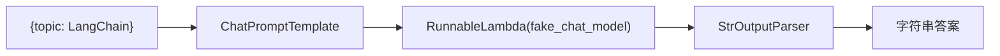
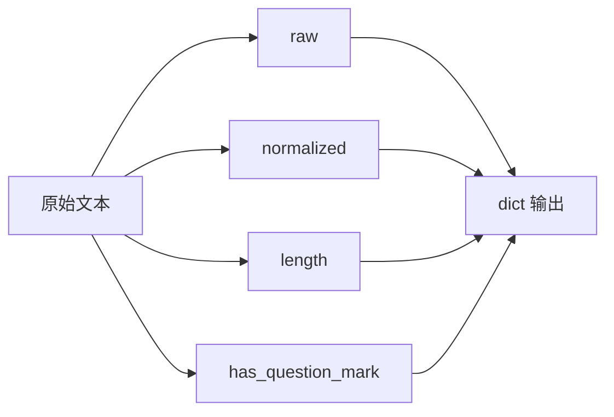

# LangChain：从调用模型到组合能力

> 归档说明：本文内容已整合至 [从 LangChain 到 LangGraph：Agent 框架基础真正要掌握什么](../00-langchain-to-langgraph-foundations.md)，这里保留为 Phase3 早期学习素材。

> 前置要求：完成 Phase1 的 ReAct / Tool Calling，理解 Prompt、LLM、Tool 的基本概念。
> 配套代码：本篇是进入 LangGraph 前的 LangChain 概念铺垫，当前基础代码从 [phase-3-frameworks/01-framework-basics/00-langchain-foundations/](../../../phase-3-frameworks/01-framework-basics/00-langchain-foundations/) 开始。

---

Phase1 里，我们手写过 Agent 的基础能力：Prompt、LLM 调用、工具注册、工具执行、记忆列表、循环控制。

这些代码能帮我们理解 Agent 的底层机制，但继续往下写会遇到一个问题：

```text
每个项目都要重复写模型调用、Prompt 拼接、工具 schema、输出解析、链式组合。
```

LangChain 要解决的不是“让模型更聪明”，而是把这些常见能力抽象成可组合的积木。

一句话概括：

```text
LangChain 关注的是：如何把 Prompt、Model、Tool、Parser、Retriever 组合成可复用的调用链。
```

这篇先不讲 Agentic RAG，也不急着用 LangGraph。先把 LangChain 的基础抽象讲清楚。

---

## 一、LangChain 解决的核心问题

如果不用框架，一个最小 LLM 应用大概长这样：

```python
prompt = f"请回答这个问题：{question}"
response = call_llm(prompt)
answer = parse_response(response)
```

如果要加工具：

```python
tool_schema = build_schema(tool_fn)
response = call_llm(prompt, tools=[tool_schema])
if response.tool_calls:
    result = execute_tool(response.tool_calls[0])
    response = call_llm(prompt + result)
```

如果要加 RAG：

```python
docs = retriever.search(question)
prompt = build_prompt(question, docs)
response = call_llm(prompt)
answer = parse_response(response)
```

这些代码不难，但每个项目都要写一遍。

LangChain 的核心价值，就是把这些步骤统一成一种可组合接口：

```text
Prompt -> Model -> Parser
Retriever -> Prompt -> Model
Input -> Branch A / Branch B -> Merge
Function -> Tool schema -> Tool invoke
```

在 LangChain 里，这些东西大多都可以看成 `Runnable`。

## 二、Runnable：LangChain 最重要的抽象

`Runnable` 可以理解成：

```text
一个可以被 invoke 的组件。
```

它可以是 Prompt，可以是模型，可以是解析器，也可以是你自己写的函数。

配套代码里没有直接调用真实 LLM，而是用一个 fake model 演示 Runnable 的组合：

```python
def fake_chat_model(prompt_value: Any) -> str:
    text = prompt_value.to_string() if hasattr(prompt_value, "to_string") else str(prompt_value)
    if "LangChain" in text:
        return "LangChain 的核心价值是把模型、Prompt、工具和解析器组合成可复用的 Runnable。"
    if "LangGraph" in text:
        return "LangGraph 的核心价值是把 Agent 工作流建模成显式状态图。"
    return f"收到输入：{text[:80]}"
```

这里故意不用真实 API。

因为学习 LangChain 基础时，重点不是模型回答质量，而是看清楚框架怎么组织调用链。

## 三、LCEL：用管道表达调用链

LangChain Expression Language，通常简称 LCEL。

最常见的写法是：

```python
chain = prompt | model | parser
```

这和 Unix pipe 很像：前一个组件的输出，作为后一个组件的输入。

配套代码：

```python
prompt = ChatPromptTemplate.from_messages([
    ("system", "你是一个 AI Agent 学习助手。回答要简洁。"),
    ("human", "用一句话解释 {topic} 的核心价值。"),
])
model = RunnableLambda(fake_chat_model)
parser = StrOutputParser()

chain = prompt | model | parser
result = chain.invoke({"topic": "LangChain"})
```

这段代码对应的流程是：



这个抽象解决了一个很实际的问题：调用链可以像普通对象一样传递、复用、测试。

你可以把 `prompt | model | parser` 看成一个新的函数：

```text
dict -> str
```

这比把所有逻辑写在一个函数里清楚很多。

## 四、RunnableParallel：并行分支不是 if else

LCEL 不只支持顺序组合，也支持并行分支。

配套代码里有一个小例子：

```python
stats = RunnableParallel({
    "raw": RunnablePassthrough(),
    "normalized": normalize,
    "length": normalize | RunnableLambda(len),
    "has_question_mark": normalize | RunnableLambda(lambda x: "?" in x or "？" in x),
})

result = stats.invoke("  LangChain 和 LangGraph 有什么区别？  ")
```

这里同一个输入被送进多个分支：



这种写法在 RAG 里很常见。

比如同一个问题可以并行做：

```text
提取关键词
判断问题类型
检索相关文档
生成 query rewrite
```

然后把结果合并给后续节点。

这就是 LangChain 适合做“组合能力”的原因。

## 五、Tool：函数变成模型能理解的能力

Agent 调工具时，模型不能直接调用 Python 函数。

它需要知道：

- 工具叫什么
- 工具做什么
- 参数有哪些
- 参数类型是什么

LangChain 的 `@tool` 装饰器就是做这个转换。

配套代码：

```python
@tool
def word_count(text: str) -> int:
    """统计文本按空格切分后的词数。"""
    return len(text.split())


@tool
def contains_keyword(text: str, keyword: str) -> bool:
    """判断文本是否包含指定关键词。"""
    return keyword.lower() in text.lower()
```

运行时可以看到工具 schema：

```text
word_count:
  args: {"text": {"type": "string"}}

contains_keyword:
  args: {"text": {"type": "string"}, "keyword": {"type": "string"}}
```

这一步对应 Phase1 手写的 `ToolRegistry`。

区别是：

```text
Phase1：我们自己维护工具名、描述、参数。
LangChain：函数签名和 docstring 自动变成工具 schema。
```

这能减少大量样板代码。

## 六、LangChain 和 Phase2 RAG 的关系

Phase2 里我们已经写过 RAG pipeline：

```text
document loading -> chunking -> embedding -> vector store -> retrieval -> prompt -> generation
```

用 LangChain 的视角看，这些都可以是组件：

| Phase2 组件 | LangChain 视角 |
|-------------|----------------|
| 文档加载 | Document Loader |
| 文本分块 | Text Splitter |
| Embedding | Embeddings |
| 向量库 | VectorStore |
| 检索器 | Retriever |
| Prompt | PromptTemplate |
| LLM | ChatModel |
| 输出解析 | OutputParser |

LangChain 最适合的场景，是把这些组件串成一条可复用链路。

例如：

```text
question
  -> retriever
  -> prompt
  -> model
  -> parser
```

这不是 Agent 工作流，而是一个调用链。

调用链适合：

- 输入输出比较稳定
- 控制流不复杂
- 不需要多轮状态机
- 不需要暂停、恢复、人类审核

这也是为什么我们先学 LangChain，再学 LangGraph。

## 七、LangChain 的边界

LangChain 很适合组合组件，但它不是所有 Agent 问题的答案。

如果流程只是：

```text
输入 -> 检索 -> 生成 -> 输出
```

LangChain 很舒服。

但如果流程变成：

```text
检索 -> 判断质量
  -> 不够好就 query rewrite
  -> 够好就生成
生成 -> 判断忠实度
  -> 不忠实就 repair
  -> 仍不行就 abstain
```

这时就不只是 chain，而是 workflow。

workflow 需要显式状态和条件路由。

这就是 LangGraph 要登场的地方。

## 八、小结

LangChain 的基础可以压成三句话：

```text
Runnable 是统一接口。
LCEL 是组合语法。
Tool 是函数能力的 schema 化封装。
```

学 LangChain，不要只记 API。

真正要理解的是：它把 LLM 应用里常见的 Prompt、Model、Parser、Retriever、Tool 统一成可组合对象。

这一步打好之后，再看 LangGraph 就会更顺：

```text
LangChain 解决“能力怎么组合”。
LangGraph 解决“流程怎么编排”。
```

参考：

- [LangChain Python Documentation](https://python.langchain.com/docs/)
- [LangChain Expression Language](https://python.langchain.com/docs/concepts/lcel/)
