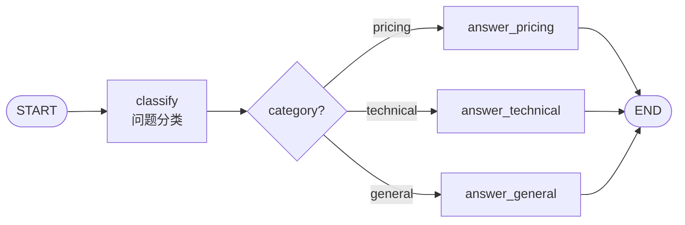

# LangGraph：把 Agent 写成状态图

> 归档说明：本文内容已整合至 [从 LangChain 到 LangGraph：Agent 框架基础真正要掌握什么](../00-langchain-to-langgraph-foundations.md)，这里保留为 Phase3 早期学习素材。

> 前置要求：理解 LangChain 的 Runnable / Tool，完成 Phase1 的 ReAct 循环。
> 配套代码：[phase-3-frameworks/01-framework-basics/01-langgraph-deep-dive/01_state_graph_basics.py](../../../phase-3-frameworks/01-framework-basics/01-langgraph-deep-dive/01_state_graph_basics.py)

---

如果说 LangChain 解决的是“能力怎么组合”，LangGraph 解决的是另一个问题：

```text
Agent 的流程怎么被显式编排、观察和控制？
```

Phase1 里，我们手写过一个 Agent 循环：

```python
while not done:
    thought = think(task, memory)
    if thought.tool_call:
        observation = call_tool(thought.tool_call)
        memory.append(observation)
    else:
        done = True
```

这个循环适合 demo。

但流程一复杂，就会出现问题：

- 分支逻辑藏在 `if/else` 里
- 状态散落在变量里
- 很难画出完整执行路径
- 很难插入人工审核
- 很难做断点恢复
- 很难解释为什么走了某条路径

LangGraph 的核心思路是：

```text
把 Agent 工作流建模成图。
节点是处理函数。
边是控制流。
State 是节点间的数据合同。
```

---

## 一、从 while 循环到 StateGraph

while 循环把两件事混在一起：

```text
每一步做什么
下一步去哪
```

LangGraph 把它们拆开。

节点负责“做什么”：

```python
def classify(state: SupportState) -> dict:
    ...
    return {"category": category, "route": state["route"] + ["classify"]}
```

边负责“去哪”：

```python
graph.add_conditional_edges(
    "classify",
    route_by_category,
    {
        "pricing": "answer_pricing",
        "technical": "answer_technical",
        "general": "answer_general",
    },
)
```

配套代码实现的是一个极简客服路由：



这就是 LangGraph 的基本形态。

## 二、State：节点之间的合同

LangGraph 要求先定义 State。

配套代码：

```python
class SupportState(TypedDict):
    question: str
    category: str
    answer: str
    route: list[str]
```

这个 `TypedDict` 不是装饰。

它是所有节点之间的合同：

```text
question：用户输入
category：分类结果
answer：最终回答
route：执行路径
```

每个节点接收完整 state，返回部分更新。

例如分类节点：

```python
def classify(state: SupportState) -> dict:
    question = state["question"].lower()
    if any(word in question for word in ["price", "cost", "价格", "费用"]):
        category = "pricing"
    elif any(word in question for word in ["error", "bug", "报错", "失败"]):
        category = "technical"
    else:
        category = "general"
    return {"category": category, "route": state["route"] + ["classify"]}
```

节点只返回自己负责更新的字段。

这和普通函数式管道不同。

LangChain 的 chain 更像：

```text
上一步输出 -> 下一步输入
```

LangGraph 的 state 更像：

```text
所有节点共享一份结构化状态，每个节点只更新其中一部分。
```

这就是它适合 Agent 工作流的原因。

## 三、Node：节点就是普通函数

LangGraph 的节点没有神秘感。

节点就是：

```text
State -> partial State
```

配套代码里有三个回答节点：

```python
def answer_pricing(state: SupportState) -> dict:
    return {
        "answer": "这是价格/费用问题：建议先确认套餐、调用量和计费周期。",
        "route": state["route"] + ["answer_pricing"],
    }


def answer_technical(state: SupportState) -> dict:
    return {
        "answer": "这是技术问题：建议先收集错误信息、复现步骤和运行环境。",
        "route": state["route"] + ["answer_technical"],
    }
```

每个节点都可以单独测试。

比如：

```python
answer_technical({
    "question": "运行报错怎么办？",
    "category": "technical",
    "answer": "",
    "route": ["classify"],
})
```

这会让 Agent 逻辑更容易维护。

不要把所有东西都塞进一个 “agent_step” 函数。

LangGraph 鼓励你把流程拆成小节点，再用边把它们连起来。

## 四、Edge：控制流显式化

普通代码里，控制流常常藏在函数内部：

```python
if category == "pricing":
    return answer_pricing(...)
elif category == "technical":
    return answer_technical(...)
else:
    return answer_general(...)
```

LangGraph 把这段逻辑拆成路由函数和条件边：

```python
def route_by_category(state: SupportState) -> Literal["pricing", "technical", "general"]:
    if state["category"] == "pricing":
        return "pricing"
    if state["category"] == "technical":
        return "technical"
    return "general"
```

然后挂到图上：

```python
graph.add_conditional_edges(
    "classify",
    route_by_category,
    {
        "pricing": "answer_pricing",
        "technical": "answer_technical",
        "general": "answer_general",
    },
)
```

这一步的价值是：流程不再需要读代码猜。

图本身就是流程。

这对 Agent 很重要。因为 Agent 的失败经常不是某个函数异常，而是走错路径：

```text
该检索时没检索
该重试时没重试
该拒答时生成了答案
该人工确认时直接执行
```

显式边能让这些路径被观察、测试和复盘。

## 五、Graph：组装和编译

完整图的组装代码：

```python
graph = StateGraph(SupportState)
graph.add_node("classify", classify)
graph.add_node("answer_pricing", answer_pricing)
graph.add_node("answer_technical", answer_technical)
graph.add_node("answer_general", answer_general)

graph.add_edge(START, "classify")
graph.add_conditional_edges(...)
graph.add_edge("answer_pricing", END)
graph.add_edge("answer_technical", END)
graph.add_edge("answer_general", END)

app = graph.compile()
```

`compile()` 可以理解为结构校验和运行时构建。

之后就可以：

```python
result = app.invoke({
    "question": "这个服务的价格怎么计算？",
    "category": "",
    "answer": "",
    "route": [],
})
```

输出里有完整路径：

```text
classify -> answer_pricing
```

这个 `route` 字段虽然是 demo 里手动加的，但它表达了一个重要习惯：Agent 工作流要记录路径。

后面做 Agentic RAG 时，我们也会记录：

```text
query_analysis -> retrieve -> context_grade -> generate -> faithfulness_check -> repair
```

没有 trace 的 Agent 很难调。

## 六、LangGraph 和 LangChain 的边界

LangChain 和 LangGraph 不是替代关系。

更准确的关系是：

```text
LangChain 提供能力组件。
LangGraph 编排这些组件的执行流程。
```

LangChain 更适合：

- Prompt -> Model -> Parser
- Retriever -> Prompt -> Model
- 工具 schema 化
- 多个 Runnable 的顺序或并行组合

LangGraph 更适合：

- 多步骤工作流
- 条件路由
- 循环重试
- 状态持久化
- 人工介入
- 可观测 trace

可以这样判断：

```text
如果流程是线性的，用 LangChain。
如果流程会分支、循环、暂停、恢复，用 LangGraph。
```

这也是为什么 Agentic RAG 应该用 LangGraph。

因为它不是简单链路：

```text
retrieve -> generate
```

而是有条件路径：

```text
retrieve -> context_grade
  -> generate
  -> query_rewrite
  -> abstain
generate -> faithfulness_check
  -> end
  -> repair
  -> abstain
```

这已经是工作流，不是 chain。

## 七、从这个 demo 走向 Agentic RAG

配套 demo 是一个客服问题分类器，看起来简单，但它包含 LangGraph 的基本骨架：

```text
State
Node
Conditional Edge
Graph Compile
Invoke
Route Trace
```

Agentic RAG 只是把这些节点换成更真实的能力：

| Demo 节点 | Agentic RAG 节点 |
|----------|------------------|
| `classify` | `query_analysis` |
| `answer_pricing` | `generate` |
| `answer_technical` | `repair` |
| `route_by_category` | `route_after_context_grade` |
| `route` | `graph_trace` |

所以学习 LangGraph 时，不要只看 API。

真正要训练的是：

```text
怎么把任务拆成状态字段？
怎么把流程拆成节点？
哪些判断应该变成条件边？
哪些失败需要回路？
哪些路径必须终止？
```

这才是 Agent 设计能力。

## 八、小结

LangGraph 的基础可以压成四句话：

```text
State 是节点之间的数据合同。
Node 是处理函数。
Edge 是显式控制流。
Graph 是可运行、可观察、可扩展的工作流。
```

Phase1 的 while 循环让我们理解 Agent 的基本机制。

LangChain 让我们学会组合模型、Prompt、工具和解析器。

LangGraph 则把这些能力组织成可控的状态图。

下一步进入 Agentic RAG 时，重点就不是“怎么调用 LangGraph API”，而是：

```text
怎么设计一个能检索、判断、重写、生成、校验、修复和拒答的 Agent 工作流。
```

参考：

- [LangGraph Documentation](https://langchain-ai.github.io/langgraph/)
- [LangGraph Concepts](https://langchain-ai.github.io/langgraph/concepts/)
