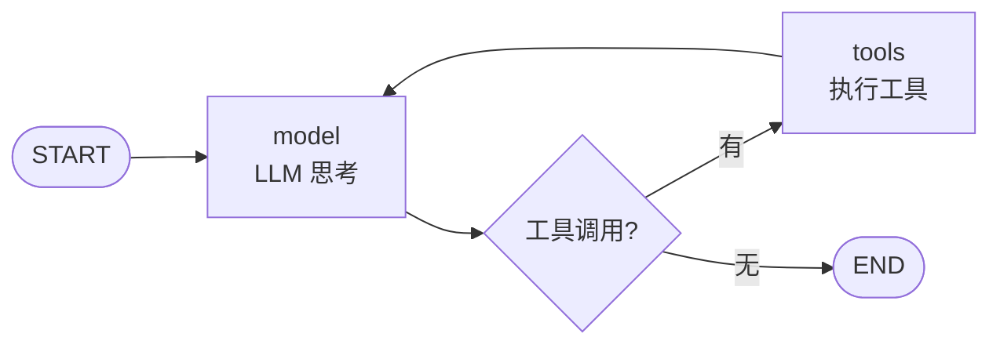
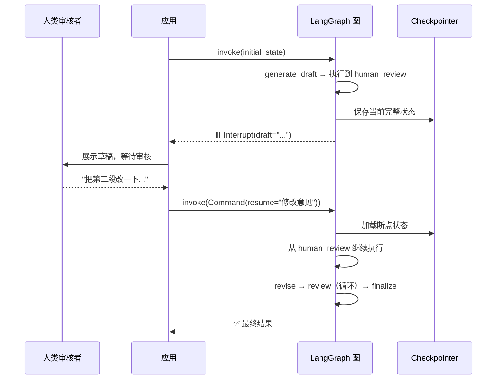

# LangGraph 的设计哲学：为什么说 Agent 不是 while 循环，而是状态机

> 归档说明：本文内容已整合至 [从 LangChain 到 LangGraph：Agent 框架基础真正要掌握什么](../00-langchain-to-langgraph-foundations.md)，这里保留为 Phase3 早期学习素材。

> 把 Agent 工作流建模为"图"而不是"循环"——这不只是 API 的变化，而是编程范式的跃迁。本文带你理解 LangGraph 背后的五个关键设计决策，以及它们如何改变你构建 Agent 的方式。

---

## 一个让你有共鸣的场景

你写了一个 Agent：用户提问 → LLM 思考 → 调用工具 → 返回结果。代码很简单，一个 while 循环搞定。跑通了，你觉得自己理解了 Agent。

然后产品经理走过来说：

"这个审批操作，能不能在发送之前让用户确认一下？"

你看了看你的 while 循环——它从头跑到尾，中间没法停。你想了想，说："可以在循环外加个确认框？"产品经理说："不行，确认完之后还得继续执行后面的步骤。"

你沉默了。while 循环做不到"暂停-等待-恢复"。

这不是一个"加个功能"的问题。这是**编程范式的问题**。

---

## 核心洞察：while 循环的边界在哪里

先退一步。为什么几乎所有 Agent 教程都用 while 循环？

```python
# 每个教程都这样写
while step < max_steps:
    thought = llm.think(messages)
    if thought.is_final:
        break
    result = execute_tools(thought.tool_calls)
    messages.append(result)
```

因为简单。因为直观。因为一开始的 Agent 确实只需要这样。

但 while 循环有一个根本局限：**它把"执行什么"和"以什么顺序执行"混在了一起**。循环体内的每一行代码既定义了操作本身，也隐含了"这一步之后是下一步"的控制流。当流程复杂到一定程度，这种耦合会让代码变得不可维护。

具体来说，while 循环有三个致命问题：

**问题一：无法暂停。** while 循环是同步的。你想在第三步之后暂停、等待用户确认、然后从第三步继续？while 循环没有"暂停"的概念——它要么在跑，要么结束了。

**问题二：状态是隐式的。** 在上面的代码里，`messages` 是一个在循环内不断被修改的列表。你知道它什么时候被修改吗？你能在崩溃后恢复它的内容吗？不能——因为它只是内存中的一个变量，没有结构化的持久化机制。

**问题三：流程不可见。** 如果有人问你"这个 Agent 的执行流程是什么"——你能画出来吗？你只能从头读一遍代码，然后在脑子里重建它的控制流。而生产 Agent 可能有 5 个条件分支、3 个循环路径——代码读起来是意大利面。

这三个问题指向一个共同的解决方案：**把控制流从代码逻辑中分离出来。这正是 LangGraph 的 StateGraph 做的事情。**

---

## LangGraph 的答案：把控制流变成"一等公民"

LangGraph 的核心思想一句话就能说清楚：

> **把 Agent 工作流建模为有向图——节点是处理函数，边是控制流。**

这意味着什么？我们看同一段 ReAct 逻辑，用 while 循环和用 StateGraph 分别怎么写：

```python
# while 循环版本：控制流藏在代码里
while step < max_steps:
    thought = think_fn(task, memory)
    if is_final(thought):          # ← 分支逻辑嵌在循环里
        break
    observation = act_fn(thought)
    memory.append(observation)

# StateGraph 版本：控制流是显式的
graph = StateGraph(AgentState)
graph.add_node("model", call_model)       # 节点 = 操作
graph.add_node("tools", call_tools)
graph.add_edge(START, "model")            # 边 = 控制流
graph.add_conditional_edges(              # 条件边 = 分支
    "model", should_continue,
    {"tools": "tools", END: END}
)
graph.add_edge("tools", "model")          # 工具执行完 → 回到 model
app = graph.compile()
```

区别在哪？在 while 循环里，**流程是你读代码时在脑子里重建的**。在 StateGraph 里，**流程是你声明出来的，可以直接画成图**：



这就是 LangGraph 的第一个——也是最核心的——设计决策：**控制流应该是声明式的，不是命令式的。** 你描述"图是什么样的"，框架负责执行。

这带来的三个直接好处：
1. **可视化**：图结构天然可以画出来。你的代码就是文档，文档就是流程图。
2. **可测试**：每个节点是独立的纯函数，输入 State、返回 State 更新，可以单独单测。
3. **可扩展**：想加一个步骤？`graph.add_node()` + `graph.add_edge()`。不改现有代码。

---

## 设计决策二：State 是节点间的"合同"

LangGraph 的第二个关键设计：**在定义任何节点之前，你必须先定义 State。**

```python
class AgentState(TypedDict):
    messages: Annotated[list, add_messages]   # add_messages = 追加，不是替换
    draft: str
    approved: bool
```

这个 TypedDict 不只是类型注解——它是**所有节点之间的数据合同**。每个节点函数的签名都是 `State → partial State`：

```python
def generate_draft(state: AgentState) -> dict:
    """我只需要返回我负责更新的字段，框架来合并"""
    response = llm.invoke(state["messages"])
    return {"draft": response.content}  # 只更新 draft，不动 messages
```

这意味着什么？

**意味着你不会在 200 行之后忘记 `memory` 是在哪里被修改的。** 在 while 循环里，状态是散落在循环体各处的变量修改。在 StateGraph 里，状态变更只能通过 return 值——就像 React 的 setState。数据流是单向的、可追踪的。

**更重要的：意味着框架可以自动持久化状态。** 因为 State 的结构是已知的（TypedDict），框架在每个节点执行后自动保存完整快照。程序崩溃了？重启后从断点继续——因为 Checkpointer 知道 State 的完整结构，可以从任意 checkpoint 恢复。

这就是"状态优先设计"（State-First Design）的威力。LangGraph 不是在你写完后帮你管理状态——而是要求你先把状态定义清楚，再写逻辑。这个约束看起来很"烦"，但在生产环境中是救命的。

---

## 设计决策三：interrupt 不是功能，是架构

大多数框架把"暂停等人类确认"当作一个高级功能（feature）。LangGraph 把它当作**图执行模型的核心能力**（architecture）。

```python
def human_review(state: ReviewState) -> dict:
    draft = state["draft"]
    
    # interrupt() 不是"抛异常"，它是执行模型的正式暂停点
    feedback = interrupt({
        "type": "review_request",
        "draft": draft,
        "prompt": "请审核草稿。输入意见或 'approve' 批准。",
    })
    # ↑ 图在这里暂停。可以暂停一分钟，也可以暂停三天。
    # ↓ 有人调用 invoke(Command(resume=...)) 后从这里继续。
    
    return {"human_feedback": feedback, "approved": feedback == "approve"}
```

interrupt 的工作流：



注意关键点：**interrupt 能暂停三天，是因为 Checkpointer 把 State 持久化到了数据库**。while 循环做不到这一点——循环是内存里的执行流，暂停 = 进程挂起 = 内存数据有丢失风险。

这个设计揭示了 LangGraph 团队的一个核心判断：**生产 Agent 和 demo Agent 的本质区别不在于"能调多少工具"，而在于"能不能安全地暂停和恢复"。**

---

## 设计决策四：Plan-and-Execute 不是"加个规划步骤"

很多 Agent 教程介绍 Plan-and-Execute 时说："先让 LLM 规划，再按计划执行"。这不叫设计，这叫把 prompt 拆成两步。

LangGraph 的 Plan-and-Execute 有更深的设计考量：**分离"做什么"和"怎么做"。**

```python
# planner 节点：只负责拆解任务
def planner(state):
    """输出是步骤列表——不执行任何操作"""
    response = llm.invoke([
        SystemMessage("你是任务规划专家。将复杂任务拆解为清晰可执行的步骤。"),
        HumanMessage(state["task"]),
    ])
    return {"plan": parse_steps(response)}

# executor 节点：只负责执行当前步骤
def executor(state):
    """输入是当前步骤，输出是执行结果——不知道全局计划"""
    step = state["plan"][state["current_step"]]
    response = llm.invoke([
        SystemMessage("你是任务执行者。简洁完成给定步骤，输出结果。"),
        HumanMessage(step),
    ])
    return {"step_results": [response.content]}

# reflector 节点：只负责评估质量
def reflector(state):
    """检查执行结果是否满意——不满意就触发重新规划"""
    response = llm.invoke([
        SystemMessage("评估执行情况。回复 COMPLETE 或 REPLAN。"),
        HumanMessage(f"任务: {state['task']}\n结果: {state['step_results']}"),
    ])
    return {"needs_replan": "REPLAN" in response.content}
```

这三个节点是**独立可替换的**。production 中你可以：
- **用不同模型**：planner 用 Opus（需要强推理），executor 用 Haiku（只需要执行），省 60% token 成本
- **加人类审核**：在 reflector 后加一个 interrupt 节点——"计划是否合理？"
- **并行执行**：如果步骤间无依赖，executor 可以拆成多个并行节点

这就是图编排的优势：**你不只是在加功能，而是在设计架构。** 每一个设计决策都可以独立演变。

---

## 设计决策五：Checkpointing 不是"保存聊天记录"

这是初学者最容易误解的概念。LangGraph 的 Checkpointer 存的不是"对话历史"，而是**图的完整执行状态**：

- 每个节点执行后的**完整** State 快照
- 条件边的**路由决策**（为什么走了 A 而不是 B？）
- interrupt 的**暂停上下文**（暂停在哪里？等待什么输入？）
- 时间戳和 checkpoint ID

这意味着你可以：

```python
# 时间旅行：查看每一步的完整状态
states = list(app.get_state_history(config))
for s in states:
    print(f"Step: {s.values['current_step']}")     # 当时执行到哪了
    print(f"Messages: {len(s.values['messages'])}") # 当时的消息数
    print(f"Draft: {s.values.get('draft', '')[:50]}") # 当时的草稿内容

# 从历史状态分叉：回到第 3 步，尝试不同的第 4 步
checkpoint_3 = states[3]
app.invoke(None, checkpoint_3.config)  # 从 checkpoint 3 重新开始
```

**这不只是调试工具——它是一种全新的调试范式。** 传统 Agent（while 循环）出问题时，你只能加 log 再跑一次——而 LLM 是非确定性的，再跑一次结果可能不同。LangGraph 的 checkpointing 让你可以"回到案发现场"——而且现场的每一件物品都完好无损。

---

## 什么时候 LangGraph 是过度设计

说了这么多好处，我必须诚实地告诉你什么时候**不该**用 LangGraph：

**1. 你的流程确实是线性的。** A → B → C，没有分支，没有循环，不需要暂停。用 LangGraph 属于"用大炮打蚊子"——你定义 State、写节点函数、组装图的成本，比直接写三个函数调用高一个数量级。

**2. 你在做原型，不是生产系统。** LangGraph 的学习曲线是真实存在的。你需要理解 StateGraph API、reducer、条件边、checkpointer、interrupt、subgraph——这些概念加起来，学习曲线需要几天到一周。如果你只是想验证"多 Agent 协作是否可行"，CrewAI 让你 20 分钟跑起来。

**3. 你的团队不想学图语法。** 不是每个人都能接受"把业务逻辑建模为有向图"的思维方式。如果你的团队说"能不能直接写代码，别搞这些概念"，听他们的——用 Claude SDK 或直接手写。

**LangGraph 适合什么场景？** 一句话：**当你需要精确控制执行路径，而且这个控制需要经得起时间考验。** 如果你的 Agent 六个月后还需要维护、调试、扩展——LangGraph 的显式控制流和 checkpointing 会是你最正确的投资。

---

## 一个可以带走的思考框架

读完这篇文章，我希望你记住的不是 LangGraph 的 API，而是它背后的设计哲学。当你设计自己的 Agent 系统时，问自己四个问题：

1. **控制流是显式的吗？** 别人能不能看着你的代码画出流程图？还是只能从头读到尾？

2. **状态有定义吗？** 你的 Agent 的所有中间数据是否有一个清晰的结构定义？还是散落在各处？

3. **能暂停吗？** 你的 Agent 能不能在关键步骤停下来等人确认？还是全自动跑到结束？

4. **能恢复吗？** 程序崩溃后，进行中的 Agent 任务能不能继续？还是从头开始？

如果四个问题的答案都是"能"，你的 Agent 架构就走在了正确的方向上。至于是用 LangGraph 实现还是手写实现——那是工具选择，不是架构决策。

---

*本文是 Phase 3 早期文章。配套代码在 `phase-3-frameworks/01-framework-basics/01-langgraph-deep-dive/`，当前 Phase3 主线会在这些框架基础之上继续进入 `phase-3-frameworks/02-agentic-rag-langgraph/`。*
