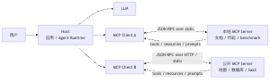
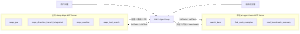
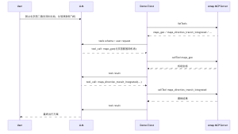

# MCP 实战：让 Agent 真正调用工具，而不是只会聊天

> Phase4 第一篇主文。前面我们已经用 LangGraph 做了 Agentic RAG，掌握了状态、路由、重试、拒答和 benchmark。现在进入下一层：Agent 怎么安全连接真实工具。
>
> 配套代码：`phase-4-advanced/01-mcp-server/`  
> 读者默认已经了解 LLM tool calling、RAG 和基础 TypeScript。

**TL;DR：** MCP 不只是“把函数注册给模型”，更像是 Agent 和外部系统之间的一层工具协议。它把工具发现、参数约束、结果回填、资源读取、提示模板和权限边界放到统一协议里。本文实现了两个闭环：一个是只读的 `ai-agent-learn` MCP Server，让 Agent 搜索本工程的文档、代码和 benchmark；另一个是接入公开的 Amap Maps MCP，让模型自己选择并调用地图工具规划路线。真正的关键不是“模型最后把结果写得好看”，而是模型是否真的拿到了工具 schema，并在运行中发起 `tool_call`。

很多人第一次听 MCP，会把它理解成“给模型挂工具”。

这个理解没错，但太窄。

如果只是给模型一个函数列表，Agent 仍然会很快遇到一堆工程问题：

```text
工具从哪里发现？
参数谁来校验？
返回结果怎么进入上下文？
文件边界怎么控制？
外部工具能不能信任？
调用过程怎么审计？
```

这些问题，才是 MCP 真正值得学的地方。

这篇文章不是 MCP 概念速查表，而是沿着当前工程的 Phase4 实战来讲：先把 MCP 的基础心智模型搭起来，再看一个本地只读 MCP Server，最后接入公开的 Amap Maps MCP，让模型真正发起工具调用。

***

## 一、为什么 Phase4 要先学 MCP

Phase3 做完 Agentic RAG 后，Agent 已经不是一个简单的问答脚本了。

它有：

```text
State
Node
Edge
rewrite
repair
abstain
trace
benchmark
```

这解决的是“Agent 工作流怎么编排”。

但真实业务里的 Agent 最后一定要碰工具：

```text
读内部文档
查代码仓库
看指标报表
访问数据库
调用地图服务
查询工单系统
触发审批流程
```

如果每接一个工具都在 Agent 代码里临时写函数，很快会变成一团散乱的 glue code。模型能调什么、参数怎么传、结果怎么返回、权限怎么控，全都混在业务逻辑里。

MCP 要解决的就是这个问题。

我现在对 MCP 的理解是：

```text
MCP 不是让模型更聪明。
MCP 是让模型用工具这件事变得标准、可发现、可测试、可治理。
```

先把几个基本概念摆正，后面看代码会轻松很多。

**MCP 里的几个核心角色：**

- **Host**：承载用户交互、模型调用、权限决策和上下文聚合。本文里的 demo client 就扮演了这个角色，真实产品里可能是 IDE、聊天应用或 Agent 平台。
- **Client**：Host 为每个 MCP Server 创建的协议连接，负责初始化、能力协商和请求转发。代码里对应 `@modelcontextprotocol/sdk/client` 与 `StdioClientTransport`。
- **Server**：暴露某一类工具、资源或提示词的独立服务。本文里有本地 `ai-agent-learn-mcp-server`，也有公开 Amap Maps MCP。
- **Transport**：Client 和 Server 之间传 JSON-RPC 消息的通道。本文主要用 `stdio`，公开服务里也常见 Streamable HTTP。
- **Capability**：初始化时声明“我支持什么能力”，比如 tools、resources、prompts、sampling、roots。

用一张图压缩一下：



<center>MCP 的 Host / Client / Server 关系</center>

这里有一个很容易忽略的点：模型不是直接连到 MCP Server。模型通常由 Host 管，MCP Client 也由 Host 管。Server 只暴露能力，能不能调用、调用前要不要确认、结果怎么进入上下文，最终还是 Host 的责任。

这也是 MCP 和“随手写一个函数给模型调”的差别。随手写函数时，工具发现、参数校验、权限、日志、上下文回填都容易散在业务代码里；MCP 把这些事情收敛到协议边界上。

MCP 里最常用的 Server 能力是三类：

**MCP Server 最常用的三类能力：**

- **Tools**：表达可执行动作，比如搜索、查询、路线规划。
- **Resources**：表达可读取资源，比如文档索引、benchmark 文件。
- **Prompts**：表达可复用任务模板，比如阶段 Review、文章大纲。

官方 TypeScript SDK 也正是围绕这些能力组织：Server 端注册 tools/resources/prompts，Client 端通过 `listTools`、`callTool`、`readResource`、`getPrompt` 等方法访问。

除此之外，还需要知道两个概念：

**另外两个概念先有印象就够：**

- **Roots**：让 Client 告诉 Server 可以访问哪些文件系统边界。本文用自己的 `path_guard` 做了类似 allowlist，后续安全章节再深入。
- **Sampling**：Server 反过来请求 Client 调模型，并且模型 key 留在 Host / Client 侧。本文暂不实现，先保持 Server 简单只读。

为什么暂时不做 Sampling？因为第一版 MCP Server 的目标不是让 Server 自己变成 Agent，而是把工具边界打稳。等工具权限、审计和用户确认机制更清楚之后，再让 Server 触发模型调用会更稳。

从一次调用链路看，MCP 大概是这样工作的：

```text
Host 启动或连接 MCP Server
Client 初始化会话并做 capability negotiation
Client 通过 listTools / listResources / listPrompts 发现能力
Host 把需要的工具 schema 交给模型
模型决定是否发起 tool_call
Host 通过 Client 调用 MCP Server
Server 返回 tool result
Host 把结果回填给模型
模型继续调用工具或输出答案
```

这一层抽象很重要。因为 Agent 开发不是只写 Prompt，更多时候是在设计：

```text
模型看到哪些工具？
模型如何选择工具？
程序如何执行工具？
工具结果如何回填？
哪些事情绝不能让模型做？
```

***

## 二、这次不从天气查询开始

很多 MCP 入门会从天气查询开始。我这次没有这么做。

原因很简单：学习工程自己就有真实资产。

前面三个阶段已经沉淀了：

```text
Phase1: 手写 Agent 循环、工具调用、记忆
Phase2: RAG、hybrid search、rerank、benchmark
Phase3: LangChain、LangGraph、Agentic RAG、框架对比
```

所以 Phase4 的第一个 MCP Server 直接服务这个工程本身：

```text
ai-agent-learn MCP Server
```

第一版只做只读工具：

**第一版只做三个只读工具：**

- `search_docs`：搜索 `docs/` 下的学习文章。
- `find_code_examples`：搜索各 phase 的代码示例。
- `read_benchmark_summary`：读取 Phase2 / Phase3 benchmark 汇总。

这三个工具刚好对应学习工程里最重要的三类证据：

```text
文章：我怎么理解
代码：我怎么实现
指标：我怎么证明
```

换句话说，这个 MCP Server 不是玩具。它以后可以被 Agent 用来回答：

```text
Phase3 是否达标？
Agentic RAG 的收益和代价是什么？
某篇文章引用的代码路径在哪里？
下一阶段学习应该补什么？
```

这比查天气更接近工程学习的真实场景。

***

## 三、整体架构：内部 MCP + 外部 MCP + 模型工具循环

这次代码里有两条线。

第一条是自己写 MCP Server：

```text
phase-4-advanced/01-mcp-server/src/server.ts
```

它暴露本工程的文档、代码、benchmark。

第二条是接入公开 MCP：

```text
phase-4-advanced/01-mcp-server/src/demos/amap_route_demo.ts
```

它启动高德地图官方 MCP Server，让模型自己调用地图工具做路线规划。

放在一起看，架构是这样：



<center>内部 MCP、公开 MCP 与模型工具循环</center>

这张图里最值得注意的是：工具不是硬编码在模型回答里的。

真正的运行链路应该是：

```text
模型看到工具 schema
模型选择工具
程序执行工具
工具结果回填给模型
模型基于结果继续决策或输出答案
```

如果只是程序先调用 API，再让模型“总结一下”，那是 RAG 式增强，不是 Agent 真正使用工具。

***

## 四、本地 MCP Server：先把边界收紧

本地 MCP Server 的核心文件是：

```text
src/server.ts
src/tools/search_docs.ts
src/tools/find_code_examples.ts
src/tools/read_benchmark_summary.ts
src/safety/path_guard.ts
```

`server.ts` 主要负责注册工具：

```typescript
server.registerTool(
  "search_docs",
  {
    description: "Search Markdown learning articles under docs/ and return matching paths and snippets.",
    inputSchema: z.object({
      query: z.string().min(1).max(200),
      phase: phaseSchema,
      limit: limitSchema
    })
  },
  async (args) => asJsonText(await searchDocs(args))
);
```

这里我刻意把工具实现放在 `src/tools/`，而不是全部塞进 `server.ts`。

原因有两个：

1. MCP Server 只是协议入口，业务逻辑应该可以单独测试。
2. 安全校验应该在工具层和 path guard 层都能被复用。

第一版只读，不做写操作：

```text
不写文件
不执行 shell
不访问工程外目录
不触发 benchmark
不修改文章
```

这不是功能不够，而是学习顺序要对。

Agent 工具系统最容易出事的地方，不是工具太少，而是边界一开始就太松。你不能先让模型拥有文件写入和 shell 执行，再寄希望于后面用 Prompt 把它管住。

当前 allowlist 放在 `src/safety/path_guard.ts`：

```text
docs/
phase-1-fundamentals/
phase-2-rag/
phase-3-frameworks/
phase-4-advanced/
```

同时屏蔽：

```text
node_modules
dist
__pycache__
.git
.ruff_cache
.gradio
```

参数也做了约束：

```text
query 不能为空
query 最长 200 字符
limit 必须是 1 到 20
phase 只能是 phase-1 到 phase-4
```

这些规则看起来很普通，但它们是工具安全的地基。

***

## 五、Resources 和 Prompts 不是摆设

很多人第一次写 MCP，只关注 Tools。

但 MCP 里还有 Resources 和 Prompts。

这三个东西最好不要混着用。

**Tools、Resources、Prompts 不要混着用：**

- **Tool**：模型可以决定调用，像函数或 API，有输入参数，可能有计算或副作用。常见误用是把所有读取类信息都做成 tool，导致模型每次都要“执行”一次。
- **Resource**：通常由 Host 或应用决定读取，像文件、索引、数据库 schema、报告快照。常见误用是把需要参数化检索的动作硬塞成静态资源。
- **Prompt**：通常由用户显式选择或应用触发，像可复用任务模板或 slash command。常见误用是把 Prompt 当成一段更长的 system prompt。

本项目注册了资源：

```text
docs://phase-1
docs://phase-2
docs://phase-3
benchmark://phase-2
benchmark://phase-3
```

还注册了两个 Prompt：

**本项目注册了两个 Prompt：**

- `phase_review_prompt`：Review 某个学习阶段。
- `article_outline_prompt`：基于工程资料生成技术文章大纲。

我现在的理解是：

```text
Tool 解决“做什么动作”。
Resource 解决“读什么上下文”。
Prompt 解决“按什么任务模板使用这些上下文”。
```

举个更贴近工程的例子。

如果用户问：

```text
Phase3 的 Agentic RAG 文章有哪些？
```

这适合用 Resource，读取 `docs://phase-3` 的文章索引。

如果用户问：

```text
帮我找 Phase3 里 StateGraph 的代码示例。
```

这适合用 Tool，因为它是一次带参数的搜索动作：`find_code_examples(query="StateGraph", phase="phase-3")`。

如果用户问：

```text
帮我 Review 一下 Phase3 是否达标。
```

这适合用 Prompt 作为任务入口，因为它不是单次读取，也不是单次搜索，而是一套固定工作流：先查文章，再查代码，再读 benchmark，最后给结论。

比如“Review Phase3”这件事，不应该只靠一句自然语言：

```text
帮我看看 Phase3 学得怎么样
```

更好的方式是把任务模板固化成 Prompt：

```text
先调用 search_docs 和 find_code_examples。
如果是 phase-2 或 phase-3，再调用 read_benchmark_summary。
输出当前产物、能力达标情况、缺口和下一步建议。
```

这就是 Prompt 在 MCP 里的价值：它不是一段文案，而是一个可复用的工作流入口。

***

## 六、发布准备：只做 dry-run，不真发布

MCP Server 写完后，下一步会自然想到发布。

但这个阶段我没有真正发布 npm 包，只做了发布前检查：

```bash
npm run publish:check
```

对应脚本：

```json
{
  "scripts": {
    "publish:check": "npm run build && npm_config_cache=.npm-cache npm pack --dry-run"
  },
  "private": true
}
```

这里有两个细节。

第一，`npm pack --dry-run` 可以看到包里会包含哪些文件，但不会真的发布。

实际 dry-run 后，包里只保留运行所需内容：

```text
README.md
dist/server.js
dist/tools/*
dist/model/*
dist/demos/*
dist/safety/*
package.json
```

测试文件不会进包。

第二，`private: true` 是误发布保护。

学习阶段先不要急着 `npm publish`。真正发布前至少要确认：

```text
包名是否合适
README 是否完整
License 是否明确
工具权限是否收敛
是否会泄露 .env
是否包含不必要的 dist/__tests__
版本号如何管理
```

这一步看似和 Agent 无关，其实很重要。MCP Server 一旦发布，别人就可能把它接到自己的 Agent 客户端里。工具协议的稳定性、安全边界和文档质量，都会变成产品的一部分。

***

## 七、从“模型整理输出”到“模型调用工具”

一开始我写了一个 `model_call_demo.ts`。

它做的是：

```text
本地工具先搜索文档 / 代码 / benchmark
再把结果交给模型
模型整理回答
```

这个 demo 有价值，但它还不是真正的 Agent tool use。

因为工具是程序先调用的，模型只是做表达层。

真正的工具调用应该像这样：



<center>模型驱动 Amap MCP 工具调用链路</center>

所以我把 Amap demo 改成了一个最小 Agent loop：

```text
1. 启动 Amap MCP Server
2. listTools 拿到公开工具列表
3. 转成 OpenAI-compatible tool schema
4. 把 schema 和用户问题交给模型
5. 模型返回 tool_calls
6. 程序执行 MCP callTool
7. 工具结果作为 tool message 回填
8. 模型继续调用工具或输出最终答案
```

关键代码在：

```text
src/demos/amap_route_demo.ts
src/model/chat_client.ts
```

模型调用工具的核心数据结构是：

```typescript
export interface ChatToolCall {
  id: string;
  type: "function";
  function: {
    name: string;
    arguments: string;
  };
}

export interface ChatMessage {
  role: "system" | "user" | "assistant" | "tool";
  content: string | null;
  tool_call_id?: string;
  tool_calls?: ChatToolCall[];
}
```

工具执行循环大概是：

```typescript
for (let round = 1; round <= options.maxToolRounds; round += 1) {
  const response = await callChatCompletion(messages, modelConfig, {
    tools: openAiTools,
    toolChoice: "auto"
  });

  if (!response.toolCalls?.length) {
    console.log(response.content);
    return;
  }

  messages.push({
    role: "assistant",
    content: response.content || null,
    tool_calls: response.toolCalls
  });

  for (const toolCall of response.toolCalls) {
    const result = await client.callTool({
      name: toolCall.function.name,
      arguments: JSON.parse(toolCall.function.arguments)
    });

    messages.push({
      role: "tool",
      tool_call_id: toolCall.id,
      content: extractTextContent(result.content)
    });
  }
}
```

这个 loop 很小，但已经有 Agent 的味道了。

它不是：

```text
我替模型调用工具，然后模型帮我润色。
```

而是：

```text
模型根据工具 schema 决定调用什么，程序负责执行和回填。
```

这就是差别。

***

## 八、公开 MCP：接入 Amap Maps 路线规划

只写自己的 MCP Server，还停留在“工具注册”的视角。

所以我又接了一个公开 MCP：高德地图 Amap Maps。

高德官方文档现在支持两种接入方式：

```text
Streamable HTTP
Node.js I/O
```

这两个名字背后对应的是 MCP 的 transport 选择。

`stdio` 更适合本地工具：Client 把 Server 当成子进程启动，双方通过标准输入输出传 JSON-RPC 消息。它的好处是部署简单、权限比较容易收敛，很适合文件系统、代码仓库、开发机工具。

`Streamable HTTP` 更像远程服务：Server 独立运行，通过 HTTP 端点接收请求，可以结合鉴权、网关、日志和限流。它更适合团队共享服务或 SaaS 集成，但安全要求也更高，尤其要注意 Origin 校验、认证和本地端口暴露问题。

这次 demo 用的是 Node.js I/O：

```json
{
  "mcpServers": {
    "amap-maps": {
      "command": "npx",
      "args": ["-y", "@amap/amap-maps-mcp-server"],
      "env": {
        "AMAP_MAPS_API_KEY": "your_amap_maps_api_key"
      }
    }
  }
}
```

本地 `.env` 只放 key，不提交：

```text
AMAP_MAPS_API_KEY=...
```

运行：

```bash
cd phase-4-advanced/01-mcp-server
npm run demo:amap
```

默认问题是：

```text
我在北京西二旗地铁站，想去深圳北站，请比较高铁和飞机两类跨城出行方案。
飞机方案只需要规划两端机场接驳，航班段不要编造。
```

为什么这么设计？

因为 Amap MCP 有路线规划工具，但没有航班查询工具。

它能回答：

```text
西二旗怎么去北京首都机场？
宝安机场怎么去深圳北站？
西二旗到深圳北站的公共交通/铁路方案是什么？
```

但它不能回答：

```text
今天有哪些航班？
票价多少？
还有没有余票？
几点起飞？
是否延误？
```

这正好是一个很好的 Agent 边界样例。

模型不能因为用户问“有没有飞机方案”，就自己编航班。它应该承认：当前工具没有航班能力，只能规划机场接驳，航班段需要接入航班系统。

***

## 九、真实运行：模型真的调用了 MCP tool

这次 demo 的关键不是最终答案，而是运行日志。

真实运行时，模型先拿到 Amap MCP 的工具列表：

```text
maps_around_search
maps_bicycling
maps_direction_driving
maps_direction_transit_integrated
maps_direction_walking
maps_distance
maps_geo
maps_ip_location
maps_regeocode
maps_search_detail
maps_text_search
maps_weather
```

然后模型自己发起工具调用：

```text
[round 1] model called maps_geo {"address":"北京首都国际机场","city":"北京"}
[round 1] model called maps_geo {"address":"深圳宝安国际机场","city":"深圳"}
[round 1] model called maps_direction_transit_integrated {"origin":"116.306295,40.053034","destination":"114.029113,22.609767","city":"北京","cityd":"深圳"}
[round 2] model called maps_direction_transit_integrated {"origin":"116.306295,40.053034","destination":"116.602545,40.080213","city":"北京","cityd":"北京"}
[round 2] model called maps_direction_transit_integrated {"origin":"113.808156,22.636116","destination":"114.029113,22.609767","city":"深圳","cityd":"深圳"}
```

这几行日志很有价值。

它说明模型不是只在最后“总结路线”，而是真的做了规划：

```text
先查机场坐标
再查高铁/公共交通整段路线
再查出发地到机场的接驳
再查到达机场到目的地的接驳
最后组合答案
```

这就是一个最小的工具型 Agent。

最终输出会把方案拆成两类：

**最终输出可以拆成两类：**

- **高铁方案**：来自 Amap MCP 的公共交通 / 铁路规划，可以给出线路、换乘和耗时。
- **飞机候选方案**：来自 Amap MCP 的两端机场接驳，只能给接驳信息，航班段仍然需要航班系统。

这比“模型凭常识说坐飞机更快”靠谱得多。

***

## 十、为什么不能让模型自由发挥

这次 demo 里有一个很典型的小坑。

第一次让模型整理飞机方案时，它会忍不住补充一些“常识建议”：

```text
建议提前到机场
注意地铁首末班
查询实时延误
```

这些话看起来没错，但问题是：工具结果没有提供。

在真实 Agent 系统里，这叫不忠实。

所以我把系统提示收紧成：

```text
Amap MCP 当前没有航班查询工具。
不能查询或编造航班号、机票价格、起飞时间、落地时间、飞行时长、余票或机场安检耗时。
注意事项只能写“原始结果未提供”的信息，不要补充常识性建议。
```

这不是吹毛求疵。

企业级 Agent 的问题往往不是“回答不够丰富”，而是“回答里混进了来源不明的信息”。

MCP 能提供工具边界，但不能自动保证模型忠实。你仍然需要：

```text
限制工具集合
限制最大调用轮数
记录工具调用 trace
把 tool result 和最终答案关联起来
对缺失信息明确标注
```

这和 Phase3 的 Agentic RAG 是同一条线：

```text
不要让模型在黑箱里自由发挥。
把关键决策显式化、可观测化、可验证化。
```

***

## 十一、代码里最值得看的四个点

### 1. MCP Server 注册工具

文件：

```text
src/server.ts
```

重点看：

```typescript
server.registerTool("search_docs", ...);
server.registerTool("find_code_examples", ...);
server.registerTool("read_benchmark_summary", ...);
```

这里回答的是：

```text
Agent 能发现什么能力？
每个能力的输入 schema 是什么？
返回结果怎么包装？
```

### 2. Path Guard

文件：

```text
src/safety/path_guard.ts
```

重点看：

```text
allowlist
blocked directories
project root check
```

这里回答的是：

```text
Agent 不能越过哪些边界？
```

### 3. OpenAI-compatible Tool Calling

文件：

```text
src/model/chat_client.ts
```

重点看：

```typescript
tools
tool_choice
tool_calls
role: "tool"
tool_call_id
```

这块让普通模型调用具备工具循环能力。

### 4. Amap MCP Agent Loop

文件：

```text
src/demos/amap_route_demo.ts
```

重点看：

```typescript
client.listTools()
toOpenAiToolDefinitions(tools)
callChatCompletion(..., { tools })
client.callTool(...)
messages.push({ role: "tool", tool_call_id, content })
```

这里回答的是：

```text
如何把 MCP 工具转成模型能主动调用的工具？
```

***

## 十二、怎么运行

进入目录：

```bash
cd phase-4-advanced/01-mcp-server
```

安装依赖：

```bash
npm install
```

复制模型配置：

```bash
cp ../../phase-3-frameworks/01-framework-basics/01-langgraph-deep-dive/.env .env
```

补充高德 key：

```text
AMAP_MAPS_API_KEY=your_amap_maps_api_key
```

运行测试：

```bash
npm test
```

当前结果：

```text
20 tests passed
```

运行本地工程 MCP + 模型整理 demo：

```bash
npm run demo:model
```

运行 Amap MCP tool-calling demo：

```bash
npm run demo:amap
```

如果想看原始 MCP 返回：

```bash
npm run demo:amap -- --raw
```

如果只想看发布前包内容：

```bash
npm run publish:check
```

这个命令只做 dry-run，不会真正发布。

***

## 十三、这次学到的不是“高德地图怎么用”

高德地图只是一个载体。

这次真正要掌握的是 MCP 接入真实工具后的几个工程判断。

第一，工具能力要被发现，而不是写死。

```text
listTools -> tool schema -> model tool call
```

第二，模型可以选择工具，但程序必须执行和审计工具。

```text
模型负责决策
程序负责执行
日志负责追踪
```

第三，工具没有的能力，模型不能补。

```text
Amap MCP 没有航班查询
所以飞机方案只能算机场接驳
航班段必须交给航班系统
```

第四，MCP Server 第一版应该先只读。

```text
先读文档、代码、指标
再谈写文件、跑命令、触发工作流
```

第五，发布是工程问题，不是命令问题。

```text
npm publish 之前，先想清楚权限、Secret、包内容、版本、README。
```

***

## 十四、回到学习路线：Phase4 接下来补什么

现在 `01-mcp-server` 已经打通了：

```text
自己写 MCP Server
模型调用本地工具
接入公开 MCP
模型驱动外部工具调用
发布前 dry-run
只读安全边界
```

下一步不应该继续堆更多 MCP demo。

更应该进入：

```text
02-agent-security
```

重点不是再接几个 API，而是系统性回答：

```text
Prompt injection 怎么防？
工具调用怎么授权？
哪些工具需要审批？
敏感信息怎么脱敏？
外部 MCP 工具如何建立信任？
工具结果如何进入审计日志？
```

因为 MCP 一旦接入真实系统，Agent 的能力边界就会快速扩大。

而能力扩大之后，安全边界必须同步跟上。

这也是 Phase4 的主线：

```text
不是让 Agent 能调用更多工具。
而是让 Agent 安全、可控、可追踪地调用真实工具。
```

***

## 参考资料

- MCP Architecture: https://modelcontextprotocol.io/specification/2025-06-18/architecture
- MCP Transports: https://modelcontextprotocol.io/specification/2025-06-18/basic/transports
- MCP Tools: https://modelcontextprotocol.io/specification/2025-06-18/server/tools
- MCP Resources: https://modelcontextprotocol.io/specification/2025-06-18/server/resources
- MCP Prompts: https://modelcontextprotocol.io/specification/2025-06-18/server/prompts
- MCP Roots: https://modelcontextprotocol.io/specification/2025-06-18/client/roots
- MCP Sampling: https://modelcontextprotocol.io/specification/2025-06-18/client/sampling
- Model Context Protocol SDKs: https://modelcontextprotocol.io/docs/sdk
- MCP TypeScript SDK: https://ts.sdk.modelcontextprotocol.io/
- 高德地图 MCP Server 快速接入: https://lbs.amap.com/api/mcp-server/gettingstarted
- mcp.so Amap Maps: https://mcp.so/server/amap-maps/amap
