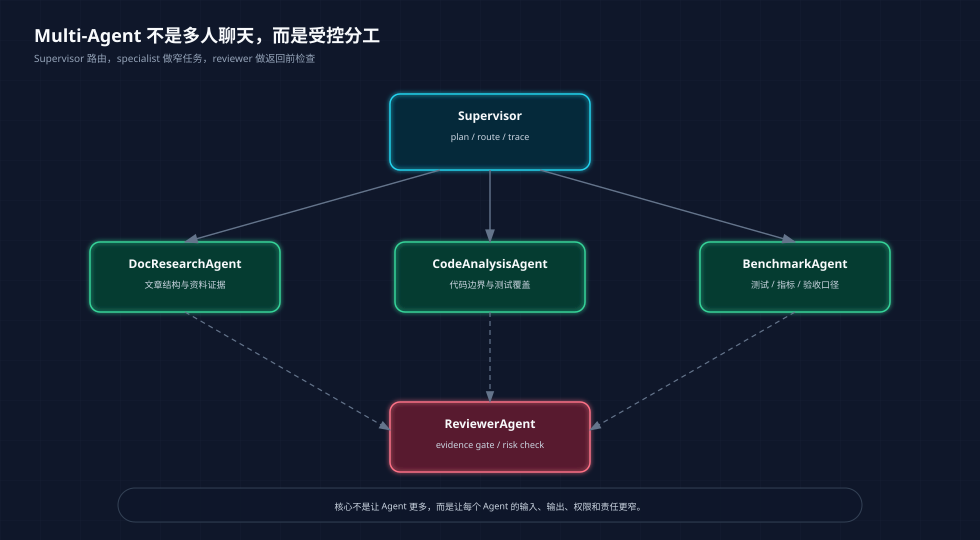
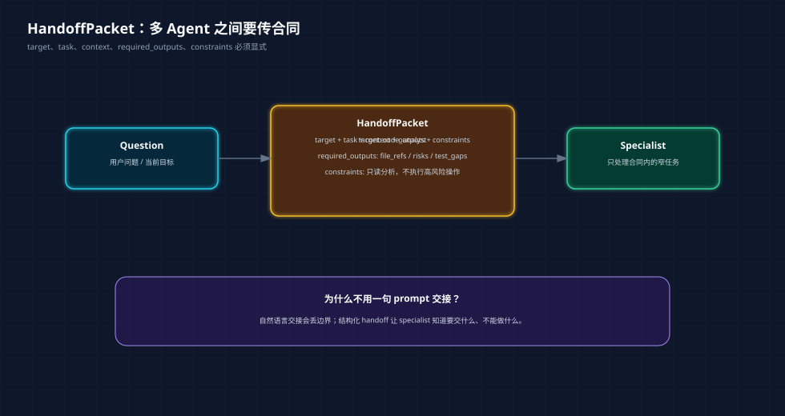
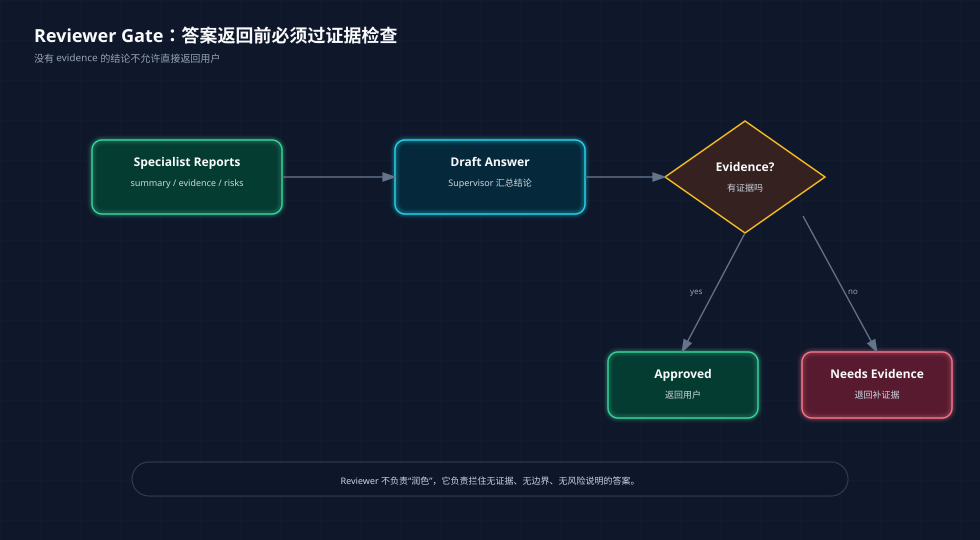

# 多 Agent 模式：别让角色扮演代替工程设计

> Phase4 第三篇主文。前面我们已经做了 MCP Server 和 Agent Memory System，这一篇进入多 Agent 模式。
>
> 配套代码：`phase-4-advanced/04-multi-agent-patterns/`  
> 读者默认已经了解 ReAct、工具调用、RAG 和 LangGraph 的基础概念。

**TL;DR：** 多 Agent 的核心不是“多几个角色说话”，而是把复杂任务拆成可路由、可移交、可审查的协作协议。Supervisor 负责拆任务和路由，handoff 负责把上下文和输出要求传清楚，tool specialist 负责窄能力执行，reviewer 负责证据和风险检查。当前 demo 不接真实 LLM，只用确定性代码把这些结构跑通，因为这一阶段要学的是协作边界，不是模型文采。

多 Agent 很容易被讲成一句听起来很热闹的话：

```text
让多个 Agent 分工协作，一个负责研究，一个负责写代码，一个负责 review。
```

这句话只说对了一半。

真正要追问的是：

| 追问 | 如果回答不上来，会发生什么 |
|------|----------------------------|
| 谁决定任务应该交给哪个 Agent？ | 所有 Agent 都抢答，信息看起来多，噪声也多 |
| Agent 之间传什么上下文？ | specialist 拿到的问题含糊，输出不可复用 |
| 每个 Agent 有哪些工具权限？ | 角色边界变成 prompt 约定，难以治理 |
| 结果凭什么通过？ | reviewer 变成润色器，不能拦住无证据结论 |
| 不通过之后怎么办？ | 系统没有 repair 路径，只能重新问一遍 |

所以这篇文章不讨论“怎么给角色写好听的 prompt”，而是讨论多 Agent 的四个工程对象：

```text
SupervisorPlan
HandoffPacket
SpecialistReport
ReviewResult
```

这些对象比角色名更重要。

很多多 Agent demo 看起来很热闹：

```text
研究员：我来查资料。
工程师：我来写代码。
审稿人：我来检查。
经理：我来总结。
```

这些角色名没有问题。

问题是，如果只有角色 prompt，没有协议和边界，多 Agent 很快会变成一场聊天剧本：

```text
谁决定下一步？
谁能调用工具？
交接时传什么上下文？
结果必须包含哪些证据？
审查不通过怎么处理？
多个 Agent 观点冲突谁说了算？
```

这些才是工程里真正难的部分。

所以 Phase4 这次不做“多个角色互相对话”的 demo，而是只实现和 Capstone 相关的四个模式：

```text
Supervisor
Handoff
Tool Specialist
Reviewer
```

***

## 一、为什么现在学多 Agent

前面几个阶段已经铺好了基础。

Phase2 做 RAG benchmark，解决的是：

```text
系统能不能从资料里找证据？
```

Phase3 做 Agentic RAG，解决的是：

```text
检索不够好、答案不忠实、需要拒答或修复时，系统怎么路由？
```

Phase4 前两段做 MCP 和 Memory，解决的是：

```text
Agent 怎么连接工具？
Agent 怎么保留跨会话上下文？
```

多 Agent 要解决的问题又进一步：

```text
当一个 Agent 同时要查文档、读代码、看指标、写文章、做 review 时，
这些职责要不要拆开？
如果拆开，怎么不失控？
```

我的判断是：多 Agent 只有在“职责边界真的不同”时才值得引入。

比如企业知识库 Agent 里，有几类任务天然不同：

| 职责 | 关注点 | 适合的 specialist |
|------|--------|-------------------|
| 文档研究 | 文章结构、论点、资料证据 | DocResearchAgent |
| 代码分析 | 文件路径、模块边界、测试覆盖 | CodeAnalysisAgent |
| 指标验收 | benchmark、测试结果、验收标准 | BenchmarkAgent |
| 质量审查 | 证据是否充分、风险是否说明 | ReviewerAgent |

这些职责混在一个 Agent 里也能写，但会越来越像一个超长 prompt。

拆成多 Agent 后，收益不是“更智能”，而是：

```text
每个 Agent 的输入更窄。
每个 Agent 的输出更稳定。
每个 Agent 的工具权限更容易控制。
每一步 trace 更容易复盘。
```



<center>图 1：多 Agent 的重点不是角色多，而是 Supervisor、specialist、reviewer 之间有清晰边界。</center>

***

## 二、代码结构：先把模式写小

这次代码仍然只用 Python 标准库。

目录结构：

```text
phase-4-advanced/04-multi-agent-patterns/
├── agents.py                    # role、report、review result、final result
├── handoff.py                   # HandoffPacket 和 SupervisorPlan
├── supervisor.py                # Supervisor、specialists、reviewer
├── multi_agent_demo.py          # 可运行 demo
└── tests/test_multi_agent_patterns.py
```

这几个文件可以按下面的顺序读：

| 文件 | 先看什么 | 它回答的问题 |
|------|----------|--------------|
| `agents.py` | `AgentRole`、`SpecialistReport`、`ReviewResult` | 多 Agent 系统里有哪些稳定数据结构 |
| `handoff.py` | `HandoffPacket`、`SupervisorPlan` | Agent 之间如何移交任务，而不是只说一句“交给你了” |
| `supervisor.py` | `MultiAgentSupervisor.plan()`、`run()` | 谁负责路由、执行 specialist、聚合 evidence、触发 reviewer |
| `multi_agent_demo.py` | 默认问题和 trace 输出 | 一次多 Agent 协作到底走了哪些步骤 |
| `tests/test_multi_agent_patterns.py` | 4 个测试 | 路由、handoff、reviewer、trace 是否真的被约束 |

为什么不用真实 LLM？

因为当前阶段要观察的是协作协议，不是模型发挥。确定性代码有一个好处：如果路由错了、handoff 信息丢了、reviewer 没拦住无证据答案，测试会直接暴露出来。

这一版最核心的对象是：

```text
HandoffPacket
SpecialistReport
ReviewResult
MultiAgentResult
```

它们比角色名重要。

角色名只是“谁来做”，这些对象才定义“怎么交接、交什么、怎么验收”。

***

## 三、Supervisor：拆任务，不是当老板

`MultiAgentSupervisor` 做两件事：

```text
plan(question) -> 生成 handoffs
run(question) -> 执行 specialist，再交给 reviewer
```

简化后的路由逻辑是：

```python
if "文章" in question or "文档" in question:
    handoff -> DocResearchAgent

if "代码" in question or "实现" in question:
    handoff -> CodeAnalysisAgent

if "benchmark" in question or "指标" in question or "测试" in question:
    handoff -> BenchmarkAgent
```

这不是为了做一个聪明的分类器。

它想表达的是：Supervisor 的价值在于把“谁来处理什么”变成显式控制流，而不是让所有 specialist 自由抢答。

测试里有一条：

```python
plan = supervisor.plan("Review Phase4 Memory 的代码和文章，指出下一步怎么优化")

self.assertEqual(
    [packet.target for packet in plan.handoffs],
    [AgentRole.DOC_RESEARCHER, AgentRole.CODE_ANALYST],
)
```

这条测试说明：

```text
文章问题交给 DocResearchAgent。
代码问题交给 CodeAnalysisAgent。
没有 benchmark 关键词，就不叫 BenchmarkAgent。
```

多 Agent 如果没有路由约束，就会变成每个 Agent 都想说两句。看起来信息很多，实际噪声更大。

***

## 四、Handoff：多 Agent 之间要传合同

我觉得很多多 Agent demo 最容易忽略的是 handoff。

它们会写：

```text
现在交给代码专家处理。
```

但没有说清楚：

```text
处理什么？
上下文是什么？
必须输出什么？
不能做什么？
```

所以这次写了一个 `HandoffPacket`：

```python
@dataclass
class HandoffPacket:
    target: AgentRole
    task: str
    context: dict[str, Any] = field(default_factory=dict)
    required_outputs: list[str] = field(default_factory=list)
    constraints: list[str] = field(default_factory=list)
```

一次交接长这样：

```python
HandoffPacket(
    target=AgentRole.CODE_ANALYST,
    task="检查代码架构、模块边界、测试覆盖和可运行性。",
    context={"question": question, "phase": "phase-4"},
    required_outputs=["file_refs", "risks", "test_gaps"],
    constraints=["只读分析，不执行高风险操作。"],
)
```

这里的关键是 `required_outputs` 和 `constraints`。

它们让 specialist 知道：

```text
我要交什么结果？
我不能越过什么边界？
```



<center>图 2：handoff 不应该只是一句话，而应该是结构化合同。</center>

测试里也把这个要求写死：

```python
serialized = packet.to_dict()

self.assertEqual(serialized["target"], "code_analyst")
self.assertIn("risks", serialized["required_outputs"])
self.assertIn("不要修改文件", serialized["constraints"])
```

这个模式后面很容易接 LangGraph。

LangGraph 里的每个节点都可以消费一个结构化 packet，节点输出也可以写回 state。这样多 Agent 不是“自由聊天”，而是图上的显式路由。

***

## 五、Tool Specialist：能力越窄，越容易治理

当前 demo 里有三个 specialist。

`DocResearchAgent` 关注文章：

```python
summary = "检查文章是否围绕问题、架构、代码和取舍展开"
evidence = [
    "docs/phase-4/03-agent-memory-system.md",
    "docs/phase-4/README.md",
]
```

`CodeAnalysisAgent` 关注代码：

```python
evidence = [
    "phase-4-advanced/03-memory-system/memory_policy.py",
    "phase-4-advanced/03-memory-system/long_term_memory.py",
    "phase-4-advanced/03-memory-system/tests/test_memory_system.py",
]
```

`BenchmarkAgent` 关注测试和验收：

```python
summary = "当前 Memory 阶段不跑指标 benchmark，但用单元测试作为验收证据。"
evidence = [
    "phase-4-advanced/03-memory-system/tests/test_memory_system.py",
]
```

这三个 Agent 现在都很简单，但边界是清楚的。

真实系统里，它们可以分别挂不同工具：

| Specialist | 可以开放的工具 | 不应该开放的工具 |
|------------|----------------|------------------|
| DocResearchAgent | 文档搜索、资料读取 | 写文件、跑 shell |
| CodeAnalysisAgent | 代码路径查询、AST 分析、测试结果读取 | 直接改生产代码 |
| BenchmarkAgent | 读取 benchmark 结果、运行只读分析 | 修改评测集 |
| ReviewerAgent | 读取报告和 evidence | 调业务写接口 |

这就是多 Agent 和 MCP 可以结合的地方。

MCP 负责工具边界，Supervisor 负责路由，specialist 负责窄任务。三者合起来，才像一个可治理的 Agent 系统。

***

## 六、Reviewer：不是润色，而是拦截

很多系统会把 reviewer 写成“帮忙润色答案”。

这不是我想要的 reviewer。

这次 `ReviewerAgent` 做的是 evidence gate：

```python
if not evidence:
    return ReviewResult(
        status=ReviewStatus.NEEDS_EVIDENCE,
        score=0.2,
        comments=["缺少 evidence，reviewer 不允许直接通过。"],
    )
```

也就是说，没有证据，不能通过。

测试里有一个很直接的例子：

```python
rejected = reviewer.review("结论：系统已经足够好了。", evidence=[])
approved = reviewer.review(
    "结论：MemoryPolicy 已经覆盖敏感词和中文项目名。",
    evidence=[
        "phase-4-advanced/04-multi-agent-patterns/tests/test_multi_agent_patterns.py",
        "phase-4-advanced/03-memory-system/memory_policy.py",
    ],
)

self.assertEqual(rejected.status, ReviewStatus.NEEDS_EVIDENCE)
self.assertEqual(approved.status, ReviewStatus.APPROVED)
```

Reviewer 的价值不是让答案更好看，而是拦住几类风险：

```text
没有 evidence 的结论
没有风险说明的建议
没有边界的“已经完成”
把 demo 输出当成验收证据
```



<center>图 3：Reviewer 不是编辑，它是证据和风险边界的检查口。</center>

***

## 七、跑一次 demo

运行：

```bash
PYTHONDONTWRITEBYTECODE=1 python3 phase-4-advanced/04-multi-agent-patterns/multi_agent_demo.py
```

默认问题是：

```text
请评估 Phase4 Memory 的代码、文章和测试证据
```

输出会包含四块：

```text
Trace:
- supervisor.plan
- handoff.doc_researcher
- specialist.doc_researcher.report
- handoff.code_analyst
- specialist.code_analyst.report
- handoff.benchmark_agent
- specialist.benchmark_agent.report
- reviewer.review
```

这条 trace 比最终回答更重要。

因为它说明这次不是一个黑盒 Agent 在“想了想”，而是系统明确走过：

```text
规划 -> 移交 -> specialist report -> review
```

demo 还会输出 evidence：

```text
docs/phase-4/03-agent-memory-system.md
phase-4-advanced/03-memory-system/memory_policy.py
phase-4-advanced/03-memory-system/tests/test_memory_system.py
```

这就是 reviewer 能通过的原因。

更重要的是，这条 demo trace 对应了一个可以迁移到真实系统的验收链路：

| 阶段 | 产物 | 失败时应该看哪里 |
|------|------|------------------|
| `supervisor.plan` | `SupervisorPlan` | 路由规则、任务拆解粒度 |
| `handoff.*` | `HandoffPacket` | context、required_outputs、constraints 是否完整 |
| `specialist.*.report` | `SpecialistReport` | evidence 是否真实、risk 是否说明 |
| `reviewer.review` | `ReviewResult` | 无证据结论是否被拦住 |

***

## 八、什么时候不要用多 Agent

多 Agent 不是越多越好。

这次代码里只有三个 specialist 和一个 reviewer，已经足够说明问题。继续加角色，如果没有新的工具边界或责任边界，只会增加噪声。

我现在判断是否需要多 Agent，会看几个信号：

| 场景 | 是否适合多 Agent | 原因 |
|------|------------------|------|
| 简单问答 | 不适合 | 一个 RAG chain 足够 |
| 单一工具调用 | 不适合 | ReAct loop 更直接 |
| 文档 + 代码 + 测试共同分析 | 适合 | 证据类型不同，职责不同 |
| 高风险操作前审批 | 适合 | reviewer / human gate 有价值 |
| 企业知识库问答 + 代码定位 + 指标解释 | 适合 | specialist 可以绑定不同工具集 |

多 Agent 的代价也很真实：

```text
更多 token
更多延迟
更多状态传递
更多调试路径
更多失败组合
```

所以不要为了“看起来更 Agent”而上多 Agent。

真正有用的多 Agent，是把复杂系统拆成更可控的窄角色。

***

## 九、和 LangGraph / CrewAI 的关系

这个 demo 是纯 Python 确定性实现。

但它对应的正是 LangGraph 里应该显式建模的东西：

```text
Supervisor node
Specialist nodes
Reviewer node
Conditional edges
State trace
```

后面如果接 LangGraph，可以这么映射：

| 当前对象 | LangGraph 里的位置 |
|----------|--------------------|
| `SupervisorPlan` | state 中的 plan 字段 |
| `HandoffPacket` | 节点输入 / state 中的 pending handoff |
| `SpecialistReport` | specialist node 输出 |
| `ReviewResult` | reviewer node 输出 |
| `trace` | route_trace / observability |

CrewAI 这类角色协作框架适合快速搭原型，因为它让“角色、目标、任务”表达得很自然。

LangGraph 更适合这里的主线，因为我们关心的是：

```text
路由是否可控
handoff 是否结构化
review 不通过如何回退
每一步 trace 能不能复盘
```

所以本工程后续仍然建议用 LangGraph 承接多 Agent 主线。

***

## 十、这阶段的验收标准

当前测试覆盖 4 个行为：

| 测试关注点 | 工程意义 |
|------------|----------|
| Supervisor 能把代码和文章问题路由给不同 specialist | 多 Agent 不是所有角色一起回答，而是按职责分发 |
| `HandoffPacket` 包含 target、context、required_outputs、constraints | 交接必须是合同，不是自然语言寒暄 |
| Reviewer 会拒绝无 evidence 的答案 | review 的职责是拦截风险，不是润色 |
| Supervisor run 会返回 trace、evidence 和 review result | 多 Agent 必须可复盘，否则调试成本会失控 |

运行：

```bash
PYTHONDONTWRITEBYTECODE=1 python3 -m unittest discover -s phase-4-advanced/04-multi-agent-patterns/tests
```

当前结果：

```text
Ran 4 tests
OK
```

这说明当前阶段已经完成最小闭环。

但它还没有做：

```text
真实 LLM 调用
真实 MCP 工具绑定
LangGraph 状态图
review 不通过后的 retry / repair
多轮任务中的长期记忆写入
```

这些可以作为下一步。

如果继续往下，我建议把这个纯 Python demo 改造成 LangGraph 版本：

```text
supervisor -> doc_research / code_analysis / benchmark -> reviewer
reviewer approved -> final
reviewer needs_evidence -> supervisor repair
```

那时 Phase4 的几条线就会合起来：

```text
MCP 提供工具
Memory 提供长期上下文
Multi-Agent 提供分工与审查
LangGraph 提供可控路由
```

这就开始接近 Phase6 的企业知识库 Agent 了。

最后再收回来一句：多 Agent 的价值不在于“角色多”，而在于把一个复杂 Agent 的不确定性拆到几个可观察、可测试、可治理的边界里。
