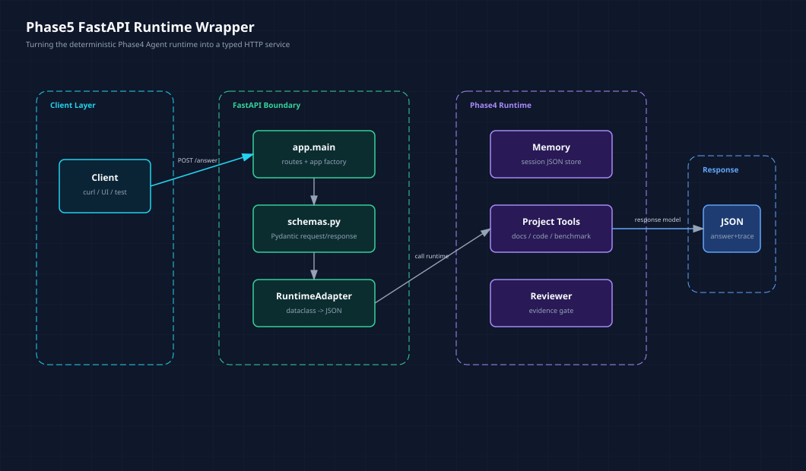

# FastAPI 封装 Agent Runtime：从脚本到服务

> Phase5 第一篇。Phase4 已经把 MCP-style tools、Memory、Multi-Agent 和 Reviewer 串成了一个确定性 runtime。Phase5 开始做生产化，但第一步不是 Docker，也不是 Langfuse，而是先把 runtime 变成一个可测试的 HTTP 服务。
>
> 配套代码：`phase-5-production/01-fastapi-backend/`

**TL;DR：** Agent 生产化不是把脚本丢进容器就结束。真正的第一步，是给 runtime 加一层明确的 API 边界：请求怎么进来，schema 怎么校验，runtime 怎么被调用，结果怎么序列化，错误怎么返回，测试怎么证明接口稳定。这次我用 FastAPI 包了一层最小服务，只开放 `/health` 和 `/api/v1/agent/answer`，暂时不做流式输出、鉴权、Docker 和观测。

很多人讲 Agent 部署，会直接从 Docker 开始。

我现在觉得顺序应该反过来：

```text
先把 runtime 变成服务，再考虑怎么部署服务。
```

因为如果服务边界没想清楚，Docker 只是把混乱打包起来。

Phase4 结束时，我们已经有一个能跑的 runtime：

```text
Memory 召回长期上下文
Supervisor 规划 handoff
ProjectToolset 查询 docs / code / benchmark
Reviewer 检查 evidence
返回 answer + trace
```

但它还是一个 Python 脚本调用：

```python
runtime.answer(question)
```

Phase5 的第一步，就是把它变成：

```http
POST /api/v1/agent/answer
```

***

## 一、为什么 Phase5 先做 API

脚本和服务的差别，不只是“有没有端口”。

脚本可以默认很多东西：

```text
输入一定是字符串。
调用者知道返回对象结构。
异常直接打印到终端。
memory 文件路径写死。
trace 给人肉看就行。
```

服务不行。

服务必须回答这些问题：

| 问题 | API 层必须给出的答案 |
|------|----------------------|
| 输入为空怎么办？ | 422 校验错误 |
| 返回结构是什么？ | Pydantic response model |
| 多个用户怎么隔离 memory？ | `session_id` 映射本地 memory 文件 |
| runtime 抛异常怎么办？ | 转成 HTTP 错误 |
| 调用方怎么复盘？ | response 带 `trace`、`evidence`、`review` |

这也是为什么 Phase5 先做 FastAPI。

不是为了学一个 Web 框架，而是为了把 Agent runtime 的边界显式化。

***

## 二、这一版服务长什么样

目录结构：

```text
phase-5-production/01-fastapi-backend/
├── app/
│   ├── config.py             # 服务配置和路径
│   ├── main.py               # FastAPI app factory 和路由
│   ├── runtime_adapter.py    # Phase4 runtime 到 API response 的转换
│   └── schemas.py            # 请求/响应 schema
├── tests/
│   └── test_api.py
├── requirements.txt
└── README.md
```

整体结构是这样：



<center>图 1：Phase5 第一步，把 Phase4 runtime 放到 FastAPI 服务边界后面。</center>

这张图里最重要的不是 FastAPI 本身，而是中间那层 `RuntimeAdapter`。

它的职责是：

```text
加载 Phase4 IntegratedAgentRuntime
根据 session_id 选择 memory 文件
调用 runtime.answer(question)
把 dataclass / enum 转成 JSON-friendly response
```

也就是说，业务 runtime 不直接暴露给 HTTP。

中间必须有一层 adapter。

***

## 三、请求 schema：先把输入收紧

请求模型在 `schemas.py`：

```python
class AnswerRequest(BaseModel):
    question: str = Field(min_length=1, max_length=500)
    session_id: str = Field(default="default", min_length=1, max_length=80)

    @field_validator("question", "session_id")
    @classmethod
    def reject_blank(cls, value: str) -> str:
        normalized = value.strip()
        if not normalized:
            raise ValueError("must not be blank")
        return normalized
```

这里有两个小点。

第一，`question` 有长度限制。

这不是安全体系，但至少避免第一版服务直接接收超大输入。

第二，空白字符串会被拒绝。

很多 API 只写 `min_length=1`，结果 `"   "` 会通过。Agent 服务尤其不能这样，因为空问题进入 runtime 后，后面检索、记忆、路由都可能出现奇怪行为。

测试里写死了：

```python
response = self.client.post(
    "/api/v1/agent/answer",
    json={"question": "   ", "session_id": "test-session"},
)

self.assertEqual(response.status_code, 422)
```

这就是 API 层应该做的事：把明显无效的输入挡在 runtime 外面。

***

## 四、响应 schema：不要只返回一段 answer

Agent 服务如果只返回：

```json
{"answer": "..."}
```

对调试不够。

Phase4 已经证明了 trace、evidence、review 很重要，所以 Phase5 的响应直接把它们保留下来：

```python
class AnswerResponse(BaseModel):
    question: str
    session_id: str
    answer: str
    memory_context: list[MemoryContextItem]
    written_memory: MemoryContextItem | None
    tool_results: list[ToolResultItem]
    evidence: list[str]
    review: ReviewResponse
    trace: list[str]
```

这意味着调用方不只是拿到一句回答，还能看到：

```text
本次召回了哪些记忆？
调用了哪些工具？
证据路径有哪些？
reviewer 是否通过？
runtime 走过哪些步骤？
```

对 Agent 系统来说，这些字段不是调试附属品，而是生产化前必须保留的可观测入口。

***

## 五、RuntimeAdapter：服务层不要污染 runtime

`RuntimeAdapter` 是这次的关键。

```python
class RuntimeAdapter:
    """Thin API adapter around the Phase4 deterministic runtime."""

    def answer(self, question: str, session_id: str) -> AnswerResponse:
        memory_path = self._memory_path(session_id)
        runtime = self._runtime_cls(project_root=self.settings.project_root, memory_path=memory_path)
        result = runtime.answer(question)

        return AnswerResponse(
            question=result.question,
            session_id=session_id,
            answer=result.answer,
            memory_context=[self._memory_item(item) for item in result.memory_context],
            written_memory=self._memory_item(result.written_memory) if result.written_memory else None,
            tool_results=[...],
            evidence=result.evidence,
            review=ReviewResponse(...),
            trace=result.trace,
        )
```

它做了两件事。

第一，根据 `session_id` 隔离 memory：

```python
def _memory_path(self, session_id: str) -> Path:
    safe_session = re.sub(r"[^A-Za-z0-9_.-]+", "_", session_id.strip())[:80] or "default"
    self.settings.memory_dir.mkdir(parents=True, exist_ok=True)
    return self.settings.memory_dir / f"{safe_session}.json"
```

这还是学习版，不是多租户生产存储。

但它表达了一个重要边界：

```text
API 请求里的 session_id 不应该直接变成任意文件路径。
```

第二，它把 Phase4 dataclass 转成 Pydantic response。

这样 Phase4 runtime 仍然保持纯 Python 学习实现，不需要知道 FastAPI，也不需要知道 HTTP。

这个分层很重要。

否则后面一旦要加 Docker、Langfuse、鉴权，很容易把 runtime 写成一个到处依赖 Web 框架的大泥球。

***

## 六、FastAPI 路由：第一版只开放两个入口

`main.py` 很小：

```python
def create_app(settings: Settings | None = None) -> FastAPI:
    resolved_settings = settings or get_settings()
    adapter = RuntimeAdapter(resolved_settings)
    app = FastAPI(
        title="Phase5 Agent API",
        version=resolved_settings.version,
        summary="FastAPI wrapper around the Phase4 integrated Agent runtime.",
    )

    @app.get("/health", response_model=HealthResponse)
    def health() -> HealthResponse:
        ...

    @app.post("/api/v1/agent/answer", response_model=AnswerResponse)
    def answer(request: AnswerRequest) -> AnswerResponse:
        ...

    return app
```

为什么不一开始就做很多接口？

因为 Phase5 第一阶段不是做平台，而是把服务边界立起来。

当前只需要两个入口：

| Method | Path | 作用 |
|--------|------|------|
| `GET` | `/health` | 服务存活和元数据 |
| `POST` | `/api/v1/agent/answer` | 调用 Phase4 runtime |

这两个接口足够支撑后续：

```text
Docker healthcheck
API smoke test
Web UI 对接
Langfuse trace 接入
鉴权和限流中间件
```

接口少一点，后面改起来也轻一点。

***

## 七、怎么运行

安装依赖：

```bash
python3 -m pip install -r phase-5-production/01-fastapi-backend/requirements.txt
```

运行测试：

```bash
PYTHONDONTWRITEBYTECODE=1 python3 -m unittest discover -s phase-5-production/01-fastapi-backend/tests
```

启动服务：

```bash
cd phase-5-production/01-fastapi-backend
uvicorn app.main:app --reload --port 8000
```

健康检查：

```bash
curl http://127.0.0.1:8000/health
```

调用 Agent：

```bash
curl -X POST http://127.0.0.1:8000/api/v1/agent/answer \
  -H 'Content-Type: application/json' \
  -d '{
    "question": "请结合 Phase4 Memory 的代码、文章和测试证据，说明是否可以进入 Phase5",
    "session_id": "demo"
  }'
```

返回里会包含：

```text
answer
memory_context
tool_results
evidence
review
trace
```

这些字段会成为后续观测和前端展示的基础。

***

## 八、测试证明了什么

当前 API 测试有三个：

| 测试 | 证明什么 |
|------|----------|
| `test_health_endpoint_returns_service_metadata` | 服务能返回基本元数据 |
| `test_answer_endpoint_wraps_phase4_runtime` | API 能调用 Phase4 runtime，并返回 answer、evidence、trace、review、tool results |
| `test_answer_endpoint_rejects_empty_question` | 空白问题会被挡在 API schema 层 |

实际运行结果：

```text
Ran 3 tests
OK
```

这里重点不是测试数量，而是测试口径。

Phase5 的测试不应该只测“接口 200 了”。

它还要测：

```text
response 里有没有 trace？
有没有 evidence？
reviewer 是否真的通过？
tool_results 是否包含 search_docs / find_code_examples / read_benchmark_summary？
空输入是否被拒绝？
```

这些都是 Agent 服务和普通 CRUD API 不一样的地方。

***

## 九、这一版还不是什么

这版 FastAPI 后端仍然不是生产系统。

它还没有做：

| 能力 | 放到哪一阶段 |
|------|--------------|
| SSE / WebSocket 流式输出 | Phase5 后续 |
| API key / JWT 鉴权 | Phase5 后续 |
| 限流和超时控制 | Phase5 后续 |
| Dockerfile / Compose | `02-docker-deploy` |
| Langfuse trace | `03-observability` |
| 自动评测和回归集成 | `04-testing-eval` |
| 真正 MCP client 替换 Python `ProjectToolset` | Phase5 / Phase6 |

这些都重要，但不能一口气全做。

Phase5 的第一步要先保证：

```text
runtime 可以被服务调用
输入输出 schema 清楚
测试能证明接口行为
代码层没有把 Web 框架污染进 runtime
```

这个地基立住后，Docker 和可观测性才有意义。

***

## 十、下一步做什么

下一步建议进入 `02-docker-deploy`。

但 Docker 也不要一上来就写复杂 Compose。

我建议下一步只做三件事：

```text
为 01-fastapi-backend 写 Dockerfile
增加 docker-compose.yml
用 healthcheck 验证 /health
```

如果这一小步跑通，再进入 Langfuse 观测。

Phase5 的主线应该始终围绕一个问题：

```text
这个 Agent runtime 能不能像一个正常后端服务一样被部署、调用、观察和回归测试？
```

现在第一步已经有了答案：

```text
它可以被 FastAPI 包成一个明确的 HTTP 服务。
```

后面要做的，就是让这个服务越来越接近真实生产环境。
