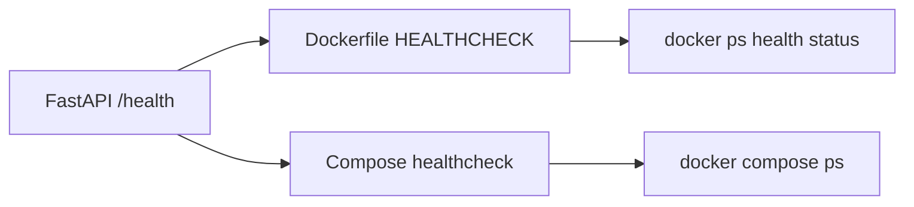

# Docker 化不是把服务塞进镜像就完了

FastAPI 服务已经能在本地跑起来，下一步为什么还要做 Docker？

原因不是“生产环境都用 Docker”这么笼统，而是到了 Phase5，我们要开始回答另一个问题：这个 Agent 服务能不能被稳定地启动、检查、重建和交付？

本节对应代码在：

- `phase-5-production/01-fastapi-backend/`：FastAPI 服务本体
- `phase-5-production/02-docker-deploy/Dockerfile`：镜像构建
- `phase-5-production/02-docker-deploy/docker-compose.yml`：本地编排
- `.dockerignore`：构建上下文边界

## 一、这一节真正要解决什么

Phase5 的第一步已经把 Phase4 runtime 包成 HTTP API：

```text
GET  /health
POST /api/v1/agent/answer
```

但本地能跑和可交付之间还差几件事：

| 问题 | Docker 层要给出的答案 |
| --- | --- |
| 服务怎么启动 | 固定 `uvicorn app.main:app --host 0.0.0.0 --port 8000` |
| 依赖怎么安装 | 镜像构建时安装 `requirements.txt` |
| Phase4 runtime 怎么找到 | 容器内保留 `/app/phase-4-advanced/...` 路径 |
| 服务是否活着 | Dockerfile 和 Compose 都使用 `/health` |
| 会话记忆怎么保留 | Compose named volume 挂载 `.memory` |
| 什么不该进入镜像 | `.dockerignore` 排除 `.env`、缓存、node_modules、记忆文件 |

这一节的重点不是 Kubernetes、CI/CD，也不是多环境配置。当前阶段只做一个能反复启动的本地部署闭环。

## 二、容器内目录为什么这样设计

FastAPI 的配置在 `phase-5-production/01-fastapi-backend/app/config.py`：

```python
@dataclass(frozen=True)
class Settings:
    service_name: str = "phase5-agent-api"
    phase: str = "phase-5"
    version: str = "0.1.0"
    project_root: Path = Path(__file__).resolve().parents[3]
    memory_dir: Path = Path(__file__).resolve().parents[1] / ".memory"
```

这里有两个隐含约束：

- `project_root` 要能定位到整个项目根目录
- `memory_dir` 要落在 FastAPI 子项目自己的 `.memory` 下

所以 Dockerfile 没有把应用随便复制到 `/app/app`，而是保留了学习工程的相对结构：

```text
/app
├── phase-4-advanced/
│   ├── 03-memory-system/
│   ├── 04-multi-agent-patterns/
│   └── 05-agent-runtime-integration/
└── phase-5-production/
    └── 01-fastapi-backend/
        ├── app/
        └── .memory/
```

这样 `RuntimeAdapter` 里这段路径逻辑还能继续成立：

```python
runtime_root = project_root / "phase-4-advanced" / "05-agent-runtime-integration"
```

这就是容器化时最容易忽略的点：不是把 Python 文件复制进去就行，还要保证代码里依赖的路径假设仍然成立。

## 三、Dockerfile 做了哪些事

核心 Dockerfile：

```dockerfile
FROM python:3.12-slim

WORKDIR /app/phase-5-production/01-fastapi-backend

RUN apt-get update \
    && apt-get install -y --no-install-recommends curl \
    && rm -rf /var/lib/apt/lists/*

COPY phase-5-production/01-fastapi-backend/requirements.txt ./requirements.txt
RUN python -m pip install --upgrade pip \
    && pip install -r requirements.txt

COPY phase-5-production/01-fastapi-backend/app ./app
COPY phase-4-advanced/03-memory-system /app/phase-4-advanced/03-memory-system
COPY phase-4-advanced/04-multi-agent-patterns /app/phase-4-advanced/04-multi-agent-patterns
COPY phase-4-advanced/05-agent-runtime-integration /app/phase-4-advanced/05-agent-runtime-integration

HEALTHCHECK --interval=30s --timeout=5s --start-period=10s --retries=3 \
    CMD curl -fsS http://127.0.0.1:8000/health || exit 1

CMD ["uvicorn", "app.main:app", "--host", "0.0.0.0", "--port", "8000"]
```

这里有三个选择：

第一，只复制运行需要的目录，而不是整个仓库。这里除了 FastAPI app 和 Phase4 runtime，也要复制 `docs/` 以及 Phase2/Phase3 benchmark outputs。原因是 Phase4 runtime 里的项目工具会读取这些资料作为 evidence；如果镜像里缺少它们，容器虽然能启动，但回答质量会和本地开发环境不一致。

第二，安装 `curl` 不是为了业务逻辑，而是为了容器内健康检查。Docker 的 `HEALTHCHECK` 需要一个能在容器里执行的探测命令。

第三，`WORKDIR` 放在 FastAPI 子项目下，这样启动命令可以直接使用：

```bash
uvicorn app.main:app
```

## 四、Compose 负责本地可重复运行

Compose 配置做了四件事：

```yaml
services:
  phase5-agent-api:
    build:
      context: ../..
      dockerfile: phase-5-production/02-docker-deploy/Dockerfile
    ports:
      - "8000:8000"
    volumes:
      - phase5_agent_memory:/app/phase-5-production/01-fastapi-backend/.memory
    healthcheck:
      test: ["CMD", "curl", "-fsS", "http://127.0.0.1:8000/health"]
```

这里 `context: ../..` 很关键。因为 Dockerfile 需要复制 Phase4 和 Phase5 两个目录，构建上下文必须是仓库根目录。

同时，`.memory` 没有放在镜像层，而是挂成 named volume：

```text
phase5_agent_memory
```

这能模拟生产服务里“代码镜像可替换，运行状态要单独持久化”的基本原则。

## 五、/health 不是摆设

`/health` 在 FastAPI 里已经存在：

```python
@app.get("/health", response_model=HealthResponse)
def health() -> HealthResponse:
    return HealthResponse(
        status="ok",
        service=resolved_settings.service_name,
        phase=resolved_settings.phase,
        version=resolved_settings.version,
    )
```

Docker 化以后，它被用在两层：



这一步的意义是：服务启动不再只看进程是否存在，而是看 HTTP 层是否能正常响应。

## 六、怎么验证

从部署目录启动：

```bash
cd phase-5-production/02-docker-deploy
docker compose config
docker compose up --build
```

`docker compose config` 不需要真正启动容器，适合先检查 build context、Dockerfile 路径、端口和 healthcheck 配置是否能被 Compose 正确解析。真实 build/run 前需要 Docker Desktop 或 Docker daemon 已经启动。

健康检查：

```bash
curl http://127.0.0.1:8000/health
```

预期结果：

```json
{"status":"ok","service":"phase5-agent-api","phase":"phase-5","version":"0.1.0"}
```

调用 Agent API：

```bash
curl -X POST http://127.0.0.1:8000/api/v1/agent/answer \
  -H "Content-Type: application/json" \
  -d '{"question":"Phase4 当前 runtime 集成了哪些能力？","session_id":"docker-demo"}'
```

停止服务：

```bash
docker compose down
```

## 七、这一节的边界

到这里，我们只证明了一件事：Phase5 FastAPI 服务可以被容器化，并且能通过健康检查确认 HTTP 层可用。

还没有解决：

- 多环境配置
- 镜像版本管理
- CI 构建
- 线上日志和 tracing
- 指标采集
- 重启策略和限流

这些会进入 Phase5 后续的 `03-observability` 和 `04-testing-eval`。

不过这一步已经把生产化的第一块地基打下来了：服务不再依赖“我在本机怎么启动”，而是有了可重复的部署入口。
