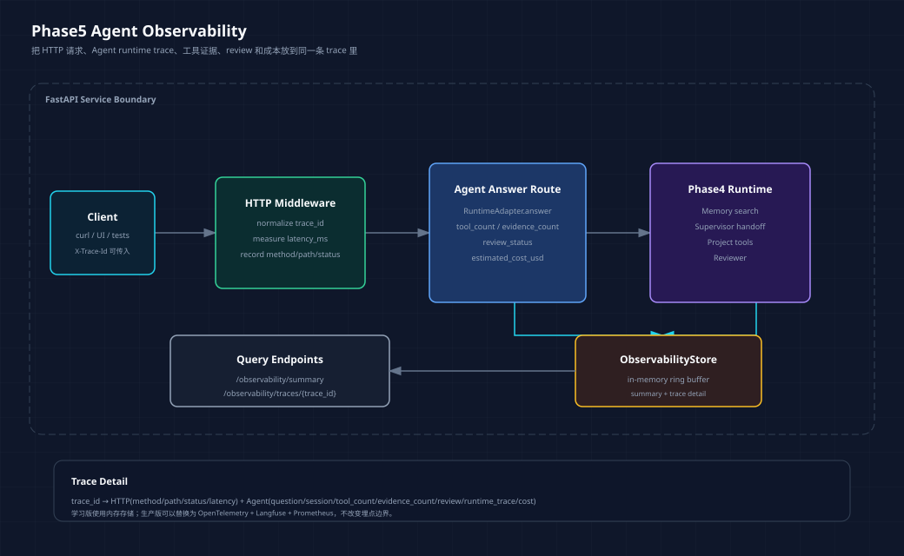

# Agent 服务可观测性：不要只看日志，要能还原一次调用



FastAPI 服务跑起来以后，最容易产生一种错觉：只要接口能返回 200，系统就算进入生产化了。

但 Agent 服务不是普通 CRUD。一次回答背后可能经历记忆召回、工具调用、多 Agent handoff、review、拒答或修复。出了问题时，只知道“接口失败了”没什么用，我们真正需要回答的是：

```text
这次请求走了哪条路径？
用了哪些工具？
证据够不够？
review 有没有通过？
延迟主要花在哪？
成本有没有异常？
```

所以 Phase5 的第三步不是先接入一个复杂平台，而是在当前 FastAPI 服务里补一个最小可观测性闭环。

对应代码在：

- `phase-5-production/01-fastapi-backend/app/observability.py`
- `phase-5-production/01-fastapi-backend/app/main.py`
- `phase-5-production/01-fastapi-backend/app/schemas.py`
- `phase-5-production/01-fastapi-backend/tests/test_api.py`

## 一、普通 API 日志为什么不够

普通 Web 服务常见日志大概是这样：

```text
POST /api/v1/agent/answer 200 183ms
```

这对传统 API 有用，但对 Agent 服务只回答了最浅的一层问题：HTTP 是否成功。

对 Agent 来说，一次 200 也可能是坏结果：

| 表面结果 | 实际风险 |
| --- | --- |
| HTTP 200 | 回答没有证据支撑 |
| HTTP 200 | 工具没有真正命中资料 |
| HTTP 200 | review 没通过但仍然返回 |
| HTTP 200 | 延迟飙升来自某个工具 |
| HTTP 200 | 成本异常但没有被记录 |

所以 Agent 服务的可观测性至少要覆盖两层：

```text
HTTP 层：method、path、status、latency、trace_id
Agent 层：runtime trace、tool_count、evidence_count、review_status、cost
```

本阶段没有急着接 OpenTelemetry、Prometheus 或 Langfuse，而是先在代码里把观测边界打清楚。边界清楚后，将来换成专业平台才不会变成“到处打点”。

## 二、这一版观测层的目标

这次新增的观测能力很克制：

| 能力 | 作用 |
| --- | --- |
| `X-Trace-Id` | 把一次 HTTP 请求和 Agent runtime 运行对齐 |
| HTTP latency | 判断服务层是否变慢 |
| Agent latency | 判断 runtime 本身耗时 |
| runtime trace | 还原 Phase4 Agent 执行路径 |
| tool count | 判断是否真的调用工具 |
| evidence count | 判断回答是否有证据 |
| review status | 判断质量检查是否通过 |
| estimated cost | 在没有真实 LLM 账单前观察成本形状 |

对应新增接口：

```text
GET /api/v1/observability/summary
GET /api/v1/observability/traces/{trace_id}
```

这里的 `summary` 看整体趋势，`trace detail` 看单次调用。

## 三、核心数据结构：先定义观测事件

观测模块在 `app/observability.py`。

HTTP 请求事件：

```python
@dataclass(frozen=True)
class HttpObservation:
    trace_id: str
    method: str
    path: str
    status_code: int
    latency_ms: float
```

Agent 运行事件：

```python
@dataclass(frozen=True)
class AgentRunObservation:
    trace_id: str
    question: str
    session_id: str
    latency_ms: float
    tool_count: int
    evidence_count: int
    review_status: str
    runtime_trace: list[str]
    estimated_cost_usd: float
```

这两个结构刻意分开。

HTTP 事件回答的是“服务有没有正常响应”，Agent 事件回答的是“这次 Agent 工作流有没有真的完成它该做的事”。

## 四、用 middleware 接住所有 HTTP 请求

FastAPI 里最适合记录 HTTP 级指标的位置是 middleware。

代码在 `app/main.py`：

```python
@app.middleware("http")
async def add_trace_and_metrics(request: Request, call_next):
    trace_id = normalize_trace_id(request.headers.get("x-trace-id"))
    request.state.trace_id = trace_id
    start_ms = now_ms()

    response = await call_next(request)
    response.headers["X-Trace-Id"] = trace_id

    observability.record_http_request(
        HttpObservation(
            trace_id=trace_id,
            method=request.method,
            path=request.url.path,
            status_code=response.status_code,
            latency_ms=elapsed_ms(start_ms),
        )
    )
    return response
```

这里有一个小细节：调用方可以自己传 `X-Trace-Id`，也可以不传。

不传时服务生成一个新的 trace id；传入时服务会做简单清洗，避免奇怪字符进入日志和查询路径。

```python
def normalize_trace_id(raw_trace_id: str | None) -> str:
    if raw_trace_id is None:
        return uuid.uuid4().hex
    normalized = TRACE_ID_PATTERN.sub("_", raw_trace_id.strip())[:80]
    return normalized or uuid.uuid4().hex
```

这样测试、前端、脚本都可以用同一个 trace id 串起一次调用。

## 五、Agent route 记录 runtime 级信息

HTTP middleware 只能知道请求耗时，不知道 Agent 内部做了什么。

所以在 `/api/v1/agent/answer` 里，还要记录 Agent 运行事件：

```python
@app.post("/api/v1/agent/answer", response_model=AnswerResponse)
def answer(payload: AnswerRequest, request: Request) -> AnswerResponse:
    start_ms = now_ms()
    response = adapter.answer(
        question=payload.question,
        session_id=payload.session_id,
    )

    observability.record_agent_run(
        AgentRunObservation(
            trace_id=request.state.trace_id,
            question=payload.question,
            session_id=payload.session_id,
            latency_ms=elapsed_ms(start_ms),
            tool_count=len(response.tool_results),
            evidence_count=len(response.evidence),
            review_status=response.review.status,
            runtime_trace=response.trace,
            estimated_cost_usd=estimate_answer_cost_usd(payload.question, response),
        )
    )
    return response
```

这段代码把 Phase4 runtime 的结构化结果变成了观测数据。

这里尤其重要的是这几个字段：

```text
tool_count
evidence_count
review_status
runtime_trace
```

它们能把“Agent 给了一个答案”拆成更可判断的工程事实。

比如：

```text
tool_count = 0
```

说明这次回答可能没有真正查资料。

```text
review_status = needs_evidence
```

说明最终答案没有通过质量检查。

```text
runtime_trace = ["runtime.start", "memory.search", "supervisor.plan", ...]
```

说明可以还原这次调用走过哪些步骤。

## 六、summary 看趋势，trace detail 看现场

第一类接口是 summary：

```text
GET /api/v1/observability/summary
```

返回结构类似：

```json
{
  "total_requests": 3,
  "total_agent_runs": 1,
  "average_latency_ms": 148.42,
  "average_agent_latency_ms": 132.17,
  "estimated_cost_usd": 0.00005,
  "recent_trace_ids": ["phase5-observe-demo"]
}
```

它不是为了替代监控大盘，而是先回答：

```text
服务有没有被调用？
Agent 运行了几次？
平均延迟大概是多少？
当前估算成本有没有在增长？
最近有哪些 trace 可以追？
```

第二类接口是 trace detail：

```text
GET /api/v1/observability/traces/{trace_id}
```

返回结构类似：

```json
{
  "trace_id": "phase5-observe-demo",
  "http": {
    "method": "POST",
    "path": "/api/v1/agent/answer",
    "status_code": 200,
    "latency_ms": 151.34
  },
  "agent": {
    "session_id": "observe-demo",
    "tool_count": 3,
    "evidence_count": 12,
    "review_status": "approved",
    "runtime_trace": [
      "runtime.start",
      "memory.search",
      "supervisor.plan",
      "handoff.doc_researcher",
      "tool.search_docs",
      "reviewer.review"
    ],
    "estimated_cost_usd": 0.00005
  }
}
```

这个接口的价值是“还原现场”。

当用户说某次回答不对时，不需要先猜模型是不是抽风，而是可以先看 trace：

```text
有没有查文档？
有没有查代码？
有没有读 benchmark？
证据数量够不够？
review 结果是什么？
```

这比只看日志有效得多。

## 七、测试怎么证明它有效

这次没有只靠手动 curl，而是在 `tests/test_api.py` 里加了三类测试。

第一，所有请求都会返回 trace id：

```python
response = self.client.get("/health")
self.assertTrue(response.headers["x-trace-id"])
```

第二，Agent 调用会进入 summary：

```python
summary_response = self.client.get("/api/v1/observability/summary")
summary = summary_response.json()

self.assertEqual(summary["total_agent_runs"], 1)
self.assertGreater(summary["average_agent_latency_ms"], 0)
self.assertGreater(summary["estimated_cost_usd"], 0)
```

第三，指定 trace id 可以查回运行细节：

```python
trace_response = self.client.get(
    "/api/v1/observability/traces/trace-detail-test"
)
trace = trace_response.json()

self.assertEqual(trace["agent"]["review_status"], "approved")
self.assertGreaterEqual(trace["agent"]["tool_count"], 3)
self.assertIn("runtime.start", trace["agent"]["runtime_trace"])
```

这些测试验证的不是“接口存在”，而是观测数据真的能从请求流进 store，再从查询接口读出来。

## 八、现在还不是完整生产观测

当前版本是学习版，边界要讲清楚：

| 当前实现 | 生产版本应该怎么升级 |
| --- | --- |
| 内存存储 | 写入 OpenTelemetry Collector、Langfuse、数据库或日志平台 |
| 单进程可见 | 多实例共享 trace 后端 |
| 估算成本 | 接入真实模型 usage 和计费 |
| 简单平均延迟 | 分 p50、p95、p99 |
| 手写 trace | 接入标准 trace/span |

但这一步仍然有价值。

因为它先把 Agent 服务应该观测什么讲清楚了。生产化不是先上工具，而是先知道哪些信号值得采。

## 九、怎么运行

启动服务：

```bash
cd phase-5-production/01-fastapi-backend
python3 -m uvicorn app.main:app --reload --port 8000
```

调用 Agent：

```bash
curl -i -X POST http://127.0.0.1:8000/api/v1/agent/answer \
  -H "Content-Type: application/json" \
  -H "X-Trace-Id: phase5-observe-demo" \
  -d '{"question":"请结合 Phase4 Memory 的代码和测试证据，说明当前状态","session_id":"observe-demo"}'
```

看整体摘要：

```bash
curl http://127.0.0.1:8000/api/v1/observability/summary
```

看单次 trace：

```bash
curl http://127.0.0.1:8000/api/v1/observability/traces/phase5-observe-demo
```

测试：

```bash
PYTHONDONTWRITEBYTECODE=1 python3 -m unittest discover -s phase-5-production/01-fastapi-backend/tests
```

## 十、这一节证明了什么

到这里，Phase5 已经从“服务能跑”推进到了“服务能被观察”。

现在一次 Agent 调用不再只是一个黑盒 HTTP 响应，而是有了：

```text
trace id
HTTP latency
Agent latency
runtime trace
tool evidence
review status
estimated cost
```

这为后面的 `04-testing-eval` 做了铺垫。

因为只有能观察，才谈得上回归测试；只有能还原调用，才谈得上线上质量评估。
