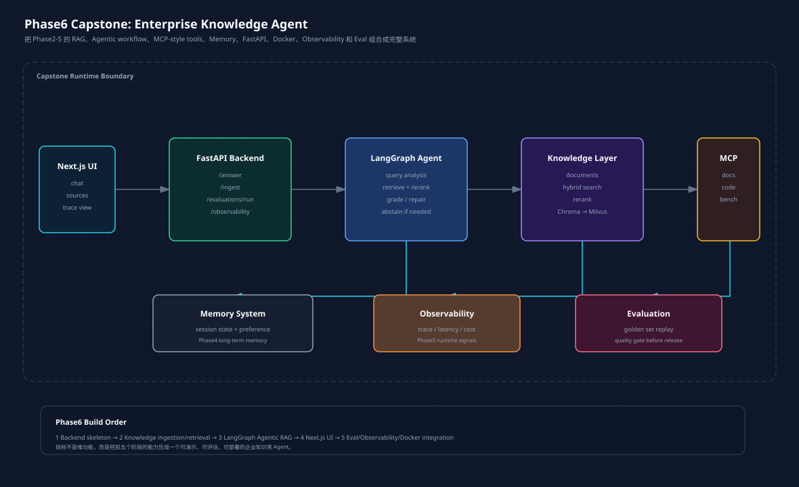

# 企业知识库 Agent：Phase6 总体设计



Phase6 不是再开一个孤立 demo。

前五个阶段已经分别证明了几件事：

```text
Phase2：RAG 需要真实 benchmark，而不是只看 demo 回答。
Phase3：Agentic RAG 的价值在于可控路由、repair、abstain 和 trace。
Phase4：真实 Agent 离不开工具、记忆、多角色复核和边界。
Phase5：生产化不是部署一下，而是服务、容器、观测、评估一起闭环。
```

Phase6 的目标，是把这些能力组合成一个企业知识库 Agent 系统。

## 一、Capstone 要解决的问题

企业知识库问答最怕三件事：

```text
资料里有答案，但检索不到。
检索到了资料，但回答编了。
回答看起来对，但没人知道它依据什么。
```

所以这个系统不能只做一个 chat UI。

它至少要有：

| 能力 | 为什么需要 |
| --- | --- |
| 文档导入 | 知识库必须可更新 |
| hybrid retrieval + rerank | 单纯向量检索不够稳定 |
| LangGraph workflow | 需要 rewrite、repair、abstain |
| sources 展示 | 用户要能看到依据 |
| trace 展示 | 开发者要能调试路径 |
| memory | 支持会话偏好和任务上下文 |
| eval replay | 每次改动后要知道有没有退化 |
| Docker Compose | 保证本地和演示环境可复现 |

## 二、系统边界

Phase6 不追求一次性做成企业级 SaaS。

当前范围：

```text
单租户
本地 Docker Compose
Markdown/PDF 文档导入
Chroma 作为开发向量库
Milvus 作为生产化替换方向
FastAPI 后端
Next.js 前端
LangGraph Agentic RAG
内置 eval golden set
```

暂不做：

```text
复杂权限系统
多租户隔离
在线协同编辑
大规模分布式索引
完整 SSO
企业审计后台
```

这些不是不重要，而是当前学习阶段容易把主线拖散。

## 三、后端模块划分

后端建议从这几个模块拆：

```text
api/
  routes_answer.py
  routes_ingest.py
  routes_eval.py
  routes_observability.py

knowledge/
  loaders.py
  chunking.py
  embeddings.py
  vector_store.py
  retrieval.py
  rerank.py

agent/
  state.py
  graph.py
  nodes.py
  prompts.py

runtime/
  memory.py
  tools.py
  observability.py
  evaluation.py
```

这个拆法的核心，是把“知识库能力”和“Agent 编排能力”分开。

RAG 层负责找资料，Agent 层负责判断是否够用、是否 rewrite、是否 repair、是否拒答。

## 四、LangGraph 主流程

Phase6 的 Agentic RAG 主流程沿用 Phase3 的经验：

```text
query analysis
  ↓
hybrid retrieval + rerank
  ↓
context grading
  ↓
conditional rewrite
  ↓
answer generation
  ↓
faithfulness / evidence check
  ↓
repair / abstain / final
```

和 Phase3 不同的是，这次要接真实服务边界：

```text
FastAPI request
  ↓
LangGraph runtime
  ↓
retrieval tools
  ↓
observability trace
  ↓
API response
  ↓
Next.js sources + trace view
```

也就是说，Phase6 不是只跑 benchmark，而是要把 benchmark 能力变成一个用户能交互的系统。

## 五、前端不做花架子

前端建议只做三个核心视图：

```text
Chat：提问、回答、引用来源
Trace：展示每一步路由、工具调用、耗时、review
Eval：运行 golden set，看 pass rate 和失败样本
```

不要先做 landing page，也不要做复杂营销页。

用户打开系统第一眼应该看到可用的问答界面，而不是项目介绍。

## 六、评估标准

Phase6 的验收不能只看“能回答”。

建议指标：

| 指标 | 来源 |
| --- | --- |
| Precision@K / Recall@K | Phase2 retrieval benchmark |
| Faithfulness | Phase2/3 judge |
| abstain rate | Agentic RAG trace |
| repair rate | LangGraph runtime |
| average latency | Phase5 observability |
| estimated cost | Phase5 observability |
| eval pass rate | Phase5 evaluation runner |

最小验收：

```text
能导入真实资料。
能回答并展示 sources。
资料不足时能拒答。
能查看 trace。
能跑 eval。
能用 Docker Compose 启动。
```

## 七、实现顺序

不要同时开后端、前端、向量库、评估和部署。

建议顺序：

```text
1. 01-backend-skeleton
   先把 FastAPI app、schemas、health、answer placeholder 立住。

2. 02-knowledge-ingestion
   做文档导入、chunk、embedding、index、retrieval。

3. 03-agentic-qa-runtime
   用 LangGraph 接 retrieval、grading、answer、repair、abstain。

4. 04-web-ui
   做 chat、sources、trace view。

5. 05-release-eval
   接 Docker Compose、observability、golden set eval。
```

每一步都要可运行、可测试。

## 八、Phase6 第一阶段怎么做

下一步先做 `01-backend-skeleton`。

目标很小：

```text
FastAPI app
GET /health
POST /api/v1/answer
GET /api/v1/observability/summary
基础 Pydantic schemas
最小测试
README
```

这一步不接真实 RAG。

它只负责搭好服务外壳，为后面的 ingestion 和 LangGraph runtime 留接口。

这听起来慢，但对 capstone 来说是对的：系统越大，越要先把边界立清楚。
