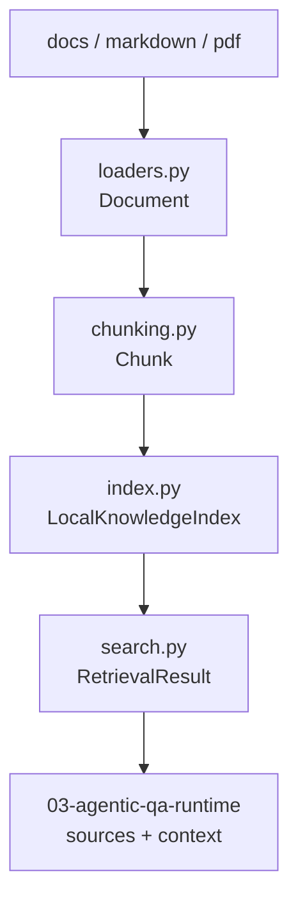

# Phase6 第二块：先让知识库真的可检索

上一块 `01-backend-skeleton` 做的是服务边界。

这一块 `02-knowledge-ingestion` 做的是数据边界：企业知识库 Agent 到底从哪里拿资料，资料如何切块，如何检索，如何把来源交给后面的 Agent workflow。

对应代码在：

- `phase-6-capstone/02-knowledge-ingestion/knowledge/loaders.py`
- `phase-6-capstone/02-knowledge-ingestion/knowledge/chunking.py`
- `phase-6-capstone/02-knowledge-ingestion/knowledge/index.py`
- `phase-6-capstone/02-knowledge-ingestion/ingest.py`
- `phase-6-capstone/02-knowledge-ingestion/search.py`
- `phase-6-capstone/02-knowledge-ingestion/tests/test_knowledge_ingestion.py`

## 一、为什么不直接接向量库

Phase2 已经做过真实 RAG benchmark，知道最终不能只靠一个简单向量检索。

但在 Capstone 里，第一步不应该直接把 Chroma、Milvus、embedding API、rerank、LangGraph 全塞进来。这样一旦结果不对，很难判断问题出在哪里：

```text
是 loader 没读到文档？
是 chunk 太大或太小？
是 embedding 不稳定？
是向量库过滤条件错了？
是 rerank 把结果排偏了？
还是 Agent 后面生成时没用证据？
```

所以这一步先做一个确定性的本地知识索引。

它不追求生产性能，追求三件事：

```text
可运行
可测试
可替换
```

等这一层稳定后，后面换 Chroma / Milvus / Cross-Encoder rerank，会有一个清晰的替换点。

## 二、整体结构

当前模块拆成四层：



每一层只做一件事：

| 层 | 负责什么 | 不负责什么 |
| --- | --- | --- |
| loader | 从文件读出 `Document` | 不切块、不检索 |
| chunker | 把 `Document` 切成 `Chunk` | 不打分、不排序 |
| index | 保存 chunk 并检索 | 不生成答案 |
| CLI | 构建和查询 index | 不启动服务 |

这个拆法是为了后面的 Agentic QA。

Agent runtime 不应该关心文档怎么读，也不应该直接操作文件系统。它只需要一个稳定接口：

```python
results = index.search(question, limit=5)
```

## 三、loader：先保住来源信息

`loaders.py` 输出的是 `Document`：

```python
@dataclass(frozen=True)
class Document:
    document_id: str
    path: str
    title: str
    content: str
    extension: str
```

这里最重要的是 `path` 和 `title`。

后面前端展示 sources，不能只展示一段文本。用户需要知道：

```text
这段答案来自哪个文档？
文档标题是什么？
路径在哪里？
```

所以 loader 从第一步就把来源信息带上，而不是等到生成答案后再补。

标题提取也很简单：

```python
heading = re.search(r"^\s*#\s+(.+?)\s*$", content, flags=re.MULTILINE)
```

如果 Markdown 有一级标题，就用一级标题；否则用文件名兜底。

## 四、chunker：切块不是随便截断

`MarkdownChunker` 当前用字符长度做窗口，但会尽量在自然边界断开：

```python
boundary = max(
    normalized.rfind("\n\n", start, end),
    normalized.rfind("\n#", start, end),
    normalized.rfind("。", start, end),
    normalized.rfind(".", start, end),
)
```

这比硬截断好一点。

原因很简单：Agent 后面拿到的是 chunk，不是整篇文章。如果 chunk 把一个论证从中间切断，生成时就更容易断章取义。

当前 `Chunk` 会保留：

```python
chunk_id
document_id
path
title
content
ordinal
```

`ordinal` 用来表示它是文档里的第几个 chunk。后面做前端 sources 或 trace 展示时，可以把同一文档的相邻 chunk 合并。

## 五、index：先用轻量 hybrid search

当前检索策略不是最终生产方案，但它刻意保留了 Phase2 的一个核心经验：

```text
不要只相信一种检索信号。
```

所以 `LocalKnowledgeIndex` 做了两个分数：

```text
lexical_score：query token 和 chunk token 的重叠
vector_score：稳定哈希 term-frequency 向量的余弦相似度
```

最终：

```text
final_score = 0.65 * lexical_score + 0.35 * vector_score
```

另外，中文检索单独处理了一下。

如果直接用正则把连续中文当作一个 token，`知识库`、`检索`、`证据` 这种短查询很容易和长句错开。所以当前 tokenizer 会给中文连续文本额外生成单字和 bigram：

```text
企业知识库 → 企 / 业 / 知 / 识 / 库 / 企业 / 业知 / 知识 / 识库
```

这不是中文分词的最终答案，但对当前学习工程已经比“整句当词”稳很多。

为什么不是直接 100% vector？

因为当前没有接真实 embedding。这里的 hashed vector 只是为了让 retrieval contract 先跑通，不应该假装它已经等价于 Phase2 的 embedding + rerank。

这也是学习工程里很重要的一点：每一层要诚实标注自己证明了什么，没有证明什么。

## 六、CLI：让知识库变成可重复动作

构建 index：

```bash
python3 phase-6-capstone/02-knowledge-ingestion/ingest.py \
  --source docs/phase-6 \
  --index /tmp/phase6-knowledge-index.json
```

查询 index：

```bash
python3 phase-6-capstone/02-knowledge-ingestion/search.py \
  --index /tmp/phase6-knowledge-index.json \
  --query "企业知识库 Agent trace" \
  --limit 3
```

这两个命令的意义不只是“方便运行”。

它们把知识入库从代码函数变成了可重复动作。后面进入 Docker、eval replay、CI smoke test 时，可以直接复用。

## 七、测试证明了什么

测试在 `tests/test_knowledge_ingestion.py`。

它用临时目录构造了两篇文档：

```text
agentic-rag.md：包含 trace / faithfulness / repair / abstain
docker-deploy.md：包含 FastAPI / healthcheck / deployment
```

然后验证四件事：

```text
Markdown 能加载出 title、path、content、document_id。
chunk 后仍保留 source metadata。
查询 faithfulness trace repair 时排在前面的是 Agentic RAG 文档。
index 保存后再加载，检索仍然可用。
```

这四个测试基本覆盖了知识入库最小闭环。

## 八、当前边界

这一步还没有做：

```text
真实 embedding
Cross-Encoder rerank
Chroma / Milvus
增量索引
FastAPI ingest endpoint
LangGraph context grading
```

这些会放到后面。

当前这一块只回答一个问题：

```text
Capstone 是否已经有一个稳定、可测试、可复用的知识检索层？
```

答案应该是：有了第一版。

## 九、下一步怎么接 Agent

下一块 `03-agentic-qa-runtime` 会把这一层接到后端：

```text
POST /api/v1/answer
  ↓
LangGraph Agentic QA runtime
  ↓
LocalKnowledgeIndex.search()
  ↓
sources + context
  ↓
answer / repair / abstain
```

到那一步，`01-backend-skeleton` 里的 `mode=placeholder` 就会变成真正的 `mode=agentic_rag`。
