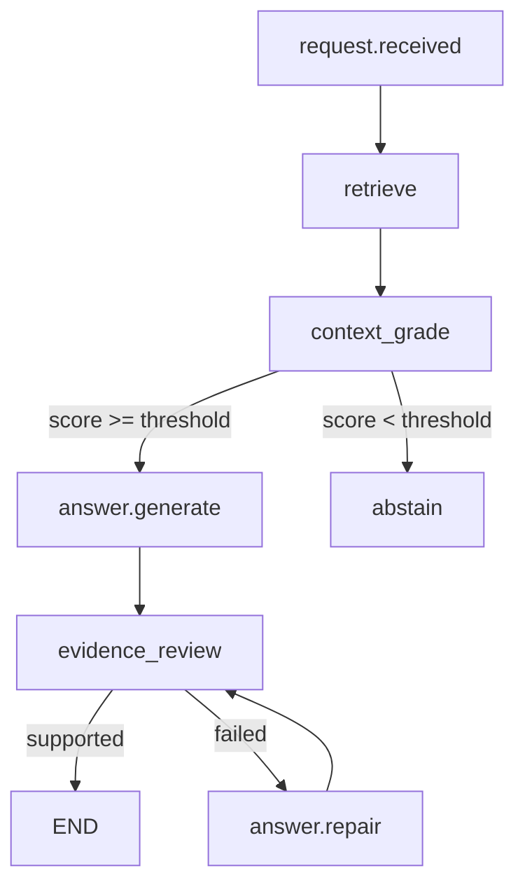

# Phase6 第三块：让问答链路真正跑起来

前两块分别做了两件事：

```text
01-backend-skeleton：把 API 合同立起来。
02-knowledge-ingestion：把知识库检索层跑起来。
```

第三块 `03-agentic-qa-runtime` 要做的是把它们接上。

但这里没有一上来接大模型。原因很简单：Capstone 是组合工程，最先要证明的是链路边界，而不是模型回答多漂亮。

所以这一版 runtime 是一个 LLM-free、LangGraph 驱动的 Agentic QA：

```text
检索资料
判断资料够不够
够：只基于证据生成答案
不够：拒答
全程返回 sources、trace、review_status
```

对应代码：

- `phase-6-capstone/03-agentic-qa-runtime/agentic_qa/runtime.py`
- `phase-6-capstone/03-agentic-qa-runtime/agentic_qa/workflow.py`
- `phase-6-capstone/03-agentic-qa-runtime/agentic_qa/evidence.py`
- `phase-6-capstone/03-agentic-qa-runtime/agentic_qa/models.py`
- `phase-6-capstone/03-agentic-qa-runtime/run_agentic_qa.py`
- `phase-6-capstone/03-agentic-qa-runtime/tests/test_agentic_qa_runtime.py`
- `phase-6-capstone/01-backend-skeleton/app/main.py`
- `phase-6-capstone/01-backend-skeleton/tests/test_api.py`

## 一、为什么不是直接 LangGraph

Phase3 已经做过 Agentic RAG：

```text
query analysis → retrieve → context grading → rewrite → generate → faithfulness → repair / abstain
```

但 Phase6 当前还处在服务集成阶段。

如果此时直接接 LangGraph、LLM、faithfulness judge 和 query rewrite，一旦 `/api/v1/answer` 返回不对，很难判断问题来自哪里：

```text
是后端 schema 不稳？
是 retrieval source 字段没接好？
是 prompt 生成不稳？
是 faithfulness judge 误判？
还是 graph route 写错了？
```

所以这一块先做一个最小可测 runtime：图是真的，节点暂时是确定性的。

它不是最终智能形态，但它把后续 Agentic RAG 需要的接口形态先跑通了。

## 二、这一版的执行图



这里有两个关键点。

第一，`context_grade` 虽然现在只是基于检索分数计算，但它已经是一个显式 LangGraph 节点。后面换成 LLM grader，不需要改变 API。

第二，`abstain` 是一等路径，不是异常分支。

企业知识库 Agent 最怕的是资料不够还硬答。当前 runtime 用阈值控制：

```python
if context_score < self.min_context_score:
    return QAResponse(
        answer="根据当前知识库资料，我无法可靠回答这个问题...",
        review_status="abstained",
        sources=[],
    )
```

这让“拒答”成为可测试行为。

## 三、返回模型和后端合同保持一致

runtime 自己定义了轻量 dataclass：

```python
@dataclass(frozen=True)
class QAResponse:
    question: str
    session_id: str
    answer: str
    mode: str
    sources: list[QASource]
    trace: list[QATraceStep]
    review_status: str | None
    context_score: float
```

它和后端 `AnswerResponse` 字段基本对齐。

为什么不直接依赖后端的 Pydantic schema？

因为 runtime 应该能在 CLI、测试、后端之外单独运行。后端只需要通过 adapter 把 dataclass 转成 Pydantic response。

这也是工程边界：

```text
runtime 负责问答流程
FastAPI 负责 HTTP contract
adapter 负责模型转换
```

## 四、answer.generate 现在如何生成答案

当前没有模型生成，所以答案只来自检索证据：

```python
def _build_evidence_answer(question, results):
    evidence_lines = []
    for index, result in enumerate(results, start=1):
        sentence = _best_sentence(result.chunk.content, question)
        evidence_lines.append(f"{index}. {sentence}（来源：{result.chunk.title}）")
    return "根据当前知识库资料，可以确认：\n" + "\n".join(evidence_lines)
```

这看起来朴素，但很重要。

它证明了两件事：

```text
回答可以带来源。
回答可以只使用检索证据。
```

后面换成 LLM 时，prompt 也应该继承这两个约束，而不是变成自由发挥。

本轮 review 里还修了一个细节：Markdown 不是纯正文。

真实文档里会混着表格、代码块、图片、命令行。如果直接按关键词挑句子，runtime 会把这些东西当答案：

```text
| 能力 | 为什么需要 |
python3 run_agentic_qa.py --question ...

```

所以当前 `_best_sentence` 做了几件事：

```text
过滤 Markdown 图片、代码块、命令和疑问句。
把有效表格行转换成自然语言证据。
对 trace、sources 这类英文技术词做精确命中加权。
```

例如：

```text
| trace 展示 | 开发者要能调试路径 |
```

会变成：

```text
trace 展示：开发者要能调试路径
```

这不是为了把 deterministic runtime 做成最终答案生成器，而是为了让它在接入 LLM 前，先具备基本的证据清洗意识。

另外，这一轮把 review / repair 也放进了图里。

测试里会故意注入一个不安全 answer builder，让它输出无来源结论：

```text
公司报销制度要求发票抬头固定为测试公司。
```

LangGraph 的 `evidence_review` 会识别这行没有来源，进入 `answer.repair`，重新生成 evidence-only answer。也就是说，repair 不再只是文章里的概念，而是一个可测试路由。

## 五、如何接入后端

`01-backend-skeleton` 的 `create_app` 做了一个小调整：

```python
def create_app(
    settings: Settings | None = None,
    runtime: AnswerRuntimeProtocol | None = None,
) -> FastAPI:
    resolved_runtime = runtime or AnswerRuntime()
```

默认还是 placeholder。

测试或后续应用组装时，可以注入 Agentic runtime：

```python
client = TestClient(create_app(runtime=AgenticRuntimeAdapter(qa_runtime)))
```

这一步的意义是：后端路由不用知道 runtime 里面到底是 placeholder、deterministic RAG，还是 LangGraph Agentic RAG。

只要它满足：

```python
answer(question: str, session_id: str) -> AnswerResponse
```

就能接进来。

## 六、测试覆盖了什么

runtime 测试覆盖三件事：

```text
资料足够时，返回 agentic_rag、sources、trace 和 evidence_supported。
资料不足时，返回 abstained，不带 sources，不编造答案。
build_runtime_from_sources 可以从文档目录构建 runtime。
review.failed 后会进入 answer.repair，删除无来源结论。
```

后端测试多了一条集成用例：

```text
create_app(runtime=AgenticRuntimeAdapter(...))
POST /api/v1/answer
返回 agentic_rag、sources、trace、review_status
```

这样可以防止后面出现一种常见问题：runtime 单测能跑，但接到 HTTP 后字段丢了。

## 七、怎么运行

runtime 测试：

```bash
PYTHONDONTWRITEBYTECODE=1 python3 -m unittest discover -s phase-6-capstone/03-agentic-qa-runtime/tests
```

CLI smoke：

```bash
PYTHONDONTWRITEBYTECODE=1 python3 phase-6-capstone/03-agentic-qa-runtime/run_agentic_qa.py \
  --source docs/phase-6 \
  --question "Phase6 为什么需要 trace？"
```

后端测试：

```bash
PYTHONDONTWRITEBYTECODE=1 python3 -m unittest discover -s phase-6-capstone/01-backend-skeleton/tests
```

## 八、本轮 review

这一轮达到了预期：

```text
API contract 没破坏。
knowledge ingestion 被复用。
sources / trace / review_status 接入了问答响应。
abstain 行为变成了可测试路径。
Markdown 表格、代码块、图片等结构化噪音不会直接混入答案。
LangGraph review / repair 条件边变成了可测试路径。
```

也要诚实说当前还没有证明：

```text
LLM 生成质量
query rewrite 是否有效
faithfulness judge 是否可靠
多段证据的综合表达质量
LLM 参与后的 answer repair 是否能降低幻觉
```

下一轮可以进入两条路线之一：

```text
继续增强 runtime：接入 LLM answer / faithfulness judge / query rewrite。
进入 Web UI：展示 chat、sources、trace 和 review_status。
```

从学习收益看，下一步可以开始做 Web UI，因为 trace 和 repair 路由已经不是假流程；但最终质量仍然要靠后续 LLM / faithfulness judge 补齐。
