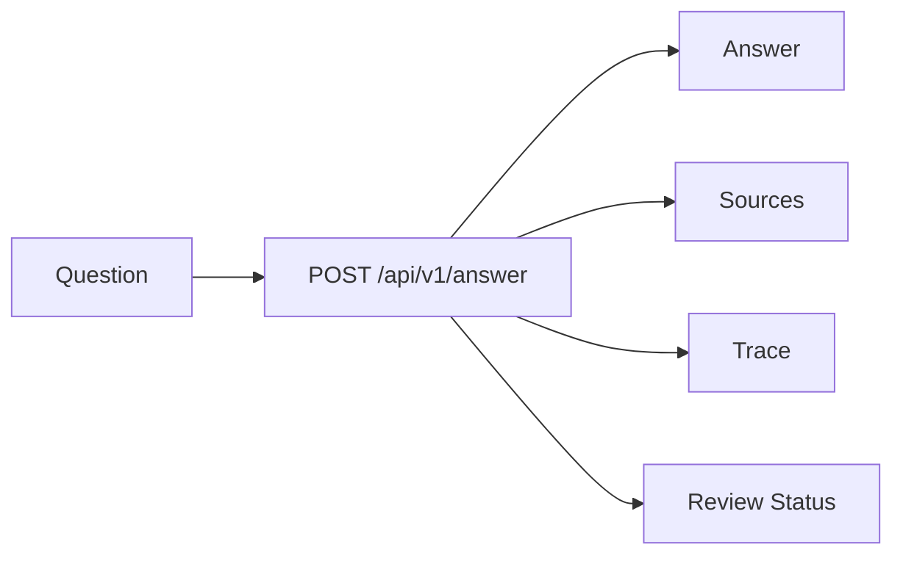

# Phase6 第四块：把 Agent 能力放到可观察界面里

前三块已经把后端、知识检索和 LangGraph runtime 接起来了。

第四块 `04-web-ui` 做前端，但重点不是“做一个漂亮页面”，而是让 Agent 的关键证据可见：

```text
回答是什么？
依据来自哪里？
走了哪些 trace step？
review_status 是 evidence_supported 还是 abstained？
```

对应代码：

- `phase-6-capstone/04-web-ui/app/page.tsx`
- `phase-6-capstone/04-web-ui/app/globals.css`
- `phase-6-capstone/04-web-ui/lib/demo-response.mjs`
- `phase-6-capstone/04-web-ui/lib/fallback-response.mjs`
- `phase-6-capstone/04-web-ui/lib/format.mjs`
- `phase-6-capstone/04-web-ui/tests/ui-contract.test.mjs`

## 一、不是 landing page

这个前端打开后就是工作台。

没有大 hero，没有营销文案，也没有“介绍项目”的空屏。第一屏直接给出：

```text
Question input
Answer
Review status
Sources
Trace
```

原因很简单：企业知识库 Agent 的核心不是讲概念，而是让用户能判断答案是否可信。

## 二、UI 信息架构



界面分成两栏：

```text
左侧：提问、回答、mode、API 状态。
右侧：Sources / Trace 两个检查面板。
```

这和 Phase6 后端 contract 是对齐的：

```text
answer
mode
sources
trace
review_status
session_id
```

## 三、为什么 demo 和 fallback 要分开

前端默认会请求：

```text
http://127.0.0.1:8010/api/v1/answer
```

页面初始状态会使用 `lib/demo-response.mjs`。

它的作用是让 UI 可以独立开发、独立 review。否则每次调整前端都要同时启动 Python 服务和索引环境，会拖慢反馈。

但后端调用失败时，不能把 demo answer 换上当前问题继续展示。

如果用户问的是“公司报销制度是什么”，后端刚好没启动，UI 却展示一段关于 `trace` 的 demo answer，这在企业知识库 Agent 里是很危险的：它看起来像回答了当前问题，实际上没有经过检索、没有经过 workflow、也没有来源。

所以现在 catch 分支会构造一个显式的客户端错误响应：

```js
{
  mode: "client_error",
  review_status: "client_error",
  sources: [],
  trace: [
    { step: "client.submit" },
    { step: "client.api_error" }
  ]
}
```

这段逻辑放在 `lib/fallback-response.mjs`，不是散落在 React 组件里。这样 UI contract test 可以直接断言：API 失败时展示的是“后端服务暂不可用”，而不是 demo answer。

UI 上会显示状态：

```text
demo
live
fallback
```

这样读者能知道当前看到的回答来自哪里。

## 四、Sources 和 Trace 是一等视图

很多问答 demo 只展示 answer。

但这个项目不是聊天玩具，目标是企业知识库 Agent。只看 answer 不够。

Sources 面板展示：

```text
title
score
snippet
path
```

Trace 面板展示：

```text
step
detail
latency_ms
```

这和前面 Phase3 / Phase6 的学习结论一致：Agent 工作流必须可观察，否则出了问题只能猜。

当 `sources=[]` 时，右侧面板也会显示空状态，而不是留一块空白。这个细节很小，但它能区分两种情况：

```text
没有来源，因为 Agent 主动 abstain / client error
没有来源，因为 UI 没渲染出来
```

## 五、测试证明了什么

前端测试不做复杂浏览器 e2e，先做 contract test：

```text
page.tsx 必须引用 sources / trace / review_status。
demo response 必须符合后端 answer contract。
review formatter 必须覆盖 evidence_supported 和 abstained。
client_error fallback 必须显式展示失败，不复用 demo answer。
```

运行：

```bash
cd phase-6-capstone/04-web-ui
npm test
```

构建：

```bash
npm run build
```

## 六、本轮 review

这一轮达到了预期：

```text
UI 第一屏就是可用的 Agent console。
answer / sources / trace / review_status 都有展示位置。
初始 demo 和 API 失败 fallback 已经分离，不会把 demo answer 当成当前问题答案。
Next build 通过，workspace root warning 已修复。
```

当前还没做：

```text
流式输出
登录权限
eval dashboard
Docker Compose 一键启动
真实后端联调截图
```

下一轮应该进入 `05-release-eval`：把后端、runtime、UI、eval smoke 放进同一个可复现启动和验收包。
