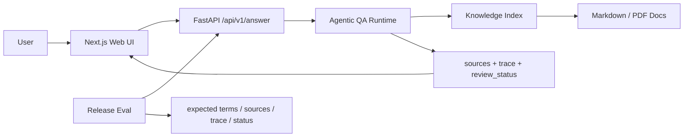
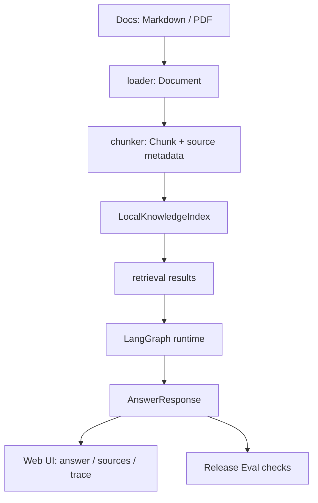
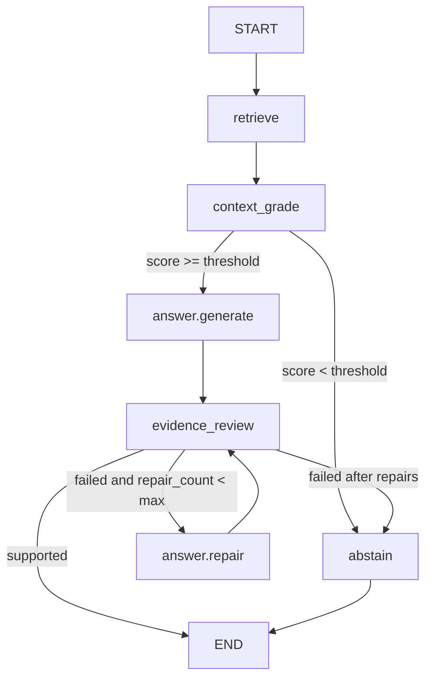
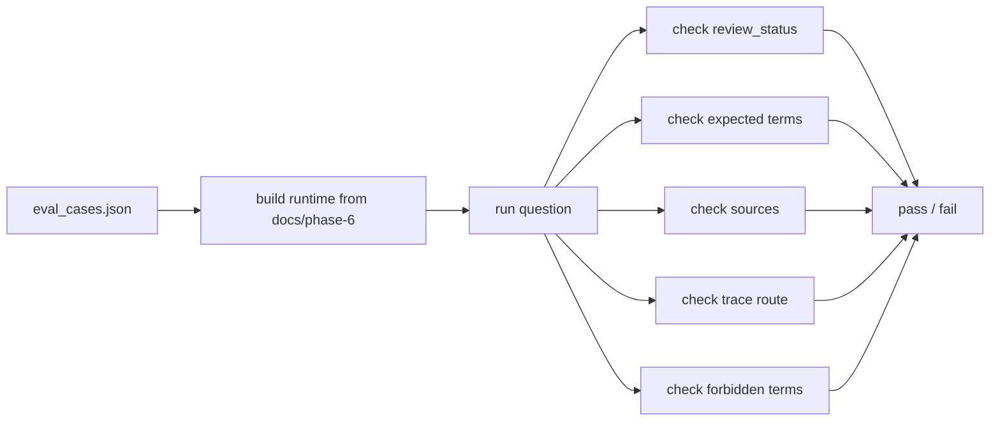

# 从 RAG 到 Agent 系统：一个企业知识库 Agent 的完整实现


**TL;DR：** Phase6 做的不是再写一个问答 demo，而是把前面学过的 RAG、Agent workflow、工具边界、服务化、观测和评估串成一个企业知识库 Agent 学习版系统。它现在已经能完成文档导入、检索、LangGraph 问答路由、sources/trace 展示、拒答、repair 和 release eval。它证明的是“一个 Agent 系统应该如何拆、如何接、如何验收”，还不是一个可直接上线的企业 SaaS。

这篇文章默认你已经知道 RAG、tool calling 和 LangGraph 的基本概念。我们不从概念定义讲起，而是直接看一个学习工程如何从 RAG pipeline 走到一个可交互、可观察、可验收的 Agent 系统。

## 一、企业知识库 Agent 不能只做一个问答框

很多知识库问答项目看起来是这样的：

```text
用户提问
  ↓
检索几段文档
  ↓
LLM 生成答案
  ↓
页面展示一段自然语言
```

这个流程能演示能力，但不太像一个工程系统。

企业知识库问答真正危险的地方不在于“答不出来”，而在于下面三件事：

```text
资料里有答案，但检索不到。
检索到了资料，但回答多编了一句。
回答看起来很顺，但没人知道依据在哪里。
```

所以 Phase6 的目标不是做一个漂亮 chat UI，而是回答一组更工程化的问题：

| 问题 | 系统必须给出的能力 |
| --- | --- |
| 答案来自哪里？ | `sources` |
| 这次执行走了哪条路径？ | `trace` |
| 证据不够时怎么办？ | `abstain` |
| 回答出现无来源结论怎么办？ | `repair` |
| 改完代码有没有退化？ | `release eval` |
| 前端、后端、runtime 怎么稳定协作？ | API contract |

这个判断来自前面几个阶段的铺垫：

```text
Phase2：RAG 需要 benchmark，不是只看 demo 回答。
Phase3：Agentic RAG 的价值在于可控路由、repair、abstain 和 trace。
Phase4：真实 Agent 需要工具、记忆、多角色复核和边界。
Phase5：生产化不是部署一下，而是服务、容器、观测、评估一起闭环。
```

Phase6 做的是把这些能力收束成一个最小但完整的 Capstone。

## 二、Phase6 的整体架构：从请求到证据、trace 和验收

Phase6 的目录按系统切片拆成五块：

```text
phase-6-capstone/
├── 01-backend-skeleton/       # FastAPI + schema + health + observability
├── 02-knowledge-ingestion/    # loader / chunk / index / retrieval
├── 03-agentic-qa-runtime/     # LangGraph retrieve / grade / answer / repair / abstain
├── 04-web-ui/                 # Next.js chat + sources + trace
└── 05-release-eval/           # integrated API + golden set eval + compose
```

这不是随便分目录。每一块都对应一个系统边界：



真正的主线是数据如何从“文档”变成“可验证回答”：



这套架构里最重要的不是哪个框架，而是几个稳定接口：

| 接口 | 作用 |
| --- | --- |
| `AnswerResponse` | 后端、前端、runtime 对齐的响应合同 |
| `LocalKnowledgeIndex.search()` | Agent runtime 使用的检索入口 |
| `QAWorkflowState` | LangGraph 节点之间传递的状态合同 |
| `EvalCase` | release eval 判断是否退化的验收合同 |

只要这些合同稳定，后面从本地 index 换成 Milvus，从确定性 answer builder 换成 LLM，从轻量 eval 换成真实 judge，都不会把系统推倒重来。

## 三、服务边界：为什么先立 FastAPI contract

Phase6 第一块是 `01-backend-skeleton`。

这一步没有急着接 RAG，而是先定义 API 合同。原因很朴素：前端、Agent runtime、观测、评估最后都要围绕同一个 `/api/v1/answer` 协作。如果合同不稳，后面每接一个模块都要改一轮前端和测试。

核心模型在 `phase-6-capstone/01-backend-skeleton/app/schemas.py`：

```python
class SourceItem(BaseModel):
    source_id: str
    title: str
    path: str
    score: float | None = None
    snippet: str | None = None


class TraceStep(BaseModel):
    step: str
    detail: str
    latency_ms: float | None = None


class AnswerResponse(BaseModel):
    question: str
    session_id: str
    answer: str
    mode: str
    sources: list[SourceItem]
    trace: list[TraceStep]
    review_status: str | None
```

这个结构提前把后续 Agent 系统需要的东西都放进来了：

| 字段 | 为什么不能后补 |
| --- | --- |
| `sources` | 用户要知道答案依据，eval 也要检查来源 |
| `trace` | 开发者要知道 retrieve、grade、repair、abstain 走没走 |
| `review_status` | 前端要展示 evidence supported / abstained / client error |
| `mode` | 区分 placeholder、agentic_rag、client_error 等状态 |

这里有一个小但真实的工程细节：Web UI 在 `3020`，API 在 `8010`，浏览器会触发 CORS。Phase6 在 `app/config.py` 中显式放了本地 origin allowlist，并在 `app/main.py` 接入 `CORSMiddleware`。这不是什么宏大的架构设计，但它决定了系统能不能在真实浏览器里联调。

这一块证明的是：服务边界先于智能能力。

如果 API 合同不清楚，后面的 Agent 再聪明，也很难稳定接入 UI、eval 和观测。

## 四、知识库边界：loader、chunk、index、retrieval 如何拆

Phase6 第二块是 `02-knowledge-ingestion`。

它没有一上来接 Chroma、Milvus、embedding API 和 rerank，而是先做了一个确定性的本地知识索引。这不是因为生产系统不需要向量库，而是因为 Capstone 第一版要先证明数据边界：

```text
文档能不能读？
来源信息有没有保住？
chunk 是否还能追溯到原文？
runtime 能不能用统一接口检索？
```

模块拆成四层：

```text
loader   -> Document
chunker  -> Chunk
index    -> RetrievalResult
CLI      -> ingest / search 可重复动作
```

代码落点是 `phase-6-capstone/02-knowledge-ingestion/knowledge/index.py`。

当前检索不是最终生产方案，但刻意保留了 Phase2 学到的经验：不要只依赖一种检索信号。

```python
lexical_score = _lexical_score(query_tokens, chunk_tokens)
vector_score = _cosine_similarity(query_vector, chunk_vector)
score = 0.65 * lexical_score + 0.35 * vector_score
```

这里的 vector 不是外部 embedding，而是稳定 hash term-frequency vector。它证明不了“生产检索质量已经足够”，但证明了三个更基础的东西：

```text
检索接口稳定。
返回结果带 score、lexical_score、vector_score。
chunk 保留 document_id、path、title、ordinal。
```

中文检索也做了一个轻量处理。连续中文 token 会被扩成单字和 bigram：

```text
企业知识库
→ 企 / 业 / 知 / 识 / 库 / 企业 / 业知 / 知识 / 识库
```

这不是中文分词的最终答案，但比把整句当成一个 token 更稳。学习工程最怕的是把临时方案包装成最终方案，所以文章里也要说清楚：这一层证明的是知识入库和检索合同，不是证明检索质量已经达到 Phase2 benchmark 的最优水平。

这一步的边界很清楚：

| 做了 | 没做 |
| --- | --- |
| Markdown/PDF loading | 企业权限和增量同步 |
| chunk + source metadata | 复杂文档结构解析 |
| 本地 hybrid-style search | Milvus / Chroma 生产检索 |
| index save/load | 大规模索引治理 |

## 五、Agent workflow：LangGraph 如何处理 retrieve、grade、answer、repair、abstain

Phase6 第三块是 `03-agentic-qa-runtime`。

这里开始进入 Agent，但仍然没有直接接 LLM。原因不是 LLM 不重要，而是当前阶段最先要证明的是 workflow 边界：

```text
检索结果如何进入图？
证据不够怎么拒答？
回答如何带来源？
无来源结论如何被 repair？
trace 如何返回给前端和 eval？
```

核心代码在 `phase-6-capstone/03-agentic-qa-runtime/agentic_qa/workflow.py`。



LangGraph 在这里的价值不是“看起来高级”，而是把每个关键判断变成显式节点和条件边：

```python
graph.add_conditional_edges(
    "context_grade",
    lambda state: route_after_context_grade(state, resources),
    {"answer": "answer_generate", "abstain": "abstain"},
)

graph.add_conditional_edges(
    "evidence_review",
    lambda state: route_after_review(state, resources),
    {"end": END, "repair": "repair", "abstain": "abstain"},
)
```

这一版 answer builder 是确定性的，只从检索证据里抽句子，并且每条答案都带来源：

```text
1. trace 展示：开发者要能调试路径（来源：企业知识库 Agent：Phase6 总体设计）
```

这不是为了假装 deterministic answer 比 LLM 好，而是为了先证明两个约束：

```text
回答必须来自证据。
回答必须能被 review。
```

`evidence_review` 会检查答案每一条 numbered line 是否带有已检索 source title。测试里会故意注入一句无来源结论：

```text
公司报销制度要求发票抬头固定为测试公司。
```

然后 workflow 会走：

```text
answer.generate
→ review.failed
→ answer.repair
→ review.evidence_supported
```

这就是 Agentic RAG 和线性 RAG 的差异：不是多调一次模型，而是把失败路径设计出来，并且让它可测试、可观察、可验收。

## 六、前端不是展示答案，而是展示可信度

Phase6 第四块是 `04-web-ui`。

这个前端没有做 landing page，也没有堆介绍文案。它打开就是一个 Agent console：

```text
Question input
Answer
Review status
Sources
Trace
```

代码落点是 `phase-6-capstone/04-web-ui/app/page.tsx`。

前端状态直接对齐后端合同：

```ts
type AnswerResponse = {
  question: string;
  session_id: string;
  answer: string;
  mode: string;
  review_status: string | null;
  sources: SourceItem[];
  trace: TraceStep[];
};
```

UI 的重点不是把回答排版得更像聊天软件，而是让用户和开发者能判断这次回答是否可信：

`04-web-ui` 的 Sources、Trace 和 review_status 展示的是 answer、sources、trace 与 review_status 这组后端合同字段，用来把答案内容、引用依据、执行路径和审查状态同时暴露出来。

| 面板 | 展示什么 | 解决什么问题 |
| --- | --- | --- |
| Answer | 最终回答 | 用户读答案 |
| Sources | title、score、snippet、path | 用户核查依据 |
| Trace | step、detail、latency_ms | 开发者调试路径 |
| Status | evidence_supported / abstained / client_error | 快速判断回答状态 |

这里还有一个很容易被忽略的产品语义：demo 和 fallback 必须分开。

页面初始状态可以用 `demo-response.mjs`，方便前端独立开发。但如果用户提交问题时后端不可用，不能把 demo answer 套到当前问题上继续展示。否则用户问“公司报销制度是什么”，页面却显示一段关于 trace 的 demo answer，看起来像系统回答了，其实没有经过检索、没有经过 workflow，也没有 sources 来源。

所以当前 catch 分支会构造一个显式的客户端错误响应：

```text
mode: client_error
review_status: client_error
sources: []
trace: client.submit -> client.api_error
```

这个细节看似小，但它体现了企业知识库 Agent 的底线：不知道就是不知道，没跑就是没跑，不要把占位内容包装成答案。

## 七、Release Eval：让系统从“能跑”变成“可验收”

Phase6 第五块是 `05-release-eval`。

Agent 系统很容易陷入一种错觉：

```text
我试了一个问题，回答看起来还行，所以系统完成了。
```

这对学习 demo 可以，对系统不够。

Release eval 做的是把验收样本固定下来。每次改动后，至少要知道这些能力有没有退化：



验收样本在 `phase-6-capstone/05-release-eval/eval_cases.json`，当前有 5 个：

| case | 验证目标 | 期望状态 |
| --- | --- | --- |
| `trace-value` | 正常回答，验证 trace 价值和来源 | `evidence_supported` |
| `web-ui-observability` | 正常回答，验证 UI 可观测字段 | `evidence_supported` |
| `unrelated-policy-abstain` | 领域外问题，必须拒答 | `abstained` |
| `weak-retrieval-abstain` | 弱检索问题，必须拒答 | `abstained` |
| `repair-removes-unsupported-claim` | 注入无来源结论，必须 repair 并移除禁止词 | `evidence_supported` |

Evaluator 不只是检查答案里有没有几个词。`phase-6-capstone/05-release-eval/release_eval/evaluator.py` 会检查：

```text
review_status 是否符合预期
answer 是否包含 expected_terms
answer 是否不包含 forbidden_terms
sources 是否包含 expected_source_title
trace 是否按顺序包含 expected_trace_steps
```

在写这篇文章前，我重新跑了一轮 Phase6 验收。结果如下：

| 验收项 | 结果 |
| --- | --- |
| Backend skeleton tests | 6 passed |
| Knowledge ingestion tests | 5 passed |
| Agentic QA runtime tests | 7 passed |
| Release eval unit tests | 2 passed |
| Web UI contract tests | 4 passed |
| Web UI build | passed |
| Release eval golden set | 5/5 passed，pass_rate 1.0 |

对应 release eval 路由结果：

```text
trace-value: request.received -> retrieve -> context_grade -> answer.generate -> review.evidence_supported
web-ui-observability: request.received -> retrieve -> context_grade -> answer.generate -> review.evidence_supported
unrelated-policy-abstain: request.received -> retrieve -> context_grade -> abstain
weak-retrieval-abstain: request.received -> retrieve -> context_grade -> abstain
repair-removes-unsupported-claim: request.received -> retrieve -> context_grade -> answer.generate -> review.failed -> answer.repair -> review.evidence_supported
```

这组数字不代表系统已经生产可用，但它证明了一件事：Phase6 不是只能跑通一个 happy path，它已经把正常回答、拒答和修复路径都放进了验收闭环。

## 八、这套系统证明了什么，还没有证明什么

Phase6 到这里，学习版 Capstone 已经完整。

它证明了：

```text
可以从文档构建可检索知识库。
可以用稳定 API contract 连接后端、runtime 和前端。
可以用 LangGraph 显式表达 retrieve、grade、answer、repair、abstain。
可以把 sources、trace、review_status 暴露给用户和开发者。
可以用 release eval 防止核心路径退化。
可以用 Docker Compose 描述本地 backend + web 演示环境。
```

但它没有证明：

```text
真实企业权限模型已经可靠。
多租户隔离已经完成。
大规模向量库和增量索引已经稳定。
LLM faithfulness judge 已经准确。
生产镜像、CI/CD、线上监控已经完备。
用户登录、审计、成本治理已经接入。
```

所以对 Phase6 的定位要诚实：

```text
它是一个完整的 AI Agent 学习作品集 Capstone。
它不是一个可以直接上线卖给企业的 SaaS。
```

这反而是这个阶段最重要的收获。

很多 Agent 学习项目停在“会调框架、会跑 demo”。Phase6 想证明的是另一件事：一个 Agent 系统不是由某个框架单独构成的，而是由合同、数据、workflow、界面、观测和评估一起构成的。

当你能解释清楚这些边界，能跑通这些验收，才算真的从“我会做 RAG demo”走到了“我能设计一个 Agent 系统”。

## 九、验收命令

下面是本文引用数据对应的本地验收命令：

```bash
PYTHONDONTWRITEBYTECODE=1 phase-6-capstone/.venv/bin/python -m unittest discover -s phase-6-capstone/01-backend-skeleton/tests
PYTHONDONTWRITEBYTECODE=1 phase-6-capstone/.venv/bin/python -m unittest discover -s phase-6-capstone/02-knowledge-ingestion/tests
PYTHONDONTWRITEBYTECODE=1 phase-6-capstone/.venv/bin/python -m unittest discover -s phase-6-capstone/03-agentic-qa-runtime/tests
PYTHONDONTWRITEBYTECODE=1 phase-6-capstone/.venv/bin/python -m unittest discover -s phase-6-capstone/05-release-eval/tests
```

```bash
PATH=/opt/homebrew/bin:$PATH npm test --prefix phase-6-capstone/04-web-ui
PATH=/opt/homebrew/bin:$PATH npm run build --prefix phase-6-capstone/04-web-ui
```

```bash
PYTHONDONTWRITEBYTECODE=1 phase-6-capstone/.venv/bin/python \
  phase-6-capstone/05-release-eval/run_eval.py \
  --source docs/phase-6 \
  --cases phase-6-capstone/05-release-eval/eval_cases.json
```

如果后续继续往生产化走，下一步应该不是再加一个 Agent 框架，而是补齐 CI、真实向量库、真实 LLM judge、权限模型、审计和线上观测。那时系统才会从“学习版完整”继续走向“生产版可靠”。
