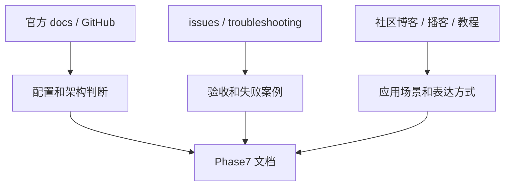
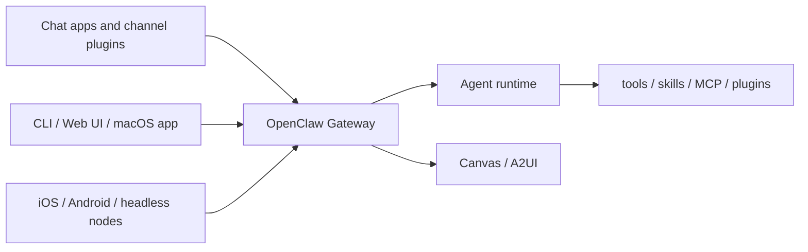
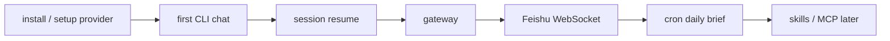
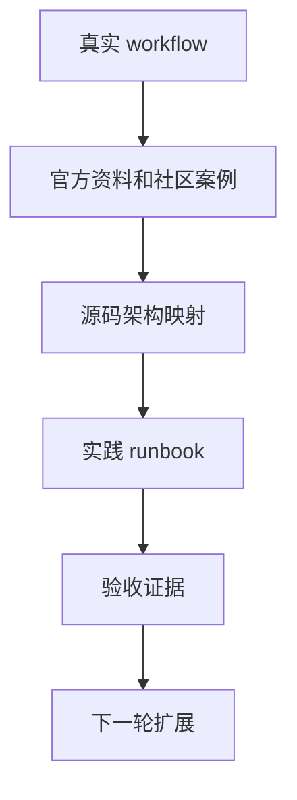

# 先从资料入口读起：OpenClaw 与 Hermes 的官方文档、社区博客和播客笔记

> Phase7 资料档案。前一版最大的问题不是信息错，而是太快进入架构矩阵，读起来像“我知道很多模块名”，但不像一个人真的准备把 OpenClaw 或 Hermes 跑起来。这里先把资料来源、真实使用路径、社区案例和安全边界摆清楚。

## 资料可信度分层

这次重写按三层资料处理：

| 层级 | 来源 | 用途 |
| --- | --- | --- |
| 第一层 | 官方 docs、官方 GitHub README、仓库内 docs | 决定“它们自称是什么”“推荐怎么部署”“安全默认值是什么” |
| 第二层 | 官方 issue、docs 里的 troubleshooting、社区案例页 | 看真实用户在哪些地方踩坑，帮助实践验收更具体 |
| 第三层 | 社区博客、播客、第三方教程 | 提供叙事、场景和经验，但不当作配置或安全事实的唯一依据 |



注意：用户给的 <https://hermesagents.net/blog/> 页脚说明它是 fan-made community site，不隶属 Nous Research 或官方 Hermes Agent 项目。因此它适合提供社区叙事和案例，不适合作为配置真相的唯一来源。

## OpenClaw：官方文档怎么介绍自己

OpenClaw 官方 docs 首页把它放在“self-hosted gateway”这个框架里：用户在自己的机器或服务器上跑一个 Gateway，把 WhatsApp、Telegram、Slack、Feishu、WebChat、移动节点等入口接到可用工具的 AI assistant 上。官方 quick start 也非常产品化：

```text
npm install -g openclaw@latest
openclaw onboard --install-daemon
openclaw dashboard
再连接一个聊天通道
```

这和“再写一个 Agent loop demo”不是一类问题。OpenClaw 第一入口是 Gateway 和多通道，而不是某个 Python 函数。

| 资料 | 链接 | 对本文的影响 |
| --- | --- | --- |
| OpenClaw docs 首页 | <https://docs.openclaw.ai/> | 把 OpenClaw 定位成 self-hosted multi-channel Gateway |
| Gateway architecture | <https://github.com/openclaw/openclaw/blob/main/docs/concepts/architecture.md> | 解释 Gateway、control clients、nodes、Canvas 的关系 |
| Security | <https://docs.openclaw.ai/gateway/security> | 强化“一个 trusted operator boundary 一个 Gateway”的判断 |
| Configuration | <https://docs.openclaw.ai/gateway/configuration> | 补充 strict validation、DM policy、group mention、sandbox 配置 |
| Feishu channel | <https://docs.openclaw.ai/channels/feishu> | 作为 Hermes 飞书实践的 Gateway/通道安全对照 |



OpenClaw 的安全文档比功能列表更值得读。它反复提醒：OpenClaw 是个人助手模型，不是敌对多租户隔离边界。`sessionKey`、per-user session、group allowlist 都不能把同一个 tool-enabled agent 变成真正的多人权限系统。要分离互不信任的人，就要拆 Gateway、拆凭证，最好拆 OS 用户或主机。

这个判断会直接影响第一版实践：即使未来做公司群或团队群，也不能把“群里每个人有 session”误读成“每个人有独立宿主机权限”。

## Hermes：官方文档怎么引导用户开始

Hermes 官方文档的第一印象不是“支持很多工具”，而是“agent that grows with you”：记忆、skills、session search、cron、gateway 和 provider routing 都围绕长期使用组织。

Hermes learning path 给的路线很清楚：

```text
Beginner: install -> quickstart -> CLI usage -> configuration
Intermediate: sessions -> messaging -> tools -> skills -> memory -> cron
Advanced: architecture -> adding tools -> creating skills -> contributing
```

这会改变实践文章的顺序。第一版不能一上来就写飞书 App Secret、systemd 和 cron，而应该先确认：

```text
Hermes 能不能在 VPS 上完成一轮普通 CLI chat？
session 能不能 resume？
gateway 能不能常驻？
飞书 DM 能不能只让 allowlist 用户触发？
cron 能不能在 gateway 常驻时投递？
```

| 资料 | 链接 | 对本文的影响 |
| --- | --- | --- |
| Hermes docs 首页 | <https://hermes-agent.nousresearch.com/docs/> | 确认 Hermes 的核心叙事是学习循环和长期个人 Agent |
| Learning path | <https://hermes-agent.nousresearch.com/docs/getting-started/learning-path> | 决定实践顺序先 CLI，再 messaging，再 memory/cron |
| Feishu/Lark setup | <https://hermes-agent.nousresearch.com/docs/user-guide/messaging/feishu> | 确认 WebSocket、home chat、allowlist、group mention、card approval |
| Scheduled tasks | <https://hermes-agent.nousresearch.com/docs/user-guide/features/cron> | 确认 cron 由 gateway tick，fresh session，支持 `workdir` 和 delivery |
| Sessions | <https://hermes-agent.nousresearch.com/docs/user-guide/sessions> | 解释 session resume、history、search 为什么是实践基线 |
| Security | <https://hermes-agent.nousresearch.com/docs/user-guide/security> | 确认审批、allowlist、容器隔离、凭证过滤是默认安全主题 |
| Architecture | <https://hermes-agent.nousresearch.com/docs/developer-guide/architecture> | 映射 `run_agent.py`、gateway、tools、cron、memory 到代码结构 |
| Agent loop internals | <https://hermes-agent.nousresearch.com/docs/developer-guide/agent-loop> | 解释 provider、tool call、approval、compression、persistence |



Hermes Feishu 文档还给了几个非常具体的落地点：

| 主题 | 取舍 |
| --- | --- |
| WebSocket | 私有服务器不需要公网 webhook，第一版默认 WebSocket |
| DM | DM 默认会响应，所以必须用 `FEISHU_ALLOWED_USERS` 收口 |
| 群聊 | 默认需要 @mention，第一版继续保持 require mention |
| Home chat | `/set-home` 或 `FEISHU_HOME_CHANNEL` 是 cron 投递前置条件 |
| 卡片审批 | 危险命令审批依赖 Feishu card action 事件，必须验收 |
| 文档评论 | 能做，但需要文档级授权，第一版先不做 |

## 社区博客和播客给的真实场景

社区博客的价值在于把能力表翻译成“人会怎么用”。这次主要参考了三类文章：

| 社区资料 | 链接 | 启发 |
| --- | --- | --- |
| Hermes security model | <https://hermesagents.net/blog/hermes-security-model-deep-dive> | 第一版终端执行默认 Docker，不用 local；审批只是纵深防御 |
| Hermes cron daily report | <https://hermesagents.net/blog/hermes-cron-daily-report> | 学习日报要像真实日报一样有输入、日程、投递、日志 |
| Hermes sandbox backends | <https://hermesagents.net/blog/seven-sandbox-backends-choose> | 把 Docker、SSH、Modal、Daytona 看成执行后端选择，而不是抽象“沙箱” |
| Practical AI podcast | <https://podcasts.apple.com/bb/podcast/hermes-agent-agents-that-grow-with-you/id1406537385?i=1000768893042> | 理解 Hermes 的产品叙事：agent 不只是回答，而是随长期使用积累能力 |

这些资料让应用场景从“个人助手、远程运维、知识工作流”变成更具体的问题：

```text
每天早上 09:00 它到底发什么？
它读哪些目录和工具？
谁能在飞书触发它？
危险命令在哪个界面审批？
gateway 重启后 cron 是否还在？
日志在哪里看？
```

## 本轮重写后的研究原则

后续三篇文章按这套顺序写：

1. 先给真实工作流，再解释架构。
2. 官方 docs 决定配置与安全边界，社区文章只补场景和经验。
3. OpenClaw 学 Gateway、通道、节点、控制面、安全模型。
4. Hermes 学长期个人 Agent：CLI、gateway、session、memory、skills、cron、execution backend。
5. 飞书第一版只做 DM、home chat、group mention gate、card approval，不急着接文档评论、会议事件和团队群自动化。
6. 所有实践都必须留下证据：命令输出、gateway status、cron list/status/output、飞书侧观察、失败记录。



这篇资料档案的作用是把文章拉回地面：先知道这两个项目在真实使用中要解决什么，再看源码为什么这样组织。
