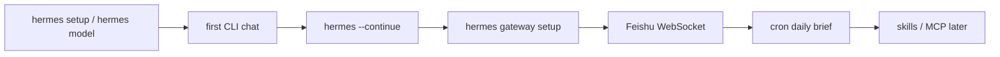
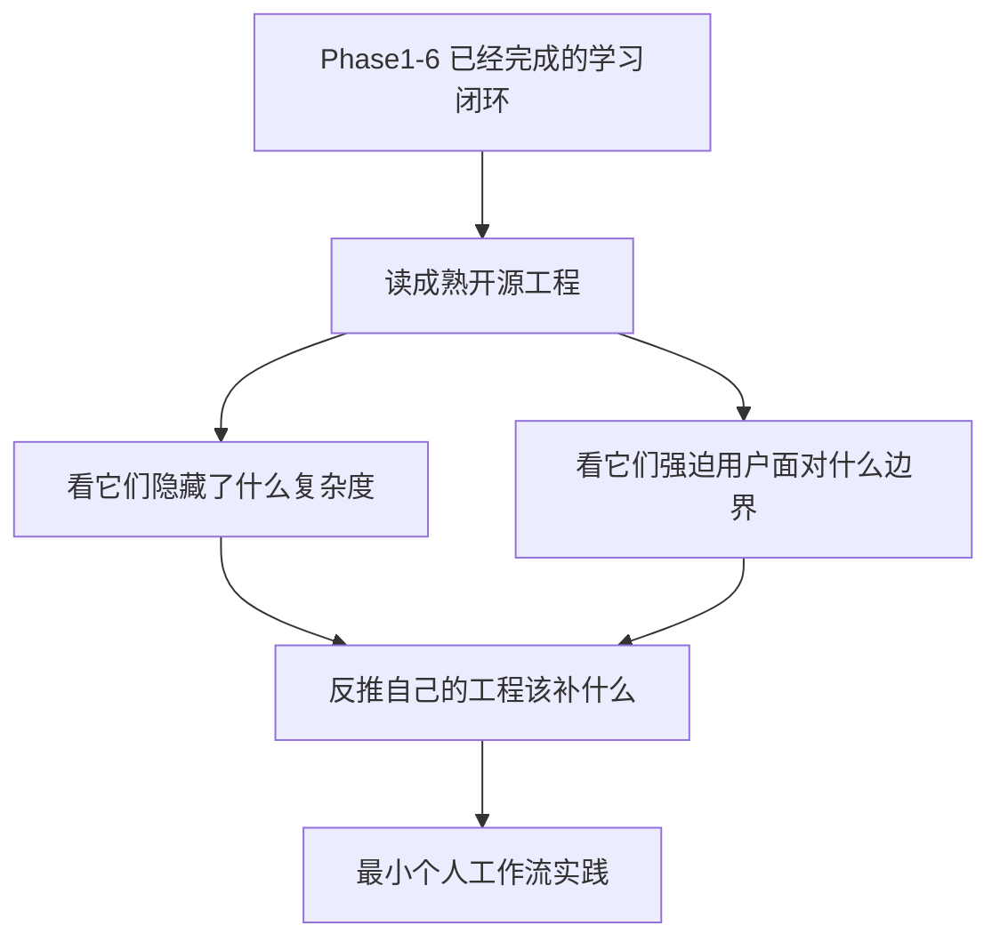
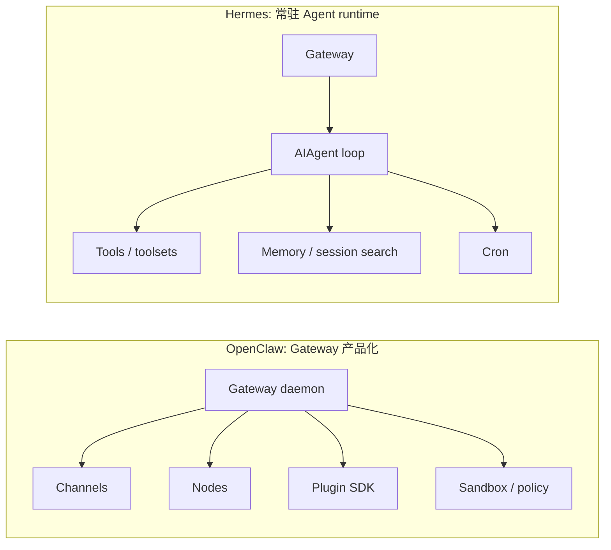
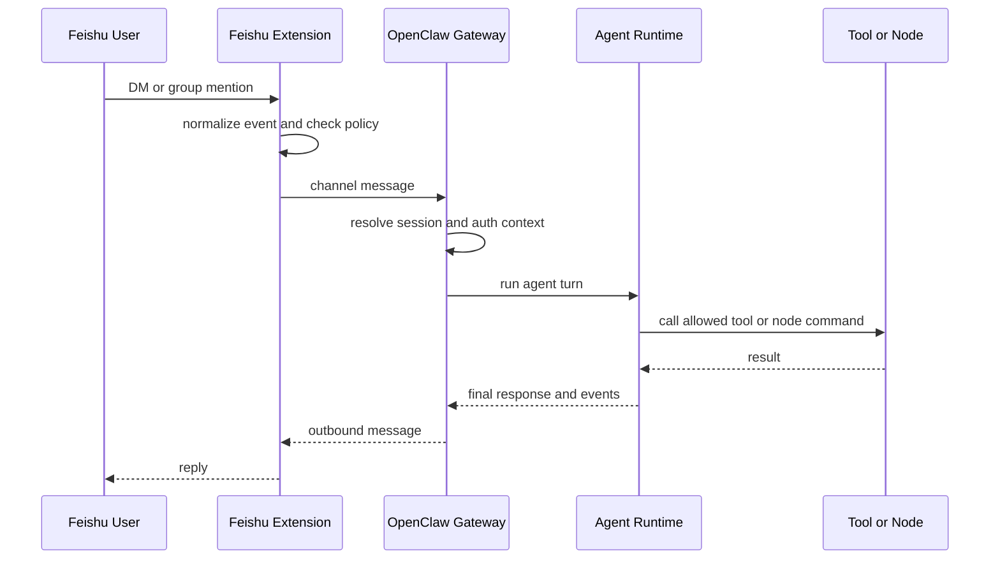
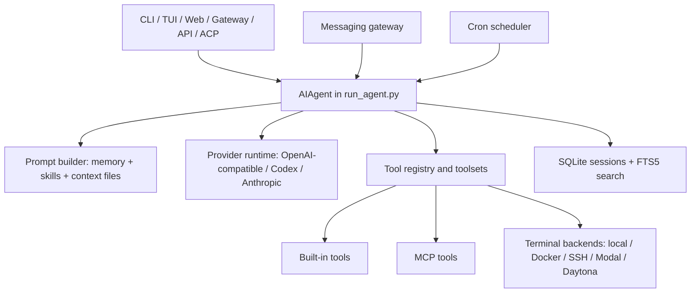
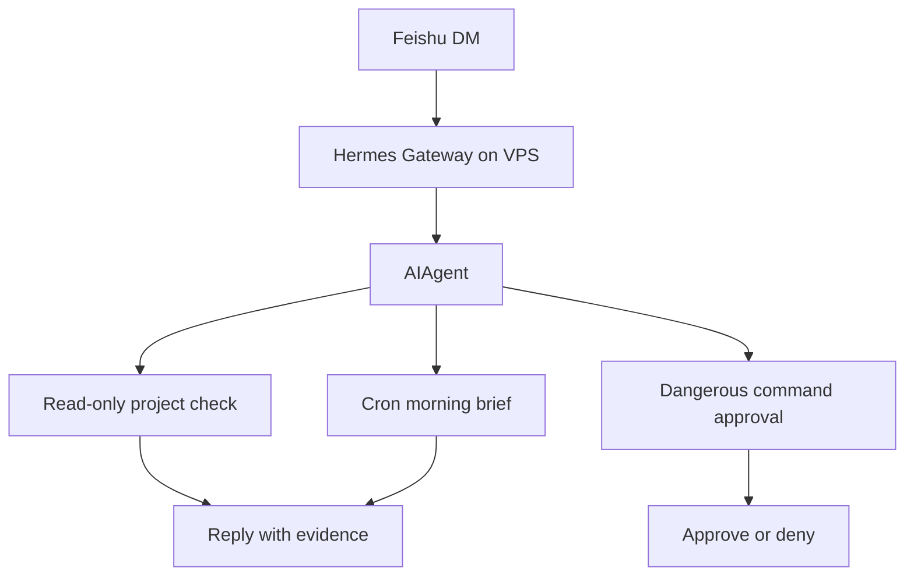

# 成熟开源 Agent 框架怎么读：OpenClaw 与 Hermes Agent 的特点、应用和边界

> Phase7 第一篇。前面六个阶段已经从手写 Agent、RAG、LangGraph、MCP、Memory、多 Agent、FastAPI 和 Capstone 一路做到了可运行系统。现在换一个问题：成熟开源 Agent 工程到底把复杂度放在哪里？
>
> 研究对象：OpenClaw baseline `a21144d8`，Hermes Agent baseline `a4fa148`。

**TL;DR：** OpenClaw 和 Hermes Agent 都不是普通 “Agent demo”。OpenClaw 更像一个 local-first、多渠道、多节点的个人 AI Gateway，把控制面、通道、插件、节点和安全策略做成产品化系统；Hermes Agent 更像一个远端常驻、可成长的个人 Agent runtime，把 CLI/TUI/Web/Gateway、memory、skills、cron、MCP、terminal backend 和供应链约束放到同一套工程里。第一轮实践选择 Hermes，不是因为它的模块表更长，而是因为官方文档本身就把它放在“先本地跑通，再挂到 VPS/gateway/cron/消息平台”的路径上。OpenClaw 则作为 Gateway、通道、安全和节点模型的对照。

## 读者前提和证据范围

这篇文章假设你已经知道 ReAct、tool calling、MCP、RAG、Memory、LangGraph 这些基本概念，也能读懂一个普通 Agent loop。它不重新解释“什么是 Agent”，而是讨论另一个更工程化的问题：

```text
当 Agent 从 demo 变成长期运行的个人系统，复杂度会被放到哪些地方？
```

本文使用三类证据：

| 证据 | 作用 | 例子 |
| --- | --- | --- |
| 官方文档 | 判断产品定位、推荐部署路径和安全边界 | OpenClaw docs、Hermes learning path、Feishu/Cron/Security docs |
| 源码路径 | 验证架构主线是否真的存在 | `packages/agent-core`、`run_agent.py`、`gateway/`、`tools/` |
| 本工程经验 | 判断哪些能力值得纳入 Phase7 实践 | Phase4 MCP/Memory/Security、Phase5 production、Phase6 capstone |

我会避免只比较功能数量。功能表很容易让两个项目看起来都像“支持消息平台、工具、记忆和 cron 的 Agent”。真正有价值的是看它们如何定义边界：谁能触发、在哪里执行、工具怎么暴露、失败后怎么恢复。

## 先看它们怎么被真实使用

返工这一版时，我先补了一份资料档案：`00-openclaw-hermes-source-dossier.md`。资料分三层用：官方 docs/GitHub 决定配置和边界，issues/troubleshooting 帮助识别踩坑，社区博客和播客只补场景叙事。

| 项目 | 官方入口 | 它先让用户做什么 |
| --- | --- | --- |
| OpenClaw | <https://docs.openclaw.ai/> | 安装 npm 包，运行 `openclaw onboard --install-daemon`，打开 dashboard，再接聊天通道 |
| Hermes | <https://hermes-agent.nousresearch.com/docs/getting-started/learning-path> | 先完成 install/quickstart/CLI/configuration，再进入 sessions、messaging、tools、skills、memory、cron |

这两个入口已经说明了它们的产品心智不同：

```text
OpenClaw 先问：Gateway 怎么把各种入口、控制面和节点接起来？
Hermes 先问：一个会记忆、会学技能、会定时运行的 Agent 怎样长期陪你工作？
```

Hermes 官方 learning path 的顺序很朴素，也很重要：

```text
安装 Hermes
选择 provider
跑通一轮普通 CLI chat
确认 session 能继续
再加 gateway、cron、skills、MCP 和 messaging platform
```

这比“它支持多少平台、多少工具、多少 backend”更接地气。一个个人 Agent 先要能在终端里稳定完成一轮任务，再把入口放到飞书，再让定时任务投递到 home chat。



OpenClaw 也应该用同样方式读：不要先背 Gateway、nodes、Canvas、plugin SDK，而是先问它如何让多入口消息、远程节点和本地执行在一个 trusted operator 边界里工作。OpenClaw 官方安全文档把这件事讲得很直：一个 Gateway 是个人助手信任边界，不是互不信任用户共用的多租户安全边界。

## 一、为什么读成熟工程，而不是继续堆 demo

Agent 学习很容易卡在一种假象里：

```text
模型能调工具
  -> 就是 Agent

Agent 能多轮执行
  -> 就能上线

接一个聊天平台
  -> 就是远程助手
```

前六个阶段已经证明这不够。

一个真正能长期运行的 Agent 系统还要处理：

| 问题 | 学习项目里的对应基础 |
| --- | --- |
| 工具从哪里发现、怎么授权、怎么审计 | `phase-4-advanced/01-mcp-server/` |
| 记忆什么时候写入、什么时候检索 | `phase-4-advanced/03-memory-system/` |
| 多 Agent 谁调度、谁复核 | `phase-4-advanced/04-multi-agent-patterns/` |
| 运行链路如何串起来 | `phase-4-advanced/05-agent-runtime-integration/runtime.py` |
| 服务化后怎么验收 | `phase-5-production/` 与 `phase-6-capstone/05-release-eval/` |
| 前端怎么展示 sources、trace、review | `phase-6-capstone/04-web-ui/` |

所以 Phase7 不从“再实现一个框架”开始，而是读两个已经把这些问题产品化的工程。



这张图是这次研究的出发点：不是为了给 OpenClaw 和 Hermes 打分，而是用它们校准自己的系统设计。

## 二、两个项目的第一印象：一个像控制面，一个像远端生命体

OpenClaw 的 README 把自己定位成 personal AI assistant。它的关键词是：

```text
local-first Gateway
multi-channel inbox
nodes
live canvas
plugins
skills
sandboxing
remote gateway
```

Hermes Agent 的 README 则更强调：

```text
self-improving agent
memory
skills
session search
cron
terminal backends
gateway
MCP
remote VPS
```

如果只看功能表，它们会显得很像：都有聊天入口、工具、记忆、自动化、远程运行和安全配置。

但从工程心智上，它们的重心并不一样。

| 维度 | OpenClaw | Hermes Agent |
| --- | --- | --- |
| 核心感觉 | Gateway 控制面和多渠道产品 | 常驻个人 Agent runtime |
| 入口形态 | 多渠道、WebSocket Gateway、节点、Canvas、CLI | CLI/TUI/Web/Gateway/API/ACP |
| 远程重点 | 一个 Gateway host 拥有状态，其他客户端/节点连接它 | Agent 可以跑在 VPS、容器、云沙箱或本地 |
| 工具生态 | OpenClaw-owned tools、MCP、插件 SDK、节点能力 | built-in tools、toolsets、MCP、skills、terminal backends |
| 安全叙事 | 单 trusted operator boundary，必要时拆 Gateway/OS 用户 | allowlist、审批、容器/远端 backend、MCP credential filtering |
| 第一轮实践价值 | 学 Gateway、通道、节点和控制面 | 学远端常驻、飞书 WebSocket、cron、memory、skills |

这不是谁先进谁落后的关系，而是产品边界不同。



这也是后续实践选择 Hermes 的原因：VPS 上常驻 Agent、飞书远程触发、定时日报和记忆工作流，Hermes 的默认路径更短。

## 三、OpenClaw 的特点：把个人助手做成一个 Gateway 系统

OpenClaw 最值得学的不是“支持很多聊天平台”，而是它如何组织这些平台。

它的架构文档 `docs/concepts/architecture.md` 明确说：一个长期运行的 Gateway 拥有 messaging surfaces，CLI、macOS app、Web UI、automations 和 nodes 都通过 WebSocket 连接到这个 Gateway。

这意味着它把系统拆成两类角色：

| 角色 | 负责什么 | 典型路径 |
| --- | --- | --- |
| Gateway | 控制面、通道连接、会话、工具、事件、健康状态 | `docs/concepts/architecture.md` |
| Agent runtime | provider、session、tools、skills、compaction | `docs/agent-runtime-architecture.md` |
| Agent core | loop、messages、compaction、session storage | `packages/agent-core/src/agent-loop.ts` |
| Channel extension | 具体平台协议和策略 | `extensions/feishu/src/channel.ts` |
| Policy/security | pairing、allowlist、sandbox、operator scopes | `docs/gateway/security/index.md` |

OpenClaw 的 Feishu 文档 `docs/channels/feishu.md` 也很有代表性：默认 WebSocket，DM 可以 pairing，群聊默认 allowlist + require mention。它不是简单告诉你“填 App ID 和 Secret”，而是把“谁能触发 Agent”当成核心配置。



这条链路里，OpenClaw 最强调的是 Gateway 边界：

```text
谁能连 Gateway？
谁能 pair 设备？
谁能触发某个 channel？
工具是否在 sandbox 里？
一个 Gateway 是否跨越多个互不信任的人？
```

它的安全模型也很直白：OpenClaw 是个人助手模型，不是敌对多租户边界。要隔离不同信任域，就拆 Gateway、拆 OS 用户、拆主机或容器。

这个判断很重要。因为如果未来把 Agent 放进公司群，不能误以为“每个人有自己的 session”就等于“每个人有自己的权限边界”。

## 四、Hermes 的特点：把 Agent 做成可长期运行的个人工作系统

Hermes 的架构文档 `website/docs/developer-guide/architecture.md` 更像一张内部地图。

它明确列出几条主线：

| 主线 | 关键文件或文档 | 说明 |
| --- | --- | --- |
| Agent loop | `run_agent.py`、`website/docs/developer-guide/agent-loop.md` | prompt、provider、tool call、fallback、compression、persistence |
| Tool registry | `model_tools.py`、`tools/registry.py` | 内置工具、toolsets、MCP 和插件工具统一进入模型可见 schema |
| Gateway | `gateway/run.py`、`website/docs/developer-guide/gateway-internals.md` | Telegram、Discord、Slack、Feishu 等消息入口 |
| Memory | `agent/memory_manager.py`、`website/docs/user-guide/features/memory.md` | `MEMORY.md`、`USER.md`、session search |
| Cron | `cron/`、`website/docs/user-guide/features/cron.md` | 一次性/周期性 Agent job，结果投递到平台 |
| MCP | `tools/mcp_tool.py`、`website/docs/user-guide/features/mcp.md` | stdio/HTTP/OAuth MCP 接入，支持工具筛选 |
| Security | `website/docs/user-guide/security.md` | 审批、allowlist、容器隔离、MCP credential filtering |

Hermes 的特别之处在于，它不是把这些能力当成插件列表，而是围绕一个可长期运行的个人 Agent 组织起来。



这对个人工作流很有启发：如果 Agent 要成为“远端助手”，它不能只回答飞书消息，还要能：

```text
记住偏好
定时运行
查历史会话
接工具生态
用容器执行命令
在危险操作前审批
失败后能诊断和恢复
```

Hermes 正好把这些能力放在默认学习路径上。

## 五、应用场景：从真实任务往回看架构

这次实践目标是个人工作流，不是生产级公司 Agent。

第一版不再只写“个人助手、远程运维、知识工作流”这些大词，而是把官方文档和社区案例里反复出现的任务翻译成可验收场景：

| 真实任务 | OpenClaw 更适合学什么 | Hermes 更适合学什么 | 第一版是否实践 |
| --- | --- | --- | --- |
| 早上 09:00 给我学习日报 | delivery、channel、notification policy | cron job、fresh session、Feishu home chat | 第一版实践 |
| 飞书 DM 问“这个项目现在到哪一步” | channel policy、session、Gateway routing | gateway message -> agent turn -> file/read-only tools | 第一版实践 |
| 危险命令必须问我 | sandbox、operator boundary | `approvals.mode=manual`、gateway approval card | 第一版实践 |
| 在 VPS 上跑长期助手 | remote gateway、node pairing | VPS gateway、Docker/SSH terminal backend | 最小实践 |
| 每天读 HN/RSS/邮件并摘要 | 多入口消息和 Canvas 展示 | cron + web/search/tool skills + delivery | 后续扩展 |
| 团队群里查仓库和文档 | allowlist、mention gate、单 trusted boundary 警告 | Feishu group policy、per-user session、MCP | 只做安全设计 |
| 飞书文档评论 @bot 回复 | channel extension、文档权限模型 | Feishu doc comments、document-level allowlist | 后续单独做 |
| 研究数据生成和轨迹导出 | QA/lab、runtime traces | trajectory、batch runner、tool traces | 只做调研 |

第一版只做三个验收闭环：

```text
飞书 DM 触发只读项目检查
每日 09:00 生成学习日报并投递飞书
危险命令走审批或拒绝
```

这比“让 Agent 远程控制我的服务器”更窄，也更适合学习。



这个边界也延续了 Phase4/Phase5 的原则：先证明链路，再扩大权限。

## 六、第一轮选型结论

这次不是在 OpenClaw 和 Hermes 之间二选一。

更准确的结论是：

```text
OpenClaw 适合学 Agent 产品控制面。
Hermes 适合学远端常驻个人 Agent。
```

对当前学习工程来说，第一轮优先 Hermes，原因有三点：

1. 目标是 VPS 常驻 + 飞书 WebSocket + 个人工作流，Hermes 文档和代码路径更直接。
2. Hermes 的 memory、skills、cron、MCP、terminal backend 正好接上 Phase4/5/6 已经学过的模块。
3. OpenClaw 的 Gateway、安全、sandbox、Feishu policy 和 remote access 仍然会作为对照，帮助避免把个人 Agent 做成无边界遥控器。

## 七、这篇文章的结论如何落到下一步

把两个项目放在一起读，我得到的不是一个“选型排行榜”，而是一个学习顺序：

```text
先用 Hermes 跑一个最小远端个人工作流。
再用 OpenClaw 校准 Gateway、通道和安全边界。
最后把这些经验反推回 Phase6 capstone 的运维和入口设计。
```

更具体地说，下一步不是把所有平台都接上，也不是马上把 Agent 放进公司群，而是做三件小而硬的事：

| 下一步 | 为什么先做它 | 成功证据 |
| --- | --- | --- |
| Hermes VPS + Feishu DM | 最贴近个人远程工作流 | allowlist 用户能触发 `/status` 和只读项目检查 |
| Hermes cron 学习日报 | 验证长期任务和消息投递 | `hermes cron list/status`、Feishu home chat 收到日报 |
| 危险命令审批 | 验证 Agent 不会变成远程 root | 危险命令需要人工批准或默认拒绝 |

这三件事看起来不花哨，但它们刚好覆盖长期 Agent 最容易被忽略的三个问题：入口、时间和权限。

## 八、局限与反例

这篇文章仍然有几个限制。

第一，它不是完整生产选型报告。我们没有把 OpenClaw 和 Hermes 都部署到同一台机器上做延迟、稳定性、资源占用和失败恢复测试，所以不能说谁更适合生产。

第二，它不是安全审计。文中关于 allowlist、sandbox、approval 的判断来自官方文档和源码阅读，但没有做红队测试，也没有验证所有平台通道的权限模型。

第三，它有明显的个人工作流偏向。Hermes 被选为第一轮实践基座，是因为目标是 VPS 常驻、飞书远程触发、定时日报和最小权限，不代表 OpenClaw 不适合更完整的多端个人助手。

第四，社区博客和播客只用于理解真实场景，不作为配置真相。配置和安全默认值仍以官方文档、仓库源码和实际部署结果为准。

## 九、进一步阅读

| 资料 | 用途 |
| --- | --- |
| `docs/phase-7/00-openclaw-hermes-source-dossier.md` | 本轮资料来源、可信度分层和社区案例 |
| `docs/phase-7/02-openclaw-hermes-architecture-study.md` | 从源码主线看入口、loop、工具和安全边界 |
| `docs/phase-7/03-hermes-feishu-personal-workflow.md` | Hermes + VPS + 飞书最小闭环实践 |
| OpenClaw docs: <https://docs.openclaw.ai/> | OpenClaw 官方产品和部署入口 |
| Hermes docs: <https://hermes-agent.nousresearch.com/docs/> | Hermes 官方学习路径、messaging、cron、security |

下一篇进入源码层：不再看 README，而是沿着入口通道、Agent loop、工具/MCP/skills、安全/沙箱四条主线读两个工程。
