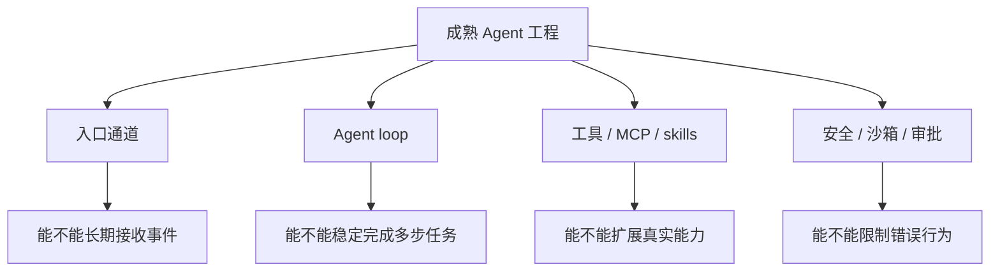
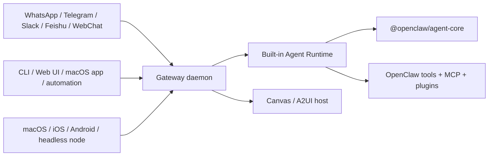
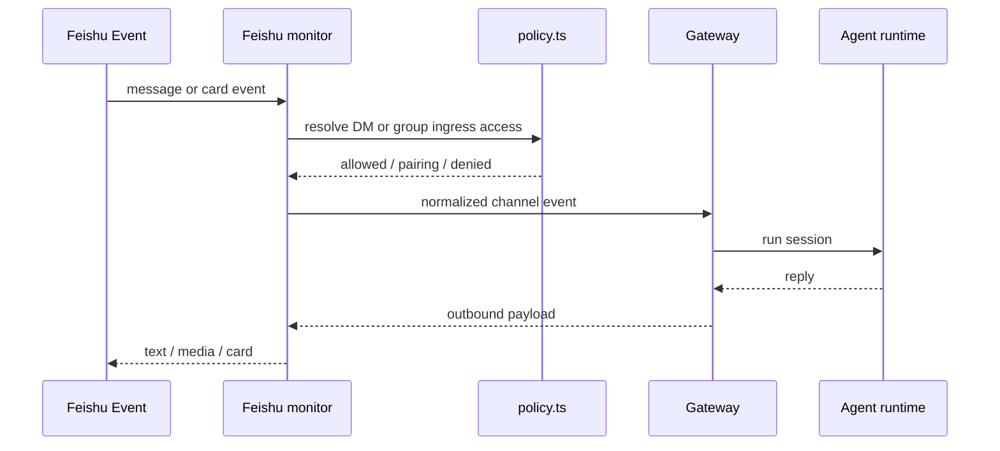
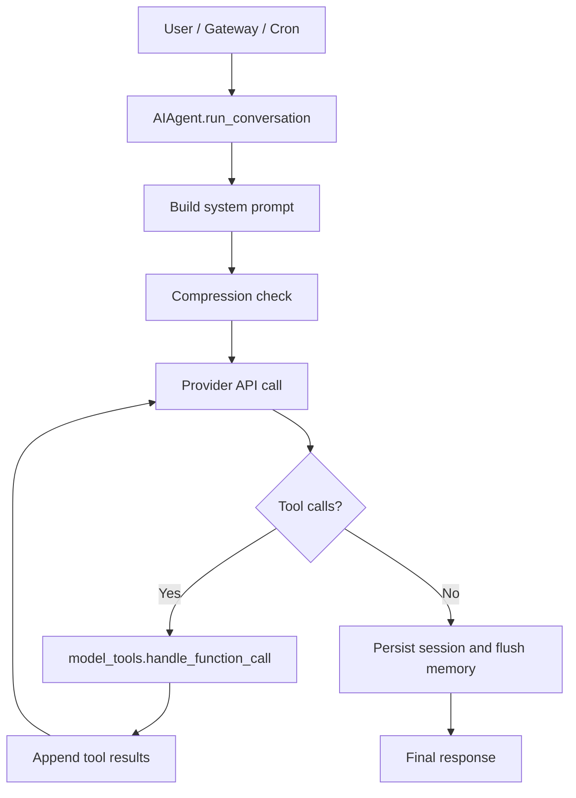
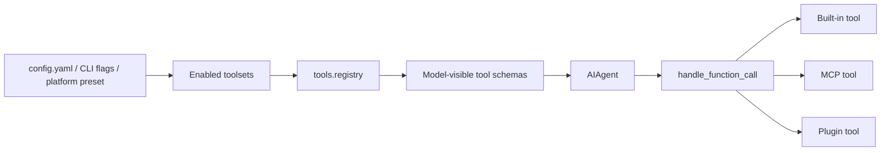
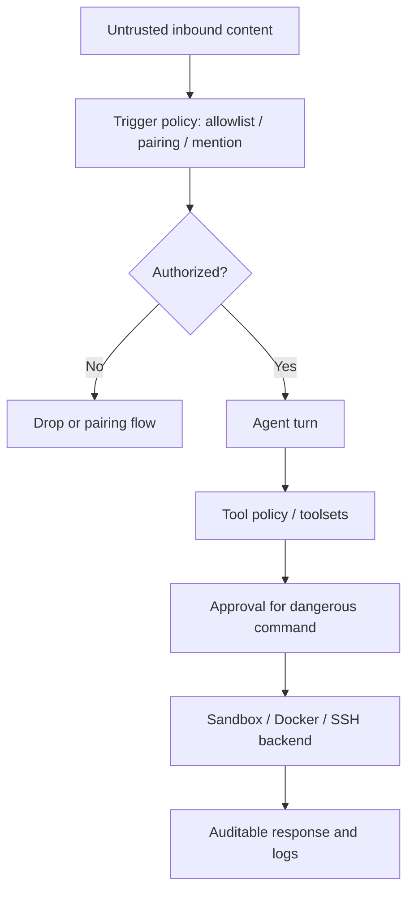

# OpenClaw 与 Hermes Agent 架构研读：入口、循环、工具和边界

> Phase7 第二篇。第一篇判断了两个项目的整体定位：OpenClaw 更像 Gateway 产品控制面，Hermes 更像远端常驻个人 Agent runtime。现在进入源码结构。
>
> 研究 baseline：OpenClaw `a21144d8`，Hermes Agent `a4fa148`。

**TL;DR：** 两个项目都把 Agent 做成了长生命周期系统，但切法不同。OpenClaw 的主轴是 Gateway：通道、节点、插件、agent-core、sandbox 和 operator scopes 都围绕 Gateway 控制面展开；Hermes 的主轴是 `AIAgent`：CLI/Gateway/Cron/API 都进入同一个 Agent loop，再由 prompt builder、provider resolver、tool registry、memory、session store 和 terminal backends 支撑。读这类工程时，最有价值的不是数功能，而是看四条线怎么闭合：入口通道、Agent loop、工具/MCP/skills、安全与沙箱。

如果是第一次读这两个项目，不建议直接从这一篇开始。先看 `00-openclaw-hermes-source-dossier.md`，把 OpenClaw 的 Gateway 路径和 Hermes 的“CLI 跑通 -> gateway 常驻 -> 飞书入口 -> cron 日报”路径建立起来，再回到这里看源码里每个模块为什么存在。

## 读者前提和阅读方法

这篇文章假设你能读 TypeScript 和 Python，也已经理解基本的 Agent loop：模型输出 tool call，runtime 执行工具，再把结果送回模型。我们不从目录树开始，因为成熟项目的目录树会把人带偏：你会看到很多 app、docs、tests、plugins，却不知道哪条线是主干。

我采用一个更可复用的读法：

```text
先找入口。
再找一次请求如何进入 Agent loop。
再找工具如何注册、筛选和执行。
最后找权限、安全、沙箱和恢复策略。
```

这个读法的好处是，它能跨语言和框架使用。OpenClaw 是 TypeScript/Node 生态，Hermes 是 Python 生态，但它们最终都要回答同样的问题：一个来自飞书、CLI、cron 或 Web 的事件，如何安全地变成一次可审计的 Agent 执行？

## 资料和源码入口

这一篇不是按文件树盲扫，而是把官方文档里的系统边界映射回源码路径：

| 主线 | OpenClaw 资料入口 | Hermes 资料入口 |
| --- | --- | --- |
| 入口通道/Gateway | <https://docs.openclaw.ai/>、<https://github.com/openclaw/openclaw/blob/main/docs/concepts/architecture.md> | <https://hermes-agent.nousresearch.com/docs/user-guide/messaging/>、<https://hermes-agent.nousresearch.com/docs/developer-guide/gateway-internals> |
| Feishu/Lark | <https://docs.openclaw.ai/channels/feishu> | <https://hermes-agent.nousresearch.com/docs/user-guide/messaging/feishu> |
| Agent loop | `docs/agent-runtime-architecture.md`、`packages/agent-core/src/agent-loop.ts` | <https://hermes-agent.nousresearch.com/docs/developer-guide/agent-loop>、`run_agent.py` |
| 工具/MCP/skills | OpenClaw tools、plugin SDK、MCP bundle | <https://hermes-agent.nousresearch.com/docs/user-guide/features/skills>、`model_tools.py`、`tools/` |
| Cron/automation | OpenClaw Gateway cron、automation clients | <https://hermes-agent.nousresearch.com/docs/user-guide/features/cron>、`cron/` |
| 安全/沙箱 | <https://docs.openclaw.ai/gateway/security>、<https://docs.openclaw.ai/gateway/configuration> | <https://hermes-agent.nousresearch.com/docs/user-guide/security> |

## 一、研究矩阵：四条主线比文件树更重要

成熟工程的文件树很容易让人迷路。

OpenClaw baseline `a21144d8` 有约 20k 个 git-tracked 文件，其中 `src/`、`extensions/`、`apps/`、`docs/`、`packages/` 都很大。Hermes baseline `a4fa148` 有约 5.5k 个文件，但 `tests/` 占比很高，说明它把大量边界做成了回归测试。

所以这次不按目录顺序读，而按四条主线读：

| 主线 | 要回答的问题 | OpenClaw 重点 | Hermes 重点 |
| --- | --- | --- | --- |
| 入口通道 | 用户和外部事件怎么进入 Agent | Gateway WS、channel extensions、nodes | CLI/TUI/Web/Gateway/API/ACP |
| Agent loop | 一次任务如何多轮调用模型和工具 | `packages/agent-core` + embedded runner | `run_agent.py` |
| 工具/MCP/skills | 能力如何被发现、筛选、执行 | OpenClaw tools、MCP bundle、plugin SDK | `model_tools.py`、toolsets、MCP、skills |
| 安全与沙箱 | 谁能触发、能触碰什么、危险操作怎么控 | dmPolicy、operator scopes、sandbox | allowlist、approval、Docker/SSH/Modal backend |



这四条线也是后续个人工作流实践的验收框架。

## 二、OpenClaw：Gateway 是系统的中枢

OpenClaw 的 `docs/concepts/architecture.md` 把 Gateway 讲得很清楚：

```text
一个长期运行的 Gateway 拥有所有 messaging surfaces。
CLI、Web UI、macOS app、automations 作为 control-plane clients 连接 Gateway。
macOS/iOS/Android/headless nodes 也连接同一个 Gateway，但声明 role=node。
```

这意味着 OpenClaw 的“入口”不是某个 chat handler，而是 Gateway WebSocket 协议。



OpenClaw 的 runtime 文档 `docs/agent-runtime-architecture.md` 又把 Agent 相关代码分成几层：

| 层 | 路径 | 责任 |
| --- | --- | --- |
| embedded runner | `src/agents/embedded-agent-runner.ts` 与子模块 | built-in agent attempt loop、compaction、队列、sandbox metadata |
| session/runtime facade | `src/agents/sessions/`、`src/agents/runtime/` | session persistence、extension loading、OpenClaw facade |
| reusable core | `packages/agent-core/` | agent loop、messages、compaction、harness、session storage |
| LLM provider | `src/llm/` | model/provider registry 和 stream implementation |
| tools | `src/agents/agent-tools*.ts` | OpenClaw-owned tool definitions、schema、policy、hooks |

`packages/agent-core/src/agent-loop.ts` 的价值在于它把 Agent loop 做成事件流：`agent_start`、`turn_start`、`message_start`、`message_end`、tool result 等事件可以被上层 runtime、UI 和 gateway 消费。

这和当前学习工程 Phase3/6 的 LangGraph 思路不同。LangGraph 强调节点和状态；OpenClaw 的 agent-core 更强调 event stream、runtime facade 和产品集成。

## 三、OpenClaw 的 Feishu：通道不是简单 adapter，而是策略边界

OpenClaw 的 Feishu 插件在 `extensions/feishu/`，里面不只有发送消息和收消息。

关键文件包括：

| 文件 | 作用 |
| --- | --- |
| `extensions/feishu/src/channel.ts` | Channel plugin 入口，定义 outbound、directory、status、setup、security warning |
| `extensions/feishu/src/policy.ts` | DM/group ingress policy，规范 open_id、chat_id、allowlist、mention facts |
| `extensions/feishu/src/monitor.ts` | WebSocket/webhook monitor runtime |
| `extensions/feishu/src/card-interaction.ts` | 交互卡片动作 |
| `extensions/feishu/src/security-audit.ts` | Feishu 配置安全检查 |

`policy.ts` 里最值得注意的是，它把“谁能触发 Agent”抽象成 ingress resolver，而不是在 handler 里随便写几个 if。



这和 Phase4 MCP 文中强调的边界一致：工具和入口不是“能调就行”，而是要可描述、可测试、可治理。

## 四、Hermes：AIAgent 是系统的主轴

Hermes 的架构文档 `website/docs/developer-guide/architecture.md` 给了一张清晰地图：CLI、Gateway、ACP、Batch Runner、API Server、Python Library 最后都会进入 `AIAgent`。

它的核心代码仍然是一个很大的 `run_agent.py`，但周边已经拆出很多支撑模块。

| 层 | 路径 | 责任 |
| --- | --- | --- |
| core loop | `run_agent.py` | prompt、provider、tool execution、fallback、compression、persistence |
| prompt/context | `agent/prompt_builder.py`、`agent/context_compressor.py` | system prompt、skills、memory、上下文压缩 |
| tools | `model_tools.py`、`tools/registry.py` | 工具发现、schema、dispatch、toolsets |
| gateway | `gateway/run.py`、`gateway/session.py` | 平台消息、授权、session key、delivery |
| memory | `agent/memory_manager.py`、`agent/memory_provider.py` | built-in memory 与 provider 插件 |
| cron | `cron/jobs.py`、`cron/scheduler.py` | 定时 Agent job |

Hermes 的 Agent loop 文档 `website/docs/developer-guide/agent-loop.md` 把一次 turn 拆成：

```text
append user message
build system prompt
preflight compression
build API messages
call provider
parse tool calls
execute tools
append tool results
loop or return final response
persist session and memory
```



这里和 OpenClaw 最大的差别是：OpenClaw 把 agent-core 做成 reusable package 和 event stream，Hermes 则保留了一个巨大但直接的 `AIAgent` 主循环，再通过周边模块逐步抽离复杂度。

这两种演进路径都很真实。

## 五、Hermes 的工具系统：toolsets 是产品层边界

Hermes 的 `model_tools.py` 不是具体工具实现，而是工具注册表之上的薄编排层。它做几件事：

```text
import built-in tools
discover plugin tools
compute tool schemas
resolve enabled/disabled toolsets
dispatch function calls
bridge async tool handlers
```

工具实现分散在 `tools/`，按类别自注册到 registry。对用户来说，暴露的是 toolset：

| toolset 类型 | 例子 | 含义 |
| --- | --- | --- |
| Web | `web_search`、`web_extract` | 搜索和网页抽取 |
| Terminal/File | `terminal`、`read_file`、`patch` | 命令和文件 |
| Memory/Recall | `memory`、`session_search` | 长期记忆和历史会话 |
| Automation | `cronjob`、`send_message` | 定时任务和平台投递 |
| MCP | `mcp-<server>` | 外部 MCP server 动态工具 |
| Orchestration | `todo`、`delegate_task`、`execute_code` | 规划、子任务和程序化工具调用 |



这给当前项目一个很重要的启发：工具不应该只按“函数”管理，还应该按“使用场景和风险档位”管理。

例如第一版飞书个人工作流不应该暴露所有工具，而应该暴露：

```text
web / file read / session_search / memory / cronjob / messaging
```

终端工具即使开启，也应该走 Docker backend，并保留危险命令审批。

## 六、安全模型：两个项目都不承诺敌对多租户

OpenClaw 的 `docs/gateway/security/index.md` 直接写明：它假设一个 trusted operator boundary，不是多个敌对用户共享一个 Gateway 的安全边界。

Hermes 的 `website/docs/user-guide/security.md` 则从七层防御讲起：

```text
user authorization
dangerous command approval
container isolation
MCP credential filtering
context file scanning
cross-session isolation
input sanitization
```

两者的语言不同，但结论接近：

| 问题 | OpenClaw 的回答 | Hermes 的回答 |
| --- | --- | --- |
| 多个陌生人能不能共用一个 tool-enabled agent | 不建议，拆 Gateway/OS 用户/主机 | 用 allowlist/DM pairing，但不要给广泛工具权限 |
| 危险命令如何处理 | exec approvals、tool policy、sandbox | approvals.mode、hardline blocklist、容器 backend |
| 群聊是否默认开放 | Feishu 默认 group allowlist + require mention | Feishu group policy + require mention |
| 远程访问如何暴露 | loopback + SSH/Tailscale 优先，非 loopback 必须 auth | VPS gateway 或 webhook/WS，生产要 allowlist 和 sandbox |
| 插件是否可信 | 插件属于 Gateway trusted computing base | MCP/skills/plugin 需要选择性启用 |



这条链路是实践部分最重要的底线。

## 七、对当前学习工程的反向校准

读完两边架构，回看当前工程，可以得到几条很具体的下一步：

| 当前已有 | 成熟项目里的放大版本 | Phase7 实践怎么接 |
| --- | --- | --- |
| Phase4 MCP Server | Hermes MCP catalog / OpenClaw MCP runtime | 先接一个只读 MCP 或保留为后续 |
| Phase4 Memory | Hermes `MEMORY.md` / `USER.md` / session search | 实践中打开 memory，但保留写入审查意识 |
| Phase4 runtime integration | Hermes `AIAgent` + Gateway + cron | 直接用 Hermes 常驻 gateway 验证 |
| Phase5 Docker deploy | Hermes Docker terminal backend / OpenClaw sandbox | 命令执行默认容器化 |
| Phase6 trace/eval | Hermes logs/session search、OpenClaw events | 实践记录必须包含命令和日志证据 |

最重要的不是“搬运哪个框架”，而是把成熟项目里的工程边界带回自己的学习路线：

```text
入口要有授权边界。
工具要按场景和风险分组。
长生命周期要有 session、memory、cron、日志和恢复。
远程操作默认不等于宿主机权限。
```

## 八、两个架构的取舍

OpenClaw 和 Hermes 的差异不是语言差异，而是产品切入点差异。

OpenClaw 选择先把 Gateway、通道、节点、Canvas 和插件 SDK 做成控制面。这个选择的好处是入口统一，多个聊天平台、控制端和设备节点可以围绕同一个 Gateway 协议协作；代价是 Gateway 变成非常重的可信计算基。你要理解 OpenClaw，就必须理解哪些东西被放进 Gateway，哪些东西被放进 node，哪些东西仍然属于 agent runtime。

Hermes 选择先把 `AIAgent` 做成核心，再把 CLI、Gateway、Cron、API、ACP 都接到它上面。这个选择的好处是实践路径短：先 CLI 跑通，再挂消息平台，再加 cron；代价是 `run_agent.py` 承载了大量历史和复杂性，读源码时需要沿着 provider、prompt、tools、memory、session store 分层拆开。

| 取舍 | OpenClaw | Hermes |
| --- | --- | --- |
| 主轴 | Gateway 控制面 | `AIAgent` runtime |
| 优点 | 多入口、多节点、多客户端统一 | CLI 到 gateway 到 cron 的路径短 |
| 代价 | Gateway 可信边界很重 | 核心 loop 文件复杂 |
| 更适合学习 | 通道、节点、控制面、安全模型 | 远端常驻、memory、skills、cron、执行后端 |
| 第一轮实践 | 作为架构参照 | 作为落地基座 |

从当前学习工程看，这个差异很有价值。我们不需要复制任何一个项目，但可以吸收两条原则：

```text
入口越多，控制面越重要。
运行越久，session、memory、cron、日志和恢复越重要。
```

## 九、源码阅读路线

如果要继续深入源码，可以按下面顺序读，而不是从根目录开始随机打开文件。

### OpenClaw 阅读路线

1. `docs/concepts/architecture.md`：先理解 Gateway、clients、nodes、Canvas。
2. `docs/gateway/security/index.md` 和 `docs/gateway/configuration.md`：先把信任边界读清楚。
3. `extensions/feishu/src/policy.ts`：看一个真实通道如何做 ingress policy。
4. `extensions/feishu/src/channel.ts` 与 `monitor.ts`：看通道事件如何进入 Gateway。
5. `docs/agent-runtime-architecture.md`：再看 embedded runner 和 agent-core。
6. `packages/agent-core/src/agent-loop.ts`：最后看 reusable loop 如何产生事件流。

### Hermes 阅读路线

1. `website/docs/getting-started/learning-path.md`：先看官方期望的学习路径。
2. `website/docs/developer-guide/architecture.md`：把 CLI/Gateway/Cron/API 到 `AIAgent` 的路线画出来。
3. `run_agent.py`：只沿一次 turn 的路径读，不要一次性读完所有分支。
4. `model_tools.py` 和 `tools/registry.py`：看工具 schema、toolsets 和 dispatch。
5. `gateway/`：看平台消息、allowlist、session key、delivery。
6. `cron/`：看定时任务如何创建 fresh session、tick、投递和写输出。
7. `website/docs/user-guide/security.md`：把审批、容器、MCP credential filtering 和 session isolation 对上代码。

## 十、局限与下一步验证

这篇文章仍然只是源码研读，不是运行时 benchmark。它没有回答这些问题：

```text
OpenClaw Gateway 常驻一周的资源占用如何？
Hermes gateway 在 Feishu WebSocket 断线后恢复是否稳定？
cron job 多了以后 session store 和 output 目录如何清理？
Docker backend 在真实项目目录下的文件权限是否顺手？
危险命令审批在移动端飞书卡片上的体验是否可靠？
```

这些问题只能在实践篇里逐步验证。第一版先验证 Hermes，因为它和“VPS 常驻 + 飞书 DM + 学习日报 + 审批”路径最贴近；OpenClaw 暂时作为 Gateway 和安全模型参照。

## 十一、进一步阅读

| 资料 | 用途 |
| --- | --- |
| `docs/phase-7/00-openclaw-hermes-source-dossier.md` | 官方资料、社区资料和可信度分层 |
| `docs/phase-7/01-open-source-agent-framework-landscape.md` | 两个项目的特点、应用和第一轮选型 |
| `docs/phase-7/03-hermes-feishu-personal-workflow.md` | Hermes 远端个人工作流实践 |
| OpenClaw architecture | <https://github.com/openclaw/openclaw/blob/main/docs/concepts/architecture.md> |
| Hermes architecture | <https://hermes-agent.nousresearch.com/docs/developer-guide/architecture> |

下一篇进入实践：基于 Hermes、VPS 和飞书 WebSocket 搭一个最小个人工作流闭环。
