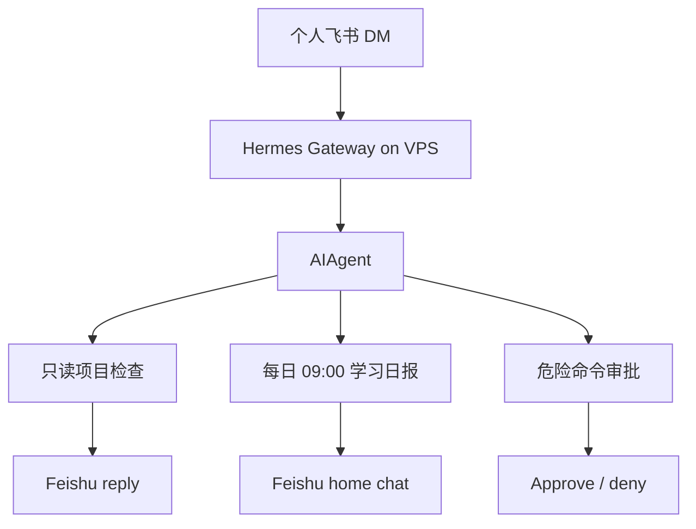
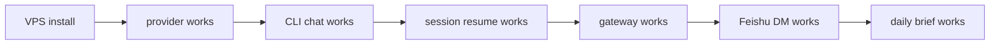
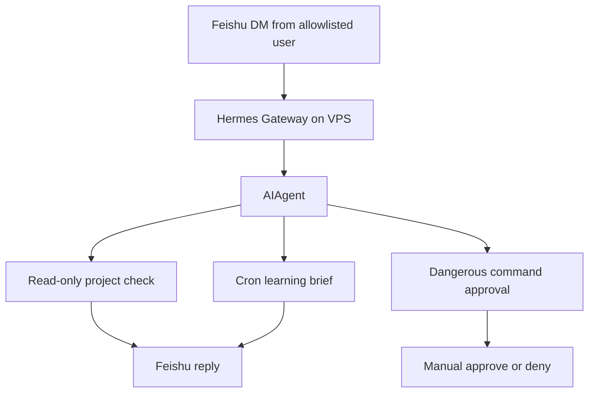
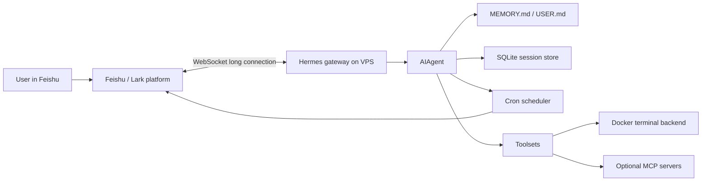
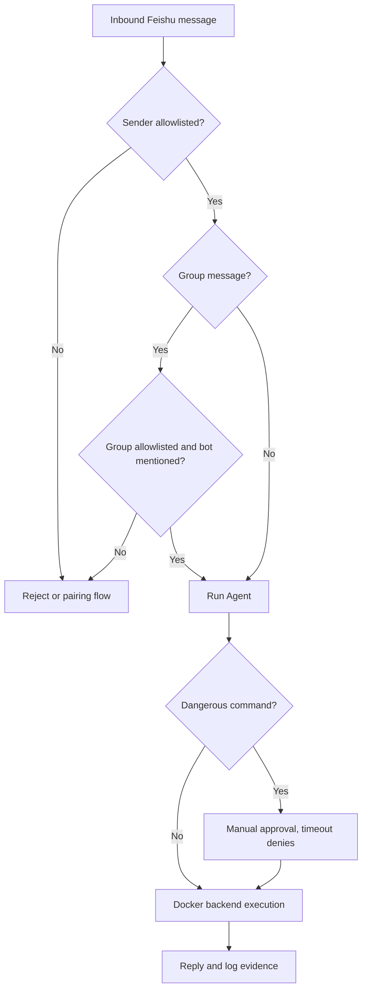

# 用 Hermes、VPS 和飞书搭一个个人 Agent 工作流

> Phase7 第三篇。前两篇已经判断：Hermes 更适合作为第一轮远端个人工作流实践基座，OpenClaw 则提供 Gateway、安全、通道和 remote access 的架构参照。
>
> 配套目录：`phase-7-open-source-frameworks/01-hermes-feishu-workflow/`

**TL;DR：** 第一版不做“万能远程遥控器”。目标是一个安全收敛的最小闭环：Hermes 跑在 VPS 的独立用户下，Gateway 常驻；飞书/Lark 用 WebSocket 长连接，不需要公网 webhook；只允许指定用户触发；群聊默认 allowlist + @mention；终端执行默认走 Docker backend；危险命令保持人工审批；验收只覆盖三个任务：飞书 DM 触发只读项目检查、每日 09:00 学习日报、危险命令审批/拒绝。

## 读者前提和最终效果

这篇文章假设你已经有一台 VPS，能 SSH 登录，能创建普通 Linux 用户，能在飞书/Lark 开发者后台创建 bot 应用，也知道模型 provider API key 应该放在私有环境文件里。它不教飞书应用从零审批上线，也不教 Linux 基础运维。

我们要搭的不是生产级团队平台，而是个人工作流的最小闭环：

```text
我在飞书 DM 里问项目状态。
Hermes gateway 在 VPS 上接收消息。
Agent 只读检查项目目录。
每天 09:00 自动生成学习日报。
危险命令必须人工审批或默认拒绝。
gateway 重启后还能恢复。
```

这就是本文的“完成定义”。如果最后只是 Hermes 能聊天，但 cron 不能投递、非 allowlist 用户也能触发、危险命令没有审批，那就不能算完成。



## 官方资料如何落到这篇 runbook

这篇实践不直接从源码开始，而是对齐 Hermes 官方 learning path 和 Feishu/Cron/Security 文档：

| 官方资料 | 链接 | 落到本实践里的动作 |
| --- | --- | --- |
| Learning path | <https://hermes-agent.nousresearch.com/docs/getting-started/learning-path> | 先 install/quickstart/CLI，再 messaging、memory、cron |
| Feishu/Lark | <https://hermes-agent.nousresearch.com/docs/user-guide/messaging/feishu> | WebSocket、`FEISHU_ALLOWED_USERS`、`FEISHU_HOME_CHANNEL`、group mention、card action |
| Scheduled tasks | <https://hermes-agent.nousresearch.com/docs/user-guide/features/cron> | cron 由 gateway tick，使用 fresh session，记录 list/status/output |
| Security | <https://hermes-agent.nousresearch.com/docs/user-guide/security> | manual approval、cron deny、容器执行、凭证最小化 |
| 社区 cron 案例 | <https://hermesagents.net/blog/hermes-cron-daily-report> | 把学习日报写成有输入、日程、投递、日志的真实日报任务 |

## 先按官方路径跑通，而不是先写 systemd

这一版返工后，实践顺序改成更接近 Hermes 官方 Quickstart：

```text
1. 在 VPS 上安装 Hermes
2. 配好模型 provider
3. 先用 CLI 完成一轮普通对话
4. 用 `hermes --continue` 确认 session 能恢复
5. 再启动 gateway
6. 接 Feishu/Lark WebSocket
7. 最后创建 cron 学习日报
```

这个顺序看起来慢一点，但它能把问题拆开：如果 CLI 都不能稳定回答，就不要急着排查飞书；如果 gateway 没跑起来，cron 也不会自动触发。



## 一、为什么第一版不做全能远程控制

“远程操作 Agent”这个词听起来很诱人，但也很危险。

如果一开始就给 Agent：

```text
宿主机 shell
文件写权限
所有聊天群入口
自动定时任务
外部 SaaS 凭证
```

那它不是个人助手，而是一个巨大攻击面。

前面读 OpenClaw 和 Hermes 时，两个项目都在提醒同一件事：

```text
Agent 不是可信主体。
边界来自 allowlist、审批、tool policy、sandbox、独立主机和日志。
```

所以第一版实践只验证最小闭环：

| 能力 | 第一版做法 | 不做什么 |
| --- | --- | --- |
| 远程入口 | 飞书 DM，指定用户 allowlist | 不开放给任意群成员 |
| Agent 常驻 | VPS 上 Hermes gateway service 常驻 | 不让 Agent 自己管理宿主机服务 |
| 定时任务 | Hermes cron 生成学习日报 | 不允许 cron 自动批准危险命令 |
| 命令执行 | Docker terminal backend | 不默认使用宿主机 local backend |
| 安全验证 | 危险命令审批/拒绝测试 | 不开启 YOLO |



这条链路足够证明 Hermes 是否适合做个人工作流基座，也足够暴露部署、安全和运维问题。

## 二、目标架构

部署形态选择：

```text
VPS + Hermes gateway + Feishu WebSocket
```

不用公网 webhook 的原因很简单：Feishu/Lark WebSocket 模式由 Hermes 主动建立 outbound connection，VPS 不需要额外暴露 `/feishu/webhook` 给公网。



这套架构里，每个组件的职责要清楚：

| 组件 | 职责 | 证据来源 |
| --- | --- | --- |
| Feishu WebSocket | 消息入口，不需要公网 webhook | Hermes `website/docs/user-guide/messaging/feishu.md` |
| Hermes Gateway | 平台事件、授权、session、delivery | Hermes `website/docs/developer-guide/gateway-internals.md` |
| AIAgent | prompt、provider、tool call、memory、fallback | Hermes `run_agent.py` 与 `agent-loop.md` |
| Cron | 定时 Agent job 和结果投递 | Hermes `website/docs/user-guide/features/cron.md` |
| Docker backend | 限制命令执行爆炸半径 | Hermes `tools` 与 `security` 文档 |
| 配置模板 | 不提交真实 secret | 本工程实践目录 |

## 三、部署步骤

配套目录里放了三个关键模板：

```text
phase-7-open-source-frameworks/01-hermes-feishu-workflow/
├── config/hermes.env.example
├── config/hermes-config.example.yaml
└── deploy/hermes-gateway.service.example
```

其中 systemd unit 示例不是第一选择。官方 Gateway 文档推荐用 `hermes gateway install/start/status` 管理后台服务；这里保留 unit 文件，是为了审计生成后的服务长什么样，以及在特殊 VPS 环境里做兜底。

### 1. 创建独立用户和目录

在 VPS 上用独立 OS 用户承载 Hermes：

```bash
sudo useradd --create-home --shell /bin/bash hermes-agent
sudo mkdir -p /opt/hermes-workflows
sudo chown -R hermes-agent:hermes-agent /opt/hermes-workflows
```

独立用户不是绝对安全边界，但它能避免把 Agent 和个人 root shell 混在一起。

### 2. 安装 Hermes

以 `hermes-agent` 用户执行：

```bash
curl -fsSL https://hermes-agent.nousresearch.com/install.sh | bash
source ~/.bashrc
hermes doctor
```

如果实际环境不允许直接 curl 安装，按 Hermes README 的手动安装路径，用 `uv venv` 和 `uv pip install -e ".[all,dev]"` 安装。

### 3. 先跑通 CLI 基线

在接飞书之前，先确认 Hermes 自己能工作：

```bash
hermes model
hermes doctor
hermes "用一句中文说明你已经在 VPS 上运行。"
hermes --continue "回忆上一轮我让你说明什么。"
```

这里要记录两类证据：

```text
provider 能成功响应
session 能继续，不是每次都从空白状态开始
```

如果这一步失败，先修 provider、Python、Hermes home 或网络，不要进入飞书配置。

### 4. 配置模型和工具

第一版要求：

```yaml
approvals:
  mode: manual
  cron_mode: deny

terminal:
  backend: docker

memory:
  memory_enabled: true
  user_profile_enabled: true
```

模型 provider 不写死。可以用 OpenAI、OpenRouter、Nous Portal 或其他兼容 provider，但必须放在 VPS 的私有环境文件里，不写入仓库。

### 5. 配置飞书/Lark

推荐通过 Hermes gateway setup 创建或录入飞书应用：

```bash
hermes gateway setup
```

选择 Feishu/Lark，优先 WebSocket 模式。

最低配置要求：

```bash
FEISHU_APP_ID=<replace-with-feishu-app-id>
FEISHU_APP_SECRET=<replace-with-feishu-app-secret>
FEISHU_DOMAIN=feishu
FEISHU_CONNECTION_MODE=websocket
FEISHU_ALLOWED_USERS=<ou_xxx>
FEISHU_GROUP_POLICY=allowlist
FEISHU_REQUIRE_MENTION=true
```

再设置 home chat，用来承接 cron 和系统通知：

```text
在飞书 DM 里发送 /set-home
或在私有环境里配置 FEISHU_HOME_CHANNEL
```

飞书应用权限至少包含：

| Scope | 用途 |
| --- | --- |
| `im:message` | 接收和读取消息 |
| `im:message:send_as_bot` | 作为 bot 发送消息 |
| `im:resource` | 处理图片、文件、音频等资源 |
| `im:chat` | 获取 chat metadata |
| `im:chat:readonly` | 读取群聊和成员信息 |

如果后续要使用交互卡片审批，再订阅 card action 事件并开启卡片能力。

### 6. 启动 gateway 并确认长连接

第一轮可以先前台启动，确认飞书 DM 有响应：

```bash
hermes gateway
```

另开一个 SSH session 或终端检查状态：

```bash
hermes gateway status
```

确认后再交给 Hermes 官方 service 管理命令：

```bash
hermes gateway install
hermes gateway start
hermes gateway status
```

如果这是 VPS 或 headless host，需要让 user service 在 SSH 断开后继续运行：

```bash
sudo loginctl enable-linger hermes-agent
```

这一步的判断标准不是“进程存在”，而是：

```text
allowlist 用户 DM `/status` 有回复
非 allowlist 用户不能触发
群聊只有 allowlist + @mention 才响应
```

## 四、安全默认值

第一版配置的原则是：默认拒绝，逐步放开。



安全配置必须满足：

| 项 | 默认 |
| --- | --- |
| `approvals.mode` | `manual` |
| `approvals.cron_mode` | `deny` |
| YOLO | 禁止作为常驻配置 |
| `FEISHU_ALLOWED_USERS` | 必填 |
| `FEISHU_GROUP_POLICY` | `allowlist` |
| `FEISHU_REQUIRE_MENTION` | `true` |
| terminal backend | `docker` |
| Docker env passthrough | 空列表或最小列表 |

宿主机级操作，例如 `hermes gateway restart`、`systemctl restart hermes-gateway`、升级 Hermes、改 systemd unit，只由人通过 SSH 执行，不交给 Agent。

## 五、验收工作流

第一版验收不追求复杂，重点是证据清楚。

### 工作流 1：飞书 DM 触发只读项目检查

在飞书 DM 里发送：

```text
请检查 /opt/hermes-workflows/ai-agent-learn 的当前学习阶段，列出最近 Phase7 文档和下一步建议。只读，不要修改文件。
```

期望：

```text
Agent 能读取指定目录或通过允许的文件工具搜索文档。
回复包含 Phase7 文档路径。
没有写文件。
没有触发危险命令审批。
```

### 工作流 2：每日 09:00 学习日报

通过飞书或 CLI 创建 cron：

```bash
hermes cron create "0 9 * * *" \
  "检查 /opt/hermes-workflows/ai-agent-learn 的学习进展，输出中文日报：昨天完成、今天建议、风险。只读，不要修改文件。" \
  --name "ai-agent-learn-daily-brief" \
  --workdir /opt/hermes-workflows/ai-agent-learn
```

期望：

```text
cron 出现在 hermes cron list。
下一次触发后能投递到 Feishu home chat。
如果任务试图执行危险命令，cron_mode=deny 会拒绝。
```

注意：Hermes 的 cron 自动触发依赖 gateway 常驻。如果只是偶尔打开 CLI，不应期待定时任务自动投递。所以这条验收必须同时记录：

```bash
hermes gateway status
hermes cron list
hermes cron status
find ~/.hermes/cron/output -maxdepth 3 -type f | tail
```

### 工作流 3：危险命令审批/拒绝

在飞书 DM 中发送一个受控测试：

```text
请测试安全审批：尝试解释但不要执行 rm -rf /tmp/hermes-danger-test 这类递归删除命令。
```

更严格的测试可以在空临时目录里让 Agent 触发受控危险命令，但必须由人确认目录安全。

期望：

```text
危险命令进入 approval flow 或被拒绝。
默认超时拒绝。
不会因为 cron 或 gateway 常驻而自动通过。
```

### 工作流 4：网关重启恢复

人工 SSH 执行：

```bash
hermes gateway restart
hermes gateway status
```

期望：

```text
Gateway 能恢复连接。
飞书 /status 有响应。
已有 cron job 未丢失。
```

## 六、回归记录方式

实践时把证据写入：

```text
phase-7-open-source-frameworks/01-hermes-feishu-workflow/PRACTICE_LOG.md
```

每次记录包括：

```text
日期
环境摘要
执行命令
关键输出
飞书侧观察
失败或限制
下一步
```

这延续了项目文章标准：不要只写“跑通了”，要保留可复盘证据。

## 七、常见失败和排障路径

远端 Agent 实践最容易失败在“看起来都配置了，但消息没有回来”。不要从模型开始乱猜，按链路定位。

| 现象 | 优先检查 | 可能原因 |
| --- | --- | --- |
| `hermes doctor` 不通过 | provider、Python、Hermes home | API key、Python 环境、配置文件路径错误 |
| CLI 能回答，飞书无响应 | `hermes gateway status`、Feishu app publish 状态 | gateway 没跑、应用未发布、WebSocket 未连上 |
| DM 有响应，cron 不投递 | `/set-home`、`FEISHU_HOME_CHANNEL`、`hermes cron status` | 没有 home chat、gateway 没常驻、cron 未启用 |
| 群聊里过度响应 | group policy、require mention | 群聊配置太开放 |
| 非 allowlist 用户能触发 | `FEISHU_ALLOWED_USERS`、pairing 流程 | allowlist 未生效或测试账号混淆 |
| 危险命令直接执行 | approvals 配置、terminal backend | `mode` 不是 manual、backend 不是 Docker、YOLO 被打开 |
| gateway 重启后没恢复 | user service、linger、环境文件路径 | SSH 断开后 user service 停止、env 文件没加载 |

排障时只记录脱敏输出，不记录真实 token、App Secret、用户 Open ID 和 chat ID。实践日志应该长这样：

```text
2026-06-28 09:15 Asia/Shanghai
Command: hermes cron status
Result: scheduler running, 1 job configured
Feishu observation: home chat received daily brief
Limitation: card approval event not tested yet
Next: subscribe card action event and rerun dangerous command test
```

## 八、第一版边界

第一版明确不做：

```text
不把真实密钥提交到仓库。
不开放公网 webhook。
不让 Agent 自己改 systemd、SSH、iptables 或宿主机安全配置。
不把群聊配置为 open。
不启用 YOLO 作为常驻模式。
不把 Hermes 当成敌对多租户平台。
```

如果后续要扩展，可以按这个顺序：

1. 接只读 MCP：GitHub、Google Drive 或内部文档。
2. 增加 Feishu 文档评论回复，但必须做文档级 allowlist。
3. 加 OpenClaw 对照部署，比较 Gateway remote、nodes、sandbox 和 Feishu extension。
4. 把实践结果写成评估表，反推 Phase6 capstone 需要补哪些运维能力。

## 九、这篇实践证明了什么，又没有证明什么

如果四个验收工作流都通过，这篇实践能证明：

```text
Hermes 可以作为个人远端 Agent 的常驻入口。
Feishu WebSocket 适合私有 VPS，不需要暴露公网 webhook。
cron 学习日报是比“远程执行命令”更安全的第一类自动化。
manual approval + cron deny + Docker backend 能形成第一版安全底线。
```

它还不能证明：

```text
这个方案适合多人团队共用。
这个方案可以托管公司级生产凭证。
Docker backend 已经足够抵御恶意输入。
飞书文档评论、日历、任务、审批都可以无风险接入。
gateway 长期运行几周不会遇到资源、日志和恢复问题。
```

所以第一版上线后，最值得观察的不是“Agent 能不能做更多”，而是：

```text
它有没有误触发？
它有没有把本该审批的动作直接执行？
cron 有没有稳定投递？
日志和实践记录能不能解释每次失败？
```

## 十、进一步阅读

| 资料 | 用途 |
| --- | --- |
| `docs/phase-7/00-openclaw-hermes-source-dossier.md` | 本实践的资料来源和可信度分层 |
| `docs/phase-7/01-open-source-agent-framework-landscape.md` | 为什么第一轮选 Hermes，OpenClaw 做对照 |
| `docs/phase-7/02-openclaw-hermes-architecture-study.md` | Hermes gateway、cron、toolsets、security 的源码位置 |
| Hermes Feishu/Lark docs | <https://hermes-agent.nousresearch.com/docs/user-guide/messaging/feishu> |
| Hermes Cron docs | <https://hermes-agent.nousresearch.com/docs/user-guide/features/cron> |
| Hermes Security docs | <https://hermes-agent.nousresearch.com/docs/user-guide/security> |

这一版的目标很克制：让个人 Agent 真的能远程工作，但还知道自己不能碰什么。
