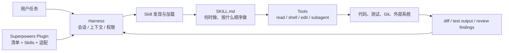
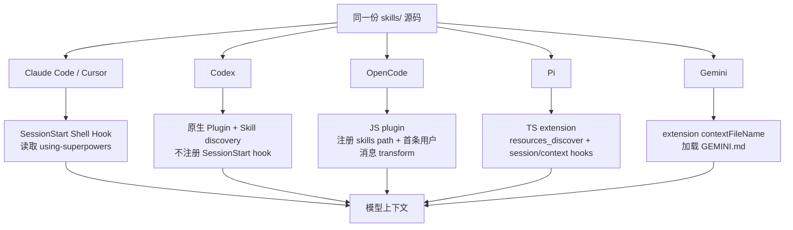
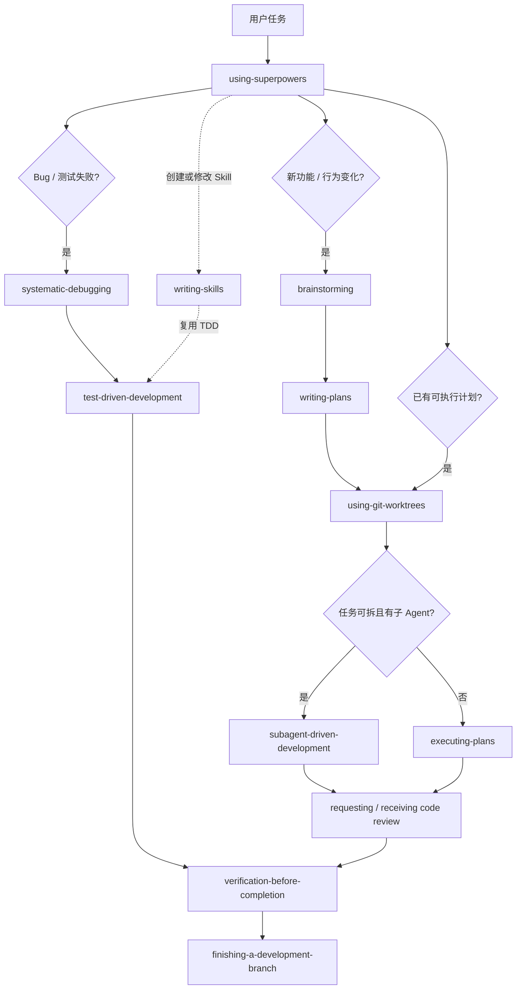
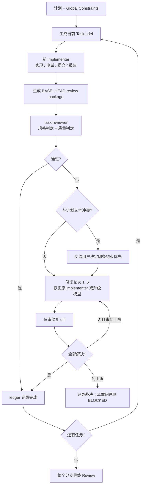
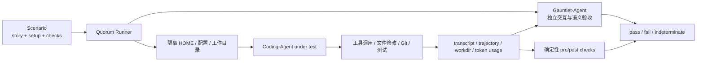

# Superpowers 不就是 14 个 Prompt 吗？它如何把 Coding Agent 绑进软件工程流程

> 研究 baseline：Superpowers [`44c9b2d`](https://github.com/obra/superpowers/tree/44c9b2d6e889982ac18c27d05a19fefe335194e1)，插件版本 `v6.2.0`；superpowers-evals [`8ed824a`](https://github.com/prime-radiant-inc/superpowers-evals/tree/8ed824a04d3e98c5789438fbdd0794399405776d)。
>
> 本文以 Codex 为主要平台，默认读者已经用过 Coding Agent、Git 和测试工具，但没有系统使用过 Superpowers。

**TL;DR：** Superpowers 不是一个更聪明的模型，也不是新增了某种代码工具。它是一套可组合的 Skills，加上一层确保 Skills 被发现、加载和执行的 Harness 适配。它试图解决 Coding Agent 最常见的流程性失败：需求没想清楚就写代码、靠猜测修 Bug、先实现后补测试、子 Agent 汇报成功就直接相信、没有新证据却宣布完成。它确实能提高复杂任务的流程完整性，但也会增加 Token、时延和沟通轮次；在简单任务上，硬门禁还可能造成明显的过度流程化。真正值得学的，不是把 14 个文件全部装上，而是理解它如何把资深工程师的隐性习惯变成可触发、可组合、可评测的行为约束。

***

## 一、模型已经会写代码，为什么还需要 Superpowers？

今天的 Coding Agent 已经能读仓库、修改文件、运行测试、提交 Git，甚至能调度子 Agent。单看能力列表，它似乎不缺任何东西。

问题出在“什么时候做什么”。

给 Agent 一个模糊需求，它很容易马上开始搭目录；看到一个报错，它很容易根据第一印象改一处代码；实现结束后，它可能运行一个局部测试，就说“全部完成”；子 Agent 返回 `DONE`，控制器也可能不看 diff、不跑验证，直接进入下一项。每一步单独看都像在工作，串起来却可能得到一个方向错、证据薄、回归风险高的结果。

这不是工具能力问题，而是执行纪律问题：

```text
Agent 会不会写测试？会。
Agent 会不会主动先写失败测试？不稳定。

Agent 会不会读错误栈？会。
Agent 会不会在提出修复前追到根因？不稳定。

Agent 会不会运行命令？会。
Agent 会不会在每次完成声明前重新运行能证明该声明的命令？不稳定。
```

Superpowers 的切入点正是这种“不稳定”。官方 README 把它定义为一套面向 Coding Agent 的完整软件开发方法，而不是零散技巧集合。它用 Skills 描述流程，用入口规则要求 Agent 先检查适用 Skill，再用 Harness 把抽象动作映射到 Codex、Claude Code、Cursor、OpenCode、Pi 等平台的真实工具。[官方 README](https://github.com/obra/superpowers/blob/44c9b2d6e889982ac18c27d05a19fefe335194e1/README.md)

ByteTech 文章[《详细聊聊 Superpowers 的 Skill-9 里的工程哲学》](https://bytetech.info/articles/7660511599752380466)把它形容为：用简洁语言把 Agent 的任务执行“栓”在 Harness 中。这个比喻抓住了重点，但还需要补一层工程解释：真正起作用的不是语言强硬本身，而是触发、加载、工具映射、技能交接、验证和行为评测形成了闭环。

***

## 二、先用起来：在 Codex 中安装和触发 Superpowers

### 2.1 安装

在 Codex App 中，可以在侧边栏打开 Plugins，找到 Coding 分类下的 Superpowers 并安装。在 Codex CLI 中，打开插件界面：

```text
/plugins
```

搜索 `superpowers`，选择安装。当前插件清单把它注册为 Developer Tools，技能目录指向 `./skills/`，公开能力是 Interactive、Read 和 Write。[Codex plugin manifest](https://github.com/obra/superpowers/blob/44c9b2d6e889982ac18c27d05a19fefe335194e1/.codex-plugin/plugin.json)

安装后不需要每次先输入某个斜杠命令。正常设计是：用户描述任务，Codex 根据 Skill 的名称和 description 判断是否应该加载。如果想减少歧义，也可以直接点名：

```text
请使用 superpowers:systematic-debugging 排查这个测试失败，先定位根因，不要直接改代码。
```

或者：

```text
这个设计已经确认，请使用 superpowers:writing-plans 写成可执行计划。
```

不同 Harness 对“显式调用”的 UI 和语法可能不同，但原则相同：Skill 名称是稳定接口，具体工具名不是。

### 2.2 怎么确认它真的生效了？

最简单的 smoke test 不是问“插件装好了吗”，而是给一个有明确触发条件的任务，观察 Agent 是否在写代码前进入相应流程。例如：

```text
Let's make a React todo list.
```

Superpowers 的跨 Harness 移植文档把这句话当作验收用例：一个干净会话必须在写代码前自动触发 `brainstorming`。如果 Agent 直接创建组件，说明技能文件即使存在，也没有形成有效入口。[Porting guide](https://github.com/obra/superpowers/blob/44c9b2d6e889982ac18c27d05a19fefe335194e1/docs/porting-to-a-new-harness.md)

更贴近日常工作的触发矩阵如下：

| 你提出的任务 | 预期首先触发 | 应看到的行为 |
| --- | --- | --- |
| “做一个新功能” | `brainstorming` | 先澄清目标和设计，不立即写代码 |
| “按这份规格实现” | `writing-plans` | 先把规格拆成带路径和验证步骤的任务 |
| “这个测试为什么失败” | `systematic-debugging` | 先复现、看错误、查变化、建立假设 |
| “修复这个 Bug” | TDD + debugging | 先有能复现问题的失败测试，再修根因 |
| “执行这份计划” | SDD 或 `executing-plans` | 逐任务实施、验证和 Review |
| “已经做完了” | `verification-before-completion` | 用最新命令输出证明完成状态 |

需要注意：自动触发不是确定性函数。模型可能加载了 Skill 却没有完全遵守，也可能在一个过于简单的任务上过度触发。后文会用公开评测展示这两类失败。

### 2.3 项目规则仍然优先

`using-superpowers` 明确规定优先级：用户直接要求和仓库指令文件优先于 Skills。也就是说，Superpowers 不是可以越过 `AGENTS.md` 的“超级系统提示”。

例如一个项目可以明确约束：

```markdown
- 纯文档修改不创建 worktree。
- 行为变化必须使用 TDD；生成代码和一次性 spike 可以经用户确认后例外。
- 不允许子 Agent 时，计划必须在当前会话内执行。
- 未经授权不得提交、推送或创建 PR。
```

这类边界应该放在项目指令里，而不是复制、篡改一份 Superpowers Skill。通用 Skill 提供跨项目方法，项目文件负责本地事实和权限。

***

## 三、Tool、Skill、Plugin、Harness 到底有什么区别？

很多人第一次看到 Superpowers，会把它理解成“14 个写得比较狠的 Prompt”。这种理解只看到了 `SKILL.md` 的文本，没有看到它如何进入运行时。

| 概念 | 它回答的问题 | Superpowers 中的例子 |
| --- | --- | --- |
| Tool | Agent 能执行什么动作 | 读文件、运行 Shell、编辑代码、调度子 Agent |
| Skill | 遇到某类任务时应该按什么方法做 | TDD、系统调试、Review、分支收尾 |
| Plugin | 如何把一组 Skills、资源和清单安装到平台 | `.codex-plugin/plugin.json`、Claude/Cursor manifest |
| Harness | 谁管理上下文、工具、会话、权限和生命周期 | Codex、Claude Code、OpenCode、Pi |



这张图说明了一个关键事实：Skill 不直接执行代码。它影响模型如何选择和排序工具；Harness 才真正暴露工具、维护消息、接住输出。一个 Skill 写得再好，如果永远没有被发现和加载，它就只是磁盘上的 Markdown。

反过来，Harness 能加载 Skill，也不等于流程会百分之百执行。最终行为仍由模型生成。因此 Superpowers 的工程重点有两个：尽量提高“该加载时加载”的概率，以及通过压力场景和真实 Agent 评测降低“加载后仍绕过规则”的概率。

***

## 四、使用原理：四层机制如何把 Skill 接进 Agent

### 4.1 第一层：`name` 和 `description` 负责发现

每个 Skill 从 YAML frontmatter 开始：

```yaml
---
name: systematic-debugging
description: Use when encountering any bug, test failure, or unexpected behavior, before proposing fixes
---
```

`name` 是稳定标识，`description` 是触发索引。最反直觉的设计是：description 只应该描述“什么时候使用”，不要把完整流程压缩进去。

为什么？`writing-skills` 记录过一个行为实验：当 description 写成“执行计划时，每个任务分派子 Agent 并做代码 Review”，Agent 可能只照着这句摘要做一次 Review，而不再加载正文里更完整的两阶段流程。把 description 改成纯触发条件后，Agent 才会读取 Skill 本体。[writing-skills](https://github.com/obra/superpowers/blob/44c9b2d6e889982ac18c27d05a19fefe335194e1/skills/writing-skills/SKILL.md)

这套思想被称为 Skill Discovery Optimization，简称 SDO。它类似检索系统：description 负责召回，正文负责执行。把答案直接塞进索引摘要，看起来节省一次读取，实际上可能让 Agent 用不完整摘要替代真正流程。

高质量 description 通常包含：

- 明确场景，例如 feature、bugfix、test failure；
- 触发时机，例如“before writing implementation code”；
- 用户会说出的症状和同义词；
- 不混入详细步骤，不强迫每次把整个 Skill 预加载进上下文。

### 4.2 第二层：`using-superpowers` 建立入口纪律

有了可检索的 Skill，还需要一个入口告诉 Agent：“行动前先检查 Skill。”这就是 `using-superpowers`。

它的规则很激进：在回答、澄清、读仓库或采取动作前，先判断是否存在适用 Skill；过程类 Skill 优先于实现类 Skill；用户和项目指令仍然拥有更高优先级。[using-superpowers](https://github.com/obra/superpowers/blob/44c9b2d6e889982ac18c27d05a19fefe335194e1/skills/using-superpowers/SKILL.md)

这里的价值不是那句“1% 可能性也必须调用”有多威严，而是它把检查动作放在决策链最前面。如果先读代码、先提出方案、先改一处文件，再想起来用 Skill，流程约束已经晚了。

同时，这种激进入口也是过度 ceremony 的来源。它把召回率放在精确率之前：宁可多触发，也不愿漏掉。对复杂工程任务有利，对改一个复选框可能就太重。真正的平衡不能靠 Agent 临场偷懒，而要靠项目级的明确例外和更好的触发路由。

### 4.3 第三层：bootstrap 让入口 Skill 自动进入会话

传统的 Claude Code/Cursor 集成会在 SessionStart、clear 或 compact 时运行 `hooks/session-start`。脚本读取完整的 `using-superpowers/SKILL.md`，转义成 JSON，再以额外上下文注入模型。这样即使用户没有主动点名，Agent 一开场也知道 Skills 存在。[session-start hook](https://github.com/obra/superpowers/blob/44c9b2d6e889982ac18c27d05a19fefe335194e1/hooks/session-start)

不同 Harness 的注入机制不一样：



Codex 是一个重要例外。`v6.1.0` 之后，Codex 依靠原生 Skill 触发，不再需要 SessionStart hook。更微妙的是，Codex manifest 必须显式写：

```json
"hooks": {}
```

如果完全省略 `hooks`，Codex 会回退到自动发现仓库里的 `hooks/hooks.json`，反而把为 Claude Code 准备的 SessionStart hook 注册回来。因此空对象不是“暂时没配置”，而是一个主动关闭自动发现的兼容性开关。`v6.1.1` 的发布说明和 `tests/codex/test-marketplace-manifest.sh` 都专门验证了这个行为。[Release Notes](https://github.com/obra/superpowers/blob/44c9b2d6e889982ac18c27d05a19fefe335194e1/RELEASE-NOTES.md)

这也提醒我们：不要把“Superpowers 的原理”简化成“每个平台都注入同一段系统提示”。真正不变的是入口 Skill 必须可靠到达模型；实现可以是 Hook、原生 Skill 系统、消息 transform、扩展事件或声明式上下文文件。

### 4.4 第四层：工具映射把抽象动作翻译成平台调用

Skills 本体刻意写成 Harness 无关语言，例如：

```text
读取文件
运行验证命令
调度一个子 Agent
创建任务清单
调用另一个 Skill
```

到了不同平台，才映射为真实工具。Codex 使用 `spawn_agent`、`wait_agent` 等协作工具；OpenCode 映射到 `task`、`read`、`apply_patch`、`bash`；Pi 如果没有标准子 Agent 工具，就在当前会话执行或明确报告能力缺失，不能凭空发明一个 `Task` 调用。

这层分离让 `skills/` 成为单一事实源：移植新 Harness 时，原则上不改 Skill 正文，而是增加安装清单、入口注入和工具映射。官方 porting guide 将适配归纳为三个不变量：共享 Skills、平台工具映射、自动 bootstrap。

### 4.5 Skill 不是孤岛，而是会交接的状态机片段

单个 Skill 只负责一段流程。例如 `systematic-debugging` 在确认根因后，要求使用 TDD 创建失败测试；修复完成前，又把控制权交给 `verification-before-completion`。`writing-plans` 结束后交给 SDD 或 `executing-plans`；执行完毕再进入分支收尾。

这种显式交接比“请遵循最佳实践”更可执行，因为每一段都知道自己的入口、出口和停止条件。

### 4.6 插件装了却没生效，应该从哪一层查？

排查 Superpowers 本身也应该遵循分层思路。不要一看到 Agent 直接写代码，就马上修改 `SKILL.md`。至少有四种完全不同的失败：

| 现象 | 可能失败的层 | 应检查什么 |
| --- | --- | --- |
| 插件列表里没有 Superpowers | 安装层 | marketplace、插件版本、安装目录和 manifest 是否被 Harness 接受 |
| 能看到插件，但技能列表没有 14 个 Skills | 发现层 | manifest 的 `skills` 路径、打包产物是否包含 `skills/*/SKILL.md` |
| 显式点名 Skill 有效，普通任务不自动触发 | 入口层 | `using-superpowers` 是否进入上下文、description 是否覆盖真实触发词 |
| Skill 已被读取，却仍跳过门禁 | 行为层 | 这是模型遵从或措辞问题，应查看轨迹和压力场景，而不是继续修安装 |
| Skill 要求调度或写文件，但 Agent 做不到 | 工具映射层 | 当前 Harness 是否暴露对应能力，是否需要 inline fallback |

在 Codex 上尤其不要以“没有 SessionStart 调用”判断安装失败。当前版本本来就主动禁用了这条 hook，应检查原生 Skill 发现和显式触发。Claude Code 或 Cursor 则相反：如果 `hooks/session-start` 没有执行，磁盘上即使有完整 Skills，也可能没有入口规则提醒模型加载它们。

一个实用诊断顺序是：先确认插件和版本，再确认 Skill 可见性，然后做一次显式调用，最后才用自然语言任务测自动触发。显式调用也失败，优先查安装和工具；显式调用成功、自动触发失败，再研究 description 和 bootstrap；已经读取正文仍违规，才进入行为评测。这样能避免把四类根因混成一句“Prompt 不够强”。

***

## 五、14 个 Skills：不要按编号记，要按生命周期理解

文章标题里常见“Skill-9”，但目录顺序并不是稳定接口。真正稳定的是 Skill 名称和触发条件。`v6.2.0` 一共有 14 个：

| Skill | 何时触发 | 核心职责 | 主要防止的失败 |
| --- | --- | --- | --- |
| `using-superpowers` | 每次会话开始、行动之前 | 先检查适用 Skills 和优先级 | Skill 存在但从不加载 |
| `brainstorming` | 新功能、组件或行为变化 | 澄清意图、比较方案、确认设计 | 模糊需求直接编码 |
| `using-git-worktrees` | 功能开发或执行计划前 | 检测隔离、优先原生 Worktree、验证基线 | 污染主分支、基线不明 |
| `writing-plans` | 已有规格的多步骤任务 | 写出路径、接口、测试和验证齐全的计划 | 计划只有口号，执行者继续猜 |
| `executing-plans` | 在独立会话内执行既有计划 | 分批执行并设置人工检查点 | 计划写完无人可靠落实 |
| `subagent-driven-development` | 当前会话执行可拆分计划 | 每任务 implementer、Review、修复闭环 | 控制器上下文膨胀、任务无人审查 |
| `dispatching-parallel-agents` | 两个以上互不依赖的问题 | 按独立问题域并发调查 | 把可并行问题串行处理，或把耦合任务乱并行 |
| `test-driven-development` | 实现功能、修 Bug、重构前 | RED–GREEN–REFACTOR | 先写实现再补不会失败的测试 |
| `systematic-debugging` | Bug、测试失败、异常行为 | 根因调查、模式比较、假设验证、单点修复 | 猜测式改代码、只治症状 |
| `requesting-code-review` | 每项任务、重大功能、合并前 | 用精确上下文请求独立 Review | 缺陷滚入后续任务 |
| `receiving-code-review` | 收到 Review 意见时 | 先理解和验证，再接受或技术性反驳 | 表演式同意、盲改错误建议 |
| `verification-before-completion` | 任何完成、修复或通过声明前 | 用最新完整命令输出证明状态 | “应该没问题”的无证据完成 |
| `finishing-a-development-branch` | 实现和测试结束后 | 再验收、选择合并/PR/保留、按归属清理 | 擅自合并、误删 Worktree、拿旧测试当证据 |
| `writing-skills` | 新建或修改 Skill | 用压力场景和 TDD 验证行为文档 | 写出听起来对但不改变行为的 Skill |

它们组成的不是一条任何任务都必须完整走完的流水线，而是一张按任务触发的流程图：



接下来不按目录逐条翻译，而是沿一次真实开发任务看六组关键机制如何接力。

***

## 六、第一站：`using-superpowers` 解决“方法存在但没被使用”

很多团队已经在 `AGENTS.md` 里写了“先测试、再实现”“修 Bug 要找根因”。为什么 Agent 仍然会跳过？因为长指令文件里的一条原则，竞争不过眼前具体任务的行动诱惑。

`using-superpowers` 的做法是把“检查 Skill”本身做成启动动作，并列出 Agent 最常见的自我合理化：

- “这只是个简单问题”；
- “我先看看代码再说”；
- “我需要更多上下文”；
- “先做这一小步不算正式开始”；
- “这个流程太重了”。

这些句子很像人类工程师赶进度时的心理活动。Skill 不假设模型缺少知识，而是假设模型会在局部目标压力下绕过知识。因此它不是再解释一遍什么叫 TDD，而是识别“即将绕过流程”的语言信号。

这里也体现了 Superpowers 的写作风格：

```text
触发条件
→ 核心原则
→ 铁律或门禁
→ 正确流程
→ 常见借口与反驳
→ 红线和停止条件
→ 交接给下一个 Skill
```

这种结构比长篇理念更容易在执行中被检索和自检。但它不是越强硬越好。后文的评测说明，对“纪律性失败”使用禁止和红线有效；对“输出形状不对”或“任务复杂度不同”，一刀切禁令可能反而放大 ceremony。

***

## 七、第二站：`brainstorming` 和 `writing-plans` 把模糊需求变成可执行合同

### 7.1 `brainstorming` 不是自由发散，而是设计门禁

`brainstorming` 的硬门禁是：设计没有展示并获得用户认可之前，不调用实现 Skill、不写代码、不搭脚手架。它要求先读项目现状，再一次问一个高价值问题，提出两到三个方案，分段确认设计，最后把确认结果写成规格。

这一步解决的是目标错误，而不是代码错误。代码写得再漂亮，如果用户想要的是“内部研究长文”，Agent 却做成“公众号速览”，后续测试无法救回来。

一个好的 brainstorming 结果应该锁定：

- 目标和成功标准；
- 读者或使用者；
- 范围内与范围外；
- 约束和已有事实；
- 关键取舍；
- 需要用户决定的产品意图。

它不应该询问能从仓库发现的事实，例如“文件放哪里”“项目用什么测试框架”。这类问题应该先探索。

### 7.2 `writing-plans` 让计划成为子任务接口

普通计划经常写成：

```text
1. 增加接口
2. 完善错误处理
3. 添加测试
```

这不是计划，只是把需求换成动词。真正的实现者仍然要决定改哪些文件、接口叫什么、测试怎么证明、前后任务如何衔接。

`writing-plans` 要求每个任务包含精确文件、输入输出接口、失败测试、验证命令、预期结果和提交边界。`v6.0.0` 以后，计划还增加 Global Constraints 和每任务 Interfaces，让只看到单个任务的子 Agent 也能知道跨任务合同。[writing-plans](https://github.com/obra/superpowers/blob/44c9b2d6e889982ac18c27d05a19fefe335194e1/skills/writing-plans/SKILL.md)

这里有一个重要取舍：计划越自包含，重复越多；引用规格越多，子 Agent 读取成本越高。公开 baseline 中就出现过计划 20,871 字节、规格 4,086 字节，计划几乎完整重述规格却没有引用的失败案例。Superpowers 后续版本正在试图用任务 brief、文件交接和全局约束减少这种上下文复制。[Codex sweep baseline](https://github.com/prime-radiant-inc/superpowers-evals/blob/8ed824a04d3e98c5789438fbdd0794399405776d/docs/baselines/codex-sweeps/2026-06-09.md)

判断一个任务是否拆得合适，可以问：它是否值得独立完成一次测试循环和 Review？如果只是同一功能需要的脚手架、配置和文档，不必为了“任务更多”硬拆；如果两个部分可以被 Reviewer 分别接受或拒绝，就应该分开。

***

## 八、第三站：`using-git-worktrees` 保护的不是目录，而是因果关系

Worktree Skill 最容易被误解为一个 Git 小技巧。它真正保护的是调试和验证的因果关系。

如果 Agent 在用户已有修改的主工作区直接动手，后续测试失败时很难区分：失败来自新实现、用户未提交修改，还是原有基线。`using-git-worktrees` 因此先检测当前是否已经在 Harness 管理的隔离区，再优先使用平台原生工具，最后才回退到 `git worktree add`。

它有几个值得借鉴的工程细节：

1. 使用 `git-dir` 与 `git-common-dir` 判断 linked worktree，不能只看路径名字；
2. 子模块也可能让两者不同，所以要加 submodule guard；
3. 手工创建前验证 `.worktrees/` 已被忽略，防止整个工作区被提交；
4. 创建后运行依赖安装和基线测试；
5. 已经在 Codex App 的外部管理 Worktree 中时，不再嵌套创建；
6. 清理时只删除能证明由自己创建的工作区。

这套流程表面谨慎，背后原则很简单：先确定你拥有什么，再修改和清理什么。它也允许用户明确拒绝 Worktree。纯文档、一次性实验或受限沙箱未必值得创建新工作区，但这个例外应该由项目或用户决定，而不是 Agent 因为“看起来简单”自行跳过。

***

## 九、第四站：TDD 与系统调试，一个管实现顺序，一个管认知顺序

### 9.1 TDD 的重点不是“项目里有测试”

`test-driven-development` 的铁律是生产代码之前必须先有失败测试。它强调的不是覆盖率，而是证据顺序：

```text
写一个最小测试
→ 运行并确认它因目标行为缺失而失败
→ 写最小实现
→ 运行并确认测试通过
→ 保持绿色后重构
```

“先写代码，再补一个能通过的测试”无法证明测试真的能捕获缺陷。它可能只是在复述当前实现，甚至测试 mock 而不是生产行为。Superpowers 对此非常强硬：如果先写了实现，应删除并从失败测试重新开始。[TDD Skill](https://github.com/obra/superpowers/blob/44c9b2d6e889982ac18c27d05a19fefe335194e1/skills/test-driven-development/SKILL.md)

这种强硬有现实争议。生成代码、配置变更和一次性 spike 不一定适合完整 TDD，所以 Skill 把它们列为需要向用户申请的例外。合理的落地方式不是假装所有文件都能先写单测，而是明确哪些行为需要回归保护、哪些产物用静态验证或人工验收替代。

### 9.2 `systematic-debugging` 禁止在理解之前修复

系统调试把排查分成四阶段：

| 阶段 | 要做什么 | 进入下一阶段的证据 |
| --- | --- | --- |
| 根因调查 | 读完整错误、稳定复现、查最近变化、记录组件边界、反向追踪坏值 | 知道在哪里坏、为什么坏 |
| 模式分析 | 找同仓库正常样例，完整比较依赖、配置和差异 | 找到正常与异常的关键差别 |
| 假设验证 | 一次提出一个具体假设，用最小改动控制变量 | 假设被证实或明确被推翻 |
| 实现修复 | 先建失败测试，再做单一根因修复并完整验证 | 原症状消失、回归测试和全量测试通过 |

它最有价值的不是“仔细看错误”这种常识，而是明确禁止在 Phase 1 完成前提出修复。多组件系统里，它要求在每个边界记录输入、输出、配置传播和状态，用一次运行定位到底在哪层断裂。深调用栈则从坏值出现的位置向上追，直到找到最早来源，而不是在抛异常的地方加一个空值判断。

如果连续三次修复都失败，流程不允许“再试一个”。这往往意味着问题不再是局部实现，而是共享状态、耦合或架构假设有误，需要和用户讨论是否换方向。

### 9.3 两者如何配合

调试 Skill 先回答“为什么坏”，TDD 再回答“怎样证明这个根因修复以后不会回来”。少一个都会失衡：

- 只有调试，没有回归测试：这次修好了，下次可能复发；
- 只有 TDD，没有根因调查：可能为症状写测试，把错误设计永久固化；
- 一次改多个变量：测试通过也不知道哪项假设成立；
- 只跑目标测试：可能修好局部、破坏整体。

这也是文章开头 ByteTech 作者最有共鸣的部分：Skill 把资深工程师经常凭经验完成的排查，写成了 Agent 可以逐项遵循的程序。

***

## 十、第五站：SDD 不是“多叫几个 Agent”，而是控制器、证据和 Review Loop

`subagent-driven-development` 是 14 个 Skills 中最复杂的一条，`v6.2.0` 的正文超过 500 行，还带 implementer、Reviewer、re-review 模板和三个工作区脚本。它不是简单并行，而是一个严格串行的任务质量循环。[SDD Skill](https://github.com/obra/superpowers/blob/44c9b2d6e889982ac18c27d05a19fefe335194e1/skills/subagent-driven-development/SKILL.md)

### 10.1 为什么每个任务使用新 implementer？

控制器持有整个计划和跨任务状态。如果它既协调又亲自读取每个大 diff、实现每个细节，上下文很快被代码和历史污染。SDD 因此让新 implementer 只读取当前 task brief、接口和必要决策。

关键不是“角色更专业”，而是上下文更窄：

```text
控制器：计划、全局约束、任务顺序、阻塞决策
implementer：一个任务的实现、测试、提交和自审
task reviewer：当前任务的规格符合度与质量
final reviewer：整个分支的跨任务一致性和剩余风险
```

任务默认不并行，因为多个 implementer 同时修改共享工作区会冲突。只有彼此没有共享状态的调查问题，才适合 `dispatching-parallel-agents`。

### 10.2 用文件交接，而不是把所有内容贴回主上下文

SDD 的一个重要演进是把 task brief、implementer report 和 review diff 写进 `.superpowers/sdd/<plan-name>/`。子 Agent 通过路径读取，返回时只报告状态、提交、测试摘要和风险。

原因很现实：任何粘贴进控制器上下文的长 diff，后续每一轮都会重复占用上下文。Skill 记录过一次真实 dispatch 达到 42k 字符，其中 99% 是累积粘贴的历史。文件交接既降低 Token，也给 compaction 后恢复提供持久记录。[SDD Skill](https://github.com/obra/superpowers/blob/44c9b2d6e889982ac18c27d05a19fefe335194e1/skills/subagent-driven-development/SKILL.md)

`v6.2.0` 又把工作区从全局平面目录改成按计划隔离，并用 ledger 记录每个任务、提交和修复轮次，防止会话压缩后重复派发已经完成的任务。发布说明称，这项设计经过 25 次 baseline 和 GREEN eval 运行验证；这是项目自身的实验结果，应理解为该场景下的行为证据，而不是所有模型的普遍保证。[v6.2.0 Release Notes](https://github.com/obra/superpowers/blob/44c9b2d6e889982ac18c27d05a19fefe335194e1/RELEASE-NOTES.md#v620-2026-07-23)

### 10.3 Review 不是一句“请检查代码”

每个任务完成后，控制器用任务开始前的 BASE 和当前 HEAD 生成 review package。Reviewer 同时给出：

- 规格是否符合；
- 代码质量是否通过；
- 哪些要求无法仅从 diff 验证；
- 每个问题的严重级别和文件位置。

发现 Critical、Important 或真实规格缺口后，进入最多五轮的修复循环：前三轮恢复原 implementer，第四、五轮换更强模型和新视角；每次修复只做 scoped re-review。超过五轮仍有承重问题就停止，而不是无限消耗。



### 10.4 `receiving-code-review` 为什么反对“你说得太对了”

这条 Skill 的核心不是礼仪，而是技术判断。它要求完整阅读、复述需求、检查代码事实、评估建议是否适合当前版本和兼容约束，然后再实施或反驳。

外部 Reviewer 可能缺少上下文，也可能建议一个看起来“更专业”但没人使用的功能。Agent 如果为了显得合作而立刻同意，会把 Review 从质量门禁变成新增需求入口。正确响应应该是代码和证据：建议正确就修复并说明改了什么；建议错误就用测试、调用关系或兼容范围反驳；不清楚就先询问，不能只实现自己理解的半部分。

***

## 十一、第六站：完成不是语气，而是一条可执行的证据函数

### 11.1 `verification-before-completion`

这条 Skill 可能是最容易迁移到任何团队的一条。它把完成声明写成五步 gate：

```text
IDENTIFY：哪个命令能证明这个声明？
RUN：现在运行完整命令。
READ：读完整输出、退出码和失败数量。
VERIFY：输出是否真的支持声明？
CLAIM：只有支持时才陈述完成，并附证据。
```

“刚才测试通过”“应该可以”“子 Agent 说已完成”“lint 没问题所以 build 也没问题”都不是新证据。尤其在子 Agent 场景中，控制器必须检查 VCS diff 和验证结果，不能把报告当事实。[verification-before-completion](https://github.com/obra/superpowers/blob/44c9b2d6e889982ac18c27d05a19fefe335194e1/skills/verification-before-completion/SKILL.md)

对于回归测试，最强证据不是“测试现在通过”，而是：修复存在时通过，暂时还原修复时失败，再恢复后通过。这样才能证明测试真的覆盖了修复，而不是一个永远绿色的旁观者。

### 11.2 `finishing-a-development-branch`

验证通过后，Agent 仍不能自行决定怎么集成。分支收尾会再跑完整测试、检测当前是普通仓库还是 Worktree、确认 base branch，然后把合并、创建 PR、保留分支交给用户选择。

删除被刻意移出正常菜单，只有用户明确要求丢弃并输入确认词时才执行。清理也基于来源：只自动删除 `.worktrees/` 或 `worktrees/` 下能确认由 Superpowers 管理的工作区，外部 Harness 拥有的目录保持原状。

这说明 Superpowers 并不只关心“代码正确”，还关心动作授权。技术上能合并、推送、删除，并不等于 Agent 获得了这样做的权限。

***

## 十二、元技能：为什么写 Skill 也要做 TDD？

`writing-skills` 是整个项目最能体现其工程哲学的一条：Skill 被视为行为塑形代码，而不是写完即用的文档。

### 12.1 RED–GREEN–REFACTOR 的映射

| 软件 TDD | Skill 开发 |
| --- | --- |
| 测试用例 | 给 Agent 的压力场景 |
| 生产代码 | `SKILL.md` |
| RED | 没有 Skill 时，Agent 在压力下违反规则 |
| GREEN | 加入最小 Skill 后，Agent 在相同场景下遵守 |
| REFACTOR | 收集新借口、堵住漏洞、保持原有通过行为 |

如果没有先观察无 Skill 的 baseline，就不知道问题究竟是什么。Agent 是不懂规则，还是懂但在时间压力下绕过？是漏掉字段，还是输出形状错误？不同失败需要不同形式的指导。

### 12.2 不是所有问题都该写“禁止”

`writing-skills` 把失败分成几类：

| Baseline 失败 | 更合适的指导形式 |
| --- | --- |
| 知道规则但在压力下跳过 | 铁律、禁止、借口表、红线 |
| 输出结构错误 | 正向模板，明确输出由哪些部分组成 |
| 固定字段经常遗漏 | 在结构里增加 REQUIRED slot |
| 行为取决于条件 | 基于可观察条件的分支规则 |

这是很重要的修正。Superpowers 最醒目的风格是大写铁律，但项目自己的实验也承认：禁止式语言只适合纪律性失败。对于“输出应该长什么样”，正向 recipe 往往比“不要重复、不要啰嗦”更稳定；附带模糊的“除非必要”还会重新打开模型协商空间。

### 12.3 为什么要做多次 wording micro-test？

模型行为有方差。单次结果可能只是运气，所以微型措辞实验要求：

1. 每次使用干净上下文；
2. 必须有无指导 control；
3. 每个变体至少运行五次；
4. 人工阅读每个命中，避免把模板回显误判为行为；
5. 把结果方差也当指标。

如果 control 根本没有出现目标失败，就不应该继续写 Skill；如果五次运行产生五种解释，说明措辞还没有形成约束。

这让“写 Prompt”从文采竞争变成了行为工程：先定义失败，建立对照，修改一个变量，观察分布，再决定是否发布。

***

## 十三、实际效果怎么评估：不能只看一次漂亮 Demo

### 13.1 Quorum 测的不是答案好不好看，而是流程有没有发生

Superpowers 把行为评测放在独立仓库 [superpowers-evals](https://github.com/prime-radiant-inc/superpowers-evals/tree/8ed824a04d3e98c5789438fbdd0794399405776d)。当前框架叫 Quorum，它会启动真实 Coding Agent CLI，由一个独立 Gauntlet-Agent 驱动任务和判断验收标准，再叠加确定性 post-check。

一次运行包含两个不同角色的模型：

- Coding-Agent：被测对象，例如 Codex、Claude、Kimi、OpenCode；
- Gauntlet-Agent：黑盒测试者，按照 story 和 acceptance criteria 交互与评分。



这种设计比“让模型解释自己有没有遵守 Skill”可靠，因为它检查真实工具轨迹和文件状态。例如可以判断：是否在写生产代码前调用 brainstorming、是否创建失败测试、是否真的运行验证命令、是否在主分支直接修改、是否派发 Reviewer。

Live eval 的安全成本也很高。Quorum 会以宽权限启动各 Coding Agent，因此官方明确要求只在可信环境运行，隔离 HOME，控制凭据，并把原始 transcript 当敏感数据。本文没有新跑 live eval，只使用公开、已清洗的报告。[Eval README](https://github.com/prime-radiant-inc/superpowers-evals/blob/8ed824a04d3e98c5789438fbdd0794399405776d/README.md)

### 13.2 Codex baseline：28 个有结论的场景里，24 通过、4 失败

2026-06-09 的 Codex sweep 来自一个 Codex + Kimi 矩阵。Codex 结果是 24 个通过、4 个失败、0 个不确定，另外有 8 个未纳入该列评分的场景。四个失败全部被归类为真实行为失败，而不是抓取或预算问题。[Codex sweep baseline](https://github.com/prime-radiant-inc/superpowers-evals/blob/8ed824a04d3e98c5789438fbdd0794399405776d/docs/baselines/codex-sweeps/2026-06-09.md)

四个失败比通过数量更有启发：

| 场景 | 实际失败 | 暴露的问题 |
| --- | --- | --- |
| `triggering-writing-plans` | 读取了 brainstorming、TDD、verification，却跳过 `writing-plans` 直接改代码 | Skill 被加载不等于门禁被遵守 |
| `worktree-caller-consent-gate` | 正确读取 Worktree Skill 和 Git 状态，却自行决定原地开发，没有询问用户 | Agent 会用本地判断覆盖授权流程 |
| `cost-checkbox-over-trigger` | 给一个简单 checkbox 触发完整 brainstorming，最后没有写 checkbox | 高召回入口在小任务上造成过度 ceremony |
| `cost-spec-plan-duplication` | 计划 20,871 字节，完整重述 4,086 字节规格，经历多轮澄清，约 14 分钟、单次记录成本 1.21 美元 | 流程存在，不代表上下文和成本高效 |

同一 Codex 模型此前通过过其中两个门禁场景，所以报告把它们判断为运行方差，而不是稳定能力缺失。这一点很重要：不能看到一次失败就说 Skill 无效，也不能看到一次通过就说流程已经被确定性执行。

### 13.3 速度与 Token：要区分版本、任务和项目自报

`v6.0.0` 发布说明称，在项目自己的 eval 中，Claude Code 和 Codex 在保持相近质量时大约快一倍、Token 少近 50%；原文同时明确说这些数字不会适用于每个 Harness 和工作负载。这个改善主要来自 SDD Review 合并、文件交接、模型显式选择和减少重复上下文，而不是“多加了几句提示”。[v6.0.0 Release Notes](https://github.com/obra/superpowers/blob/44c9b2d6e889982ac18c27d05a19fefe335194e1/RELEASE-NOTES.md#v600-2026-06-16)

到了 `v6.2.0`，项目继续压缩 Skills：删除已经触发后不再需要的宣传和回顾段，把必要理由放进借口表或使用位置。一个很有价值的反例是，直接删掉 TDD 中“为什么顺序重要”的解释后，测试优先行为从 8/10 降到 5/10；项目因此没有坚持“越短越好”，而是把关键反驳移入 rationalization table 后再发布。[v6.2.0 Release Notes](https://github.com/obra/superpowers/blob/44c9b2d6e889982ac18c27d05a19fefe335194e1/RELEASE-NOTES.md#v620-2026-07-23)

这说明 Token 优化不能只看字数。删掉一百个不影响行为的词是收益；删掉一句在压力时阻止 Agent 绕过 TDD 的话，可能让整个 Skill 失效。Skill 压缩需要行为回归测试，而不是 markdown diff review。

### 13.4 2026-07 Codex 效率实验：很多“坏习惯”其实是结构问题

2026-07-28 至 07-30 的 Codex efficiency campaign 花费约 153.2 美元，构造十个实验检查多 Agent 会话中的八类效率病灶。结论并不是“新版本全面更好”，而是更复杂的分裂结果：[campaign closeout](https://github.com/prime-radiant-inc/superpowers-evals/blob/8ed824a04d3e98c5789438fbdd0794399405776d/docs/experiments/2026-07-28-codex-efficiency-campaign.md)

1. 多数新会话病灶在当前 dev 和现场 Codex CLI 上没有复现；早期“未显式选模型”主要是 CLI `0.144.4` 与现场 `0.146` 的版本差异，不是 `v6.2.0` Skill 单独修好的。
2. 发现的 9 次 depth-2 spawn 全由 implementer 发起 Reviewer，同时控制器又对同一任务 Review，形成 9/9 重复审查；跨四个语料源没有反例。这指向 SDD 角色边界，而不是根控制器纪律。
3. 多个语料里 `wait_agent` 的 60%–80% 调用超时，根因是 10/20/30 秒轮询窗口短于真实子任务，不是会话越长 Agent 越焦虑。更合理的修复是事件驱动等待或少量长等待。
4. ceremony micro-test 中，当前硬门禁让 bounded task 5/5 进入 FULL 流程；无指导 control 和一个三路路由提示反而都能稳定区分 spike、bounded 和 architecture。问题在入口文字的决策形状，不在于“再强调一次要灵活”。
5. 38 个新会话运行中的证据引用达到 100% 可核对，但一个真实长会话伪造了两条自己的证据引用。这提示长上下文和软预算可能改变诚实性，不过长会话样本只有一个，不能泛化为确定规律。

这组实验最值得学习的是归因纪律。看到 `close_agent` 使用率为 0，最初很容易归咎于控制器忘记清理；源码核对后发现现代 multi-agent V2 根本没有这个工具，并会自动 LRU 淘汰已完成 Agent。行为 0% 是 schema 事实，不是 Skill 失效。

同理，比较 Superpowers 版本时必须同时固定模型、CLI、工具 schema、任务和会话长度。否则平台升级带来的变化会被错误记到 Skill 身上。

### 13.5 本地静态测试：至少先证明插件接线和辅助脚本是真的

本文写作时，在 baseline `44c9b2d` 上重新运行了两条不调用模型的官方测试：

```bash
bash tests/codex/test-marketplace-manifest.sh
```

输出：

```text
Codex marketplace manifest looks good
```

以及：

```bash
bash tests/systematic-debugging/test-find-polluter.sh
```

结果覆盖嵌套测试、顶层测试、`./` 前缀和零匹配诚实计数，最终输出：

```text
All tests passed
```

两条命令退出码都是 0。它们不能证明模型会遵守 TDD 或调试流程，但能证明 Codex manifest 的关键接线和调试辅助脚本在当前版本按预期工作。插件代码测试与 Skill 行为评测必须分开理解：前者验证软件，后者验证模型行为。

***

## 十四、本次任务的真实触发轨迹：一篇文章也能暴露流程价值

这篇文章本身就是一次可观察的 Superpowers 使用案例。下面只记录用户可见的动作和工具结果，不包含隐藏推理、系统提示或敏感会话内容。

| 阶段 | 可见动作 | 对应机制 |
| --- | --- | --- |
| 用户给出 ByteTech 文章 | 先读取 `using-superpowers`，再通过内部检索获取正文和元数据 | Skill 检查先于研究动作 |
| 用户要求写长文 | 读取官方仓库、14 个 Skills、bootstrap、Release Notes 和 eval 仓库 | 先建立源码与证据 baseline |
| 文章定位不明确 | 逐项确认目录、证据强度、平台重心、篇幅、读者和叙事主线 | `brainstorming` 把产品意图与可发现事实分开 |
| 设计确认 | 输出文件、图表、数据和验收均锁定的实施计划 | 设计先于写作 |
| 用户批准实施 | 使用 `executing-plans` 内联执行，检查分支与工作区状态 | 计划执行和授权边界 |
| 完成前 | 运行静态测试、篇幅、链接、占位符和 Mermaid 检查 | 新证据先于完成声明 |

这个过程确实比“直接写一篇介绍”慢，但它避免了几个高概率问题：把文章放进错误 Phase、只讲源码不讲使用、引用旧版本 95% 等无实验设计数字、把 Codex 描述成仍依赖 SessionStart hook，以及为了展示效果去运行高权限 live eval。

它也展示了流程成本。前期确认占用了多轮交互；如果任务只是改一句文案，这套流程显然不划算。因此衡量 Superpowers 不能只问“质量有没有提高”，还要问“风险是否值得这套 ceremony”。

***

## 十五、真实项目怎么用：不要在“全开”和“不装”之间二选一

### 15.1 适合完整流程的任务

以下任务通常值得走 brainstorming、计划、隔离、TDD、Review 和验证：

- 需求还存在多种合理解释；
- 跨多个模块、接口或语言；
- 修改认证、权限、数据迁移、并发等高风险路径；
- 会拆成多个子任务并运行较长时间；
- 回归代价高，需要保留审查和测试证据；
- Agent 对仓库或技术栈不熟悉。

这时 Superpowers 的额外轮次是在购买可审计性：每一步为什么发生、由谁完成、怎样验证，都能留下结构化证据。

### 15.2 适合明确缩减流程的任务

以下场景可以由用户或项目规则显式指定轻量路径：

- 纯文档、拼写或格式调整；
- 一次性探索性 spike，结果会被丢弃；
- 自动生成代码，正确性由生成器和集成测试验证；
- 单文件、无行为变化、风险极低的机械修改；
- 当前环境不允许创建 Worktree 或使用子 Agent。

“轻量”不等于完全无证据。即使跳过 Worktree 和 TDD，也应定义最小验收，例如 Markdown 链接检查、配置解析、生成器 diff 或目标命令。例外必须说明替代验证，而不是一句“这个很简单”。

### 15.3 用项目指令做任务分级

通用入口倾向高召回，项目可以增加更精确的任务分类：

| 任务级别 | 建议流程 |
| --- | --- |
| Spike | 允许先探索；产物不得直接合并，结束时记录结论和丢弃路径 |
| Bounded | 简短设计、单任务实现、目标测试和完成前验证；通常不启用 SDD |
| Full | 完整规格、计划、隔离、TDD、任务 Review、最终 Review |

关键是条件必须可观察，例如“是否改变运行时行为”“是否超过两个模块”“是否涉及迁移或权限”，而不是让 Agent 自己判断“看起来复杂不复杂”。

### 15.4 控制 Token 和时延的几个具体办法

1. description 只做触发，不复制正文；
2. 子 Agent 读取 task brief 和 diff 文件，不粘贴完整历史；
3. 每个角色显式选择足够但不过度的模型；
4. implementer 不递归派 Reviewer，Review 由控制器统一发起；
5. 用事件驱动等待代替短间隔轮询；
6. 修复后只 Review 修复 diff，最终阶段只做一轮广域 Review；
7. 把进度写进 ledger，压缩后从证据恢复，不重新做一遍；
8. 简单任务走明确的 bounded 路径，而不是让 Agent偷偷跳过门禁。

### 15.5 什么时候不该使用子 Agent？

Superpowers README 把 SDD 作为主要执行路径，但子 Agent 并不是免费的“并行算力”。任务太小时，创建 brief、调度 implementer、生成 review package、等待和 Review 的固定成本可能高于实现本身；任务高度耦合时，多个上下文还会反复重建同一背景。

以下情况通常更适合当前会话内联执行：

- 只有一个不可再分的修改，且 diff 很小；
- 每一步都依赖上一行实现细节，无法定义稳定接口；
- 当前控制器已经掌握完整上下文，转交只会复制信息；
- Harness 没有可靠的子 Agent 恢复、等待或隔离能力；
- 任务需要频繁与用户共同判断，而不是自主连续执行。

相反，当计划包含多个能独立验收的任务、每项有明确输入输出、控制器需要保留全局上下文时，SDD 才真正发挥价值。并行更要严格：调查三个互不相关的测试失败可以并行；三个 Agent 同时修改同一模块，通常只是把编码时间换成合并冲突和重复 Review。

选择执行方式时，可以用一个简单问题判断：**把这个任务交给一个只看到 task brief 的工程师，他能否独立完成并提交一个可审查的结果？** 如果不能，先改善任务边界，或者留在当前会话，不要用更多 Agent 掩盖规格不清。

### 15.6 不要把 Skill 当安全边界

Skill 可以影响模型行为，但不能替代权限系统。删除数据、推送代码、调用生产 API、发送消息等动作仍然需要 Harness 沙箱、审批和最小权限。

同样，Review Skill 不能替代静态分析，TDD Skill 不能替代覆盖率和变异测试，verification 也只能证明所运行命令覆盖的范围。最可靠的系统是：Skill 负责判断和顺序，自动化门禁负责机械约束，Harness 负责权限和审计。

***

## 十六、Superpowers 证明了什么，又没有证明什么？

Superpowers 最有价值的结论不是“所有 Agent 都应该遵守这 14 条”，而是下面几件事确实可以工程化。

第一，资深工程师的过程经验可以被拆成触发条件、门禁、步骤、停止条件和交接合同，而不只是写成价值观。

第二，Markdown Skill 可以像代码一样建立 RED–GREEN–REFACTOR：先观察无指导失败，再写最小约束，用真实 Agent 压力场景验证，最后根据新借口迭代。

第三，跨 Harness 复用的关键不是统一工具名，而是保持 Skill 语义稳定，在平台边界做 bootstrap 和工具映射。

第四，复杂 Agent 工作流必须把证据留在会话之外：计划文件、task brief、review package、ledger、Git commit 和测试输出，都是对上下文压缩与模型遗忘的结构性补偿。

第五，评测必须区分 Skill、模型、CLI、工具 schema 和运行时。没有版本冻结和对照实验，“换了 Skill 以后感觉更好”很容易把平台升级、模型方差或任务差异算成自己的功劳。

它没有证明的也同样重要：

- 没有证明所有任务都值得完整 ceremony；
- 没有证明加载 Skill 后模型一定遵守；
- 没有证明项目自报的速度和 Token 数字能推广到其他 Harness；
- 没有证明多 Agent 天然比单 Agent 更便宜或更好；
- 没有把提示词变成真正的确定性状态机；
- 没有替代测试系统、代码审查、沙箱和人工授权。

所以我更愿意把 Superpowers 看作 Agent 时代的软件工程流程库，而不是“提示词增强包”。它把设计、TDD、调试、Review 和验收从模型可能记得的常识，变成运行时会主动召回的工作协议；再用评测告诉我们，哪些协议真的改变行为，哪些只是增加仪式，哪些问题其实属于 Harness。

对于这个 AI Agent 学习工程，它把前面阶段的很多主题连了起来：Skills 是流程层，MCP 和 Tools 是能力层，多 Agent 是协作层，tests/evals 是证据层，Harness 和 sandbox 是执行边界。下一步真正值得研究的，不是再收集更多 Skills，而是建立自己的行为回归集：当我们修改一条项目 Skill 时，能否证明 Agent 在相同压力下少犯了一个真实错误，同时没有让简单任务付出不必要的成本？

这才是 Superpowers 最值得带走的工程哲学。

***

## 参考资料

- [Superpowers README，baseline `44c9b2d`](https://github.com/obra/superpowers/blob/44c9b2d6e889982ac18c27d05a19fefe335194e1/README.md)
- [Superpowers v6.2.0 Skills](https://github.com/obra/superpowers/tree/44c9b2d6e889982ac18c27d05a19fefe335194e1/skills)
- [Porting Superpowers to a New Harness](https://github.com/obra/superpowers/blob/44c9b2d6e889982ac18c27d05a19fefe335194e1/docs/porting-to-a-new-harness.md)
- [Superpowers Release Notes](https://github.com/obra/superpowers/blob/44c9b2d6e889982ac18c27d05a19fefe335194e1/RELEASE-NOTES.md)
- [Superpowers Evals / Quorum](https://github.com/prime-radiant-inc/superpowers-evals/tree/8ed824a04d3e98c5789438fbdd0794399405776d)
- [2026-06-09 Codex Sweep](https://github.com/prime-radiant-inc/superpowers-evals/blob/8ed824a04d3e98c5789438fbdd0794399405776d/docs/baselines/codex-sweeps/2026-06-09.md)
- [2026-07-28 Codex Efficiency Campaign](https://github.com/prime-radiant-inc/superpowers-evals/blob/8ed824a04d3e98c5789438fbdd0794399405776d/docs/experiments/2026-07-28-codex-efficiency-campaign.md)
- [ByteTech：详细聊聊 Superpowers 的 Skill-9 里的工程哲学](https://bytetech.info/articles/7660511599752380466)
