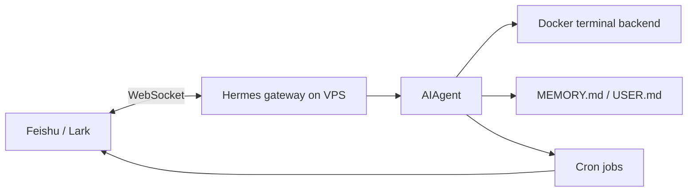

# Hermes Feishu Personal Workflow

This directory contains the Phase7 practice assets for a minimal remote personal Agent workflow:

```text
Hermes Agent on VPS
+ Feishu / Lark WebSocket gateway
+ Docker terminal backend
+ manual dangerous-command approval
+ scheduled learning brief
```

The files are templates and checklists. They intentionally do not contain real credentials, real Feishu user IDs, model API keys, VPS hostnames, or private paths.

## Files

| Path | Purpose |
| --- | --- |
| `config/hermes.env.example` | Environment variable template for secrets and Feishu app settings |
| `config/hermes-config.example.yaml` | Safe-first Hermes config template |
| `deploy/hermes-gateway.service.example` | Example user-level systemd service for audit or fallback |
| `CHECKLIST.md` | Step-by-step deployment checklist |
| `ACCEPTANCE.md` | Smoke tests and workflow acceptance criteria |
| `PRACTICE_LOG.md` | Evidence log template for real runs |
| `scripts/verify_templates.sh` | Local validation for placeholders and accidental secrets |

## Default Architecture



## Safety Baseline

The practice starts with these defaults:

```text
approvals.mode = manual
approvals.cron_mode = deny
terminal.backend = docker
FEISHU_ALLOWED_USERS is required
FEISHU_GROUP_POLICY = allowlist
FEISHU_REQUIRE_MENTION = true
YOLO is not used in persistent gateway mode
```

Host-level maintenance, such as `hermes gateway restart`, `systemctl`, SSH hardening, package upgrades, firewall rules, and Hermes runtime upgrades, remains a human SSH operation.

## Suggested Order

1. Read `docs/phase-7/03-hermes-feishu-personal-workflow.md`.
2. On the VPS, run a Hermes CLI baseline before touching Feishu: provider response plus `hermes --continue`.
3. Copy the examples to the VPS private Hermes home and fill in real values there.
4. Run `bash scripts/verify_templates.sh` locally before committing template changes.
5. Execute `CHECKLIST.md` on the VPS.
6. Record real command output in `PRACTICE_LOG.md`.
7. Validate the workflows in `ACCEPTANCE.md`.
